+----------------------------------------------------------------------+
| > {width="0.1388888888888889in" |
| > height="0.1388888888888889in"}영어에서 한국어로 번역 -             |
| > www.onlinedoctranslator.com                                        |
+======================================================================+
| > **제스처 그리기** **애니메이션용**                                 |
+----------------------------------------------------------------------+

> 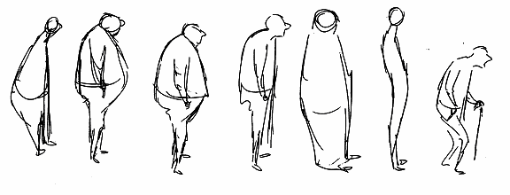{width="6.0in"
> height="2.2916666666666665in"}

**월트 스탠치필드**

**편집자**

**레오 브로디**

ii 월트 스탠치필드

이 편집물은 편집물 편집자(Leo Brodie)에 의해 저작권이나 보호를 받지
않습니다. 이것은 대략 1970년에서 1990년 사이에 애니메이션 강사 Walt
Stanchfield가 작성한 일련의 저작권 없는 수업 노트를 기반으로 합니다. 그
이후로 이 수업 유인물은 광범위하게 복사되어 Mr. 스탠치필드의 축복과
격려; 그런 의미에서 유인물은 이제 인터넷에서 무료로 사용할 수 있습니다.
이 책의 일부 삽화는 해당 저작권 소유자의 자산이므로 저작권의 보호를 받는
만화 캐릭터의 예비 도면을 나타냅니다. 이 삽화는 원본 유인물의 일부였으며
애니메이션 기술의 특정 원리 를 설명하기 위한 교육 목적으로 여기에
포함되었습니다. 저작권 소유자가 이 책을 보증한다는 것을 암시하지 않 으며
이 책에 표현된 견해가 저작권 소유자의 견해를 반영하지 않아도 됩니다.
나는 그것이 그것을 덮기를 바랍니 다.

> 애니메이션을 위한 제스처 그리기 iii
>
> **목차**
>
> **1장: 진실을
> 찾아라**\...\...\...\...\...\...\...\...\...\...\...\...\...\...\...\...\...\...\...\...\...\...\...\...\...\...\....
> \...\...\...\...\...\...\...\...\...\...\...\...\...\....2
>
> 관찰하다, 관찰하다,
> 관찰하다\...\...\...\...\...\...\...\...\...\...\...\...\...\...\...\...\...\...\...\...\...\...
> \...\...\...\...\...\...\...\...\...\...\...\...\...\...\...\...\...\...\.....2
>
> 감성으로
> 인도하십시오\...\...\...\...\...\...\...\...\...\...\...\...\...\...\...\...\...\...\...\...\...\...\...\...\...\...\....
> \...\...\...\...\...\...\...\...\...\...\...\...\...\...\...\...\...\...\...\...\...\...\...\...\...\...\....
> \.....4
>
> 그들에게 경험을
> 주십시오\...\...\...\...\...\...\...\...\...\...\...\...\...\...\...\...\...\...\...\...\...\...\...\...\...\...\....
> \...\...\...\...\...\...\...\...\...\...\...\...\...\...\...\...\...\...\.....5
> 행동의 원동력
> \...\...\...\...\...\...\...\...\...\...\...\...\...\...\...\...\...\...\...\...\...\...
> \...\...\...\...\...\...\...\...\...\...\...\...\...\....5
>
> 제스처
> \...\...\...\...\...\...\...\...\...\...\...\...\...\...\...\...\...\...\...\...\...\...\...\...\...\...\....
> \...\...\...\...\...\...\...\...\...\...\...\...\...\...\...\...\...\...\...\...\...\...\...\...\...\...\....
> \...\...\...\...\...\...\...\...\...9
>
> 에센스
> \...\...\...\...\...\...\...\...\...\...\...\...\...\...\...\...\...\...\...\...\...\...
> \...\...\...\...\...\...\...\...\...\...\...\...\...\...\...\...\...\...\...\...\...\...\...\...\...\...\....
> \...\...\...\.....10
>
> 진실을
> 찾아라!\...\...\...\...\...\...\...\...\...\...\...\...\...\...\...\...\...\...\...\...\...\...
> \...\...\...\...\...\...\...\...\...\...\...\...\...\...\...\...\...\...\...\...\...\...\...\...\...\...\....
> \...\....13
>
> **2장: 애니메이터의
> 스케치북**\...\...\...\...\...\...\...\...\...\...\...\...\...\...\...\...\...\...\...\...\...\...\...\...\...\...\....
> \...\...\...\...\...\...13
>
> 어디를 가든지
> \...\...\...\...\...\...\...\...\...\...\...\...\...\...\...\...\...\...\.....
> \...\...\...\...\...\...\...\...\...\...\...\...\...\...\...\...\...\...\...\...\...\...\...\...\...\...\....
> .17
>
> 구성\...\...\...\...\...\...\...\...\...\...\...\...\...\...\...\....
> \...\...\...\...\...\...\...\...\...\...\...\...\...\...\...\...\...\...\...\...\...\...\...\...\...\...\....
> \...\...\...\.....17
>
> Ron Husband의 스케치북
> \...\...\...\...\...\...\...\...\...\...\...\...\...\...\...\...\...\...\.....
> \...\...\...\...\...\...\...\...\...\...\...\...\...\...\...\...\...\...\.....21
>
> 메모 작성 및 스케치
> \...\...\...\...\...\...\...\...\...\...\...\...\...\...\...\...\...\...\...\...\...\...\...\...\...\...\....
> \...\...\...\...\...\...\...\...\...\...\...\...\...\...\...\...\...\...\.....27
>
> 좋은 습관
> \...\...\...\...\...\...\...\...\...\...\...\...\...\...\...\...
> \...\...\...\...\...\...\...\...\...\...\...\...\...\...\...\...\...\...\...\...\...\...\...\...\...\...\....
> \...\...\...\.....32
>
> **3장: 그림 그리기를 위한 시각적
> 어휘**\...\...\...\...\...\...\...\...\...\...\...\...\...\...\...\...\...\...\...\...\...\...\...\...\...\...\....
> \...\.....31
>
> 선, 선,
> 선\...\...\...\...\...\...\...\...\...\...\...\...\...\...\...\...\...\...\...\...\...\...
> \...\...\...\...\...\...\...\...\...\...\...\...\...\...\...\...\...\...\...\...\...\...\...\...\...\...\....
> \...\...31
>
> 그리기에 대한 간단한 접근
> \...\...\...\...\...\...\...\...\...\...\...\...\...\...\...\...\...\...\...\...\...\...
> \...\...\...\...\...\...\...\...\...\...\...\...\...\....31
>
> 그리기에 대한 간단한 접근
> \...\...\...\...\...\...\...\...\...\...\...\...\...\...\...\...\...\...\...\...\...\...
> \...\...\...\...\...\...\...\...\...\...\...\...\...\....32
>
> 초록 찾기
> \...\...\...\...\...\...\...\...\...\...\...\...\...\...\...\...\...\...\...\...\...\...\...\...\...\...\....
> \...\...\...\...\...\...\...\...\...\...\...\...\...\...\...\...\...\...\...\...\...\...\...\...\...\...\....
> ..32
>
> Solid-Flexible 모델
> \...\...\...\...\...\...\...\...\...\...\...\...\...\...\...\...\...\...\.....
> \...\...\...\...\...\...\...\...\...\...\...\...\...\...\...\...\...\...\.....32
>
> 애니메이션을 위한 인물 스케치
> \...\...\...\...\...\...\...\...\...\...\...\...\...\...\...\...\...\...\...\...\...\...\...\...\...\...\....
> \...\...\...\...\...\...\...\...\...\...\...\...\...\...\...\.....32
>
> 파이프
> 모델\...\...\...\...\...\...\...\...\...\...\...\...\...\...\...\...\...\...\.....
> \...\...\...\...\...\...\...\...\...\...\...\...\...\...\...\...\...\...\...\...\...\...\...\...\...\...\....
> \...\...\.....33
>
> 3차원으로 보기
> \...\...\...\...\...\...\...\...\...\...\...\...\...\...\...\...\...\...\...\...\...\...\...\...\...\...\....
> \...\...\...\...\...\...\...\...\...\...\...\...\...\...\...\...\...\...\.....34
>
> 관점의 규칙
> \...\...\...\...\...\...\...\...\...\...\...\...\...\...\...\...\...\...\...\...\...\...\...\...\...\...\....
> \...\...\...\...\...\...\...\...\...\...\...\...\...\...\...\...\...\...\.....34
>
> 방향 \...\...\...\...\...\...\...\...\...\...\...\...\...\...\...\....
> \...\...\...\...\...\...\...\...\...\...\...\...\...\...\...\...\...\...\...\...\...\...\...\...\...\...\....
> \...\...\...\...\...\...36
>
> 선 그리기
> 문제\...\...\...\...\...\...\...\...\...\...\...\...\...\...\...\...\...\...\...\...\...\...\...\...\...\...\....
> \...\...\...\...\...\...\...\...\...\...\...\...\...\...\...\...\...\...\.....36
>
> 헤드 단순화
> \...\...\...\...\...\...\...\...\...\...\...\...\...\...\...\...\...\...\...\...\...\...
> \...\...\...\...\...\...\...\...\...\...\...\...\...\...\...\...\...\...\...\...\...\...\...\...\...\...\....
> \...37
>
> 캐리커처된 머리 모양
> \...\...\...\...\...\...\...\...\...\...\...\...\...\...\...\...\...\...\...\...\...\...\...\...\...\...\....
> \...\...\...\...\...\...\...\...\...\...\...\...\...\...\...\.....37
>
> 몸짓으로 머리
> \...\...\...\...\...\...\...\...\...\...\...\...\...\...\...\...\...\...\...\...\...\...\...\...\...\...\....
> \...\...\...\...\...\...\...\...\...\...\...\...\...\...\...\...\...\...\...\...\...\...\...\...\...\...\....
> ..38 의상과 커튼에 대한 간단한 접근
> \...\...\...\...\...\...\...\...\...\...\...\...\...\...\...\...\...\...\...\...\...\...\...\...\...\...\....
> \...\...\.....38
>
> **4장:
> 첫인상**\...\...\...\...\...\...\...\...\...\...\...\...\...\...\...\...\...\...\...\...\...\...\...\...\...\...\....
> \...\...\...\...\...\...\...\...\...\...\...\...\...\....71
>
> 짧은 포즈 스케치
> \...\...\...\...\...\...\...\...\...\...\...\...\...\...\...\...\...\...\.....
> \...\...\...\...\...\...\...\...\...\...\...\...\...\...\...\...\...\...\...\...\...\...\...\...\...\...\....
> .71 피상적인 외모 vs. 창의적인 묘사
> \...\...\...\...\...\...\...\...\...\...\...\...\...\...\...\...\...\...\...\...\...\...
> \...\...\...\.....71
>
> 새로운 구문: \"본문 구문\"
> \...\...\...\...\...\...\...\...\...\...\...\...\...\...\...\...\...\...\.....
> \...\...\...\...\...\...\...\...\...\...\...\...\...\...\...\...\...\...\.....72
>
> \"폭발적인\" 제스처
> \...\...\...\...\...\...\...\...\...\...\...\...\...\...\...\...\...\...\.....
> \...\...\...\...\...\...\...\...\...\...\...\...\...\...\...\...\...\...\.....72
>
> 보고, 느끼고, 몸짓
> \...\...\...\...\...\...\...\...\...\...\...\...\...\...\...\...\...\...\...\...\...\...
> \...\...\...\...\...\...\...\...\...\...\...\...\...\...\...\...\...\...\.....76
>
> 명사가 아닌 동사 그리기
> \...\...\...\...\...\...\...\...\...\...\...\...\...\...\...\...\...\...\...\...\...\...
> \...\...\...\...\...\...\...\...\...\...\...\...\...\...\...\.....77
>
> 목적이 있는 그리기
> \...\...\...\...\...\...\...\...\...\...\...\...\...\...\...\...\...\...\...\...\...\...\...\...\...\...\....
> \...\...\...\...\...\...\...\...\...\...\...\...\...\...\...\...\...\...\...\...\...\...\...\...\...\...\....
> ..77
>
> 몸을 단위로 나누기
> \...\...\...\...\...\...\...\...\...\...\...\...\...\...\...\...\...\...\...\...\...\...
> \...\...\...\...\...\...\...\...\...\...\...\...\...\...\...\...\...\...\.....78
>
> \"알기\" 또는 검색하기
> \...\...\...\...\...\...\...\...\...\...\...\...\...\...\...\...\...\...\...\...\...\...
> \...\...\...\...\...\...\...\...\...\...\...\...\...\...\...\...\...\...\.....79
> 명확성을 위한 단순성
> \...\...\...\...\...\...\...\...\...\...\...\...\...\...\...\...\...\...\...\...\...\...
> \...\...\...\...\...\...\...\...\...\...\...\...\...\....79**5장:
> 포즈의
> 요소**\...\...\...\...\...\...\...\...\...\...\...\...\...\...\...\...\...\...\...\...\...\...\...\...\...\...\....
> \...\...\...\...\...\...\...\...\...\...\...\...\...\....85
>
> 각도와 장력
> \...\...\...\...\...\...\...\...\...\...\...\...\...\...\...\...\...\...\...\...\...\...\...\...\...\...\....
> \...\...\...\...\...\...\...\...\...\...\...\...\...\...\...\...\...\...\...\...\...\...\...\...\...\...\....
> \...88 도면에 각도 및 장력 적용
> \...\...\...\...\...\...\...\...\...\...\...\...\...\...\...\...\...\...\...\...\...\...\...\...\...\...\....
> \...\...\...\.....92

iv 월트 스탠치필드

> 테니스와 앵글
> \...\...\...\...\...\...\...\...\...\...\...\...\...\...\...\...\...\...\.....
> \...\...\...\...\...\...\...\...\...\...\...\...\...\...\...\...\...\...\...\...\...\...\...\...\...\...\....
> \.....98 커브에 대한 직선: 포즈에서 스쿼시 및 스트레치
> \...\...\...\...\...\...\...\...\...\...\...\...\...\...\...\.....
> ..101
>
> 관점 적용
> \...\...\...\...\...\...\...\...\...\...\...\...\...\...\...\...\...\...\...\...\...\...\...\...\...\...\....
> \...\...\...\...\...\...\...\...\...\...\...\...\...\...\...\...\...\...\.....103
>
> 공간 감각
> \...\...\...\...\...\...\...\...\...\...\...\...\...\...\...\...\...\...\...\...\...\...\...\...\...\...\....
> \...\...\...\...\...\...\...\...\...\...\...\...\...\...\...\...\...\...\.....105
> 첫인상 재현
> \...\...\...\...\...\...\...\...\...\...\...\...\...\...\...\...\...\...\...\...\...\...\...\...\...\...\....
> \...\...\...\...\...\...\...\...\...\...\...\...\...\....109 포즈의
> 요소 합치기
> \...\...\...\...\...\...\...\...\...\...\...\...\...\...\...\...\...\...\.....
> \...\...\...\...\...\...\...\...\...112
>
> 피해야 할 습관
> \...\...\...\...\...\...\...\...\...\...\...\...\...\...\...\...\...\...\...\...\...\...\...\...\...\...\....
> \...\...\...\...\...\...\...\...\...\...\...\...\...\...\...\...\...\...\...\...\...\...\...\...\...\...\....
> \...\....118
>
> 쉽지
> 않다\...\...\...\...\...\...\...\...\...\...\...\...\...\...\...\...\...\...\...\...\...\...
> \...\...\...\...\...\...\...\...\...\...\...\...\...\...\...\...\...\...\...\...\...\...\...\...\...\...\....
> \...\...\...\.....121
>
> **6장: 제스처
> 누르기**\...\...\...\...\...\...\...\...\...\...\...\...\...\...\...\...\...\...\...\...\...\...\...\...\...\...\....
> \...\...\...\...\...\...\...\...\...\...\...\...\...\....119
>
> 모델에서 제스처 그리기
> \...\...\...\...\...\...\...\...\...\...\...\...\...\...\...\...\...\...\...\...\...\...
> \...\...\...\...\...\...\...\...\...\...\...\...\...\....120
>
> 테마에 충실
> \...\...\...\...\...\...\...\...\...\...\...\...\...\...\...\...\...\...\...\...\...\...\...\...\...\...\....
> \...\...\...\...\...\...\...\...\...\...\...\...\...\...\...\...\...\...\...\...\...\...\...\...\...\...\....
> \...120
>
> 미묘함
> \...\...\...\...\...\...\...\...\...\...\...\...\...\...\...\...\...\...\...\...\...\...
> \...\...\...\...\...\...\...\...\...\...\...\...\...\...\...\...\...\...\...\...\...\...\...\...\...\...\....
> \...\...\...\...\...\...123
>
> 제스처 누르기
> \...\...\...\...\...\...\...\...\...\...\...\...\...\...\...\...\...\...\...\...\...\...
> \...\...\...\...\...\...\...\...\...\...\...\...\...\...\...\...\...\...\...\...\...\...\...\...\...\...\....
> 124 행동이나 기분을 나타내는 제스처
> \...\...\...\...\...\...\...\...\...\...\...\...\...\...\...\...\...\...\.....
> \...\...\...\...\...\...\...\...\...124 동작 분석: 손과 발
> \...\...\...\...\...\...\...\...\...\...\...\...\...\...\...\...\...\...\.....
> \...\...\...\...\...\...\...\...\...\...\...\...\...\....125
>
> 속임수 배우기
> \...\...\...\...\...\...\...\...\...\...\...\...\...\...\...\...\...\...\...\...\...\...\...\...\...\...\....
> \...\...\...\...\...\...\...\...\...\...\...\...\...\...\...\...\...\...\...\...\...\...\...\...\...\...\....
> \...\...\.....125
>
> 게으른 라인
> \...\...\...\...\...\...\...\...\...\...\...\...\...\...\...\...\...\...\...\...\...\...\...\...\...\...\....
> \...\...\...\...\...\...\...\...\...\...\...\...\...\...\...\...\...\...\...\...\...\...\...\...\...\...\....
> \...\...\...\.....125
>
> 더블 비전
> \...\...\...\...\...\...\...\...\...\...\...\...\...\...\...\...\...\...\...\...\...\...
> \...\...\...\...\...\...\...\...\...\...\...\...\...\...\...\...\...\...\...\...\...\...\...\...\...\...\....
> \...\...\.....125
>
> 풍자
> 만화\...\...\...\...\...\...\...\...\...\...\...\...\...\...\...\....
> \...\...\...\...\...\...\...\...\...\...\...\...\...\...\...\...\...\...\...\...\...\...\...\...\...\...\....
> \...\...\...\.....125
>
> **7장: 애니메이션의
> 원리**\...\...\...\...\...\...\...\...\...\...\...\...\...\...\...\...\...\...\...\...\...\...\...\...\...\...\....
> \...\...\...\...\...\...\...\...\...153
>
> 그리기
> 원리\...\...\...\...\...\...\...\...\...\...\...\...\...\...\...\...\...\...\...\...\...\...\...\...\...\...\....
> \...\...\...\...\...\...\...\...\...\...\...\...\...\...\...\...\...\...\...\...\...\...\...\...\...\...\....
> .153
>
> 28 애니메이션의 원리
> \...\...\...\...\...\...\...\...\...\...\...\...\...\...\...\...\...\...\...\...\...\...\...\...\...
> \...\...\...\...\...\...\...\...\...\...\...\...\...\...\...\...\...\...\.....154
>
> 칼로리 그리기
> \...\...\...\...\...\...\...\...\...\...\...\...\...\...\...\...\...\...\...\...\...\...
> \...\...\...\...\...\...\...\...\...\...\...\...\...\...\...\...\...\...\...\...\...\...\...\...\...\...\....
> \...154
>
> 과격한
> 포즈\...\...\...\...\...\...\...\...\...\...\...\...\...\...\...\...\...\...\...\...\...\...\...\...\...\...\....
> \...\...\...\...\...\...\...\...\...\...\...\...\...\...\...\...\...\...\.....154
>
> 스쿼시 및 늘이기 애니메이션
> \...\...\...\...\...\...\...\...\...\...\...\...\...\...\...\...\...\...\.....
> \...\...\...\...\...\...\...\...\...\...\...\...\...\....154
>
> 반대
> 세력\...\...\...\...\...\...\...\...\...\...\...\...\...\...\...\...\...\...\.....
> \...\...\...\...\...\...\...\...\...\...\...\...\...\...\...\...\...\...\...\...\...\...\...\...\...\...\....
> 154
>
> 연결
> 작업\...\...\...\...\...\...\...\...\...\...\...\...\...\...\...\...\...\...\...\...\...\...\...\...\...\...\....
> \...\...\...\...\...\...\...\...\...\...\...\...\...\...\...\...\...\...\...\...\...\...\...\...\...\...\....
> 157
>
> 중간
> \...\...\...\...\...\...\...\...\...\...\...\...\...\...\...\...\...\...\...\...\...\...\...\...\...\...\....
> \...\...\...\...\...\...\...\...\...\...\...\...\...\...\...\...\...\...\...\...\...\...\...\...\...\...\....
> \...\...\.....158
>
> **8장: 스토리
> 감각**\...\...\...\...\...\...\...\...\...\...\...\...\...\...\...\...\...\...\...\...\...\...\...\...\...\...\....
> \...\...\...\...\...\...\...\...\...\...\...\...\...\....171
>
> 스토리 감각
> \...\...\...\...\...\...\...\...\...\...\...\...\...\...\...\...\...\...\...\...\...\...\...\...\...\...\....
> \...\...\...\...\...\...\...\...\...\...\...\...\...\...\...\...\...\...\...\...\...\...\...\...\...\...\....
> \...\....171 청중과의 대화 - 그림을 통해
> \...\...\...\...\...\...\...\...\...\...\...\...\...\...\...\...\...\...\.....
> \...\...\.....179
>
> 생각하는 사람의 예술
> \...\...\...\...\...\...\...\...\...\...\...\...\...\...\...\...\...\...\...\...\...\...\...\...\...\...\....
> \...\...\...\...\...\...\...\...\...\...\...\...\...\...\...\...\...\...\.....182
>
> 연기와
> 그림\...\...\...\...\...\...\...\...\...\...\...\...\...\...\...\...\...\...\.....
> \...\...\...\...\...\...\...\...\...\...\...\...\...\...\...\...\...\...\...\...\...\...\...\...\...\...\....
> 187
>
> 감정적 제스처
> \...\...\...\...\...\...\...\...\...\...\...\...\...\...\...\...\...\...\...\...\...\...
> \...\...\...\...\...\...\...\...\...\...\...\...\...\...\...\...\...\...\.....187
>
> 일반적인 제스처와 흔하지 않은 제스처
> \...\...\...\...\...\...\...\...\...\...\...\...\...\...\...\...\...\...\...\...\...\...\...\...\...\...\....
> \...\...\...\...\...\...\...\...\...\...\...\...\...\....188
>
> 바디 랭귀지
> \...\...\...\...\...\...\...\...\...\...\...\...\...\...\...\...\...\...\...\...\...\...
> \...\...\...\...\...\...\...\...\...\...\...\...\...\...\...\...\...\...\...\...\...\...\...\...\...\...\....
> \...\....189
>
> **9장: 마지막
> 말**\...\...\...\...\...\...\...\...\...\...\...\...\...\...\...\...\...\...\...\...\...\...\...\...\...\...\....
> \...\...\...\...\...\...\...\...\...\...\...\...\...\...\...\...\...\...\.....191
>
> 창조적인 에너지
> \...\...\...\...\...\...\...\...\...\...\...\...\...\...\...\...\...\...\...\...\...\...
> \...\...\...\...\...\...\...\...\...\...\...\...\...\...\...\...\...\...\...\...\...\...\...\...\...\...\....
> \.....191
>
> 삼투\...\...\...\...\...\...\...\...\...\...\...\...\...\...\...\....
> \...\...\...\...\...\...\...\...\...\...\...\...\...\...\...\...\...\...\...\...\...\...\...\...\...\...\....
> \...\...\...\...\...\...192
>
> 약간의 자기 성찰
> \...\...\...\...\...\...\...\...\...\...\...\...\...\...\...\...\...\...\...\...\...\...\...\...\...
> \...\...\...\...\...\...\...\...\...\...\...\...\...\...\...\...\...\...\.....194
>
> 정신적 육체적 준비
> \...\...\...\...\...\...\...\...\...\...\...\...\...\...\...\...\...\...\...\...\...\...\...\...\...
> \...\...\...\...\...\...\...\...\...\...\...\...\...\....195
> 형이상학적 측면
> \...\...\...\...\...\...\...\...\...\...\...\...\...\...\...\...\...\...\.....
> \...\...\...\...\...\...\...\...\...\...\...\...\...\...\...\...\...\...\.....196
>
> 습관
> \...\...\...\...\...\...\...\...\...\...\...\...\...\...\...\...\...\...\...\...\...\...\...\...\...\...\....
> \...\...\...\...\...\...\...\...\...\...\...\...\...\...\...\...\...\...\...\...\...\...\...\...\...\...\....
> \...\...\...\...\...\...\...\...\...197
>
> Essence에 대한 마지막
> 말\...\...\...\...\...\...\...\...\...\...\...\...\...\...\...\...\...\...\.....
> \...\...\...\...\...\...\...\...\...\...\...\...\...\...\...\...\...\...\.....199
>
> 애니메이션을 위한 제스처 그리기 V
>
> **편집자의 서문**\
> Walt Stanchfield는 제스처 드로잉에 특히 중점을 둔 애니메이터를 위한
> 생활 드로잉 수업 을 가르친 애니메이터였습니다. 매주 수업 시간마다 그는
> 현재 수업 세션의 주제를 강조하 고, 이전 수업에서 수행한 작업에 대해
> 논평하거나, 자신이 좋아하는 주제에 대해 토론하기 위해 비공식 유인물을
> 작성했습니다. 수년에 걸쳐 이 노트는 전 세계의 애니메이터와 애니메 이션
> 학생들이 사랑스럽게 공유하고, 연구하고, 소중히 여겼습니다.
>
> Stanchfield 씨는 관심이 있는 학생들에게 개인적으로 자신의 소장품
> 사본을 주었고 배포 되는 것을 보고 기뻤습니다. 그의 밑에서 공부할 만큼
> 운이 좋았던 많은 사람들에 따르면 그 는 그것들을 책으로 출판하고
> 싶었지만 그가 일하는 스튜디오는 관심이 없었다.
>
> 이 프로젝트의 목표는 Walt Stanchfield가 썼을 책을 상상하는 것입니다.
>
> 이 프로젝트는 www.animationmeat.com 웹사이트에서 공유되는 처음 60개의
> 유인물을 편집한 것입니다. Walt Stanchfield는 수업의 진행 특성에 맞는
> 특정 순서로 주제를 제시하 지 않았습니다. Walt의 유인물은 애니메이션의
> 개별 프레임과 같습니다. 일부는 극단적이고 일부는 중간이며 일부는
> 정리입니다. 노트를 읽으면서 최대한 많은 내용을 흡수하려고 노력하 면서
> 기본 주제와 더 복잡한 아이디어가 차례로 나열되어 있으면 더 잘 이해할
> 수 있을 거라고 생각했습니다. 그의 아이디어를 주제별로 그룹화하여
> 아이디어를 비교할 수 있도록 하고 싶었 습니다. 즉, 일반 책처럼 주제를
> 정리하고 싶었습니다. 그래서 저는 유인물에서 나온 부분들을 응집력 있는
> 장으로 재배열했습니다.
>
> 자료를 구성하는 방법을 결정할 때 월트가 직접 작성했다면 어떻게
> 구성했을지 상상했습니 다. 그는 어디에서 시작했을까요? 이 책의 독자들이
> 그의 반에서 운이 좋은 구성원이 아니라 는 것을 알면 더 고급 주제로
> 넘어가기 전에 어떤 개념을 설명했을까요? 나는 월트 자신이 이 노트에서
> 설명하는 원칙을 따르려고 노력했습니다. 명확성, \"본질\"에 대한 관심,
> 감정, 그리고 요점을 전달하기 위해 최소한의 단어(라인) 사용.
>
> 이 자료를 책으로 보고 싶었던 또 다른 이유는 동일한 정보를 다루는 다른
> 책이 없기 때문입니 다. 애니메이션에 대한 훌륭한 볼륨이 많이 있지만
> 일반적으로 독자가 해당 단계에 도달하는 방법을 설명하지 않고도 강력한
> 포즈로 애니메이션 가능한 캐릭터를 이미 그릴 수 있다고 가 정합니다.
> 일반적인 인물과 생활 드로잉에 관한 모든 책은 제스처를 강조하는
> 책이라도 모델 의 모습과 제스처를 극단적으로 밀어붙이거나 다른 인물에
> 적용하는 방법을 내재화하는 방법 을 설명하지 않고 모델의 모습과
> 제스처를 캡처하도록 권장합니다. 개인적으로, 나는 이 편집 이 책이라면
> 애니메이션에서 최고의 볼륨 중 하나를 차지할 것이라고 생각합니다.
>
> 독자에게 \'거기에 있는\' 느낌을 주는 원본 유인물에는 비공식적이고
> 활기찬 매력이 있습니다. 이 정보가 어땠는지 확인하려면 해당 정보를
> 확인하는 것이 좋습니다.

vi 월트 스탠치필드

원래 제시했습니다. 나는 이 책에서 \"Savvy Sayings\"(animationmeat.com
컬렉션의 \#47)를 남겨두었으므로 스스로 찾아볼 수 있는 기쁨으로 남아
있습니다.

많은 Walt의 메모를 스캔하고 전사하여 웹 사이트에서 사용할 수 있도록
해준\
AnimationMeat.com의 Jon Hooper와 Steve Kellerer에게 감사드립니다. 이
책은 그들 의 스캔과 OCR 변환을 포함하고 있으므로 그들의 노력 없이는
존재하지 않았을 것입니다. 인 터넷에 Walt의 메모 중 하나를 게시한 최초의
사람인 Aimee Major Steinberger에게도 감 사드립니다.

> \- - 레오 브로디\
> 워싱턴주 시애틀
>
> 애니메이션을 위한 제스처 그리기 vii
>
> **월트 스탠치필드 소개**
>
> Walt Stanchfield는 1919년 캘리포니아 로스앤젤레스에서 태어났습니다.
> 그는 곰돌이 푸와 폭풍우가 몰아치는 날, 곰돌 이 푸의 많은 모험,
> 구조대원, 여우와 사냥개(코디네이터 애니 메이터), 미키의 크리스마스
> 캐롤(크리에이티브)에 애니메이 터로 등재되어 있습니다.
>
> 콜라보레이션), The Black Cauldron(주요 애니메이션 코디네이 터), The
> Great Mouse Detective(코디네이터 애니메이터), Roger Rabbit(애니메이션
> 컨설턴트), Oliver & Company(프로 덕션 어시스턴트). 그는 만년에
> 디즈니에서 계속해서 수업을 지도하 고 가르쳤습니다. Stanchfield 씨는
> 2000년 9월 3일에 사망했습니 다.

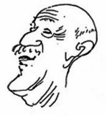{width="1.8333333333333333in"
height="1.9888877952755906in"}

viii 월트 스탠치필드

**2000년 10월 페그보드부터**\
일생에 한 번, 당신의 인생을 영원히 바꿀 수 있는 진정으로 특별한 선생님이
옵니다.

> 나와 업계의 많은 동료들에게 Walt Stanchfield는 매우 특별한
> 교사였습니다.
>
> 일부는 예술가, 일부는 시인, 일부는 음악가, 일부는 테니스 프로, 일부는
> 괴상한 서번 트, 일부는 현란한 교수인 Walt는 애니메이터의 기술에 대한
> 폭넓은 이해뿐 아니라 열 정과 삶에 대한 사랑으로 한 세대의 젊은
> 예술가들에게 영감을 주었습니다.
>
> Walt는 1937년 Mintz에서 애니메이션 업계에 입문했습니다. 그는 또한
> Lantz에서 2 년 동안 일했습니다. 1948년 그는 디즈니에서 일하기 시작했고
> 네 번의 짧은 은퇴를 제외하고는 그 이후로 디즈니에서 일했습니다. Walt는
> Ichabod Crane and Mr. Toad(1949)에서 The Great Mouse
> Detective(1986)까지 모든 장편 만화 장편을 작업했습니다.
>
> 그 기간 동안 Walt는 공예를 가르치는 것에 대한 끝없는 열정을
> 키웠습니다. 그는 애니 메이션과 드로잉 원리뿐만 아니라 철학, 태도, 삶의
> 교훈을 가르치는 주간 유인물로 수 많은 드로잉 수업을 지원했습니다.
>
> 월트의 개인 작업은 활력이 넘쳤습니다. 그는 지칠 줄 모르는 스케쳐였고
> 풍경, 바다 풍경, 정물, 사람을 그린 화가였습니다. 그는 시와 이야기뿐
> 아니라 애니메이션 예술 에 관한 수백 페이지의 메모를 남겼던 열렬한
> 작가였습니다. 그는 또한 음악을 사랑했 고 피아노에서 과도하게 많은
> 시간을 보냈습니다. 즉, 채소밭을 돌보는 것과 가장 좋아 하는 게임인
> 테니스를 치는 것 사이입니다.
>
> Walt는 애니메이션에 대한 끝없는 열정뿐 아니라 삶, 예술, 사람에 대한
> 사랑으로 많은 사 람들의 삶을 감동시켰습니다. 그의 작품은 그의 학생들의
> 손과 마음에 영원히 남을 것이며 우리 모두는 그를 그리워할 것입니다.

\- - 돈 한

> 애니메이션을 위한 제스처 그리기 ix
>
> **서론(월트 스탠치필드의 말에서)**
>
> "아, 내가 그림을 잘 그릴 수만 있다면"이라고 말한 적이 있습니까? 아,
> 예, 당신은 자신을 표현할 수 있습니다N학위. 연상시키는 장면을
> 애니메이션으로 만들거나 정리할 수 있습니다.오우그리고아아. 일은 일처럼
> 되지 않을 것입니다.
>
> 모든 것을 종이에 적고 기분이 좋은 5시에 떠날 수 있습니다.
>
> 때때로 나는 당신에게 손을 흔들며 \"당신은 이제 배우게 된 예술가입니다.
> 가서 마음껏 그림을 그 리세요.\"라고 말할 수 있는 마술 지팡이가
> 있었으면 좋겠습니다. 하지만 스스로 하는 것이 더 나을 수도 있습니다.
> 스스로 시작하는 사람이 되십시오. 학습 과정은 재미있어야 합니다. 그것이
> 하는 한 가지는 많은 거짓 교만을 무너뜨리는 것입니다. 도움을 구하는
> 것은 애니메이션을 그룹 노력으 로 생각하고 연습해야 하는 만큼 겸손한
> 경험이며 매우 필요한 경험입니다. 나는 도움을 구하는 것을 부끄러워하지
> 않는 사람을 지혜로운 사람으로 여깁니다.
>
> 인생을 늦게 시작했습니다. 사업을 시작한 첫 5\~6년은 \"워크스루(walk
> through)\"였습니다. (저는 1937년 9월 13일 Mintz의 Cartoon Studio에서
> 시작했습니다.) 저는 시, 그림, 노래 및 사교 활동을 하는
> 딜레탕트였습니다. 그 후 10년 동안 Lounsbery의 조수로, 10년 동안
> Johnston의 조수로 일하 면서 제 자신을 \"중심\"에 맞추는 데 도움이
> 되었습니다. 그 사람들은 열심히 일했고 자신의 일에 완전 히
> 헌신했습니다. 그것은 나에게 열심히 일하고 따라잡기 위해 열심히
> 공부하는 법을 가르쳤습니다. 그 다음 20년은 쉽지 않았지만 매우
> 만족스러웠다.
>
> 네 번째로 은퇴를 선언한 저는 지난 몇 년 동안 제가 모은 방법을 그림의
> 일부로 전달하려고 노력했습니다. 강의보다 효과가 좋은 주간 \"유인물\"을
> 통합했습니다. 그것들은 내가 마음 에 떠오르는 두드러진 요점을 더
> 철저하게 표현할 수 있게 해줍니다. 뿐만 아니라 향후 필요 할 때 검토할
> 수 있는 \"수집품\"입니다.
>
> 이 유인물을 통해 제 경험과 관찰을 깊이 파고들어 여러분에게 도움이 될
> 만한 내용을 생각해 낼 수 있습니다. 좋은 애니메이션의 기초 중 하나이기
> 때문에 제스처 드로잉에 집중했습니다. 좋은 제스처 그리기에 필요한 것은
> 연기, 캐리커처, 해부학, 바디 랭귀지, 원근법 등이므로 때 때로 이러한
> 주제를 분리하고 논의합니다.
>
> 때로는 \"구루\" 역할을 하기도 하고 긍정적인 사고 방식의 설교를 하기도
> 합니다.
>
> 나는 나 자신을 \"선생님\"이라고 부르는 것을 피하려고 애썼고 다른
> 버전의 포즈를 제안할 때 \"수 정\"보다 \"제안\"과 같은 단어를
> 사용했습니다. 나는 정말로 내 경험을 공유하기 위해 여기에 있으 며
> 당신이 적절하다고 생각하는 방식으로 치료하는 것은 당신의 특권입니다.
> 제안에 관해서는, 그것들은 단지 당신이 새로운 방식으로 보도록 격려하기
> 위한 것입니다. 그것은 당신이 보기의 \"페니 꼬집기\"의 불쾌한 습관을
> 깨도록 돕기 위한 것입니다. 내가 진행하는 수업과 유인물이 다 른 무엇도
> 아닌 한 개인의 발전을 위해 활용할 수 있는 집단 에너지의 급증을 만들어
> 낸다고 생각 합니다.
>
> 나는 한 번 수업에 \"내가 제시하는 이것들은 난해한 개념이 아니다\"라고
> 말했다. 그러나 내가 틀렸습니다. 그들 은 그렇습니다. 선택된 소수만이
> 흡수하는 것들입니다. 그것은 \"선택된\" 소수의 사람들이다.

엑스 월트 스탠치필드

아카데미상을 받을만한 애니메이션과 드로잉을 이끌어가고 있습니다. 그러나
진지하게 추 구하면 누구나 그 그룹에 속할 수 있다고 확신합니다. \"음향
장벽\"(실제로 생각의 장벽, 그림 을 그리는 것은 생각하는 사람의 예술이기
때문에)을 깨는 데 도움이 되는 어떤 차량에 자신 을 노출시키는 것입니다.

여기 \"Disney School of Animation\"에서 몇 년 전 저의 \"Teaching\"
정신을 포착한 Dan Haskett의 캐리커처가 있습니다. 청중에는 현재 두 명의
감독인 Clements와 Musker가 있 기 때문에 예언적인 그림이기도 합니다. 다른
사람이 있습니까? 아마도 제리 리브스? 에드 곰 버트? 블루스, 포메로이,
골드만? 예술가 자신도 거기에 있습니다 - Dan Haskett.

지금은 얼굴이 다르지만 감정은 똑같다.

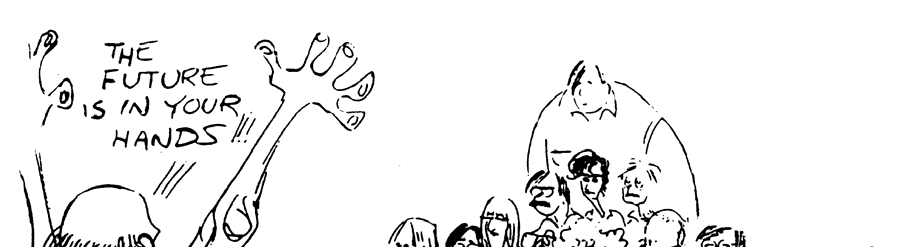{width="6.004166666666666in"
height="1.6416666666666666in"}

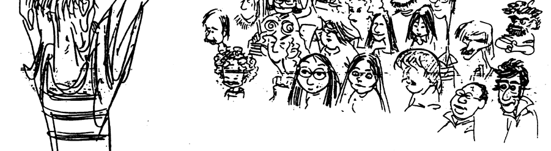{width="6.004166666666666in"
height="1.6416655730533682in"}

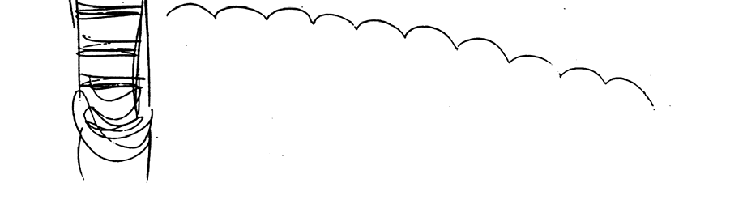{width="6.004166666666666in"
height="1.6416655730533682in"}

에서삶의 환상, Ollie 또는 Frank는 내가 그림 수업에서 계속 강조하는 몇
가지 사항과 일치 하는 청소 담당자의 기능 중 일부를 나열하는 청소
담당자에 대한 단락을 작성했습니다. 부드 러운 모양에 대한 선명한 선(각도
사용), 모양 디자인 베끼기 보다는 액션과 함께 작동하고, 스쿼시와
스트레치를 강조하고, 액션과 드로잉을 발전시킬 때만 디테일을 그립니다.
특히, 애니메이션의 한 장면이든 정지 그림이든 \"이야기하기\".

> 애니메이션을 위한 제스처 그리기 xi
>
> 여기에 전체를 다시 인쇄한 인용문은 청소하는 사람들을 지칭하지만
> 애니메이터와 중간자도 지칭할 수 있습니다. 위의 모든 분류는 장면에
> 들어가는 그림을 만들기 때문에 모두에게 동일 한 교육이 필요합니다.
>
> "그들은 라인 드로잉을 공부했고 홀바인, 드가, 도미에, 다빈치에 대한
> 교육을 받았습니다. 그들은 커튼이 움직이는 것을 보았고, 얇은 스카프,
> 모직 스커트, 흐르는 듯한 망토, 그리고 헐렁한 바지 사이의 차이를
> 주목했습니다. 그들은 크고 부드러운 모양에 대한 날카롭고 선 명한 선의
> 가치를 배웠습니다. 그들은 딱딱한 복사본을 만드는 것보다 애니메이션의
> 자유 롭게 흐르는 모양으로 디자인을 유지하는 방법을 알고 있었습니다.
> 그들은 항상 움직임의 호를 확장하고, 캐릭터를 더 짓누르고, 더
> 늘렸습니다. 액션과 그림을 강조하면서 개선했습 니다. 그들은 장면의
> 비즈니스, 달성해야 할 목표를 이해하고 어떤 부분이 잘 발전하고 있 고
> 어떤 부분이 약간의 도움이 필요한지 결정하는 데 애니메이터와 긴밀히
> 협력했으며 캐 릭터가 \"구르면서\" 살기 시작하는 것을 볼 수 있었습니다.
> 못에 그림.
>
> 애니메이션 드로잉에 적용되는 생각에는 특별한 것이 있습니다.
>
> 검색을 쉽게하지 마십시오. 성공은 속담의 모퉁이에 있습니다.
>
> 힘, 스트레칭, 각도 및 기타 모든 도면이 도움이 되기를 바랍니다.

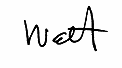{width="1.2708333333333333in"
height="0.7083333333333334in"}

xii 월트 스탠치필드

> **1장: 진실을 찾아라**
>
> **관찰, 관찰, 관찰**\
> 생기! 이것은 당신이 자신을 표현하기 위해 선택한 수단입니다. \"도구\"의
> 전체 목록이 필요합 니다: 그리기, 타이밍, 표현, 행동, 연기, 무언극,
> 준비, 상상력, 관찰, 해석, 논리, 캐리커처, 창 의성, 명료성, 공감 등 -
> 엄청나게 많은 전제 조건이 있습니다.
>
> 편히 쉬세요. 당신은 그들 모두와 함께 태어났습니다. 그들 중 일부는
> 날카롭게 해야 할 수도 있고, 다른 일부는 깊은 잠에서 깨어나야 할 수도
> 있지만 팔, 다리, 눈, 신장, 헤모글로빈 및 언 어만큼이나 당신의
> 일부입니다.
>
> 읽기와 관찰은 마음의 휴면 영역을 해방시키는 두 가지입니다. 고전, 전기,
> 유머, 미스터리 및 만화책을 읽으십시오. 관찰, 관찰, 관찰. 스펀지처럼
> 되십시오. 눈에 보이는 모든 것을 빨아들 입니다. 특이한 것, 일반적인 것,
> 등장인물, 상황, 구성, 태도 연구 형태, 특징, 성격, 활동, 세 부사항 등을
> 찾으십시오.
>
> 사물이 아닌 아이디어를 그리십시오. 포즈가 아닌 액션; 몸짓은 해부학적
> 구조가 아닙니다.
>
> 나는 애니메이터의 목적에 가장 잘 부합하는 그림 스타일을 상기시키기
> 위해 일부 러프 애니 메이션 그림을 다시 인쇄하고 있습니다.\
> 나타내는.
>
> 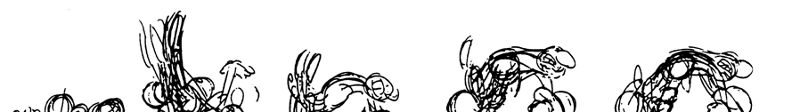{width="5.983332239720035in"
> height="0.8375in"}
>
> {width="5.983332239720035in"
> height="0.8375in"}
>
> 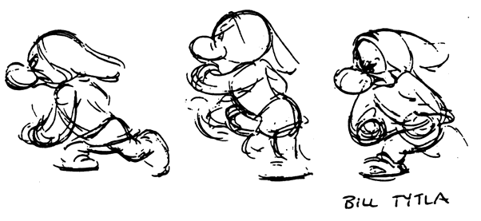{width="4.008333333333334in"
> height="1.8430544619422573in"}

1

애니메이션을 위한 제스처 그리기

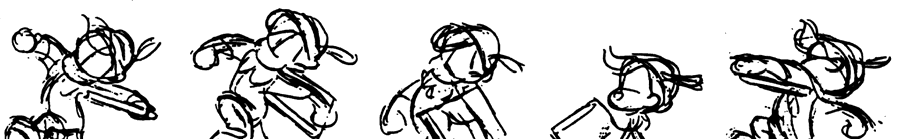{width="5.9875in"
height="0.9208333333333333in"}

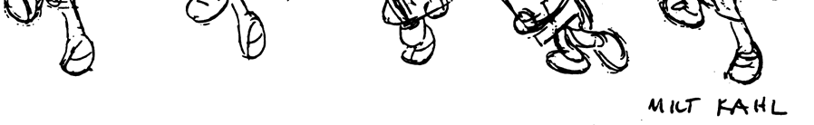{width="5.9875in"
height="0.9194433508311461in"}

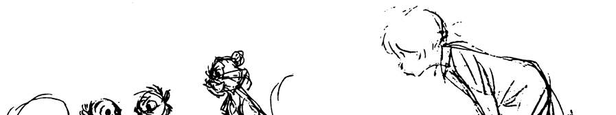{width="5.986111111111111in"
height="1.120832239720035in"}

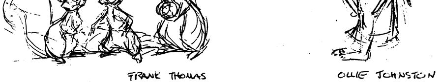{width="5.986111111111111in"
height="1.120832239720035in"}

> 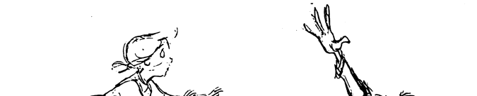{width="4.505554461942257in"
> height="0.908332239720035in"}
>
> 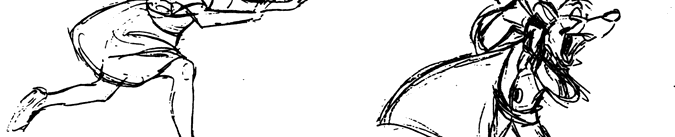{width="4.505554461942257in"
> height="0.9083333333333333in"}
>
> 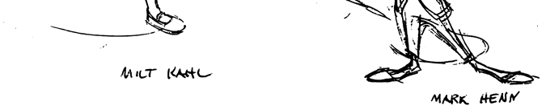{width="4.505554461942257in"
> height="0.9069433508311461in"}

2

1장: 진실을 찾아라!

> 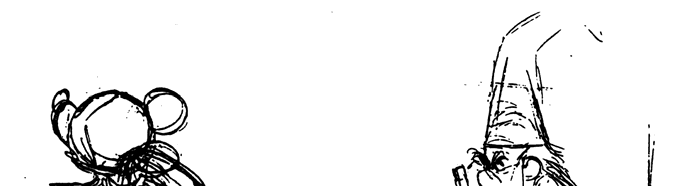{width="4.511111111111111in"
> height="1.2375in"}
>
> 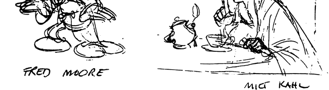{width="4.511111111111111in"
> height="1.2375in"}
>
> **감성으로 인도하다**\
> 잘 짜여진 그림은 모든 부분이 있어야 하고 아름답게 뭉쳐야 하는데,
> 그림을 볼 때 그것이 보 여야 하는 것은 아니다. 당신이보아야 할 것은
> 감정입니다. 굶주린 사람의 그림에서 두려움과 배고픔과 절망을 보아야
> 하고, 여기에 연민과 혐오와 분노를 더하여 느껴야 합니다. 모든 제스 처가
> 그렇게 극적이지는 않겠지만 모든 제스처는 확실히 부분 그 이상입니다.
>
> 이 실험을 해보세요: 나무 성냥을 가져와 보세요. 이는 모델 또는
> 애니메이션의 캐릭터를 나타냅니다. 그런 다음 불을 붙이고 반 정도
> 태우십시오. 이제 제스처로 모델이나 캐릭터를 나타냅니다.
>
> 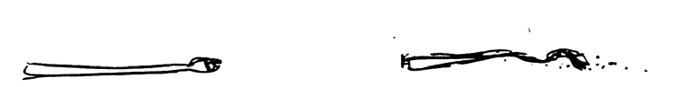{width="5.025in"
> height="0.6458333333333334in"}
>
> 해부학적 성냥에서 번트 성냥으로 변형되었습니다. 불에 탄 성냥을 그려야
> 한다면 \"좋아, 이것 이 성냥의 해부학이다\"라고 스스로에게 말하지 않을
> 것입니다. 아니요, 당신은 \"이것은 해부 학이 불타고 괴로운 모양으로
> 뒤틀린 성냥입니다. 내가 그 상태에 있다고 상상한다면 그 성냥 에 일어난
> 일을 느낀다면 나에게도 일어난 모양입니다. 그렇다면 이것이 내가 그려야
> 하는, 그 리고 묘사해야 하는 감정이다.\"
>
> 진지한 문제든 유머든 주제에 대해 감정적이어야 합니다. 우리는 우리의
> 감정에서 물러설 수 없습니다. 우리가 그렇게 한다면 그는 단순한 해부학적
> 재생산이 될 것입니다. 그림이나 장면 은 물질적 표현이 만들어졌을 때
> 최종적인 것이 아닙니다. 감정에 대한 민감한 묘사가 이루어 지면
> 마지막입니다.
>
> 의미는 이야기에만 있는 것이 아니라 그 이야기를 생생하게 만드는 삽화에
> 있습니다. 예, 해부학, 형태, 구조, 모델 및 2\~3줄의 등이 있지만 이러한
> 것들이 이야기를 표현하는 한에 서만 가능합니다.

삼

애니메이션을 위한 제스처 그리기

**그들에게 경험을 주십시오**

애니메이션을 위한 드로잉은 모델을 종이에 복사하는 것만이 아닙니다.
카메라로 더 잘 할 수 있습 니다. 애니메이션용 드로잉은 액션을 드로잉
형식으로 변환하여 관객이 해당 드로잉을 해당 액션 의 경험으로 다시 번역할
수 있도록 합니다. 당신은 청중이 그것을 보도록 행동을 보여주고 싶지
않습니다. 당신은 그들이 볼 수 있도록, 즉 경험하기 위해 행동을
시각화하기를 원합니다. 그렇게 하면 그것들을 당신의 손에 쥐고, 당신의
힘으로 이야기를 이어갈 수 있고, 청중은 이야기를 이어 갈 수 있습니다.
왜냐하면 그들이 관련되어 있기 때문입니다. 당신은 그들이 그것을 경험할 수
있 도록 허용했습니다.

그림의 부분은 포즈의 의미를 묘사하거나 희화화할 수 있는 방식으로
조합되어야 합니다. 그 렇지 않으면 그것은 단지 그림이 될 것입니다. 그림에
불과하다는 것이 얼마나 끔찍한 운명인 가.

다음은 캐릭터의 해부학과 모델을 초월한 애니메이션 그림입니다. 그것들은
좋은 그림이지 만 단순한 그림이 아닙니다.

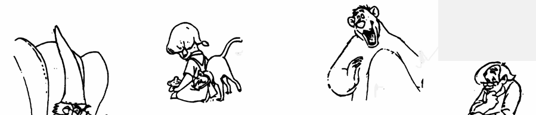{width="5.993055555555555in"
height="1.2847222222222223in"}

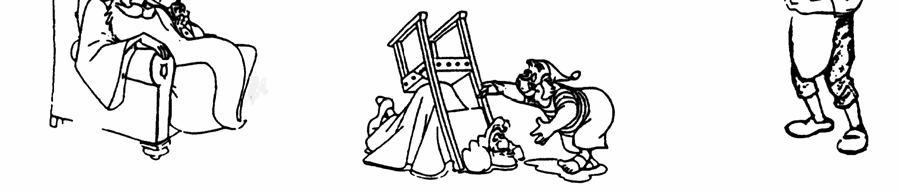{width="5.993055555555555in"
height="1.2861111111111112in"}

**행동의 원동력**\
드로잉 세션에서 저는 학생들의 생각을 모델의 물리적 존재와 의상
장식보다는 몸짓으로 유 도하려고 노력합니다. 모델이 덜 입을수록 생각이
해부학에 더 많이 집중되는 반면 모델이 입 을수록 생각이 의상을 그리는 데
더 많이 들어가는 것 같습니다. 정신 기어를 \"보조\"(세부 사 항)에서
\"기본\"(포즈 뒤에 있는 동기 또는 원동력)으로 전환해야만 깰 수 있는 교착
상태입니 다. 수업 시간에 그리는 그림은 애니메이션 그림 기술을 연마하는
과정으로 생각해야 한다는 것을 기억하십시오.

Eric Larson의 엔터테인먼트에 대한 첫 번째 강의에서 여러분에게 도움이 될
만한 내용을 찾 았습니다. 견적의 길이를 참고하십시오. 너무 잘 붙여서
의미를 잃지 않고 편집 할 수 없었습 니다. 읽으면서 몸짓 그리기에 마음을
두십시오.

> "\.... 우리가 우리 장면의 \'루핑 아웃\'을 시작할 때, 우리는 캐릭터의
> 신뢰성과 우리 가 계획한 행동에 관심을 갖게 되고 우리는 약간의

4

1장: 진실을 찾아라!

> Constantin Stanislavsky의 관찰에 대한 생각. \'모든 신체적 행동에는
> 항상 심리적 인 것이 있고 그 반대도 마찬가지입니다. 외적인 육체적 표현
> 없이는 내적 경험도 없 다.\' 다시 말해서, 우리의 캐릭터는 그것을
> 행동하고 행동하고 움직이게 하기 위해 무 엇을 생각하고 있습니까?
> 애니메이터로서 우리는 그림이 보여주고 싶은 모든 움직임 과 분위기를
> 스스로 느껴야 합니다. 그것들은 우리 생각의 이미지입니다.
>
> "오락을 추구할 때 우리의 상상력은 한계도 경계도 없어야 합니다.
> 창조적인 노력에 있어 항상 기본적인 요구 사항이었습니다. Stanislavsky는
> \'상상력을 배양하고 개발해야 합 니다. 경계하고 풍부하고 활동적이어야
> 합니다. 배우(애니메이터)는 모든 주제에 대해 생 각하는 법을 배워야
> 합니다. 그는 사람(그리고 동물)과 그들의 행동을 관찰해야 합니다.
>
> 그들의 사고 방식을 이해하려고 노력해야 합니다.\'
>
> "어느 정도 우리 청중들은 인간과 동물의 행동을 알고 있습니다. 그들은
> 그것에 대해 보거나 경험하거나 읽었을 수 있습니다. ... 그들의 지식은
> 비록 제한적이긴 하지만 공 통 분모로 작용하며, 우리가 상기 특성과
> 행동을 추가하고 확대하여 \'만화처럼 생생하 게 묘사된\' 스크린으로
> 가져오면 스크린 캐릭터에 대한 관객의 반응적인 관계가 꽃피 게 됩니다.
> 그것은 \"엔터테인먼트\"를 철자합니다.
>
> "우리가 우리 캐릭터의 작은 특징과 매너를 얼마나 잘 찾아내고 얼마나 잘
> 그리고 어 떤 \'삶\'으로 그것을 움직이고 그리느냐가 그 캐릭터의
> 진정성과 엔터테인먼트적 가 치를 결정합니다. 화면을 보고 \'저 사람을
> 알아요!\'라고 말합니다. (또는 제스처 드로 잉의 경우: \'나는 그 사람이
> 무엇을 하고 있는지, 무엇을 생각하고 있는지 알고 있습 니다.\')
>
> 레오나르도 다빈치는 \'포즈가 그 영혼에 무엇이 있는지 알려주는 방식으로
> 인물을 만 드십시오. 몸짓은 몸이 아니라 영혼의 움직임이다.\' 월트
> 디즈니는 액션 뒤에 숨은 원 동력에 대해 다음과 같이 말하면서 우리에게
> 이것을 상기시켰습니다. \'즉, 대부분의 경우 액션의 원동력은 분위기,
> 성격, 캐릭터의 태도 또는 이 세 가지 모두입니다.\'
>
> "애니메이션은 정말 판토마임 예술이기 때문에 우리 스스로를 판토마임
> 주의자 라고 생각합시다. 인간 행동에 대한 철저한 지식을 갖춘 훌륭한
> 판토미스트는 아 주 간단한 행동으로 긍정적이고 재미있는 연기를 선보일
> 것입니다. 그의 기대, 태 도, 표정 및 움직임에 과장이 있어 모든 것을
> 매우 시각적으로 만듭니다.
>
> "인간의 육체적 한계 내에서 일하는 판토미스트는 자신의 행동과 감정을
> 캐리커처하 고, 행동을 좋은 실루엣으로 유지하고, 한 번에 한 가지씩
> 하고, 최대한의 시각적 힘을 위해 긍정적이고 단순한 방식으로 자신의
> 행동을 표현하기 위해 최선을 다할 것입니 다. 그러나 삶을 선형 그림으로
> 해석하는 애니메이터인 우리는 판토미스트로서 단순 함의 가치와 힘을 항상
> 염두에 두고 분위기와 움직임의 캐리커처에서 훨씬 더 강해질 기회가
> 있습니다."

5

애니메이션을 위한 제스처 그리기

다음 페이지에는 Walt가 \"\....행동의 원동력은 캐릭터의 분위기, 성격,
태도입니다\....\"라고 말 했을 때 의미한 바가 무엇인지 보여주는 몇 가지
훌륭한 예가 있습니다. Henn은 Great Mouse Detective의 녹음 세션에
참석했습니다.

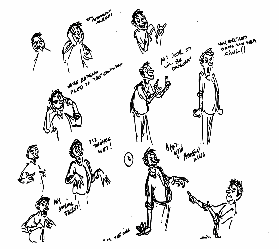{width="5.948611111111111in"
height="5.301388888888889in"}

6

1장: 진실을 찾아라!

> 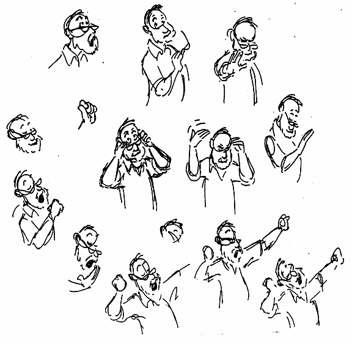{width="6.0in"
> height="5.863888888888889in"}
>
> **몸짓**\
> 제스처는 역할에 캐릭터를 맞추는 데 사용되는 수단입니다. 개, 쥐,
> 올빼미, 코끼리, 고양이, 사람 등 다양하게 그렸습니다. 각각의 독특한
> 캐릭터는 독특한 신체 형태와 몸짓을 가지고 있 습니다. 인간의 모습과
> 의상을 복제한다는 아이디어로 모델에 접근하는 것은 시간 낭비라고 할 수
> 있습니다. 우리의 관심은 각 성격과 개인주의적 제스처의 차이점을 보고
> 훌륭한 캐리커 처 작가처럼 이러한 차이점의 본질을 포착하는 것입니다.
>
> 우리가 과거 영화에서 등장인물들의 캐스트를 검토할 때 우리는 이러한
> 개별적인 특성을 적절 한 캐릭터에 배치하고 그들의 묘사에서 일관성을
> 유지해야 할 필요성을 깨닫습니다. 홈즈의 행 동은 도슨의 행동과 다르고
> 구별되어야 했습니다. 그렇지 않으면 그들의 성격이 흐려질 것입니 다.
> 미키 마우스는 자신만의 고유한 성격을 가지고 있었습니다. 자신의 몸
> 구조와 그에게 부여 된 성격과 일치하는 고유한 움직임과 몸짓입니다.
> 미키와 모든 면에서 백 배나 다른 구피는 같 은 원리가 다른 방식으로
> 사용되었기 때문에 구피였습니다.

7

애니메이션을 위한 제스처 그리기

그림을 그리는 데에는 몇 가지 원칙이 있지만 무한한 수의 성격 특성과
몸짓이 있습니다. 신 체 구조를 배운 후 \"구멍을 뚫는\" 것은 제스처의
뉘앙스를 통해 삶의 이야기를 전하기 위해 해당 정보를 사용하는 흥분과
만족을 놓치는 것입니다.

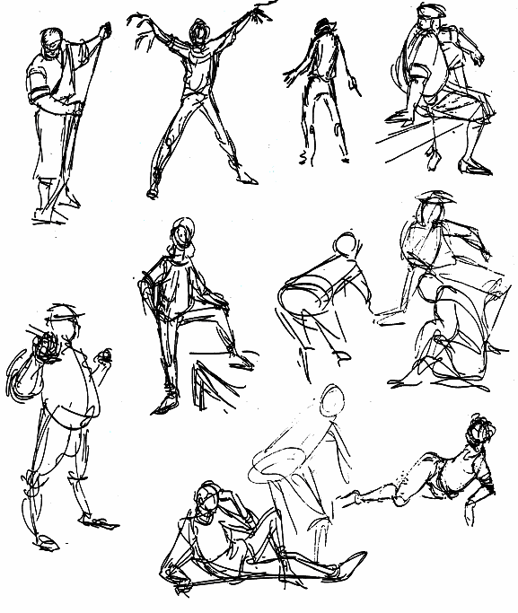{width="6.011111111111111in"
height="7.115277777777778in"}

8

1장: 진실을 찾아라!

> **에센스**\
> 단어본질나에게 그것은 의미가 거의 철학적입니다. \"모든 외적 표현의
> 기초가되는 존 재 \...\" 드로잉에 적용되는 것은 육체의 몸짓을 통해
> 표시되는 동기, 기분 또는 감정입니 다.
>
> 해부학과 역학도 항상 존재하지만, 우리가 최고의 애니메이션 장면(\'scuse
> me - 장면)\'으로 상을 받으려면 결국 각 포즈의 본질이 우선해야 합니다.
> 비율, 해부학, 선, 구조, 무게, 음의 공 간, 각도, 스쿼시 및 스트레치,
> 원근감 등 생각할 것이 많지만 포즈의 본질이 있다면 이러한 영 역에서
> 벗어날 수 있습니다.
>
> 그들 중 하나 또는 다른 것에 대해 매일 약간의 연구를 하면 놀라운 결과를
> 얻을 수 있습니 다. 바라건대, 이 모든 요소가 만족스러운 조화를 이루면서
> 곧 갑자기, 지속적으로 그림에 나타나게 되기를 바랍니다. 그들이 모두
> 함께 어울리기 시작하고 각각의 분리된 것들과의 피곤한 전투가 끝나면
> 당신은 기뻐하고 크게 번영할 것입니다.
>
> 우리는 모두 발달 단계가 다르기 때문에 자신의 약한 부분을 찾아 집중해야
> 합니다. 탐색과 발 견의 정신을 들어보자. 가치 있는 목표에 박차를
> 가한다면 언제든지 모험을 할 수 있습니다.
>
> 나는 Frederich Banbery가 그 책을 위해 그린 몇 가지 그림을 제록스
> 처리했습니다. Pickwick 클럽의 유서내가 생각하는 \"Essence Drawings\"의
> 훌륭한 예라고 생각합니다. 선과 표현은 최소한이지만 몸짓과 느낌은
> 최대다. 그리고 그들은 이야기가 요구하는 유형의 유머를 발산합니다.

9

애니메이션을 위한 제스처 그리기

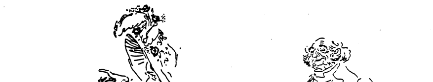{width="5.845833333333333in"
height="1.1138877952755906in"}

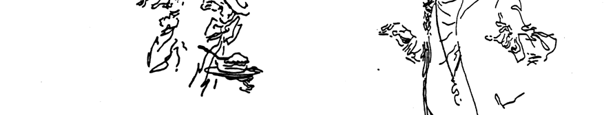{width="5.845833333333333in"
height="1.113888888888889in"}

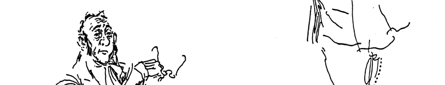{width="5.845833333333333in"
height="1.113888888888889in"}

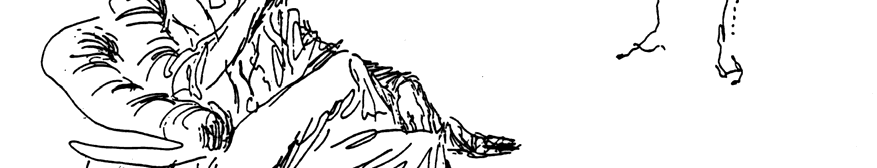{width="5.845833333333333in"
height="1.1152766841644794in"}

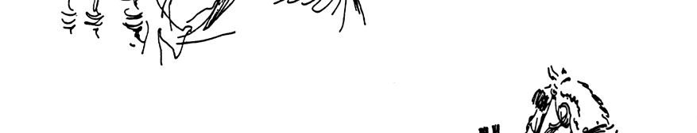{width="5.845833333333333in"
height="1.1152777777777778in"}

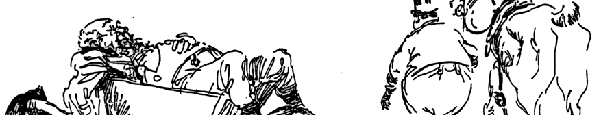{width="5.845833333333333in"
height="1.1138877952755906in"}

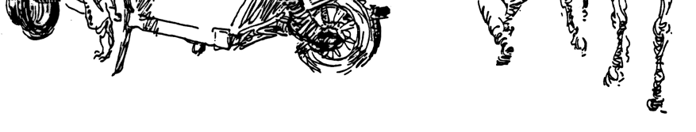{width="5.845833333333333in"
height="1.1097222222222223in"}

10

1장: 진실을 찾아라!

> 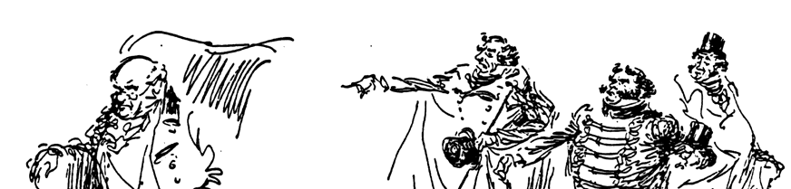{width="5.8180555555555555in"
> height="1.3875in"}
>
> 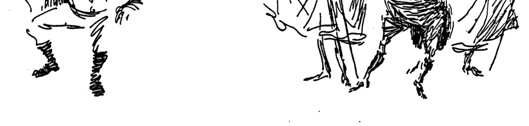{width="5.8180555555555555in"
> height="1.3875in"}
>
> 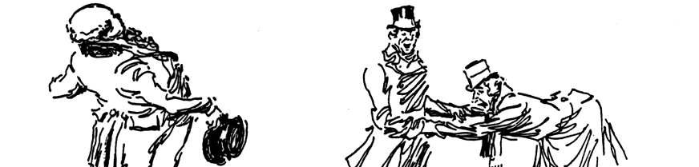{width="5.8180555555555555in"
> height="1.3874989063867016in"}
>
> 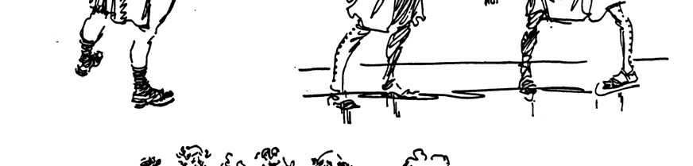{width="5.8180555555555555in"
> height="1.3875in"}
>
> 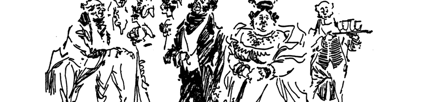{width="5.8180555555555555in"
> height="1.3874989063867016in"}
>
> 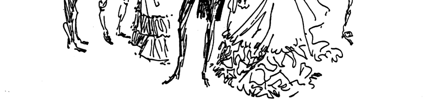{width="5.8180555555555555in"
> height="1.3847222222222222in"}

11

애니메이션을 위한 제스처 그리기

**진실을 찾아라!**

우리는 실제로 우리 자신을 창조하지 않습니다. 우리는 단지 우리를
활성화시키는 창조적 힘 을 사용할 뿐입니다. 그리고 그림을 그릴 때 사실을
기록하는 데 좌뇌를 사용하지 않고 기어를 바꿨고 이제 우뇌를 사용하여 작은
그림 이야기를 만들고 있습니다. 물론 좌뇌가 이전 연구 기 간에 수집하고
명명하고 항목화한 사실과 함께. 이것은 연구 기간이 아닙니다. 이것은 쇼 앤
텔 기간(공부하지 않는 시간)입니다.

지식이 너무 부족하다고 느끼십니까? 위대한 예술 교사인 로베르 앙리는
제한된 지식으로 누 구나 걸작을 그릴 수 있다고 말했습니다. 그 제한된
지식을 올바른(창의적인) 방식으로 사용하 는 것이 문제일 것입니다. 그
위대한 화가 Albert Ryder의 \"지식\"이나 그림 능력을 본 적이 있 습니까?
아마 그렇지 않을 것입니다. 그러나 그의 모호한 바다 위의 배나 아무 것도
입지 않은 채 떠돌아 다니는 해골을 보면 드라마를 느끼며 이야기가 전해지는
느낌이 든다. 그 사실을 알 고 싶다면 Sears 우편 주문 카탈로그를
선택하십시오.

나는 인물 연구를 포기하는 것을 옹호하는 것이 아니다. 해부학은 그림을
그리는 데 있어 중 요한 도구입니다. 하지만 그림을 안다고 해서 당신의
예술가가 될 것이라고 생각하지 마십시 오. 당신을 예술가로 만드는 것은
신체에 대한 몇 가지 기본 사실, 그림의 몇 가지 기본 원칙, 그리고 당신의
감정과 인상을 표현하려는 광범위하고 강박적인 욕망과 충동의 조합입니다.

바이올리니스트 Yehudi Menuin은 그의 직업의 \"정상\"에서 시작했습니다.
그는 아주 어린 나이 에 콘서트에서 연주했으며 10대 후반에 세계적으로
유명했습니다. 갑자기(십대 후반이 갑작스러 운 경우) 그는 자신이 레슨을
받은 적이 없다는 것을 깨달았습니다. 그는 바이올린을 어떻게 연주하 는지
몰랐습니다(당시에는 우뇌가 발견되지 않았습니다).

그는 영감을 주는 플레이 방식이 그를 떠나면 자신이 플레이할 수 없을까
걱정했습니다. 그래 서 그는 수업을 듣고 음악을 배웠습니다. 그것은 그의
플레이 능력을 바꾸지 않았지만 그에게 약간의 보험을 샀습니다.

나는 어떻게든 그가 일찍부터 창조력을 발휘하고 모든 천재들이 하는 것처럼
힘든 공부 기간 을 우회했다는 것을 제안하는 것입니다. 모차르트가 9살쯤에
작곡한 피아노 곡이 있습니다. 나는 몇 년 동안 그것을 작업했지만 여전히
그것을 재생할 수 없습니다. 그는 어쨌든 자신이 누구라고 생각합니까? 나는
수십 년 동안 피아노를 공부해 왔지만 여전히 조표를 모릅니다. 뇌의 왼쪽은
완전히 마비됩니다. 하지만 피아노를 치려고 자리에 앉았을 때 때때로 그
창조적 인 힘이 내 손을 잡고 음악에서 감정적인 소리의 힌트를 추출합니다.
그게 내가 정말 걱정하는 전부야.

내 스케치도 같은 방식입니다. 나는 흉골의 견갑골을 알지 못하지만
스케치북을 가지고 세상 으로 모험을 떠날 때, 나는 인상을 한 프레임의
이야기로 정제하여 내가 본 것에 대한 나의 버 전을 완전히 말할 수
있습니다. 아내 Dee와 내가 휴가를 갈 때 그녀는 사진을 찍고 나는 스케 치를
한다. 그녀는 사실을 기록하고 나는 진실을 기록합니다.

시프트 기어! 당신이 가진 몇 가지 사실과 함께 - 진실을 위해 가십시오!

12

> **2장: 애니메이터의 스케치북**
>
> \"만화 작가는 스케치를 할 때 연구 과정을 거치고 있습니다. 그는 모델에
> 집중하고, 그 움직임, 부피, 윤곽을 연결합니다. 그런 다음 그는 정신, 즉
> \"장자\"만 원한다는 것을 기 억하면서 그것을 내려 놓습니다. 그가
> 추구하는 것. 그는 자신의 모든 경험을 그림에 넣습니다. 그는
> 단순화합니다. 그는 자신의 선을 가지고 놀고, 실험합니다. 그는 해부 학,
> chiaroscuro 또는 \"흐름 선\"의 대칭에 관심이 없습니다. 스케치 패드
> 그는 그리기 를 좋아하기 때문에 그림을 그리는 것입니다! 모든 유형의
> 스케치는 아티스트에게 도 움이 됩니다. 스케치를 멈추지 마세요! 집에서,
> 지하철에서, 피크닉에서, 미술 학교에 서 또는 침대에서 스케치를 합니다.
> 하지만 SKETCH!

--- 책에서모두를 위한 만화로렌스 라리어

> \"스케치북에 자신을 너무 철저하게 결합하여 거의 자신의 물리적 확장이
> 될 것을 제안 합니다. 이제 당신이해야 할 일은 그림을 그리고 그림을보고
> 그림을보고 그림을보고 그림을 그리는 것입니다.. .\"

--- 책에서그리기 배우기로버트 카우펠리스

> \"마지막으로, 항상 스케치북을 휴대하는 것의 가치를 너무 강조하지 않을
> 수 없습니다. 거기에는 메모와 아이디어를 기록할 수 있으며 무엇보다도
> 아티스트 또는 만화가로서의 지속적인 발전을 기록할 수 있습니다.\"\
> --- 책에서만화 기초알 로스
>
> \"그(작가)는 자신이 사랑하는 것을 소홀히 지나치지 않고, 그것을 알기
> 위해 멈추고, 스케 치북의 축약형으로 메모하기 위해 멈추고, 발견한 대로
> 삶을 살아갑니다. 그는 자신이 사 랑하는 것을 찾고 있습니다. , 그는
> 그것을 잡으려고 합니다. 그것은 어디에서나, 어디에서 나 발견됩니다.
> 사냥꾼이 아닌 사람들은 이러한 것들을 보지 못합니다. 사냥꾼은 보고 이
> 해하고 즐기는 법을 배우고 있습니다.\"\
> --- 로버트 앙리
>
> 예술가에게 스케치는 권투 선수에게 섀도우 복싱이, 콘서트 피아니스트에게
> 키보드 연습이, 테니스 선수 또는 모든 스포츠(또는 노력) 참가자에게
> 연습이 하는 것입니다. 위에서 나는 예 술가의 일상적인 모험(모험)의 필수
> 부분으로 스케치를 맹세하고 추천하는 예술가와 만화가 를 인용했습니다.

13

애니메이션을 위한 제스처 그리기

> 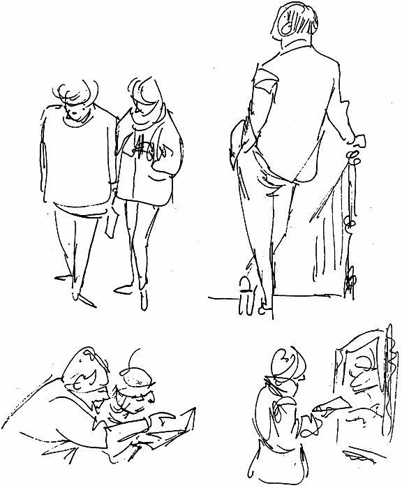{width="4.073611111111111in"
> height="4.936111111111111in"}

스케치북을 가지고 다니십시오. 페이지 낭비에 대해 걱정할 필요가 없는
저렴한 책입니다. 지 하에서 스케치를 하고, 텔레비전을 보면서, 술집에서,
경마장에서. 복싱 경기, 축구 경기 등 스 포츠 경기는 스케치하는 것이 특히
재미있습니다. 끊임없이 그림을 그립니다. 삶에 대한 관심 이 커질 것입니다.
그리기 문제를 해결하는 능력이 날카로워집니다. 창조적 인 주스가 급증 할
것입니다. 치유액이 몸 전체에 흐를 것입니다. 삶과 경험과 성장에 대한
열망은 모든 고갈과 무관심의 감정을 몰아낼 것입니다.

이 모든 에너지를 어디에서 얻을 수 있습니까? 인체는 발전기와 같은 에너지
생성 기계라는 사 실을 깨달으십시오. 에너지를 더 많이 사용할수록 더 많이
생산됩니다. 스케치와 같은 업무 관 련 취미는 긍정적인 활동입니다. 특히
선택한 분야에서 활동이 없으면 부정적인 것입니다. 부 정은 무겁고,
성가시고, 쇠약하게 하고, 비생산적이며 완전히 피해야 합니다. 오늘
긍정적인 발 걸음을 내딛으세요. 스케치북과 펜(연필보다 더 영구적임)을
구입하고 페이지에 작은 직사각 형을 만들고 간단한 구성으로 채웁니다.

14

2장: 애니메이터의 스케치북

> 그것을 식별하고 날짜를 기입하고 그것 에 대해 기분이 좋습니다. 그것에
> 대해 부정적으로 생각하거나 말하지 마십시 오. 시작이 원하는 만큼
> 만족스럽지 않 다면 비판하지 마십시오. 페이지를 넘 기고 다른 페이지를
> 시작하기만 하면 됩니다. 보다 만족스러운 스케치를 만 들기 위해 필요한
> 모든 기능은
>
> 새로운 주제를 찾고 스케치를 시작하면 서 깨어난 지금도 마찬가지입니다.
> 우주 의 어느 누구도 당신처럼 그것을 그리지 않았을 것입니다. 당신이 더
> 잘하고 싶다 고 생각한다면, 다른 것을 만들고, 다른 것을 만들고, 또 다른
> 것을 만드십시오. 첫 번째 것을 유지하십시오. 시설과 관심 모두의 성장을
> 지켜보십시오. 생활 드로 잉 수업에서 몸통만 그리면서 자신의 한 계를
> 종식시키십시오. (내가 과장합니 까?) 마음의 잠재적인 틈새를 활성화하십
> 시오.
>
> 기독교 종교에는 \"만약 당신이 믿을 수 있다면 그렇게 될 것입니다.\"라고
> 말하는 법이 있습니다. 민법은 어길 수 있지만 영적인 법은 어길 수
> 없습니다. 생각을 조심해야 합니다. 영적 또는 정 신적 법칙 중 하나가
> 작동하기 시작하 면 모든 종류의 일이 일어나기 시작합 니다

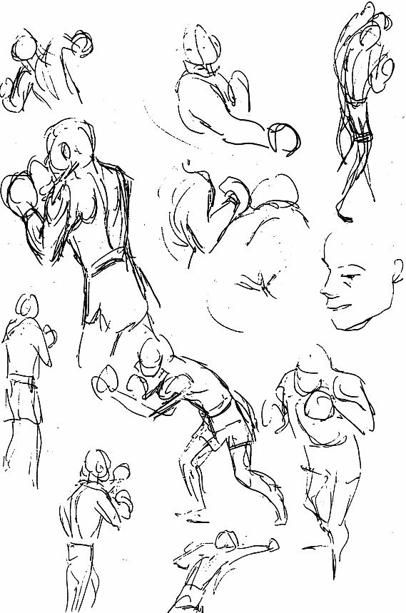{width="3.6875in"
height="5.572222222222222in"}

> 그 이행을 구현하기 위해 무대 뒤에서. 그러니 그림을 잘 그리고 싶다면
> 스케치북을 시작 하고 좋은 법을 배워보세요.

15

애니메이션을 위한 제스처 그리기

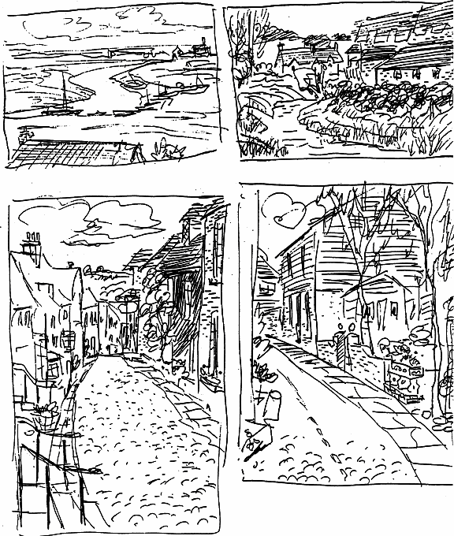{width="6.138888888888889in"
height="7.252777777777778in"}

16

2장: 애니메이터의 스케치북

> **어디를 가든지**
>
> 다음과 같은 공공 장소에서 스케치하는
>
> 것을 두려워하지 마십시오.
>
> 박물관, 공원, 레스토랑 등. 그리 고 바람, 비, 추위 또는 더위가 당 신을
> 방해하지 않도록하십시오. 이러한 조건은 때때로 최고의 스 케치를
> 산출합니다. 당신이 그릴 수 있도록 여행할 때 다른 사람이 운전하게
> 하십시오. 고속으로 이 동하면서 장면을 캡처하면 눈이 날카로워지지만 더
> 많은 작업을 수행하는 데 시간이 걸립니다.
>
> 상세한 스케치.
>
> 인물이나 만화에만 관심이 있 다며 풍경을 기피할 수 있습니 다. 그러나
> 나무와 산, 강과 구 름은
>
> 행동을 분석하는 데 도움이 될 수 있는 제스처. 산은 곧게 서 고,
> 기울어지고, 눕고, 뻗어 있 으며, 충적 형태로 계곡에 쏟아 집니다. 나무가
> 베고, 괴로워 하거나

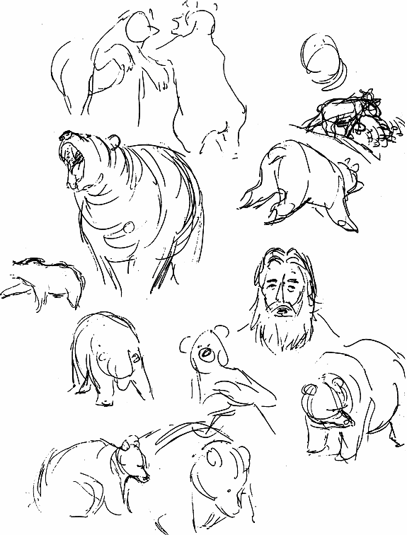{width="3.801388888888889in"
height="5.0in"}

> 유머러스한 몸짓; 그들은 곧게 서고, 쭉 뻗고, 비스듬히 서 있습니다. 어떤
> 사람은 피곤하고, 어떤 사람은 활 기차고, 어떤 사람은 열매나 꽃을
> 피우며, 그 자체로 몸짓입니다. 풍경의 분위기에도 (공간) 제스처가 있습
> 니다.
>
> 길든 짧든 여행을 간다면 카메라보다 스케치북을 우선시하세요. 그 어느
> 때보다 더 많이 찾고 보게 될 것입니다. 계속 늘어나는 스케치북에서
> 새로운 볼거리, 방문할 새로운 장소, 더 많은 종류의 사람들을 \"포착\"할
> 수 있는 방법을 찾고 있는 자신을 발견하게 될 것입니다. 그것은 당신의
> 일기가 될 것입니다. 그것을 그래픽 자서전으로 생각하십시오. 이
> 행성에서의 너무 짧 은 여행에 대한 개인적인 관찰에 대한 독특한
> 설명입니다.
>
> 집에서도 스케치. 무릎에 스케치 패드 없이 TV 앞에 앉지 마십시오. 얼굴,
> 인물, 무대 설정을 스케치합니다. 개나 고양이가 근처 바닥에 누워 있으면
> 스케치하십시오.
>
> 차량에는 고유한 제스처가 있습니다. 어떤 차는 미끄러지듯 가고 어떤 차는
> 자랑스럽게 움직 입니다. 일부는 용수철 위로 올라가 있습니다. 하천을
> 건널 수 있도록 치마를 들고 있는 것처 럼 보입니다. 스킵 로더, 세미 및
> 데릭과 같은 특수 장비 및 배송

17

애니메이션을 위한 제스처 그리기

트럭 - 모두 각자의 일을 합니다. 농부가 회사원인 것처럼 그들은 서로
다릅니다. 또는 군인은 깡패 출신입니다. Ford 광고를 하는 것처럼 차량을
스케치하지 마십시오. 차량의 성격과 제스 처를 살펴보십시오. 스케치는
재미있을 뿐만 아니라 평생 싸워야 할 빈 종이를 마스터하는 데 도움이 될
것입니다.

**구성**\
먼저 직사각형을 그리고 그 안에서 작업하여 한 가지를 다른 것 및 테두리와
연결하여 구성을 만들도록 합니다. 스케치에 톤을 맞출 필요가 있다고
생각되면 크로스 해치를 사용하거나 몇 개의 회색 펠트 펜을 휴대하십시오.
펜을 사용하는 습관을 들이십시오. 훨씬 더 직접적이고 부 드러운 연필처럼
문지르지 않습니다.

최소한의 선으로 포즈를 캡처하는 직접적인 접근 방식의 가능성을 보여주기
위해 공항, 지하 및 박물관에서 만든 몇 가지 스케치를 Xeroxed했습니다. 서
있는 자세에서 한쪽 다리에 무게 를 싣는 것을 강조하십시오. 앉아있는
자세의 이완 강조. 처음에는 연필로 칠하지 않았습니 다. 잉크로 직접
수행했습니다.

{width="3.6236100174978128in"
height="3.2416666666666667in"}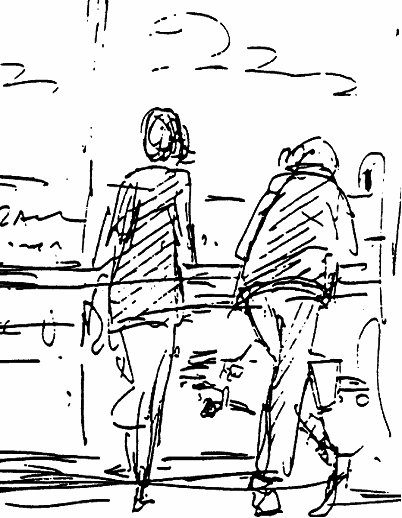{width="2.198611111111111in"
height="2.8222222222222224in"}

18

2장: 애니메이터의 스케치북

> 이것은 눈을 감고 판지 템플릿 내부에서 수행되었습니다. 테두리는 나중에
> 추가되었습니 다. 좋은 운동!
>
> 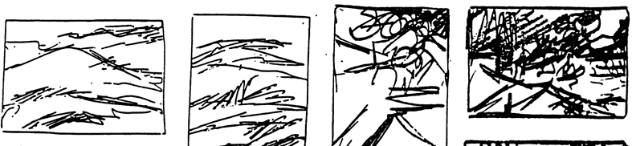{width="5.243055555555555in"
> height="1.211111111111111in"}
>
> 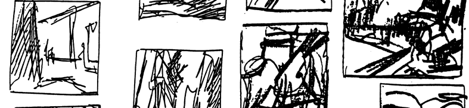{width="5.243055555555555in"
> height="1.2111100174978127in"}
>
> {width="5.243055555555555in"
> height="1.2125in"}

19

애니메이션을 위한 제스처 그리기

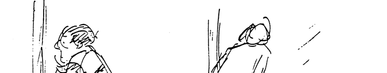{width="5.033333333333333in"
height="0.945832239720035in"}

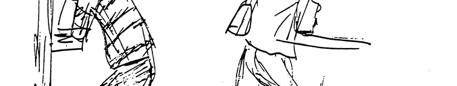{width="5.033333333333333in"
height="0.9472222222222222in"}

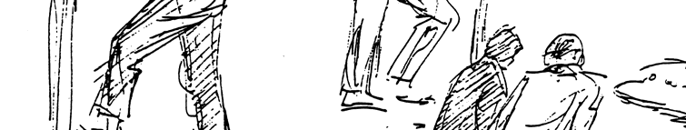{width="5.033333333333333in"
height="0.9472211286089239in"}

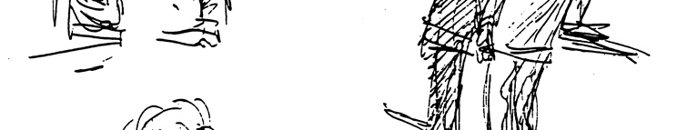{width="5.033333333333333in"
height="0.9472222222222222in"}

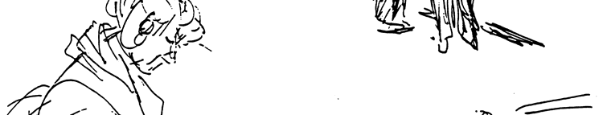{width="5.033333333333333in"
height="0.9472211286089239in"}

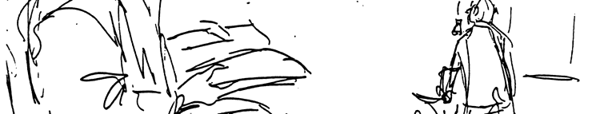{width="5.033333333333333in"
height="0.945832239720035in"}

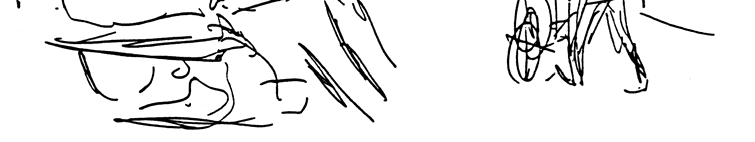{width="5.033333333333333in"
height="0.9430544619422572in"}

20

2장: 애니메이터의 스케치북

> **론 남편의 스케치북**\
> Ron Husband는 공평하게 자신의 일을 처리하는 조용한 사람으로 보입니다.
> 그러나 그는 집요한 스케치가입니다. 그의 펜은 일상 생활의 사건을
> 끊임없이 찾고 탐구하며 일상을 넘어 엔터테인먼트의 영역으로 밀어
> 넣으려고 시도합니다. 그의 방에 채워진 100권의 스케치북 (집에 100권이
> 더 있음)은 애니메이션을 하지 않을 때 그가 하는 전부라고 생각하게 만들
> 수 도 있지만 그는 몇 가지 \"불 속의 철\"을 가지고 있으며 정의를 행할
> 수 있는 능력 이상입니다. 그들 모두에게. 그는 어린이 잡지의 삽화가이며
> 매우 상상력이 풍부한 자신의 책에 참여하고 있습니다. Ron은 그의 그림을
> 작은 스케치북 형식으로 제한하지 않습니다. 1년 정도 전에 그 가 17 x
> 22인치에 대해 많은 그림을 전시했던 전시회를 기억합니다. 유머러스한
> 것부터 드라 마틱한 것까지 다양했고,
>
> Ron은 빠른 스케치가 애니메이션에 도움이 된다고 믿습니다. 그는 스케치가
> 드로잉 능력을 향상시키고 눈을 빠르게하며 더 짧은 시간에 동작을
> 분석하는 데 도움이 될 것이라고 유지합 니다. 그는 빠른 스케치의 이점은
> 포즈의 본질을 포착하고, 드로잉의 신뢰성을 확보하고, \"격 자\" 또는
> 접지면 및 배경에 대한 인식을 선명하게 하고, 깊이, 원근 및 3차원에 대한
> 더 큰 친숙 도를 얻는 능력이라고 말합니다. , 또한 표준 3/4 전면 또는
> 후면 보기의 관점에서 생각하지 않 아도 됩니다.
>
> 다음은 그의 스케치북 중 일부에서 발췌한 것입니다.
>
> {width="5.629165573053369in"
> height="1.1236111111111111in"}
>
> {width="5.629165573053369in"
> height="1.1236100174978128in"}
>
> {width="5.629165573053369in"
> height="1.1222211286089239in"}
>
> {width="5.629165573053369in"
> height="1.1222222222222222in"}

21

애니메이션을 위한 제스처 그리기

{width="5.805555555555555in"
height="1.325in"}

{width="5.805555555555555in"
height="1.325in"}

{width="5.805555555555555in"
height="1.3249989063867016in"}

{width="5.805555555555555in"
height="1.325in"}

{width="5.805555555555555in"
height="1.3222211286089238in"}

22

2장: 애니메이터의 스케치북

> {width="5.998611111111111in"
> height="1.1694433508311461in"}
>
> {width="5.998611111111111in"
> height="1.1708333333333334in"}
>
> {width="5.998611111111111in"
> height="1.170832239720035in"}
>
> {width="5.998611111111111in"
> height="1.1694433508311461in"}
>
> {width="5.998611111111111in"
> height="1.1708333333333334in"}
>
> {width="5.998611111111111in"
> height="1.1694433508311461in"}
>
> {width="5.998611111111111in"
> height="1.1694444444444445in"}

23

애니메이션을 위한 제스처 그리기

{width="5.966666666666667in"
height="1.1388888888888888in"}

{width="5.966666666666667in"
height="1.1402766841644794in"}

{width="5.966666666666667in"
height="1.1402766841644794in"}

{width="5.966666666666667in"
height="1.1402777777777777in"}

{width="5.966666666666667in"
height="1.1402766841644794in"}

{width="5.966666666666667in"
height="1.1388888888888888in"}

{width="5.966666666666667in"
height="1.136111111111111in"}

24

2장: 애니메이터의 스케치북

> {width="6.004165573053369in"
> height="1.1597222222222223in"}
>
> {width="6.004165573053369in"
> height="1.1597222222222223in"}
>
> {width="6.004165573053369in"
> height="1.1597222222222223in"}
>
> {width="6.004165573053369in"
> height="1.1597222222222223in"}
>
> {width="6.004165573053369in"
> height="1.1611111111111112in"}
>
> {width="6.004165573053369in"
> height="1.1597222222222223in"}
>
> {width="6.004165573053369in"
> height="1.1541666666666666in"}

25

애니메이션을 위한 제스처 그리기

{width="5.991666666666666in"
height="1.3833333333333333in"}

{width="5.991666666666666in"
height="1.3847222222222222in"}

{width="5.991666666666666in"
height="1.3847211286089238in"}

{width="5.991666666666666in"
height="1.3847222222222222in"}

{width="5.991666666666666in"
height="1.3847211286089238in"}

{width="5.991666666666666in"
height="1.3791666666666667in"}

26

2장: 애니메이터의 스케치북

> **메모 작성 및 스케치**\
> 아직 메모를 하지 않았다면 메모를 작성하세요. 잠재적으로 비옥할 수 있는
> 수백 가지 아이디 어가 당신의 의식을 떠돌아다녔고 영원히 잃어버리기
> 위해 망각 속으로 사라졌습니다. 부비동 을 깨끗이 하는 강력한 양 고추
> 냉이 소스와 같이 어떤 환상적 점, 아마도 주름을 그리는 더 명 확한 방법
> 또는 손이나 무릎을 그리는 더 좋은 방법에 대한 명확한 비전을
> 불러일으키는 것을 자주 듣거나 봅니다. 그 당시에는 너무 명백해 그것을
> 기록할 이유가 없는 것 같습니다.
>
> 많은, 아마도 수십 개의 아이디어가 낮과 밤 동안 민감한 수용체를
> 공격했고, 과부하는 항상 가 장 유용한 것은 아니지만 가장 인상적인 몇
> 가지 메시지를 위해 스스로를 조정합니다. 따라서 그것들을 기록하거나
> 스케치하십시오. 그것들은 나중에 매우 가치 있는 것으로 판명될 수 있
> 습니다. 노련한 메모 작성자는 종종 겉보기에 둔해 보이는 정보를 듣고 그
> 자리에서든 나중에 든 이를 의미 있는 지혜로 번역합니다. 일단 글이나
> 그림으로 적으면 비옥한 땅에 심어진 씨앗 처럼 적절한 유인이 주어지면
> 싹이 텄습니다.
>
> 스케치처럼 메모를 하는 것은 마음을 날카롭게 하고 더 민감하고 수용적인
> 도구로 연마하여 \"조수와 함께\" 허용되는 것보다 필요할 때 더 준비할 수
> 있습니다. 리액터냐 액터냐의 차이일 수 있다. 원자로는 움직이기 전에
> 다른 사람의 기회를 기다리며 표류합니다. 배우는 자신의 메 모를 확인하고
> 자신의 긍정적 인 움직임을 생각해냅니다. 전부는 아니더라도 대부분의
> 예술 가, 작곡가, 작가, 과학자 등은 열렬한 메모를 하고 스케치하는
> 사람이었습니다.
>
> 안감이 없는 종이가 있는 3개의 고리 모양의 느슨한 잎 메모장은 필기,
> 스케치 및 메모 보관에 이상 적입니다. 너무 커서 어디든 가지고
> 다니기에는 너무 클 수 있으므로 주머니나 지갑에 들어갈 수 있는 작은
> 메모장으로 보강하십시오. 작은 패드에 적힌 메모는 제거하고 테이프로
> 붙이거나 더 큰 책에 붙일 수 있습니다. 출처를 기록하거나 자신의 출처를
> 이니셜로 기록하십시오. 날짜도 함께 기 재하십시오. 그것은 학습의 큰
> 초점이 될 것이고 즐거운 취미가 될 것이며, 새로운 아이디어와 창 의적인
> 사고의 새로운 전망을 염두에 두는 데 도움이 될 것입니다.
>
> 노트/스케치북은 쓰기와 스케치를 모두 포함할 수 있고 포함해야 합니다.
> 기억은 창의적인 작 업에 종종 유용합니다. 오늘날의 경험은 기록하고
> 저장하고 음미할 가치가 있습니다. 관련 세 부 사항만 적습니다.
>
> 스케치 장면, 표현 --- 스케치 아래에 설명을 작성하십시오. 당신이 알고
> 만나는 사람들을 묘사 하십시오. 인상을 나중에 수정하지 마십시오. 새로운
> 인상을 쓰거나 그리는 것이 좋습니다. 감 각을 인식함으로써 감각을
> 개발하십시오. 직관적인 방식으로 녹음하거나 유머러스한 극단으 로
> 캐리커처하십시오. 당신이 하게 될 일은 당신의 감성을 날카롭게 하고
> 인상에 대한 당신의 감수성을 높이고 그것을 그래픽 형식으로 인식하고
> 바꾸는 능력을 개선하는 것입니다. 곧 당신 은 인상을 찾기 위해 세상을
> 탐험하는 자신을 발견하게 될 것이며, 그것들을 기록하는 것은 정 신적,
> 육체적, 영적으로 당신을 부양할 것입니다.
>
> 이에 대한 내 공식을 기억하십시오. 인상 ‒ 표현 우울증. 그러니 메모를
> 하는 사람이 되어 수 집을 시작하세요. 한쪽 귀나 눈으로 다른 쪽 귀로가
> 아니라 그래픽으로, 당신이 표현하기로 선택한 손가락을 통해 수집하세요.

27

애니메이션을 위한 제스처 그리기

자신을 통해. 단어, 문구, 기사, 그림, 그림, 당신의 불꽃을 일깨우는 모든
것을 복사하십시오.

{width="6.002777777777778in"
height="1.3194444444444444in"}

{width="6.002777777777778in"
height="1.3194444444444444in"}

{width="5.8805555555555555in"
height="1.2583333333333333in"}

{width="5.8805555555555555in"
height="1.2569444444444444in"}

{width="5.8805555555555555in"
height="1.2569444444444444in"}

스케치북으로 무장하면 기회가 올 때 대비할 수 있습니다. 어느 날 유목과
조개껍데기(내 유 목 모빌과 해초(아내의 바구니 만들기)를 찾기 위해)를
찾다가 해변에서 이 연 전단 무리를 만 났습니다.

28

2장: 애니메이터의 스케치북

> {width="6.004165573053369in"
> height="1.1083333333333334in"}
>
> {width="6.004165573053369in"
> height="1.108332239720035in"}
>
> {width="6.004165573053369in"
> height="1.1055544619422573in"}
>
> 만화가 알 로스의 스케치북에서
>
> 어떤 주제에 대해 메모를 하거나 생각을 모으는 좋은 방법은 문제나 주제를
> 중앙에 표시하고 동그라미를 치는 것입니다. 그런 다음 관련 생각이 오거나
> 연구를 수집하면서 중심에 선으로 연결하고 더 밀접하게 관련된 그룹으로
> 묶습니다. 그것은 마음을 집중시키는 훌륭한 수단입니 다.
>
> {width="3.848611111111111in"
> height="2.2083333333333335in"}
>
> {width="3.848611111111111in"
> height="2.209722222222222in"}

29

애니메이션을 위한 제스처 그리기

나는 침체기에 빠진 예술가들을 위한 영감을 주는 책을 만들고 있었습니다.
제목에 대한 이 러한 제안은 식당에서 또는 운전 중에 기록되었을 수
있습니다.

> {width="5.002777777777778in"
> height="3.5527777777777776in"}

**좋은 습관**\
사람들은 일반적으로 습관적으로 하는 일을 합니다. 당연한 말처럼 보일 수
있지만 여러 면 에서 의미가 있습니다. 그것의 찬성으로 논하면, 그것은
편안한 생활 방식입니다. 주의를 요 하는 최소한의 결정이 있으며, 당신이
습관적으로 하고 있는 일과 그것을 하는 방식이 \"이상 적인\" 삶에 대한
당신의 생각과 양립할 수 있기를 바랍니다. 콘서트 피아니스트나 록 밴드 드
러머 또는 프로 테니스 선수가 되기 위해 공부하고 있다면 몇 시간이나
연습하는 것과 같은 엄격한 습관 형성에 복종하는 것이 좋습니다.

30

> **3장: 그림 그리기를 위한 시각적 어휘**\
> 어떤 의미에서 회화는 언어적 어휘가 필요한 것처럼 시각적 어휘를
> 축적함으로써 학습됩니다. 그리고 어느 정도의 문장 구조, 구문 및 성조는
> 구두로 의사 소통하는 법을 배워야 하므로 그림 의 의미를 전달하는 데
> 배우고 사용해야 하는 몇 가지 그림 규칙이 있어야 합니다.
>
> 우리는 의사 소통을 \"정상\"이라고 생각하지만 먼 과거에는 단어가 없었고
> 그 시점에서 사람 은 자신의 생각을 전달할 수있는 방법이
> 제한적이었습니다. 아마도 간단했습니다. 우리의 현 재 커뮤니케이션
> 방식은 진화했고\... 지금도 진화하고 있습니다. 우리 수업에서 우리는
> 제스처 를 한 번에 보고 모든 신선함과 명료함을 내려놓음으로써 의사
> 소통을 그리는 데 또 다른 도약 을 시도하고 있습니다.
>
> **라인, 라인, 라인**\
> 귀하의 비즈니스(애니메이션)에서 라인은 가장 중요한 요소 중 하나입니다.
> 선은 인간(예술 가)이 경이적인 정도로 발전시킨 매우 흥미로운
> 발견입니다. 줄을 서는 것은 진정한 모험이 될 수 있으며, 능숙하게
> 사용하면 화면에서 당신의 작품을 보는 수백만 명의 시청자에게 모험의
> 원천이 될 수 있습니다. Line은 단순한 추적 도구가 아니라 꿈꾸는 모든
> 것을 설명할 수 있는 살아 있고 유기적인 것입니다.
>
> **많은 종류의 라인이 있습니다.**
>
> 짧은 것:
> {width="0.7138888888888889in"
> height="0.4166666666666667in"}\
> 긴 것:
> {width="4.858332239720035in"
> height="0.4166666666666667in"}곡선:
> {width="0.7944433508311461in"
> height="0.25in"}\
> {width="1.6263888888888889in"
> height="0.5513877952755906in"}그리고 시작은 좋았지만 똥이 나오는
> 것처럼 보이는 것들도 있습니다.
>
> 라인으로 무엇이든 할 수 있습니다. 몇 년 전에 다음과 같은 어리석은
> 기믹이 있었습니다.

+---------------------+-----------------------------------------------+
| > 이게 뭔지 아세요? | > {width="0.8069433508311461in" |
|                     | > height="0.2916666666666667in"}곁눈질하는    |
|                     | > 사람들을 위한 TV 화면입니다.                |
+=====================+===============================================+
| 이게 뭔지 알아?     | > {width="0.8874989063867017in" |
|                     | > height="0.9069444444444444in"}\             |
|                     | > 딸꾹질을 동반한 토네이도입니다.             |
+---------------------+-----------------------------------------------+

31

애니메이션을 위한 제스처 그리기

> {width="5.998611111111111in"
> height="1.4097222222222223in"}
>
> {width="5.998611111111111in"
> height="1.4111111111111112in"}
>
> {width="5.998611111111111in"
> height="1.4111100174978128in"}
>
> {width="5.998611111111111in"
> height="1.4111111111111112in"}
>
> {width="5.998611111111111in"
> height="1.4111100174978128in"}
>
> {width="5.998611111111111in"
> height="1.408332239720035in"}

32

{width="6.0in"
height="0.8324081364829397in"}{width="6.0in"
height="0.8324081364829397in"}{width="6.0in"
height="0.8324081364829397in"}{width="6.0in"
height="0.8324081364829397in"}{width="6.0in"
height="0.8324081364829397in"}{width="6.0in"
height="0.8324081364829397in"}{width="6.0in"
height="0.8324081364829397in"}{width="6.0in"
height="0.8324081364829397in"}{width="6.0in"
height="0.8324081364829397in"}{width="6.0in"
height="0.8324081364829397in"}{width="6.0in"
height="0.8324081364829397in"}{width="6.0in"
height="0.8324081364829397in"}{width="6.0in"
height="0.8324081364829397in"}{width="6.0in"
height="0.8324081364829397in"}{width="6.0in"
height="0.8324081364829397in"}{width="6.0in"
height="0.8324081364829397in"}{width="6.0in"
height="0.8324081364829397in"}{width="6.0in"
height="0.8324081364829397in"}

3장: 그림 그리기를 위한 시각적 어휘

33

애니메이션을 위한 제스처 그리기

**그리기에 대한 간단한 접근**\
수업이나 경험이 거의 없는 우리 반 학생들을 위해 그림에 대한 매우 간단한
접근 방식을 채 택할 것을 제안합니다. 경험은 있지만 모델 작업을 소홀히 한
사람들도 이점을 누릴 수 있습 니다.

모델을 대할 때 가장 논리적인 접근 방식은 몇 가지 간단한 요소 모양으로
기본 포즈를 취하는 것입니다. 의상의 세부 사항은 무시하십시오. 먼저
제스처의 포즈를 연구하고(자신만의 스피 아니즘을 약간 추가해야 할 수
있음) 근육이나 기타 세부 사항과 같은 모든 세부 사항을 무시하 고 체중
분포와 모든 추상적인 모양(실루엣)을 찾고 일반적이고 전반적인 일반적인
제스처. 이 것은 또한 상대적 비율에 집중할 수 있는 기회를 제공합니다.
비율이 중요하므로 미키, 로저 래 빗, 인어, 에릭, 세바스찬과 같이 비율에
대한 감수성을 모두 다른 비율로 개발해야 합니다.

다음은 간단한 접근 방식에 대한 몇 가지 제안입니다. 수많은 불필요한 선과
수수께끼 모양으 로 인해 방해를 받거나 혼란스러워하지 않을 것입니다.
포즈를 잡으면 의상을 더 쉽게 입을 수 있습니다. 주름에 대한 알려진 사실을
사용하여 모델에서 적절한 주름을 선택하거나 직접 만 들 수 있습니다.
\"짧은\" 체형을 만들 때 가슴과 엉덩이가 비틀렸을 때 별도의 모양으로
처리할 수 있다고 제안하겠습니다. 이렇게 하면 서로 다른 방향을 향하도록
더 쉽게 그릴 수 있습니다. 비틀지 않을 때 가슴과 엉덩이 부분은 하나의
형태로 취급될 수 있다.

{width="6.0125in"
height="1.0652766841644794in"}

{width="6.0125in"
height="1.0652777777777778in"}

{width="6.0125in"
height="1.0652766841644794in"}

{width="6.0125in"
height="1.0638888888888889in"}

34

3장: 그림 그리기를 위한 시각적 어휘

> 다음은 Lariar의 책에서 제안한 것입니다.모두를 위한 만화, 만화 그림에
> 누워있는 방법. 그는 이 삽화에 대한 설명을 하지 않았지만 보다시피 그는
> 일반적인 것부터 구체적인 것까 지 일했습니다.
>
> {width="5.966666666666667in"
> height="1.3499989063867017in"}
>
> {width="5.966666666666667in"
> height="1.3486111111111112in"}
>
> **초록 찾기**
>
> 나는 그림 그리는 법을 배우는 지름길을 계속 찾고 있지만 Ollie
> Johnston이 일반적으로 그림에 대해 말했듯이 \"쉬운 일이 아닙니다.\"
>
> 전체적인 추상적인 모양을 찾아보십시오. 나는 여기서 요약이라는 단어를
> 요약의 의미로 사 용합니다. 즉, 필수 요소에 대한 간략한 설명입니다.
> 나는 몇몇 친숙한(남성) 신체 유형의 추상 적인 모양을 스케치했습니다.
> 삶에서 그림을 그릴 때 그리는 캐릭터에서 이러한 모양 중 하나 (또는
> 자신의 디자인 중 하나)를 발견할 수 있다면 모델에서 복사할 선을 찾는
> 수고를 덜 수 있 을 것입니다. 다루고 있는 전체적인 추상적인 형태를
> 안다면 그것을 제스처에 적용하는 것이 더 쉬울 것입니다.
>
> {width="6.0in"
> height="2.2916666666666665in"}
>
> 제스처 자체에서 초록을 찾는 것도 도움이 될 것입니다. 잠시 시간을 내어
> 신체 구조의 유형을 연구하여 마음에 추상적인 모양을 만든 다음 전체
> 포즈와 동일하게 수행하십시오. 그것은 단 순히 디테일의 90%를 떨어뜨리고
> 포즈의 본질인 10%만 보는 것을 의미합니다.

35

애니메이션을 위한 제스처 그리기

이러한 생각은 특히 바디 랭귀지가 중요한 애니메이션에서 보다 표현력 있는
드로잉으로 이어 질 것입니다. 그것은 제스처의 본질과 선의 경제를 포착하는
데 도움이 될 것입니다. 내 철학 은: 10개의 선으로 그릴 수 있다면 왜 75를
사용합니까? 그리고 누가 철학에 대해 이의를 제기 할 수 있습니까? 5분 안에
그릴 수 있다면 왜 30분이 걸리나요?

느슨한 스타일을 사용하면 그리기 동작을 연구하고 연습할 수 있습니다.
이동하면서 정리하 고 완성된 그림을 만들려고 하면 하기 어려운 작업입니다.

**견고하고 유연한 모델**\
인간, 대부분의 동물 및 어느 정도 만화 캐릭터는 견고하고 유연한 기반으로
구성됩니다.

{width="6.0in"
height="2.05in"}

{width="6.0in"
height="2.048611111111111in"}만화 캐릭터는 더 유연하지만 동일한 부분이
있기 때문에 솔리드-플렉서블의 원칙이 적 용될 수 있습니다.

견고하고 유연한 개념은 우리가 그려야 하는 다양한 행동, 기분 및 표현을
묘사하는 모든 각도 의 기초입니다. 각 섹션에는 수행할 수 있는
제한적이지만 고유한 동작이 있습니다. 이러한 움 직임은 우리의 모든 신체
커뮤니케이션을 표현하는 수단입니다. 당신의 삶에서 어떤 사건을 연
관시키거나, 당신의 목을 중괄호로 묶고 손을 등 뒤로 묶은 채로 다른 사람의
일을 흉내내십시 오. 허리와 무릎을 구부림으로써 그것을 만회할 것입니다.
머리가 평소에 하는 대로 상체 전체 를 움직이게 하고 손짓 대신 무릎을
구부리면 됩니다.

나중에 스쿼시 및 스트레치 애니메이션에서 solid-flexible 모델을 더 많이
볼 것입니다.

36

3장: 그림 그리기를 위한 시각적 어휘

> **애니메이션을 위한 그림 스케치**\
> 다음은 라이프 드로잉 강사이자 레이아웃 맨인 Glen Vilppu가 그린
> 그림입니다. 이것은 애 니메이션 목적으로 그림을 스케치하는 매우 단순한
> 접근 방식입니다. 나는 당신이 그들을 공 부하고 그들을 모방하려고
> 제안합니다.
>
> {width="4.052777777777778in"
> height="6.8236100174978125in"}

37

애니메이션을 위한 제스처 그리기

> {width="5.093055555555556in"
> height="7.875in"}

38

3장: 그림 그리기를 위한 시각적 어휘

> **파이프 모델**\
> 처음에는 약간 이상하게 보일 수 있지만 고려할 가치가 있는 그림을 그리는
> 또 다른 접근 방식 이 있습니다. 어려운 단축 문제를 풀 때 특히
> 유용합니다. 이 방법은 파이프 또는 실린더를 몸 체의 일부로 사용합니다.
>
> 실린더를 사용하여 기본 모양, 각도, 방향 및 관계를 설정하면 세부 사항을
> 추가하는 것이 쉽 습니다. 다시 말하지만, 세부 사항은 기본이 잘 확립된
> 후에만 가능합니다. 조급해하지 마십 시오. 기초가 먼저입니다. 이러한
> 형태의 학습을 연습하는 동안 \'낙서\'를 피하려면 다음과 같 은 형태로
> 자신을 제한하십시오.
>
> {width="5.919443350831146in"
> height="1.4069433508311462in"}
>
> 실린더당 단 4개의 라인이 있으며 하나를 만드는 데 20개의 라인이
> 필요하다면 도움이 필요 합니다!
>
> {width="1.988888888888889in"
> height="1.375in"}\
> 우주에서 실린더를 참조하십시오. 아마도 각각의 내부에 화살표를 상상하면
> 방향과 각도를 파악하는 데 도움이 될 것입니다.
>
> {width="5.220833333333333in"
> height="0.9999989063867016in"}
>
> 이것은 2차원 표면이 아닌 공간에서 가장 간단한 용어로 모양을 설정하는
> 데 도움이 됩니다. 또한 그림의 대부분이 자동으로 구성되어 추가 묘사에
> 사용할 수 있습니다. 공간에서 이러한 모양을 보고 전체 포즈와 관련시키는
> 데 어려움이 있는 경우 포즈를 제안하기에 충분한 리드 미컬한 제스처
> 라인으로 스케치하십시오. 그런 다음 그들과 너무 관련되기 전에 기풍과
> 허세 를 가지고 실린더에 \"던지고\" 인물이 형성되는 것을 지켜보십시오.
> 물론 적절한 각도의 손과 발로 그들을 장식하는 것을 기억하십시오.
>
> \"포즈의 본질\"이 있는 이 기본 그림은 필요에 따라 인간화되거나
> 만화화될 수 있습니다. 작업 중인 누드라면 살, 관절, 주름 등을 추가하고,

39

애니메이션을 위한 제스처 그리기

옷을 입은 인물의 경우 옷, 의상, 기능, 주름 및 기타 세부 사항을
추가하십시오. 그에 따라 만 화를 캐리커처하면 의상을 추가하고 오스카상을
수상하십시오.

{width="5.8125in"
height="1.15in"}

{width="5.8125in"
height="1.1513888888888888in"}

{width="5.8125in"
height="1.15in"}

{width="5.8125in"
height="1.1513877952755907in"}

{width="5.8125in"
height="1.1513877952755907in"}

{width="5.8125in"
height="1.15in"}

{width="5.8125in"
height="1.1513877952755907in"}

앞에서 설명한 solid-flexible 개념과 실린더를 결합해 보십시오.

40

3장: 그림 그리기를 위한 시각적 어휘

> {width="4.255554461942257in"
> height="1.636111111111111in"}
>
> {width="4.255554461942257in"
> height="1.636111111111111in"}
>
> **3차원으로 보기**\
> 3차원으로 볼 수 있는 능력은 애니메이터, 어시스턴트 애니메이터,
> 중간자에 대한 요구 사항 목록의 최상위에 가깝습니다. 우리 대부분은
> 수년간의 관찰과 연습 후에 이 지식을 얻습니다. 생각하면 할수록 원근법은
> \"그리기의 모든 것을 포괄하는 원리\"라고 불러야 한다고 믿게 되었
> 습니다. 저는 절대 의식하지 않고 그림을 그리지 않고, 그림을 그릴 때
> 고민이 될 때 그 규칙들 을 파헤쳐보면 확실히 도움이 됩니다.
>
> 예술가로서 우리는 모양, 몸짓, 색상, 대비 등을 끊임없이 찾는 눈을 통해
> 봅니다. 모델(또는 일반적인 삶)에서 그릴 때 모양을 특징으로 하는 경향이
> 있습니다. 사물은 원형 또는 직사각형 또는 직사각형 또는 각각의
> 조합입니다. 이것들은 차례로 하나 이상의 물체 또는 하나의 물체 의 부분
> 사이의 관계를 형성하는 2차원 음의 공간을 만듭니다. 사물을 3차원으로
> 보기 위해서 는 관찰의 추가 넛지가 필요하고, 3차원을 2차원 표면으로
> 변환하려면 2개의 추가 넛지가 필 요합니다. 우리는 사물을 기본적인
> 모양으로 보기 때문에 모양을 3차원으로 생각해야 합니다.
>
> 예를 들어 직사각형
> {width="0.533332239720035in"
> height="0.40694444444444444in"}그것은 그것이 그려진 종이만큼
> 평평합니다.
>
> 그러나 크기를 줄이는 규칙을 추가하면 다소 3D 모양을 얻을 수 있습니다.
>
> 그 모양에 약간의 부피를 추가하면 3D 느낌(또는 환상)이 증대됩니다.
>
> {width="0.4736111111111111in"
> height="0.4583333333333333in"}

{width="0.5999989063867016in"
height="0.42777668416447945in"}

41

애니메이션을 위한 제스처 그리기

약간의 각도를 추가하거나 비틀면 환상이 훨씬 더 분명해집니다.

{width="6.0125in"
height="1.0319444444444446in"}

구 또는 구형으로 3차원을 구현하는 것이 더 어렵지만 원근법의 도움으로
수행할 수 있습니 다. 예를 들어 머리를 그릴 때 코, 이마, 볼, 귀, 턱은
다른 모양과 겹치는 모양으로 생각할 수 있습니다.

{width="4.005554461942257in"
height="1.323611111111111in"}
{width="0.7736111111111111in"
height="0.7916666666666666in"}\
모델의 포즈가 직사각형을 이루는 경우, 그 직사각형,3/4 각도는 다음과
같습니다.
{width="0.6388888888888888in"
height="0.9055544619422572in"}\
크기가 감소하는 정도(원근법적으로)는 우리가 모델(또는 물체)에 얼마나
가까이 있고 어떤 각도에서 그것을 보고 있는지에 달려 있습니다.

우리의 눈이 17\' x 20\' 크기의 직사각형에서 1피트 거리에 있다면
{width="1.1069444444444445in"
height="0.9361111111111111in"},\
7/8도 각도로
{width="0.8263888888888888in"
height="0.8236100174978128in"}먼 쪽은 높이가 약 7인치로 표시되며,\
20인치 이내에서 수직선이 절반 이상 줄어들었음을 의미합니다. 6피트에서는
4인치만 더 짧 고 12피트에서는 2인치만 더 짧습니다. 따라서 원근감 감소
비율은 거리가 멀어질수록 줄어듭 니다.

따라서 우리를 염려하는 요소는\
우리는 물체에서 얼마나 멀리 떨어져 있고\
원근법은 무엇입니까? 그건:

42

3장: 그림 그리기를 위한 시각적 어휘

4분의 1 또는

사분의 삼.

> {width="0.47499890638670167in"
> height="0.36527668416447945in"}
>
> {width="0.3333333333333333in"
> height="0.5319433508311461in"}
>
> **관점의 규칙**\
> 몇 년 전에 저자인 Bruce McIntyre가 저에게 간단한 그림책을
> 선물했습니다. 그는 어 린 아이들에게 가르쳤던 일종의 속기 미술 과정을
> 고안했고 그 결과는 놀라웠습니다. 그의 전제는 6가지 원근법과 방향성
> 기호의 사용에 기반을 두고 있습니다.
>
> 원근법 규칙은 다음과 같습니다.
>
> {width="5.9847222222222225in"
> height="1.0444433508311461in"}
>
> {width="5.9847222222222225in"
> height="1.0430555555555556in"}
>
> **표면 및 크기**\
> 크기 감소에 관한 것입니다. 그것은 수평선에 소실점을 설정하고 전경의
> 정해진 높이에서 그 소실점까지 모든 것의 크기를 줄이는 것과 관련이
> 있습니다. 애니메이션에서 우리는 그러한 종류의 원근감이 내장된
> 레이아웃으로 작업하므로 다소 일치하는 원근감으로 캐릭터를 그려 야
> 합니다. 이러한 규칙을 사용하여 원하는 3차원 효과를 얻는 방법을 고려해
> 보겠습니다. 이 것은 가능성이 없는 접근 방식처럼 보일 수 있지만
> 50센트(세부 사항 제외)를 사용하겠습니 다. 그것들이 모두 같은 크기라는
> 것을 알고, 만약 우리가 그것들을 모두 같은 크기로 그리면, 그것들은 모두
> 우리로부터 같은 거리로 나타날 것입니다.

{width="2.9694444444444446in"
height="0.9680555555555556in"}

43

애니메이션을 위한 제스처 그리기

크기를 변경하면 우리와 다른 거리에 있는 것처럼 보일 것입니다(\"크기
감소\" 규칙).

> {width="2.8027777777777776in"
> height="1.25in"}

처음 두 가지 규칙은 세 번째 규칙인 표면 플러스 크기에 대한 준비라고
생각합니다. 이는 애니메이션 에서 매우 유용한 규칙입니다. 예를 들어
다음과 같은 레이아웃이 있는 장면에서 작업할 때:

{width="2.626388888888889in"
height="0.8736100174978128in"}

그 평원에 서 있는 캐릭터는 해당 표면에 두 개의 발이 맞춰져 있어 안정적인
자세뿐만 아니라 3차원도 생성합니다.

{width="4.125in"
height="1.4263877952755906in"}물론 사과, 캔, 그릇 등과 같은 모든 소품.

**겹침**\
두 개의 동전을 나란히 놓으면 그 사이의 공간(2차원 공간)을 만들고
인식하게 됩니다.

{width="1.775in"
height="0.6777777777777778in"}\
이제 하나를 다른 하나 뒤에 배치하고(겹침 규칙) 그 중 하나를 크기를
줄이면(원근법 규칙 중 하나) 3차원 음수 공간을 만듭니다.

{width="1.2625in"
height="0.7291666666666666in"}\
겹침 규칙은 모든 드로잉 클래스에서 매우 중요하며 특히 3차원의 환상이
바람직할 때 그렇 습니다.

44

3장: 그림 그리기를 위한 시각적 어휘

> 다음은 첫 번째 그림에서 전체 머리 영역이 어깨 앞에 있고 다음 그림에서
> 완전한 반전이 있 는 이상하게 간단한 예입니다. 첫 번째 그림에서 겹치는
> 부분이 얼마나 명확하게 묘사되어 있는지 주목하세요. 팔꿈치 앞의 왼쪽
> 엄지손가락 - 뒤에 있는 손가락. 겹침으로 명확하면 도 면을 명확하게
> \"읽을 수\" 있습니다.
>
> {width="5.373611111111111in"
> height="0.9986111111111111in"}
>
> {width="5.373611111111111in"
> height="0.9986111111111111in"}
>
> 전체 십일조를 사용할 수 있는 많은 경우가 있을 것입니다. 예를 들어
> 그림을 어떤 예각, 가슴 앞의 머리(한 원)(두 번째 십인), 엉덩이 앞의
> 가슴, ( 세 번째 다임) 등이 있습니다.

{width="3.2625in"
height="1.323611111111111in"}

> 그 영역은 원(100원)과 관련되기 쉽지만 더 길고 곧은 모양에 직면할 때:
> 팔이나 다리 또는 손 가락이 단축된 경우, 즉 그림에 관한 책에서 한 번 본
> 것을 사용할 수 있습니다. T\" 원칙.

{width="2.7111111111111112in"
height="0.8652777777777778in"}

> \"T\" 원칙을 사용하면 깊이가 생성됩니다(한 가지가 다른 것보다 먼저
> 표시됨).
>
> {width="6.002777777777778in"
> height="1.3111111111111111in"}

45

애니메이션을 위한 제스처 그리기

\"T\"가 없으면 모든 선이 함께 실행되고 깊이가 파괴됩니다.

{width="5.4in"
height="1.0in"}이 라인을 따라(약간 말장난) \"L\" 규칙을 도입할 수
있습니다. 한 사물이 다른 사물과 만나지만 그 앞도 뒤에 있지도 않고(방향은
바뀌지만 겹치지 않음) 차별화가 필요하거나 바람직한 경우 \"L\" 규칙을
사용합니다.

> {width="3.6930555555555555in"
> height="1.5611111111111111in"}

ㅏ접선두 개 이상의 줄이 서로 만나거나 병합되어 설명하는 부분 사이에
차이가 없을 때 발생 합니다. 간단한 예는 겹치지 않고 그려진 두 개의 산
모양으로, 자동으로 접선을 만들고 깊이 에 대한 환상을 없애줍니다.

{width="1.1708333333333334in"
height="0.6652766841644795in"}

이 문제에 대한 간단한 해결책은 겹침을 추가하는 것입니다.

> {width="1.2666666666666666in"
> height="0.6666666666666666in"}

어느 언덕이 다른 언덕 앞에 있는지 매우 명확하게 만듭니다. 그런 다음
그림에 표면과 크기 를 추가하여 원근감을 강제로 적용하면 더 명확하고 훨씬
빠르게 읽을 수 있습니다.

{width="1.125in"
height="0.8541666666666666in"}

접선은 한 선이 특정 지점에서 끝나고 다른 지점에서 계속되는 것처럼 보일
때도 발생 합니다.

{width="1.511111111111111in"
height="0.8861100174978128in"}

46

3장: 그림 그리기를 위한 시각적 어휘

> 여기서 헤드 라인은 부리 라인으로 계속되는 것 같습니다.
>
> {width="1.745832239720035in"
> height="1.5930544619422573in"}
>
> 부리 선을 조정하여 접선을 방지합니다.
> {width="2.0347222222222223in"
> height="2.2388877952755903in"}여기에 접선 문제의 명백한 예와 많은
> 깊이와 명확성이 달성되는 간단한 솔루션이 있습니다.
>
> {width="4.322222222222222in"
> height="1.125in"}
>
> {width="4.322222222222222in"
> height="1.1236111111111111in"}

47

애니메이션을 위한 제스처 그리기

> {width="4.888888888888889in"
> height="1.8541666666666667in"}
>
> {width="4.888888888888889in"
> height="1.8555555555555556in"}

**표면 라인**\
표면 선 규칙의 중요성과 유용성은 단지 암시될 수 있습니다. 렌더링된
그림이나 그림에서 아 티스트는 깊이를 강조하기 위해 색상, 음영 및
렌더링의 미묘한 뉘앙스를 가지고 있습니다. 애 니메이터에는 선과 원근법
규칙이 있습니다. 표면 선은 일반적으로 선화에 거의 없습니다. 표 면
라인(밴드)이 있는 시가를 사용하면 방향과 깊이에 대한 사용의 중요성을
쉽게 알 수 있습 니다.

> {width="3.0027777777777778in"
> height="1.2819444444444446in"}

시가 밴드처럼 사용할 수 있는 만화 몸체의 영역은 거의 없습니다. 전혀
없다면 두 물체는 서 로 닮아 보이지만 하나는 다른 것보다 작습니다.

> {width="3.001388888888889in"
> height="1.3125in"}

따라서 예술가는 스스로 제안하는 것은 무엇이든 사용해야 합니다. 예를 들어
슬리브:

48

3장: 그림 그리기를 위한 시각적 어휘

{width="2.873611111111111in"
height="1.4555555555555555in"}

> 또는 바지 커프:
>
> {width="1.6638877952755906in"
> height="1.4791655730533684in"}
>
> 또는 벨트, 칼라, 밑단 라인, 소재의 패턴 또는 천의 주름:
>
> {width="5.9902766841644794in"
> height="1.5430555555555556in"}
>
> 앞에서 설명한 \"T\" 원리는 표면 방향 규칙과도 일치합니다. 축소된
> 물체의 표면 방향을 표시 하기 위해 T의 줄기를 수직각으로, 십자형을
> 수평각으로 생각하면 됩니다. 따라서:
>
> {width="6.009722222222222in"
> height="0.8430544619422572in"}우리는 표면 라인을 줄무늬 블라우스나
> 바지에만 속하는 것으로 생각하고 싶은 유혹을 받을 수 있지만, 실제로는
> 모든 것이 표면 라인이 있지만 항상 보이는 것은 아닙니다.
>
> 입을 예로 들어보자. 머리(수정된 구)에 위치하며 머리가 위아래로
> 기울어짐에 따라 \"표면 선\"이 변경됩니다. 마찬가지로 눈과 귀:
>
> {width="4.538888888888889in"
> height="1.1041666666666667in"}

49

애니메이션을 위한 제스처 그리기

콧구멍 라인도 온 일을 합니다.

{width="2.7111111111111112in"
height="0.5930555555555556in"}

마찬가지로 눈썹, 볼 등. 곡면의 모든 것이 가능합니다.

평평한 표면의 표면 선은 다르게 작동합니다. 기울이면 서로 더
가까워집니다.

> {width="2.8569444444444443in"
> height="0.8333333333333334in"}

헤드의 경우 기본 구조가 표면선 역할을 해야 합니다. 예를 들어 눈, 코, 입
선 - 보이지 않 지만 눈과 입의 위치와 머리를 기울일 때 취하는 방향으로
암시되고 묘사됩니다.

> {width="5.498611111111111in"
> height="1.9277777777777778in"}

이러한 \"보이지 않는\" 표면 선과 함께 (이 경우) 머리카락과 같은 겹침이
있습니다. 처음에는 이마 뒤에서 약간 보인다가 두 번째 그림에서 이마
앞에서 반전됩니다. 귀는 단축법이라는 또 다른 규칙을 사용합니다. 다른
규칙(표면 더하기 크기 및 원근감)은 머리를 옆으로 돌리면 작동 했을
것입니다.

> {width="2.876388888888889in"
> height="2.6555544619422573in"}

50

3장: 그림 그리기를 위한 시각적 어휘

> 그리고 다른 쪽 귀는 보이지 않아 보이는 것과 비교할 수 없지만 머리가
> 귀를 당신 쪽으로 향하 게 하고 당신에게 더 가까이 다가갈수록 크기가
> 커질 것입니다. 정지 그림이나 두 귀를 보는 것 에서:

{width="1.8583333333333334in"
height="0.6152777777777778in"}

> 크기의 증가와 모양의 변화(각도)와 호를 따라가는 것(귀가 구(머리)의
> 외부를 공전하는 것처 럼 최대 3차원 효과를 줄 것입니다).
>
> **단축**\
> 원근법의 마지막 법칙은 단축법으로 이탈리아 원근법을 단순화한 것입니다.
> 배경에서 비슷한 크기의 것보다 전경에서 더 큰 것을 그리기만 하면
> 애니메이션에서 광범위하게 사용됩니다. 예 를 들어 머리에 \"강제
> 원근법\"은 이브, 눈썹 등을 그리는 데 사용됩니다.

{width="2.756943350831146in"
height="1.9263877952755906in"}

> 이것은 카메라에 광각 렌즈를 사용할 때 얻을 수 있는 종류의
> 원근법입니다. 차이점은 사진이 왜곡되고 비현실적으로 보인다는 것입니다.
> 만화에서는 전체 그림을 조정하고 그럴듯하게 만들 수 있기 때문에
> 부분적으로 허용됩니다. 그것은 현실을 무시하지만 논리적인 방법입니다.
> 애니메이션에서 논리를 사 용하는 것은 강력한 도구입니다. 그것이 우리가
> 그러한 극단적인 행동을 사용하고 그것을 믿을 수 있는 것처럼 해낼 수
> 있는 방법입니다.
>
> 나는 Edward Laning의 \"Act of Drawing.\"이라는 책에서 이 페이지를
> 접했습니다.
>
> {width="5.873611111111111in"
> height="1.0944433508311462in"}
>
> {width="5.873611111111111in"
> height="1.0944444444444446in"}

51

애니메이션을 위한 제스처 그리기

그는 축소의 예를 설명하기 위해 중첩의 원리를 사용합니다. 내가 제안하는
것은: 3차원 환경 의 모든 것은 다리(또는 코)의 일부처럼 연결되어 있든
분리되어 있든 공간에서 서로 겹치는 하나의 것입니다. 그렇더라도 모든 것이
그들이 차지하는 공간의 매트릭스에 의해 연결되어 있기 때문에 실제로
분리된 것은 없습니다. 그림에서 우리는 물체가 겹치지 않는 경우 공간에 서
물체가 어디에 있는지 보여주기 위해 대기 원근법을 사용할 수 있습니다.
선으로 그리기에 서 우리는 원근법의 또 다른 원칙을 사용할 수 있습니다:
크기 감소 또는 표면 더하기 크기 감 소:

{width="2.0555555555555554in"
height="0.7916666666666666in"}

**방향**\
Bruce McIntyre의 시스템에는 여러 방향을 가리키는 간단한 화살표로 구성된
방향 기호도 포함되어 있습니다. 각 화살표와 방향에는 코드 번호가
있습니다. 그들의 사용은 Bruce가 그 림을 가르친 방식과 관련이 있습니다.
나는 그의 사용에 한 번도 관여한 적이 없었지만, 그 원 리는 나를 완전히
사로잡았습니다. 그것은 내가 그것에 노출된 이후로 내가 만든 모든 그림과
그림에 영향을 미쳤습니다. 그것은 모든 것이 어떤 방향을 가리키고 있다는
사실을 깨닫게 해 주었습니다. 우리에게서 멀어지거나 옆으로 우리를
가리키거나 특정 각도로 4분의 3을 가리키 거나; 우리에게 똑바로 또는 약간
왼쪽이나 오른쪽이나 아래로. 대부분의 경우 이러한 방향선 은 투시선과
일치하며 공통 소실점이 있습니다.

그림을 그릴 때 선의 방향은 무작위가 아니라 포즈나 동작과 관련이
있습니다. 팔, 다리, 손가 락 등이 가리키는 방향을 의식하는 것이 입체
드로잉의 핵심입니다. 그것은 우리에게 여섯 가 지 관점의 법칙을 드러내는
것입니다. 예를 들어, 캐릭터의 다리를 그릴 때 하나는 자신을 가 리키고
다른 하나는 반대쪽을 가리키는 경우:

{width="1.613888888888889in"
height="1.801388888888889in"}

표면 선은 이러한 방향에 의해 결정되며 표면 플러스 크기는 발의 위치와
크기에 영향을 미치 며 오른쪽 다리가 왼쪽 다리 앞에 있음을 나타내려면
겹침이 필요합니다. 단축법은 미묘하지 만 왼쪽 다리는 엉덩이에서 발목으로
갈수록 크기가 줄어듭니다.

52

3장: 그림 그리기를 위한 시각적 어휘

{width="1.613888888888889in"
height="1.7819444444444446in"}

> 포즈에서 어려운 단축법은 물체가 가리키는 방향을 알고 있으면 더 쉽게
> 처리할 수 있습니다. 예를 들어, 몸을 굽힌 사람은 보기가 어렵습니다.
> 문제는 무슨 일이 일어나고 있는지 인식함으 로써 가장 잘 극복할 수
> 있습니다. 당신에게는 다음과 같이 보입니다.
>
> {width="1.3569433508311461in"
> height="1.5833333333333333in"}측면에서 보면 훨씬 더 그리기 쉬운 뷰가
> 될 것입니다.

{width="1.9930555555555556in"
height="1.3555544619422573in"}

> 측면 보기를 인식하는 것만으로도 이 단축 딜레마를 극복하는 데 필요한
> 관점의 규칙을 선 택하는 데 도움이 됩니다.

{width="1.3444433508311462in"
height="1.7180544619422573in"}

> 가슴과 배의 표면 선은 거의 원형입니다. 약간 뒤로 잡은 팔은 덜 원형의
> 표면 선을 갖게 됩니 다. 한쪽 다리는 앞으로, 한쪽 다리는 반대 표면
> 라인이 필요합니다. 오른쪽 다리는 멀어질수록 크기가 약간 줄어듭니다.

53

애니메이션을 위한 제스처 그리기

다른 사람이 증가하는 동안 당신에게서; 단축법칙을 적용한다. 머리가 가슴
앞에 있는 경우 오 버랩 규칙이 적용되고 발에는 표면 플러스 크기 규칙이
적용됩니다.

이러한 규칙을 아는 것은 많은 낙서, 연필 조작 및 우연한 우연에 의존하지
않고 포즈로 직접 진행할 수 있도록 하는 드로잉에 긍정적인 도움이 됩니다.

이 시스템은 Surface Lines, Surface plus Size, Overlap 및 위에서 언급한
Foreshortening과 같은 다른 모든 규칙에도 도움이 됩니다.

이러한 원근법의 유용한 요소는 우리가 만들 모든 그림의 모든 영역에
존재합니다. 그것들을 의식하는 것은 훌륭한 제도 기술을 추구하는 데 큰
도움이 될 뿐만 아니라 큰 위안이 될 것입니 다. 초안이 궁극적인 목표는
아니지만 애니메이션으로 자신을 표현하려면 초안이 필요합니다. 필요할 때
이러한 원칙을 알고 사용하는 것은 낯선 곳을 여행할 때 좋은 로드맵을
가지고 있는 것과 같습니다.

다음은 수업에서 저장한 두 가지 수정 사항입니다. 중첩 및 표면 선의 규칙이
여기에 적용됩니다. 몸을 구부린 수컷의 모습이 3/4 시야에서 앞으로
나아가기 위해 더 많은 각도가 필요하다는 점을 주목하십시오.

{width="2.8874989063867016in"
height="0.7125in"}\
{width="2.8874989063867016in"
height="0.7125in"}\
{width="2.8874989063867016in"
height="0.7125in"}\
가슴 덩어리 위에 배치된 머리 덩어리는 겹침 규칙을 보여줍니다.
{width="0.5986100174978127in"
height="0.520832239720035in"}그의 머리의 기울기는 표면 선 규칙을
보여줍니다.
{width="0.6791666666666667in"
height="0.6152777777777778in"}

여성의 머리에는 동일한 문제가 있으며 동일한 규칙이 해결 방법을
제공합니다. 이마는 볼과 겹치고 볼은 턱과 겹치고 귀는 턱과 겹치는 표면
라인에 배치됩니다.

54

3장: 그림 그리기를 위한 시각적 어휘

{width="2.7in"
height="1.0in"}

{width="2.7in"
height="0.9986111111111111in"}

> **선 그리기의 문제**\
> 선만을 사용하여 그릴 때의 문제점 중 하나는 자연에 선이 거의 없다는
> 것입니다. 물체의 윤곽 선조차도 진정한 선이 아닙니다. 물체가 축에서
> 우리를 향해 1/4로 회전하면 가장자리였던 것 이 이제 중심이 되기
> 때문입니다.
>
> {width="1.775in"
> height="0.6763877952755906in"}\
> 우리가 그 원을 머리로 생각하고 프로파일에 둥근 코를 놓으면 그것이
> 우리를 향할 때 여전 히 둥근 코가 될 것입니다.
>
> {width="2.025in"
> height="0.5625in"}\
> 하지만 실제 사람의 코에 사람의 코가 달린 실제 사람의 머리를 가지고
> 있다면 똑바로 바라보 면서 복잡한 코 모양이 크게 바뀝니다. 프로파일에
> 선이던 것이 정면에서 비선이 됩니다. 원근 법의 원리는 이것을 극복하는
> 데 도움이 됩니다.
>
> 양도 논법. 예를 들어 중첩 규칙
> {width="0.4583333333333333in"
> height="0.25in"}앞에 무엇이 있고 무엇이 있는지 알려줍니다.
>
> 뒤에서, 그리고 우리가 둘을 구별하고 그런 식으로 그릴 수 있도록
> 도와줍니다. 사람의 얼굴(머리)은 선만으로 설명할 수 있는 영역이 거의
> 없는 매우 복잡한 평면 세트입니다.
>
> 그러나 앞에 있는(가장 가까운) 영역이 그렇게 보여지고 그려지면 적어도
> 작업할 수 있 는 항목이 표시됩니다.
>
> 똑바로 바라보는 얼굴은 실제로 매우 적은 수의 선으로 서로 겹쳐진 평면의
> 집합체입니다. 따라서 선 그리기를 위해 우리는 어떤 모양이나 평면이
> 우리와 그 일반적인 모양에 가장 가까운지를 나타 내기 위해 몇 가지
> 기호를 발명했습니다.
>
> 애니메이션에서 코에 사용하는 기호는 단순하게 유지됩니다. 선이 적을수록
> 지터가 발생할 가 능성이 적으며 선에 기준점이 없으면 \"표류\"하는 것을
> 방지하기 어렵습니다. 예를 들어 렌더 링의 코는 다음과 같이 그릴 수
> 있습니다.
>
> {width="3.8805544619422574in"
> height="0.7402777777777778in"}

55

애니메이션을 위한 제스처 그리기

라인에 혼자 있는 동안 다음과 같이 해야 할 수 있습니다.

{width="4.555555555555555in"
height="0.7916666666666666in"}\...물론 그려지는 캐릭터의 유형에 따라
다릅니다.

**헤드 단순화**\
애니메이션에서는 종종 클로즈업이나 웨이스트 샷이 등장합니다. 이 때문에
우리는 머리와 상체를 연구하는 데 시간을 할애해야 합니다. 여전히 몸짓에
중점을 두어야 하며 전체 인물과 마찬가지로 세부 사항은 최대한 무시해야
합니다. 머리 모양, 눈, 코 및 입에 대한 매우 간단한 기호는 제스처나
표정을 \"정밀화\"하는 것으로 충분합니다.

우리는 모두 그림을 그리는 단계가 다르기 때문에 간단한 모양으로 시작하는
것이 불필요하다고 느끼는 사람도 있습니다. 그렇다면, 복습 과정처럼
처리하고 약간의 시간을 보내십시오.

머리를 기본적으로 두 개의 타원형 모양으로 생각하는 것이 필수적이지는
않더라도 꽤 안전 하다고 생각합니다. 이러한 모양은 머리 꼭대기에 일종의
평평한 평면과 머리 뒤쪽의 범프 를 자동으로 제안합니다. 얼굴과 턱의
평평함.

귀 위치를 찾는 데에도 도움이 됩니다.

{width="1.244443350831146in"
height="1.2180544619422573in"}

정면에서 보면 머리 윗부분의 원과 얼굴 부분의 타원형이 다시 자동으로
관자놀이, 좁은 얼굴 부분, 턱을 제안합니다.

{width="0.875in"
height="1.2611100174978127in"}

그림을 통해 자신의 방식대로 이야기하는 것이 도움이 됩니다. 일반적으로
우리는 일상적인 어휘 에 멋진 설명 용어를 많이 사용하지 않기 때문입니다.
설명할 수 있는 간단한 사항만 따르면 문제 가 줄어듭니다. 예를 들어,
애니메이터의 경우 \"구조\", \"각도\", \"스쿼시\" 및 \"스트레치\"와 같은
몇 가지 단어를 사용하면 모든 그림에서 꽤 멀리 이동할 수 있습니다.

56

3장: 그림 그리기를 위한 시각적 어휘

> 그래서 당신은 스스로에게 \"좋아, 머리 구조는 기본적으로 이
> 모양이다:\"라고 말할 수 있을 것입니다.
>
> {width="1.4111111111111112in"
> height="1.125in"}\
> 이 특정 머리는 왼쪽으로 3/4 기울어져 앞쪽으로 3/4을 향하고 있습니다.
> 이것은 위쪽 타원의 3/4 보기이므로 이제 타원과 원의 중간이 됩니다.
>
> {width="6.001388888888889in"
> height="0.9375in"}
>
> 그래서 나는 다음과 같은 것을 얻습니다.

{width="1.3888888888888888in"
height="0.8541666666666666in"}

> 머리가 왼쪽(관찰자의 왼쪽)으로 기울어져 있기 때문에 목의 왼쪽은
> 찌그러지고 오른쪽은 늘어납니다.

{width="1.4277766841644794in"
height="1.198611111111111in"}

> 이제 목이 뒤쪽의 척추와 앞쪽의 가슴으로 합쳐진다는 것을 알고 있기
> 때문에 그린 것을 안정 시키기 위해 어깨가 필요합니다(측면 보기를 위해
> 멘탈 컴퓨터를 연결할 것입니다. 이다!):

{width="1.586111111111111in"
height="1.2722211286089238in"}

57

애니메이션을 위한 제스처 그리기

이제 이를 염두에 두고 어깨를 추가하겠습니다.

{width="1.2527766841644794in"
height="1.0930555555555554in"}

목은 왼쪽 어깨에 우아하게 연결하고 반대쪽 어깨는 좋은 각도로 연결하여
입체감을 주기 때문 에\
이것을 알고
{width="0.7in"
height="0.2916666666666667in"}목을 어깨 앞에 놓는 것이 이것보다
낫습니다.
{width="0.6458333333333334in"
height="0.28194335083114613in"}아니면 이거:
{width="0.7319444444444444in"
height="0.32222222222222224in"} 아니면 이거:
{width="0.8069433508311461in"
height="0.38472222222222224in"} 아니면 이거:
{width="0.7333333333333333in"
height="0.4166666666666667in"} 아니면 이거:
{width="0.7402777777777778in"
height="0.36527777777777776in"}.

이 사람의 머리카락은 상당히 지배적인 특징이며 머리가 그렇게 기울어져
있기 때문에 머리카락이 목처럼 다소 반응하는 것을 볼 수 있습니다. 그래서
왼쪽에 스쿼시를 그리고 다른쪽에 스트레칭을 그립니다.

{width="1.8333333333333333in"
height="1.4069444444444446in"}\
나는 내가 머리카락에 대해 명확하고 단순하다는 것을 확인하고 싶습니다.
그리고 모델에서는 이것이 이런 식으로 진행되지만 논리적이어야 합니다.
그래서 나는 스쿼시 쪽의 어깨 너머로 머리카락을 드레이프하고 머리카락이
오른쪽 어깨 너머로 늘어지도록 할 것입니다. 그리고 오, 네, 원근법의
원리(깊이를 만들기 위해 한 물체가 다른 물체 앞에 놓임)를 사용해야
합니다. 머리와 어깨의 만남의 좋은 각도.

이것:
{width="1.3875in"
height="1.1680555555555556in"} 이것보다:
{width="1.245832239720035in"
height="1.1652766841644795in"}
{width="1.1291666666666667in"
height="1.1041666666666667in"}아니면 이거:
{width="1.1166655730533683in"
height="1.0722222222222222in"} 아니면 이거

또 바람을 아무리 불어도 스타일링이 어떻든 기본적으로는 윗머리가 다소
납작하고 뒷머리가 해골같고 이마가 약간 가파르게 돌다가 부드럽게 아래로
휘어지는 스타일이다. 다소 날카롭지 만 때로는

58

3장: 그림 그리기를 위한 시각적 어휘

> 바닥을 가로질러 약간 평평하고 턱선이 귀쪽으로 뒤로 구부러지면서 다소
> 두드러집니 다.
>
> {width="5.344444444444444in"
> height="1.5097222222222222in"}
>
> 그래서 지금은 \"초보자 어휘\"를 그리는 4단어를 다 써버렸고, 지금까지는
> 꽤 탄탄하게 느껴졌 습니다. 자, 나는 당신에 대해 잘 모르지만 (당신은
> 여전히 자신에게 이야기하고 있습니다) 그러나 이것은 좋은 시작이라고
> 생각하고 코와 눈을 추가 할 때라고 생각하지만 물론 내가\' 내 가
> 지금까지 한 것과 같은 몇 가지 간단한 모양을 염두에 두었습니다.
>
> {width="5.8805555555555555in"
> height="0.875in"}
>
> **캐리커처 머리 모양**\
> 위의 디자인이 기본 머리라고 생각되면 거기에서 만화 또는 캐리커처
> 모양으로 벗어날 수 있 습니다. 머리는 이전 그림의 일부 캐릭터가 한
> 것처럼 다음 모양 중 하나를 취할 수 있습니다.
>
> {width="5.866666666666666in"
> height="0.9597222222222223in"}
>
> 다양한 캐릭터의 무수한 포즈와 제스처에는 기본 모양과 다음 네 가지 기본
> 단어의 창의 적 사용이 숨겨져 있습니다.구조,각도,스쿼시그리고 뻗기.
>
> 머리 모양은 여러 면에서 다양하며 일단 개인의 변이가 발견되면 닮은꼴을
> 얻기 위해 이용하 거나 원하는 경우 캐리커처로 더 멀리 옮길 수 있습니다.
> 사람의 실제 머리와 특징 모양은 웃 음, 분노, 공포, 광대, 진지함, 긴장
> 등과 같은 다른 각도와 다른 기분과 상황에서 그 사람을 보 기 전까지는
> 실제로 알 수 없습니다.
>
> 애니메이션에서 대부분의 머리는 원 위에 만들어졌습니다. 뺨이 추가되거나
> 쥐 귀 또는 오리 부리가 추가되어 갑자기 보편적 인 매력이있는 캐릭터가
> 있습니다. 나는 갑자기 말했지만 문 제의 진실은 대부분의 캐릭터 모델이
> 최종 승인되기 전에 수개월 간의 집중적인 검색과 실험 이 있었다는
> 것입니다.

59

애니메이션을 위한 제스처 그리기

미키 마우스와 도널드 덕과 같은 일부는 평생 동안 계속해서 진화해
왔습니다. 많은 캐릭터가 동일한 기본 공식을 기반으로 구축되기 때문에
서로를 구별하는 미묘함을 유지하기 위해 세심 한 주의를 기울여야 합니다.
애니메이션을 통해 캐릭터는 행동에서 자유롭게 캐리커처될 수 있지만 모양이
믿을 수 없을 정도로 늘어나고 찌그러지더라도 항상 그 캐릭터로 인식할 수
있 어야 합니다.

좋은 모델은 캐릭터를 잃지 않고 다양한 포즈와 표정으로 애니메이션될 수
있는 모양을 가진 모델입니다. 스쿼시와 스트레치가 그대로 인식될 수 있도록
머리의 전체적인 모양과 개별적인 특징을 정상 상태로 먼저 설정해야 합니다.
다시 말해, 완전히 인식할 수 있는 규범은 규범에서 벗어나는 것을 강조하는
역할을 하여 특별한 표현에 펀치와 권위를 더합니다.

반면에 우리는 이미 청중들에게 말하는 쥐와 변덕스러운 오리와 같은 존재에
대한 불신을 중 단하라고 명했기 때문에 캐릭터를 일관되게 유지하여 새로
생성된 개연성을 유지하는 것이 중 요합니다. 이를 염두에 두고 일반적으로
모델과 사람들을 연구하는 것은 우리에게 목적을 제 공하고 그렇게 하기 위한
추가 인센티브를 제공합니다.

헤드 스케치를 하는 동안 너무 진지해지지 않도록 하세요. 결국, 당신은 만화
사업에 종사하고 있으며 대부분의 디즈니 캐릭터는 다소 우스꽝스럽고
코믹하지 않다면 적어도 진지한 존재의 캐리커처입니다. 보통 사람이 자신을
너무 진지하게 생각하면 우리 눈에는 \"코미디언\"이 됩 니다. 그는
캐리커처에 적합합니다. 따라서 만화가 현실의 풍자 만화가 아니라면 너무
진지하 게 받아 들여 만화에 필요한 유머의 특별한 불꽃을 잃을 수 있습니다.

박물관과 거실은 약간의 유머로 수정하고 싶은 진지한 초상화로 가득 차
있습니다. 그러나 물 론 초상화는 사람들을 웃게 하기 위해 발명된 것은
아닙니다.만화는 그랬습니다. 세상이 너무 심각하다고 생각한다면 역사가나
철학자가 되어야 합니다. 하지만 유머에 굶주린 사람들의 삶에 약간의 유머를
불어넣고 싶다면 만화가가 되어 그 심각성을 일부 상실합니다.

내가 아는 애니메이터 중 그림을 쉽게 그리는 사람은 거의 없습니다. 올리
존스턴(Ollie\
Johnston)의 \"쉬운 일이 아니다(It ain\'t easy)\"라는 말은 스튜디오
속담이 되었습니다. 재미있 는 만화를 그리는 것은 진지한 일이었습니다.
가장 웃긴 장면이 가장 \'땀\' 흘렸던 장면인 것 같다. 그 것들은
애니메이터가 그가 추구한 결과가 청중을 미소 짓게 하는 것이라는 사실을
(더욱 더듬고 정 신적 고통 속에서도) 결코 잊지 않을 것을 요구하는 심각한
문제였습니다.

다음 페이지에는 디즈니의 특징과 단편에 나오는 몇 가지 캐릭터가 있습니다.
그것들은 모두 기본적인 머리 모양이나 모양을 기반으로 합니다. 그 후 기능
등과 같은 세부 사항이 추가됩 니다. 모양은 움직일 수 있을 정도로
유연하지만 결코 그렇지 않습니다.

60

3장: 그림 그리기를 위한 시각적 어휘

> 다른 캐릭터의 모양이나 성격을 취할 만큼 유연합니다. 두개골은
> 일반적으로 꽤 단단하 지만 나머지 머리 부분은 짓누르고 스트레칭을
> 합니다.
>
> 기본을 올바르게 처리하면 잘못되기가 꽤 어렵습니다. 모든 활동에서
> 마찬가지입니다. 기본을 먼저 확보해야 합니다. 그런 다음에만 세부 정보를
> 추가하여 창의적인 작업을 완료할 수 있습 니다.

61

애니메이션을 위한 제스처 그리기

{width="6.004166666666666in"
height="1.351388888888889in"}

{width="6.004166666666666in"
height="1.3527766841644795in"}

{width="6.004166666666666in"
height="1.3527777777777779in"}

{width="6.004166666666666in"
height="1.3527766841644795in"}

{width="6.004166666666666in"
height="1.3527766841644795in"}

{width="6.004166666666666in"
height="1.351388888888889in"}

62

3장: 그림 그리기를 위한 시각적 어휘

> **몸짓으로 머리**
>
> {width="4.502777777777778in"
> height="1.1375in"}
>
> {width="4.502777777777778in"
> height="1.1347211286089238in"}
>
> {width="5.993055555555555in"
> height="1.1736111111111112in"}
>
> {width="5.993055555555555in"
> height="1.1708333333333334in"}
>
> {width="5.9944444444444445in"
> height="0.8722211286089239in"}
>
> {width="5.9944444444444445in"
> height="0.8708333333333333in"}
>
> {width="5.9944444444444445in"
> height="0.870832239720035in"}

63

애니메이션을 위한 제스처 그리기

{width="5.986111111111111in"
height="1.0625in"}

{width="5.986111111111111in"
height="1.0625in"}

{width="5.991666666666666in"
height="1.1999989063867016in"}

{width="5.991666666666666in"
height="1.198611111111111in"}

{width="5.998611111111111in"
height="1.1374989063867016in"}

{width="5.998611111111111in"
height="1.1361100174978127in"}

수업에서 당신의 그림 중 일부는 헤드 스터디가 진행될 것이라고 생각하는
방식을 암시합니 다. 그들은 과장된 거짓의 톤으로 가중되지 않고 표현이
빛날 수 있도록 충분히 간단합니다!

64

3장: 그림 그리기를 위한 시각적 어휘

> {width="5.008333333333334in"
> height="1.0625in"}
>
> {width="5.008333333333334in"
> height="1.0638877952755905in"}
>
> {width="5.008333333333334in"
> height="1.0625in"}
>
> {width="4.881944444444445in"
> height="0.8819444444444444in"}
>
> {width="4.881944444444445in"
> height="0.8805544619422572in"}
>
> {width="4.881944444444445in"
> height="0.8819444444444444in"}
>
> {width="4.881944444444445in"
> height="0.8819444444444444in"}
>
> **의상과 커튼에 대한 간단한 접근**\
> 드레이프 된 모습은 당신의 경력을 통해 힐 플라이처럼 당신을 따라갈 많은
> 문제 중 하나가 될 것입니다. 주름, 접힘, 이음매, 벨트, 주름, 주름,
> 셔링\[주름이나 바느질로 재료를 모으는 것\]은 모두 매우 중요해 보이며
> 때로는 압도적입니다. 그들의 중요성은 부정할 수 없지만 그 들이 그곳에
> 있는 이유와 그들이 하는 방식을 신중하게 고려해야 합니다.
>
> 직시합시다. 옷은 행동할 수 없습니다. 옷이 행동하는 것 같다면, 그 밑에
> 있는 몸이 행동하기 때문이다(포즈나 몸짓). 옷은 비슷한 방식으로
> 반응하고 심지어

65

애니메이션을 위한 제스처 그리기

제스처를 향상시킵니다. 그러나 그림이 제스처를 캡처하지 않은 경우 주름,
덩어리, 돌출, 접힘 및 이음새의 모든 조작으로 그림이 제거되지 않습니다.
실제 견고하고 표현력이 뛰어나며 반 짝이는 그림은 몸이 시키는 대로 옷이
움직이는 그림입니다.

(제정신을 유지하기 위해) 당신이 할 수 있는 가장 좋은 일은 가능한 가장
간단한 방법으로 그것을 처리 하려고 노력하는 것입니다. 애니메이션에서
의상은 단순한 것에서 복잡한 것까지 스타일이 다를 수 있 지만 주름과
주름에 관해서는 모두 간단한 방식으로 처리됩니다.

옷이 어떻게 구성되어 있는지 보기 위해 정신적으로 옷을 분해하는 데 도움이
됩니다. 예를 들 어 소매: 어깨 부분이 얼마나 큰지; 몸통에 어떻게 부착되어
있습니까? 테이퍼합니까? 어깨 솔 기가 어깨 아래에 부착됩니까? Ward
Kimball의 위대한 관찰은 여기에서 매우 적절합니다. 그는 무언가를 떼었다가
다시 붙일 수 있다면 그릴 수 있다고 말했습니다.

애니메이션을 위한 그림을 공부하기 위해서는 의복의 라인을 인상으로만
그리는 것이 아니라 논리적이어야 합니다. 장면에서 해당 그림을 사용하는
경우 해당 커튼 선은 보조 동작으로 애 니메이션되어야 합니다. 기본 동작은
본체 자체입니다.

원인! 원인! 원인! 옷이나 커튼의 모양에 대한 논리적인 이유를 항상
찾으십시오. 그 이 유는 항상 몸짓에서 찾을 수 있습니다.

모든 캐릭터에 대해 표준화된 커튼의 일종이 있습니다. 대부분의 디즈니
캐릭터는 관절에만 주름이 있고, 구부리거나 쥐어 짜는 압력이 가해질 때만
나타납니다. 따라서 팔꿈치와 무릎, 앉았을 때 허리에 발생합니다. 여성복은
주름, 주름, 퍼프 소매 등으로 인해 주름이 생기기 마련이지만, 항상 손가락
두세 개로 셀 수 있습니다. 재료가 너무 많으면 의미 없는 접힘, 융 기 및
돌출이 발생합니다.

{width="5.8in"
height="1.0791655730533682in"}

{width="5.8in"
height="1.0763888888888888in"}

이것은 단순함이 쉽다는 의미가 아니라 덜 답답할 뿐입니다.

커튼에 대한 명확한 이해와 의복 구성 유형에 대한 일반적인 이해가 도움이
될 것입니다. 라는 책이 있습니다.패션의 완전한 책

66

3장: 그림 그리기를 위한 시각적 어휘

> 삽화, Sharon Lee Tate와 Mona Shafer Edwards(Harper & Row, 출판사),
> 그것은 옷을 입고 인물을 그리는 데 매우 유용한 관점을 제공합니다.
> 추천합니다.
>
> Glenn Vilppu는 커튼에 대한 비디오 테이프를 만들어 매우 간결하게
> 단순화했습니다\[Ed. 참 고: http://www.vilppustudio.com/dvd.htm 참조\].
> 그는 천의 주름을 7가지 기본 범주로 분류했는데, 이는 종종 우연처럼
> 보이는 것을 논리적으로 만드는 데 도움이 될 것입니다.
>
> 1번 그는 \"파이프 폴드\"라고 부릅니다. 천이 한 지점에서 매달릴 때
> 발생합니다.
>
> {width="0.4527777777777778in"
> height="0.9055544619422572in"}
>
> 2번은 천이 두 지점에 걸려 \"기저귀 접힘\"이 발생하는 경우입니다.
> {width="0.7402777777777778in"
> height="0.6444444444444445in"}
>
> 3번은 매달린 천 조각을 천처럼 바닥에 접을 때 발생합니다.
>
> 비스듬히 낮추어지며 \"지그재그 접기\"라고 합니다.
> {width="0.8666666666666667in"
> height="0.5in"}
>
> 4번은 \"나선형 접기\"입니다. 이것은 팔, 다리 또는 신체의 다른 부분과
> 같은 모양을 감싸는 천으로 인해 발생합니다.

{width="0.7861111111111111in"
height="0.9166666666666666in"}

> 5번은 다리를 구부렸을 때 무릎에서 나타나고 팔을 구부렸을 때
> 팔꿈치에서도 나타나는 \"반 잠금 접기\"입니다. 무릎이나 팔꿈치가 더
> 심하게 구부러진 경우\
> {width="1.5055544619422572in"
> height="0.8097211286089239in"}\
> Glenn이 \"완전한 잠금 접기\"라고 부르는 현상이 발생합니다.
>
> 6번은 \"폴딩 폴드\"입니다. 이것은 매달린 천이 어떤 표면에 뭉칠 수 있을
> 때 발생합니다.

{width="1.2194433508311462in"
height="0.9902766841644794in"}

67

> 애니메이션을 위한 제스처 그리기
>
> 7번은 \"비활성 접힘\"입니다. 이것은 에너지에 대한 잠재력이 없는 것으로
> 보이는 유일한 접기입니다. 그것은 단지 거기에 비
>
> 활성 상태로 놓여 있습니다.
>
> {width="2.001388888888889in"
> height="0.7069433508311461in"}
>
> 이러한 다소 단순한 범주의 주름을 알고 있으면 특정 조건에서 커튼에 어떤
> 일이 발생하는지 해석하는 데 도움이 됩니다. 또한 더 복잡한 동작과
> 포즈로 인해 해당 범주가 겹치고 하이브리 드 폴드가 생성되며, 기여하는
> 폴드의 기원을 알지 못한다면 약간 어리둥절할 수 있습니다.
>
> 따라서 분류하기 어려운 접힌 부분을 발견하면 이 목록을 사용하여 그
> 기원을 검색할 수 있으며 학 식이 우세할 것입니다. 모델에서 그림을 그릴
> 때 주름 유형을 식별하는 것이 더 어려울 것입니다.
>
> 자연스러운 드레이프가 항상 단순한 용어로 모든 것을 나열하는 것은
> 아니기 때문입니다.
>
> 그러나 애니메이션과 같이 스스로 그림을 그릴 때 동작과 일치하거나
> 포즈를 향상시키는 보다 단순화된 형태의 커튼을 사용할 수 있습니다.
> Vilppu의 접힌 부분 목록을 사용하면 첫인상을 형성하는 문제 영역을 보다
> 쉽게 식별하고 식별할 수 있습니다.

또한 다음과 같은 드레이퍼리 액션 용어의 어휘를 개발하는 데 도움이 될 수
있습니다.매달다, 매 달다, 매달리다, 자유롭게 휘두르다, 매달리다,
고수하다, 처지다, 회전하다, 드레이프하다, 기울이 다, 구부리다, 처지다,
하강하다, 기울이다, 흔들리다, 담그다, 정착하다, 돌진, 끌기, 흔적, 매달리
다, 드레이프, 봉투, 포장, 장식하다, 둘러싸다. 이들 각각은 커튼에
일어나는 일에 당신을 참여시 키는 데 도움이 되는 개별화된 행동을
제안합니다. 항상 존재하는 수많은 가능성을 인식하는 것이 좋습니다. 특히
아카데미 상을 수상한 장면에 민감한 사람이라면 더욱 그렇습니다.

> 다음은 Milt Kahl의 세 가지 극단적인 그림입니다. 직접적으로 그림을
> 그리는 과정을 보여주 고, 소녀의 치마에 주름을 사용하면서도 기본적으로
> 형상으로 취급되는 방식을 보여주고 있 다. 한 그림에서 다른 그림을
> 살펴보고 스커트의 겹침이 동작을 어떻게 장식하는지 관찰하십 시오.
>
> {width="5.988888888888889in"
> height="1.0513877952755906in"}
>
> {width="5.988888888888889in"
> height="1.05in"}
>
> 68

3장: 그림 그리기를 위한 시각적 어휘

> 또한 묘사되는 캐릭터의 유형을 강조하기 위해 인물을 드레이프하는 것도
> 중요합니다. 여자 입니까 남자입니까? 청초한 사람인가, 멍청한 사람인가?
> 드레스는 정장입니까 캐주얼입니 까? 그것은 배우를 아첨하거나
> 우스꽝스럽게 보이게 해야 합니까?
>
> 여기에 예술가가 의상의 복잡성을 표현하려고 하는 것에 갇힌 수업의 한
> 예가 있습니다. 모델 은 실제로 매우 엄격한 포즈를 취하고 있었습니다.
> 천이 많았지만 모델의 몸을 촘촘하게 감싸 심플하면서도 드라마틱한 형태를
> 연출했다. 내가 제안한 단순화가 오른쪽에 나타납니다.

{width="3.397222222222222in"
height="1.3388888888888888in"}

{width="3.397222222222222in"
height="1.3375in"}

69

애니메이션을 위한 제스처 그리기

다음은 의류가 간단한 방법으로 처리될 수 있지만 작업을 보완하는 데
효과적인 방법에 대 한 몇 가지 아름다운 예입니다.

{width="5.986111111111111in"
height="1.5847222222222221in"}

{width="5.986111111111111in"
height="1.5847222222222221in"}

{width="5.986111111111111in"
height="1.5847211286089238in"}

{width="5.986111111111111in"
height="1.5833333333333333in"}

70

> **4장: 첫인상**\
> 이 실험을 시도해 보십시오. 주변 환경을 살펴보십시오. 파노라마의 풍경이
> 이에 이상적이며 마음을 일부 선택된 모드에 들락날락하게 하십시오. 먼저
> 색상에 집중합니다. 다른 모든 요소 를 제거하고 색상 영역만 볼 수 있어야
> 합니다. 그런 다음 어둠과 빛으로, 그 다음에는 덩어리 로, 그 다음에는
> 가까이 있는 것과 멀리 있는 것의 3차원적 특성으로 전환하십시오. 이제 이
> 모 든 것을 한 번에 보려고 합니다. 한 번에 한 가지 이상에 집중하기가
> 다소 어렵기 때문에 마음이 약간의 지그재그를 해야 할 수도 있습니다.
> 그러나 계속 하다 보면 모든 것이 뭉쳐지고 전체 장 면이 폭탄처럼 쳐질
> 것입니다.
>
> 그것이 바로첫 인상에 대해 이야기합니다. 때때로 영감의 순간이라고
> 합니다. 완전한 명확 성의 순간; Betty Edwards(Drawing On Artist
> Within)가 \"아-하!\"라고 부르는 순수한 모습의 그 순간 순간. 사실
> 그것은 당신 앞에 있는 모든 중요한 요소의 극히 생생한 요약일 뿐 입니다.
> 너무 강렬하고 명확하여 새로운 모습이 필요할 때 비교적 쉽게 기억할 수
> 있습니다.
>
> 강한 첫인상을 얻는 것은 포즈의 구성 요소를 분석하는 데 필요한 첫 번째
> 단계입니다.
>
> **짧은 포즈 스케치**\
> 실제 모델로 제스처 드로잉을 연습할 때 포즈는 상대적으로 짧아서 빠른
> 첫인상을 불러일으키 고 작업하고 개발할 수 있어야 합니다. 자세히
> 설명하거나 \"정리\"할 시간이 없습니다.
>
> 짧은 포즈 스케치는 또한 더 높은 수준의 인식으로 당신을 흥분시켜
> 창의적인 주스가 더 자유 롭게 흐르고 보는 것이 더 예리해집니다. 빠른
> 스케치는 드로잉에서 자발성의 느낌을 전파합 니다. 무엇보다 짧은 포즈는
> 드로잉의 전 과정을 압축하여 제스처의 전체성이 우세하고 포즈 의 제스처
> 특성이 드로잉의 전체 과정에 스며듭니다.
>
> 어떤 예술가들은 하나의 그림을 그리는 데 시간이 걸리는 반면(그리고 그
> 그림은 거의 완성 되지 않는 경우가 많음) 다른 예술가들은 서너 번의
> 시도로 스케치했습니다. 이것은 실험을 장려하고 제스처에 대한 대체
> 해석을 찾습니다. 다양한 포즈를 시도하면 관찰력과 손/눈의 협응력이
> 향상되고 제스처의 미묘한 뉘앙스를 찾는 데 도움이 됩니다. 결국 같은
> 포즈로 여 러 디즈니 캐릭터를 그려야 한다면 그 캐릭터의 성격에 따라
> 각각 다르게 그려야 할 것입니 다.
>
> 수업에서 나는 예술가들이 모델을 모방하는 것을 멈추게 하려고
> 노력합니다. 특히 제스처를 느끼기 어렵고 종종 세부 사항에 대해 뒷걸음질
> 치는 사려 깊은 방식으로 말이죠. 나는 유연 성을 장려합니다. 빠르고
> 느슨하게 스케치하면 더 창의적이고 창의적이고 영감을 받는 데 도움이
> 되며 적응력과 다재다능함(더욱 재미있음)으로 훈련할 수 있습니다.

71

애니메이션을 위한 제스처 그리기

**피상적인 모습 vs. 창의적인 묘사**\
그림에 애니메이션을 적용하는 과정에서 각기 다른 일련의 제스처를 요구하는
다양한 동작을 그려야 합니다. 당신의 캐릭터는 각각의 감정에 맞는 행동으로
행복, 분노, 혼란, 결단력 등과 같은 다양한 표정을 보여야 할 수 있습니다.
캐릭터는 의심할 여지 없이 걷고, 돌리고, 구부리 고, 뻗고, 팔을 뻗는 등의
작업을 해야 합니다. 영화에는 여러 캐릭터가 등장하며 각 캐릭터는 적절한
제스처가 필요한 서로 다른 성격을 가질 것입니다. 반복 - 적어도 정확히
같은 방식은 아닙니다.

실제 모델을 연구하는 교실 상황에서는 이러한 작업 요구 사항을 예측하는
것이 거의 불가능하 므로 모델이 수행하는 제스처를 캡처하는 기능에
집중해야 합니다. 이것은 실제로 신체 활동을 보는 감도를 연마하여 미래의
필요에 기술을 더 잘 적용할 수 있도록 합니다. 다양한 이야기 속 등장인물과
어울리는 \'닮은\' 모델을 찾는 것도 거의 불가능하다. 당신이 그것을 찾을
수 있 다면 제스처 드로잉 기술을 향상시키기 위해 시간과 기회를
사용하기보다는 모델의 피상적 인 모습을 모방하려는 유혹을 받을 수 있다는
점에서 이것은 축복일 수 있습니다. 결국 애니메이 터에게 제스처를 그리는
것은 무대나 영화배우에게 연기를 하는 것과 같다.

모델에서 작업할 때 앞에 있는 것을 복사하는 것이 아니라
그리기(애니메이션)할 때 호출될 수 있는 모든 캐릭터에 적용할 수 있는
제스처, 인어, 선원 중 한 명, 또는 \"인어\"의 왕자, 미키 또는 구피. 다시
나는 \"변속 기어\"(멘탈 기어)라는 용어를 사용하여 모델을 복사해야 하는
잘 못된 부담, 책임 또는 의무의 족쇄에서 벗어나는 것을 묘사합니다.

애니메이션의 한 장면은 다소간 일련의 제스처 드로잉입니다. 차이점은
애니메이터의 그림 에는 스틸 그림과 연결되지 않은 일부 항목이 포함될
가능성이 있다는 것입니다. 예를 들어, 애니메이션 드로잉에는 겹치는 동작,
드래그, 스쿼시 및 스트레치, 균형이 맞지 않을 수 있는 자세 또는 스틸
드로잉에서 피하거나 조정할 수 있는 보기가 있을 수 있습니다. 그러나 기본
적으로 애니메이션 장면의 극단은 이야기의 필요에 맞게 만들어진 제스처
드로잉입니다.

제스처(연기)에 대한 예리하고 예리한 관찰은 애니메이터에게 필수적입니다.

> \"(그림의) 완성은 물질적 표현에 의존하지 않습니다. 작업은 그 특별한
> 것이 말되었을 때 완료됩니다.\" - 로버트 앙리

실제 모델과 함께 작업하는 목적은 신체 언어로 \"이야기\"를 전할 수 있는
인체의 가능성에 대 한 인식을 높이는 것입니다. 기본 해부학을 이해한다고
가정하면 무릎의 위치, 작동 방식 및 일반적인 기능을 알고 있습니다.
마찬가지로 신체의 다른 모든 부분. 이 시점에서 단순히 앞 의 것을 베끼는
것은 잠재력이 부족한 고원에서 입지를 굳히는 것입니다.

72

4장: 첫인상

> 지금이야말로 모델을 모방하는 능력을 초월하고 바디 랭귀지의 풍부한
> 구색과 미묘함을 발 견, 공개 및 공개할 때입니다. 그러면 미래에 필요한
> 변형을 공식화하고 무엇이든 적용할 수 있는 더 나은 준비를 갖추게 될
> 것입니다. 작업 중인 캐릭터입니다.
>
> "현자는 자신의 경우를 제시하기 위해 가장 효과적으로 사용할 수 있는
> 것을 제시합니다. 그의 경우는 그의 특별한 관심, 즉 그의 특별한
> 비전입니다. 그는 자연을 반복하지 않습니 다."---로버트 앙리
>
> 위의 모든 것은 예쁜 사본을 만들기 위해 모델에서 종이로 이리저리
> 살펴봄으로써 눈의 피로 를 멈추도록 설득하려는 것입니다. 오히려 육체를
> 지나 포즈의 정신으로 바라보면서 \"멘탈 기 어를 전환\"하기 위한
> 것입니다. ---그리고 그것을 그리는 것. 캐리커처를 생각하고, 몸짓의 본
> 질을 생각하고, 평범한 그림을 넘어 \"감정적인 얼굴\"에서 폭발하는
> 그림을 생각하십시오. 사 실을 그리지 않고 진실을 그릴 수 있다면 마을에
> 기쁨이 있을 것입니다.
>
> 내가 설교처럼 들린다면 사과드립니다. 그런 의도는 아닙니다. 나는
> 스스로를 교사라기보다 일종의 코치라고 생각 한다. 여러분은 모두
> 선생님을 두었습니다. 그들은 당신에게 그림을 \"가르쳤습니다\". 나는
> 단지 당신이 더 명확하 게 볼 수 있도록 돕기 위해 그 그림 능력을 보다
> 충실하게 사용할 수 있도록 하려는 것입니다.
>
> **새로운 구문: \"본문 구문\"**\
> 마치 감정과 개성이 결여된 정물처럼 진지하고 냉정하게 모델을 바라보는
> 경향이 있습니다. 모 델을 보고 시작점을 선택하고 그립니다. 우리는
> 우리가 제대로 했는지 되돌아보고, 스스로를 안심시키기 위해 몇 번 더
> 훑어보고, 추가할 또 다른 라인을 찾습니다. 아마도 첫 번째 라인에
> 연결되거나 관련 없는 영역의 다른 어딘가에 연결될 수 있습니다. 우리는
> 아래를 내려다 본다. 임시로 새 라인에 스케치합니다. 모델을 다시 살펴본
> 후 펜을 여러 번 스와이프하여 강화합니 다. 제스처가 인식되지 않습니다.
> 관련 없는 선을 더 많이 내려놓을수록 제스처는 우리의 손에 서
> 멀어집니다.
>
> 원이나 사각형과 같은 간단한 모양을 그리는 자신을 상상해보십시오. 여기
> 저기에 스케치를 하 고 경외감이 든 부분을 살펴보고 다른 부분으로
> 넘어가서, 내려놓고 있는 선의 작은 부분만 보 고 있는 자신을 보십니까?
> 아니, 당연하지! 원과 만들고자 하는 크기가 가능한 한 적은 줄로 표
> 시됩니다. 아래로 간다.
>
> 인간의 몸은 당연히 더 복잡하지만 제스처를 그리는 행위는 거의
> 동일합니다. 전체를 봐야 하 고 (물론 더 오랜 기간에 걸쳐) 아래로
> 내려가야 합니다. 당신은 세부 사항을 거의 보지 않았습 니다. 그들은
> 포즈(제스처)에 영향을 미치고 향상시키지만 약간 부수적입니다. 관심이
> 있는 제 스처인 경우 관련 없는, 때로는 제스처를 파괴하는 세부 사항
> 너머를 살펴보십시오.
>
> 나는 읽기를 좋아한다. 나는 작가들이 단어를 조합하는 방식을 좋아합니다.
> 나는 문법을 좋아한다. 나는 그 단어들이 나를 따라가는 주인공들의
> 줄거리와 성격을 드러내는 방식을 좋아합니다.

73

애니메이션을 위한 제스처 그리기

줄거리에서. 그러나 내가 조심하지 않으면 나는 세부 사항과 이야기가
전달되는 방식에 감탄하고 이야기의 내용에 뒤처지게됩니다.

우리는 \"세부 사항\"(본문 구문)이 주의를 산만하게 할 정도로 매력적인 몇
가지 훌륭한 모델을 보유하고 있습니다. 디테일이 재미있을수록 제스처의
단순함을보기가 더 어려운 것 같습니 다. 따라서 이야기를 읽기 위해 내가
특별한 노력을 기울여야 하는 것처럼 우리 대부분도 마찬 가지입니다.
제스처를 그리기 위해 특별한 노력을 기울여야 합니다.

앞서 본문 구문에 대해 언급했습니다. 그것은 만들어 볼 가치가 있는
구절입니다. 구문의 비 문법적 의미는 \"연결된 시스템 또는 순서, 질서 있는
배열\"입니다. 자세나 몸짓이 아니라 기 분, 태도, 태도, 버릇, 표정, 감정
등 무엇이든 나타내기 위해 신체 부위를 질서 있게 배열한 것 입니다.
\"정렬한 배열\"(본문 구문)이라는 문구는 다시 생각해 볼 가치가 있습니다.
신체 부위 의 질서정연한 배열. 나는 그것을 좋아한다. 문장도 부분 앞에
배열을 둡니다.

만족할 정도로 펜이나 연필을 다루는 육체적 능력이 정복되면, 그림의 그
면이 처리되고 거기 서부터 정신적입니다. 그런 다음 분석하고 상상하는
능력입니다. 캐리커처, 스토리텔링의 모 든 개별 요소를 하나의 그림 또는
일련의 그림(애니메이션)으로 조합하고 구성합니다. 베티 에드워즈 박사 이후
우리가 깨달은 것처럼 그림은 우뇌의 활동입니다. 좌뇌는 사물의 진지한
이름을 짓는 사람인 반면 우뇌는 그 모든 진지함을 창의적인 목적으로
사용합니다. 뇌의 왼쪽 과 오른쪽은 대뇌 공동체의 \"홀수 커플\"입니다.
오른쪽은 약간 덜 심각합니다.

{width="5.586111111111111in"
height="1.745832239720035in"}

{width="5.586111111111111in"
height="1.7444444444444445in"}

**\"폭발적인\" 제스처**\
몇 주 전에 우리는 멋진 Bobby Ruth를 모델로 삼았습니다. 나는 그녀가
나만큼 나이가 많다 고 생각하지만 그녀는 에너지가 넘치고 재능이 있는
여배우입니다. 그녀는 했다

74

4장: 첫인상

> 우리를 위한 광대. (그 전날 밤 그녀는 섹시한 나이트 클럽
> 공연을했습니다.) 그녀가 한 멋진 연 극 연기는 Red Skelton의 캐릭터 중
> 한 명이나 Bob Newhart 또는 독특한 스타일을 가진 다 른 출연자 중 한
> 명처럼 독특한 전형적인 광대 같은 캐릭터를 발굴했습니다. 기억에
> 남습니다. 슈퍼마켓 계산대에서 바비를 본다면 군중 속에 녹아들 수도
> 있겠지만, 공연하는 동안 그녀는 우리를 평범함을 넘어서는 독특한 능력을
> 가지고 있습니다. 그녀는 순수한 몸짓의 다른 영역으 로 자신을 변화시키는
> 것 같습니다.
>
> 그러나 이 작업을 수행하는 것은 모델의 역할일 뿐만 아니라 우리의
> 목표이기도 합니다. 우리는 단순히 팔과 다리와 옷을 그리는 것 이상을
> 하고 싶습니다. 우리는 우리 모델들이 하는 것처럼 이야기를 들려주는
> 무언가 를 그리고 싶습니다.
>
> 드로잉은 실제로 삶에 대한 반응, 즉 스케치하고 있는 삶의 일부에 대한
> 반응입니다. 단순히 종이에 적힌 부품들의 집합이 아닙니다. 불꽃놀이가
> 하늘에서 터진 후 마지막 \"제스처\"를 드 러내는 화려한 불꽃놀이와
> 비슷합니다. 하늘 분수라고 하는 물리적인 것을 처리하는 것만으 로는 그
> 제스처를 볼 수 없습니다. 그 아름다움을 드러내기 위해 폭발해야 합니다.
> 그래서 그 림으로. 신체의 인간 부분을 다루는 것은 끝까지 수단, 즉
> 이야기로 가득 찬 몸짓 중 하나를 취했을 때 끝납니다.
>
> 그림을 그릴 때 종이에 생생하게 느껴지는 제스처를 보는 것만큼 느낄 수
> 있습니다. 당신을 사 로 잡는 일종의 플러시가 있습니다. 부품만 보고
> 있으면 항상 부품으로 남겠지만 마지막 \'폭 발\' 제스처를 취하면 부품이
> 제자리에 떨어져 멋진 포즈가 나온다.
>
> 여기에서 한 단락이 있습니다.내면의 예술가 그리기, Betty Edwards의
> 다음과 같이 매우 적절 합니다.
>
> "제스쳐 드로잉은 15분 이내에 완성되는 매우 빠른 드로잉 기법입니다.
> 그것은 효과가 있으며 아마도 다음과 같은 방식으로 강력하고 언어적인
> 좌반구 모드를 \"제외\"한다고 믿습니다. 선호하는 친숙한 명명 가능한
> 형식을 사용하여 그리기에 다소 느린(상대적 으로 말해서) 단계별 선형,
> 순차적, 분석 절차를 선호하는 L 모드는 사실상 \"우선 머리 를 그릴
> 것입니다. , 그것은 일종의 타원형입니다); 그런 다음 목 (두 줄); 그런
> 다음 어 깨(목에서 두 개의 비스듬한 선)\..." 그러나 제스처 드로잉에서
> L-모드는 페이지 전체 에 \"그냥 내려놔! 더 빠르게! 더 빠르게! 그리고
> L-모드 개체, \"그 바보 같은 방법으로 그릴 거면, 나를 계산! 나는
> 합리적인 방식으로 일을 하는 것을 좋아합니다. 한 번에 한 가지, 방법\...
> 우리는\... 항상\... 하는\...\" 그리고 L-모드는 고개를 숙입니다.
> 완벽한! 우 리가 원하는 대로!"
>
> 다음은 Bobby Ruth와의 세션에서 약간의 도움이 필요하다고 느꼈던 몇 가지
> 그림입니다. 내 \"제안\"(원본 오른쪽에 표시됨)은 \"렘브란트\"와 같은
> 그림을 만들려는 시도가 아닙니다. 결국, 그들은 단지 5\~10초 스케치 같은
> \"연기\"에 불과했습니다. 광대 의상을 입고 매력적인 광대 같 은 캐릭터를
> 만들고 있었고, 그녀의 모든 움직임은 전형적인 광대였습니다.

75

애니메이션을 위한 제스처 그리기

이 첫 번째 포즈에 대해, 나는 드로잉의 원리가 생각에 스며들도록 하는 것이
가능한 해석 중 하나라고 제안했습니다. 스쿼시와 스트레치, 각도, 단순화,
균형, 긴장, 곡선에 대한 직선 및 원근감. 약 10초 또는 15초 안에 해보세요.
세부 사항은 잊어 버리십시오. 그 내용은 모두 \"모델 시트\"에 있습니다.

> {width="4.0638877952755905in"
> height="1.2541666666666667in"}
>
> {width="4.0638877952755905in"
> height="1.2555544619422572in"}

다음은 그녀가 즐겁게 하고 있는 \"관객\"에게 그녀의 주의를 집중시키기
위해 일렬로 정렬할 수 있는 곳입니다. 그녀의 오른팔을 떨어뜨려 외모에
방해가 되지 않게 하고 등을 구부려 청중 과의 의사 소통을 앞으로 보낼 수
있습니다. 당신은 그녀의 모자에 있는 작은 꽃이 그들에게 튀 어나오도록 할
수도 있습니다.

> {width="3.8652777777777776in"
> height="1.075in"}
>
> {width="3.8652777777777776in"
> height="1.0763888888888888in"}

겸손하거나, 수줍어하고, 수줍어하는 포즈를 취하거나 수줍은 척하는 것이 더
좋습니다. 그것 은 주머니에 손을 밀어 넣는 것, 한 발의 끌기, 어깨 중 하나
뒤에 숨기려고하는 머리의 기울기 입니다.

76

4장: 첫인상

{width="3.379166666666667in"
height="1.1805555555555556in"}

{width="3.379166666666667in"
height="1.1819444444444445in"}

> 그리고 광대가 무언가에 기댈 때, 그들은 LEAN. 그들은 중력을 무시할
> 정도로 모든 것을 과장 합니다.

{width="3.0722222222222224in"
height="2.376388888888889in"}

> 여기에 두 가지가 더 있습니다. 앞서 언급한 그리기의 모든 원칙, 스쿼시
> 및 스트레치 등의 도 움으로 이러한 포즈를 약간만 \"밀어내서\" 제스처의
> 캐리커처라고 부를 수 있는 것으로 \"폭 발\"할 수 있습니다. 이와 같은
> 드로잉 세션에서 모델을 능가할 수 있습니다. 결국 물리적인 한 계가 있는
> 반면, 서류상에는 아무 것도 없습니다.

77

애니메이션을 위한 제스처 그리기

> {width="3.4361100174978128in"
> height="4.873611111111111in"}

**몸짓을 보고 느끼며 느끼다**\
포즈만 보기보다 느낌으로 반복해서 하프를 한다. 보기만 하다보면 파트를
복사하면서 계속 반복해서 봐야 합니다. 포즈를 느낀다는 것은 실제로 포즈를
취하는 자신을 마음속으로 상상 하는 것을 의미합니다. 해야 한다면 일어서서
그림판을 내려놓고 포즈를 취하세요. 어떤 근육 이 당기거나 수축하여 어떤
스트레칭이나 스쿼시를 하는지 느껴보십시오. 무게가 떨어지는 위치, 균형을
유지하기 위해 수반되는 것을 느끼십시오. 그것이 주는 심리적 태도를
느껴보십 시오. 예를 들어, 머리가 처져 있으면 슬프거나 실망스러운 느낌이
듭니까? 머리를 높이 들고 있으면 자랑스럽거나 거만하거나 경건하다고
느끼십니까? 아니면 무엇입니까?

그래서 몸 전체에 일종의 태도를 부과하십시오. 그러면 당신은 그 자세를
마음에 고정시키고 마음속에 그것을 보고 그 태도를 취함으로써 마음대로
그것을 불러낼 수 있습니다. 사실 어느 시점에서든 그것을 볼 수 있습니다.
정신적으로 공중 부양을 하고 위에서 내려다볼 수도 있습 니다.

그 접근 방식은 모델을 바라보고, 팔뚝의 각도를 알아차리고, 종이를
뒤돌아보고, 천천히 목을 피곤하게 만드는 과정과 대조됩니다. 위팔에
스케치한 다음 모델을 보고 아래팔이 무엇을 하 는지 확인하고 종이로
돌아가서 스케치한 다음 모델로 돌아와 다음으로 그릴 것을 찾습니다.

78

4장: 첫인상

> 그런 다음 종이로 돌아가서 이미 그린 것이 다음에 추가할 내용에 대한
> 단서를 제공하는지 확 인하십시오.
>
> \"포즈 느낌\" 방법은 모델이 어색하게 보이는 라이브 스케치에서 큰
> 도움이 됩니다. 한쪽 다리 와 한쪽 팔이 시야에서 가려지는 뷰를 말합니다.
> 라이브 모델을 사용하면 무슨 일이 일어나고 있는지 알 수 있는 수십 가지
> 표시가 있기 때문에 포즈가 다소 명확하지만 이러한 환상적 표시 는 라인
> 드로잉으로 포착하기 어렵습니다. 그러나 포즈를 고정하면 포즈를 명확히
> 하는 데 필 요한 조정을 수행할 수 있습니다. 결국 애니메이션에서는
> 그렇게 해야 합니다. 당신은 당신의 포즈를 \"읽을 수 있는\" 것으로
> 만들기 위해 모든 것을 \"공개적으로\" 꺼내기 위해 많은 노력을
> 기울입니다. 그래서 연습 세션에서는 안 됩니다. 나는 당신이 환상을 보는
> 방법을 알고 있다고 확신합니다. 좋아, 그림에 사용하십시오.
>
> 포즈에 고정할 수 있으면 포즈를 유용한 변형으로 환상적으로 만들 수도
> 있습니다.
>
> 나는 유명화가 학교에서 \"인체를 그리는 방법\"이라는 책을 발견했습니다.
> 보라, 그들은 또한 잘 그리는 법을 배우고 그것을 그리기 전에 먼저 몸짓을
> 느끼기 위해서는 보는 것의 중요성을 강조한다. 또한 포즈를 변경할 때마다
> 새로운 분위기를 연출하여 모든 스케치에 신선함과 즉 흥성을 부여할 것을
> 강력히 권장합니다.
>
> 아이디어를 더 발전시키려면 적절한 마음의 틀로 자신을 버리기 위해
> 신속하게 자세를 취하 고, 느끼고, 경험하는 것이 도움이 될 것입니다. 이
> 책에서 더 나아가 다음과 같은 수업에서 언 급한 다른 요점을 찾습니다.
> 제스처 그리기는 그림의 동작을 복사하는 것 이상입니다. 그것은 특히
> 우리에게 내면의 의미, 포즈의 본질, 즉 그 순간에 일어나는 일을 포착하는
> 것과 관련이 있습니다. 첫인상 스케치를 통해 좋은 최종 도면이
> 보장됩니다.
>
> **명사가 아닌 동사 그리기**
>
> 정적이고 생기가 없는 그림을 그리는 것을 방지하는 확실한 방법은
> \"명사\" 대신 \"동사\"를 그리는 것 을 생각하는 것입니다. 기본적으로
> 명사는 사람의 이름이나 사물의 이름을 지정합니다. 동사는 행동, 존재
> 상태 또는 발생을 주장하거나 표현합니다.
>
> 나는 멘탈 기어를 바꾸는 것에 대해 자주 이야기하는데, 여기에 그것을 할
> 수 있는 다른 곳이 있습니다. 현 재 일어나고 있는 일을 행동으로 알아내기
> 위해 시간(또는 노력)을 들이지 않고 우리 앞에 있는 것을 베끼 는 경향은
> 거의 압도적입니다.
>
> 예를 들어 모델(모델 없이 그림을 그리는 경우에도 적용됨)이 팔꿈치를
> 펴고 몸을 기대고 있다 고 가정해 보겠습니다. 명사를 그리는 관점에서
> 포즈에 접근하면 각 부위(상완골, 요골, 척골, 견갑골, 이두박근, 삼두근,
> 삼각근 등)에 이름을 붙이고 그려서 최대한 명사에서 제시하는 위 치에
> 배치합니다. 모델. 손과 눈의 협응력이 좋거나, 기억력이 좋거나, 모형이나
> 좋은 해부학 책이 있으면 꽤 멋진 명사 그림을 그릴 수 있습니다. 동사를
> 그리는 관점에서 포즈에 접근하면 단순히 그 명사를 사용하여 구부리고
> 스트레칭하는 여성을 묘사하는 그림을 생성하게 됩니다.

79

애니메이션을 위한 제스처 그리기

{width="2.473611111111111in"
height="0.8249989063867017in"}

{width="2.473611111111111in"
height="0.825in"}

{width="2.473611111111111in"
height="0.825in"}

{width="2.473611111111111in"
height="0.825in"}

{width="2.473611111111111in"
height="0.8249989063867017in"}

> 그녀의 팔이 그녀의 머리를 잡아당기고, 그녀의 머리 위로 수 건을 밀어서
> 말리려 하고 있다. 당신은 그녀의 왼손 아래 머 리카락이 매달려 있는 것을
> 느낍니다. 당신은 오른팔이 움츠 리고 앞으로 나아갈 준비가 된 것을
> 느낍니다. 당신은 등이 늘어나고 왼쪽이 짓눌리는 것을 느끼며, 그녀의
> 팔뚝의 각도 에 의해 설정되는 아래쪽 움직임을 느낍니다.
>
> 몸도 균형을 잡고 비틀고 휘어집니다. 당신은 그녀가 정물 에 얼어붙은
> 것이 아니라 자신이 하고 있는 일에 대해 생각 하고 있다고 느낍니다.
>
> 이제 생명의 숨결이 담긴 그림으로 발전해야 하는 동 사 목록이 있습니다.
> 포즈는 \"목욕 후의 여성\"이라는 명사로 설명될 수 있지만 동사는
> 시청자가 대리로 참 여할 수 있도록 신체 움직임, 리듬, 동작 및 행동의 특
> 성을 부여하는 생명을 부여합니다.

**목적이 있는 그리기**\
사전에 따르면 두들기는 목적 없이 낙서를 하는 것을 의미합니다. 반면에
그림에는 목표가 있습니다. 있는 이유가 있습니다. 삽화, 묘사, 풍자 만화,
어떤 사건의 녹음, 사람 또는 장식 이 될 수 있습니다. 애니메이션이나
애니메이션 연구를 위해 그림을 그릴 때 그것은 무언가 를 말해야 합니다.
즉, 행동이나 분위기를 묘사해야 합니다. 그렇지 않으면 단순한 낙서가
됩니다.

피아노로 모차르트 음악을 연주하고 싶다면 언젠가 모차르트와 같은 소리를
들을 수 있기를 바라면서 피아노에 낙서를 하지 않을 것입니다. 아니요, 먼저
음악의 기본 원리를 공부한 다음 약간의 연습을 통해 모차르트에 생명을
불어넣을 수 있습니다. 드로잉도 다르지 않다.

그의 그림은 무언가를 \"말해야\" 하고 무언가를 전달해야 하기 때문에
애니메이터는 낙서 의 사치에 편히 쉴 수 없습니다.

그래서\.... 애니메이션을 더 잘하기 위해 그림을 공부할 때마다 낙서를 하지
마십시오. 목적을 가 지고 그림을 그리십시오. 제스처를 취하십시오. 전화
통화를 위해 낙서를 저장하십시오.

**몸을 단위로 나누기**\
스케치할 때 너무 자주 전체 그림(그림 전체, 즉 전체 그림)이 보이지 않으면
유쾌한 그림으로 끝날 수 있지만 포즈나 제스처와 차이가 있습니다. 아무
생각 없이 시작하여 종이의 어딘가에 낙서를 할 때는 괜찮습니다.

80

4장: 첫인상

> 당신 것). 그러나 미리 결정된 제스처를 시도할 때는 어느 정도 훈련이
> 필요합니다.
>
> 비행기를 착륙시키는 조종사를 상상해보십시오. 어떤 이상한 현상이 필드의
> 아주 작은 부분 을 제외하고는 모두 지워버렸습니다. 맞아 - 메이데이!
> 노동절! 상황을 잘 판단하려면 전체 필 드가 필요합니다. 좋아요, 그림도
> 마찬가지입니다. 제스처에 대한 판단을 참으로 유지하려면 전신(현장)이
> 필요합니다.
>
> 악기를 연주하는 사람이라면 어떤 종류의 연속성을 유지하기 위해 한두
> 소절 앞을 내다보기 위 해 주변 시야를 사용해야 한다는 것을 알고 있을
> 것입니다. 음악은 완벽하게 재생되어야 합니 다. 그렇지 않으면 무언가가
> 손실됩니다(대부분 청중). 음표가 한 번에 하나씩 읽혀지면 리듬이
> 비음악적으로 흔들릴 것입니다. 드로잉에서도 마찬가지로 포즈는 형태의
> 연속성으로 포착되 어야 합니다. 모든 부분을 리드미컬하고 충실한 포즈의
> 표현으로 묶기 위해 앞을 내다보는 것 입니다.
>
> 스케치에서 부품의 연속성을 유지하는 한 가지 방 법은 본체를 두세 단위로
> 나누는 것입니다. 단위 \#1에서 스케치하는 동안 주변 시야에서 단위 \#2
> 를 명확하게 볼 수 있고 더 적은 정도로 세 번째 단 위도 볼 수 있습니다.
> 그런 다음 단위 \#2를 스케치 하는 동안 세 번째 단위와 방금 스케치한
> 단위를 명확하게 염두에 두십시오. 전체 포즈를 지속적 으로 염두에 두어야
> 한다는 아이디어는 머리나 팔 을 따로 따로 그리는 것이 아니라, 오히려
> 전체의 일부로. 어깨, 팔꿈치, 손 등, 특히 전신이 서 있는 발의 관계는
> 포즈의 본질이 손실되지 않도록 또는 무게와 관련하여 \"맵아웃\"되거나
> 미리 계획되어 야 합니다. , 전체 그림이 균형을 벗어납니다.

{width="2.7708333333333335in"
height="1.7305555555555556in"}

{width="2.7708333333333335in"
height="1.7291666666666667in"}

> 부품을 그리기 전에 전체 제스처의 신선하고 생생한 뷰인 첫인상을 놓치지
> 않도록 마음 과 눈이 포즈를 끊임없이 스캔하게하십시오.
>
> **\"알고\" 또는 검색**\
> 특히 제스처 캡처와 관련하여 두 가지 그리기 방법이 있습니다. 둘 다
> 소중합니다. 그러나 차이 점을 알고 둘 중 하나를 마음대로 사용할 수 있는
> 것이 중요합니다.
>
> 제스처 스케치 수업에서는 학생들에게 펜과 잉크만 사용하게 합니다. 그
> 이유는 그림을 그리는 기능을 손에서 마음으로 옮기려는 경향을 없애고
> 종이로 느끼기 보다는 눈으로 한 눈에 볼 수 있도록 훈련하기 위함이다.
> 수많은 검색과 불필요한 라인. 나는 주장한다

81

애니메이션을 위한 제스처 그리기

모델 드로잉 상황에서 포즈는 이미 존재합니다. 검색이 필요하지 않습니다.
펜을 사용하면 마 음의 눈으로 포즈의 본질을 추출하여 보는 대로 그리게
됩니다.

물론, 모델이 없고 필요한 제스처가 마음에 명확하지 않을 때, 반드시 검색을
시작하십시오. 나는 여러 줄을 사용하여 내려놓는 것이 아닙니다. 때때로
구불구불한 줄에서 실수로 물건을 찾기 때문에 그것에 의존하게 될 수
있습니다. 궁극적으로 검색 방법은 애니메이션에서 사용 할 스타일일 수
있습니다. 기댈 수 있는 모델이 없기 때문입니다.

그러나 이 방법은 습관이 될 수 있는 낙서에 가깝습니다. 포즈를 잡아줄
모델이 없을 때에도 운동 감각을 사용할 수 있습니다. 즉, 우리 몸에서
포즈를 느끼는 느낌, 또는 포즈를 \"살아 있 는\" 느낌, 제스처와 하나가
되어 \"알고 있는 것\"입니다. \" 모델에서 제스처를 발견할 필요 없 이.
펜을 사용하는 연습을 통해 얻은 포즈의 본질을 추출하는 능력은 몸으로
느끼는 대로 포 즈를 그릴 수 있게 해줍니다. 이것은 모든 의미에서 종이에
제스처를 캡처하는 지름길입니다.

**명확성을 위한 단순성**\
우리 모델 중 한 명인 Ian Steel이 세션 후에 나에게 매우 중요한 말을
했습니다. 그는 몇 분 동 안 포즈를 취한 후 처음 포즈를 취했을 때의
신선하고 강렬한 느낌이 더 이상 없다고 말했습니 다. 그것은 삶의 모든
단계에서 일어나는 일입니다. 작가는 액션 분석 수업에서 처음 영감을 얻
거나 포즈를 취했을 때 포즈를 보고 그 선명도와 표현력에 충격을 받고 잠시
작업을 하다 보면 첫인상이 사라지고 모든 것이 사라집니다. 종이에 그것을
캡처의 기회. 그것이 우리가 첫인상 을 즉시 내려놓는 법을 배워야 하는
이유입니다. 신선할 때, 그것이 희미해지기 시작하기 전에 아직 첫인상
단계에 있는 동안입니다.

쉬운 일이 아닙니다. 당신은 해부학을 공부했고 무언가를 그리는 방법에 대한
결론을 내릴 때 까지 좋아하는 아티스트를 존경하는 데 많은 시간을
보냈습니다. 이제 새로운 제스처와 새로운 개념에 대한 폭격을 받게 됩니다.
당신은 제스처의 본질을 보고 그것이 다시 물에 잠긴 자세로 미끄러지기 전에
또는 당신의 예견된 결론이 당신이 발견한 새로운 비전을 바꾸기 전에 그것을
내려놓으라는 요청을 받았습니다.

이 드로잉 단계에서 디테일은 당신에게 아무것도 사지 않습니다. 디테일한
낙서는 첫인상을 잃게 만듭니다. 뼈 구조와 근육을 공부할 시간은 해부학
수업이나 집에서 좋은 해부학 책을 가 지고 있습니다. 동작 분석 수업에서
대략적인 원만 있으면 무릎이나 팔꿈치 또는 손목을 찾아 제안할 수
있습니다. 팔과 다리의 다양한 부분을 찾고 제안하는 데 두 개의 선만 있으면
됩니 다. 직선은 스트레치 측면에서 사용되고 곡선은 스쿼시 측면에서
사용됩니다. 내가 찾고 제안 할 때 그것이 바로 당신이 필요로 하는
전부입니다. 당신이 그리는 것은 부품이 아니라 포즈입 니다. 가장 간단한
제안은 좋은 그림을 그리는 가장 확실한 방법입니다.

82

4장: 첫인상

> 선을 공부한 사람이라면 모든 것을 끊임없이 새롭게 보는 습관에 익숙할
> 것입니다. 과거를 파 헤쳐 현재를 판단하는 데 사용하지 않습니다. 모든
> 것이 새롭다, 오직 지금, 이 순간이 있기에 매 순간이 그 첫인상 새로움을
> 갖는다. 드로잉에 적용되는 매 순간은 처음 본 듯한 포즈를 보여 줍니다.
> 연필로 만드는 모든 획은 마치 처음 본 것처럼 포즈를 조각하는 칼날과
> 같습니다.
>
> 나는 Xeroxed의 작은 일련의 그림을 가지고 있습니다.삶의 환상매우 단순한
> 스케치가 어떻 게 그렇게 많은(첫인상)을 표현할 수 있는지 보여줌으로써
> 최종 도면의 완벽한 기초가 됩니 다. 스케치에서 손과 발이 어떻게
> 무시되지 않았는지 주목하십시오. 사실, 그들은 포즈의 지 배적 인
> 요소입니다.
>
> 간단하고 표현력 있게\...

83

애니메이션을 위한 제스처 그리기

> {width="4.283332239720035in"
> height="2.25in"}
>
> {width="4.283332239720035in"
> height="2.251388888888889in"}
>
> {width="4.283332239720035in"
> height="2.251388888888889in"}
>
> {width="4.283332239720035in"
> height="2.25in"}

84

> **5장: 포즈의 요소**

시작할 수 없는 사람은 끝나지 않습니다.

--- 로버트 앙리: 예술 정신

> 모델 스케치 세션에서 우리는 자연스럽게 모델을 그리려는 노력을
> 기울이지만, 우리의 관심은 사진과 같은 것을 복사하거나 얻는 것이 아니라
> 포즈의 본질을 연구하고 포착하는 데 집중됩니 다. 우리의 목표는
> 애니메이션을 만들든, 정리를 하든, 중간 작업을 하든 우리가 배운 원칙을
> 애니메이션 드로잉에 적용할 수 있도록 하는 것입니다.
>
> 모델의 포즈를 검색할 때 \"모델이 하는 것, 생각하는 것\"이라는 좋은
> 첫인상을 얻으려면 모델을 구성하는 요소를 찾지 마십시오.수치 (해부학적
> 부분), 그러나 오히려 그것을 구 성하는 요소를 찾으십시오.포즈.
>
> 모델을 연구하는 우리의 진정한 목표는 뼈대 근육과 중요하지 않은 세부
> 사항을 그리는 것이 아니라 스쿼시와 스트레치 및 체중 분포를 그리는
> 것입니다. 몇 가지를 언급하자면 긍정적인 형태입니다.
>
> 이러한 요소는 제스처에 따라 다르지만 일반적으로 다음과 같은 특징이
> 있습니다.
>
> 1.**무게 분포.**피규어가 하는 일에 따라 균형을 잡는 방법.
>
> 2.**추력.**바디 랭귀지는 일반적으로 엉덩이를 내밀고, 어깨를 위로,
> 무릎을 벌리거나, 팔을 내밀어야 합니다(예: 무언가를 던지거나 가리키기).
>
> 삼.**각도.**직선 위아래 그림은 일반적으로 뻣뻣하고 정적입니다. 각도는
> 생기와 움직임 을 더해줍니다.
>
> 4.**긴장.**몸의 한 지체가 움직일 때마다 그 지체와 그 지체 사이에
> 설정이 있습니다. 한 팔꿈치를 다른 팔꿈치에 대고 작업하면 효과적인
> 장력을 포착할 수 있습니다. 한쪽 무릎을 다른 쪽 무릎. 마찬가지로 발,
> 손, 어깨. 반대 방향으로 카운터 이동을 계획하지 않고 하나의 부속물을
> 절대 그리지 마십시오\.... 절대.
>
> 5.**커브에 대해 직선.**모든 일을 하고 놀지 않으면 하루가 길고
> 삭막합니다. 모든 곡선과 직선은 쓸쓸한 그림을 만듭니다. 무분별하게
> 사용되는 직선과 곡선은 속임수에 불과하 지만 논리적으로 사용하면
> 제스처를 강조하고 명확하게 할 수 있습니다. 직선과 곡선 도 애니메이션의
> 핵심 도구 중 하나와 완벽하게 연결됩니다.스쿼시와 스트레칭.
>
> 6.**포즈의 극치.**애니메이션의 극단은 일반적으로 방향 변경 직전의 일부
> 포즈 또는 그림의 가장 먼 확장을 의미합니다. 하나의 그림에도 극단이
> 있는데, 순식간에 포즈에서 무슨 일이 일어나고 있는지 설명합니다. 그러한
> 극단은 그러한 설명에 매우 중요합니다. 누 락되거나 희석되는 정도에 따라
> 그림은 \"표현적\"에서 \"단조\", \"혼란\", 완전히 \"지루 함\"으로
> 악화됩니다. 실루엣은 거의 \'극단적\'이라고 설명하지만, 그것이 인물의
> 외부 에 대한 추적으로 생각된다면 그렇지 않다. 힘은 몸짓에서 작용하며
> 극단을 생성하는 것은 힘과 추진력 및 긴장입니다.

85

애니메이션을 위한 제스처 그리기

이러한 모든 요소의 지각 있는 전체 분포는 제스처의 중요한 측면에 시청자의
관심을 집중시 킵니다. 흐릿하고 모호한 방식으로 그것들을 무시하는 것은
당신이 \"말하려는\" 것을 명확하 게 보지 못하도록 보는 사람을 속이는
것입니다.

다음은 \"Art Spirit\"의 또 다른 인용문입니다.초상화그리고페인트 등
단어로그림.)

> "주제에 대한 관심; 주제에 대해 확실히 말하고 싶은 것; 이것이 도면의 첫
> 번째 조건입 니다. 드로잉의 과정은 이러한 관심에서 비롯됩니다. 완성은
> 재료 표현에 의존하지 않 습니다. 그 특별한 것이 말되었을 때 작업이
> 완료됩니다. 작가는 의견(첫인상)으로 시 작하여 의견의 표현(첫인상)에
> 이르기까지 자신이 그리는 재료(위에서 말한 요소)를 구성합니다. 사물은
> 더 이상 죽은 의미가 아니라 조정의 살아있는 부분이 되었습니다. 깊은
> 인상으로 시작하려면 모델에 대해 가장 훌륭하고 가장 흥미롭고 가장 깊은
> 인상 을 남길 수 있습니다. 작업 전반에 걸쳐 이 비전을 보존합니다. 다른
> 것을 보지 않기 위 해; 그것에서 벗어나지 않는다는 것을 인정하기 위해
> \.... 그림의 모든 요소는 건설적이 고, 건설적이며, 감정을 표현합니다.
> 그림의 모든 요소는 아름다움을 가질 것입니다. 왜냐하면 조직 내에서 그
> 역할을 하고 있기 때문입니다. 사물의 올바른 관계에 대한 감 각을
> 통해서만 자유를 얻을 수 있습니다."

배우가 좋은 목소리, 완벽한 딕션, 적절한 강조, 훌륭한 연기자가 되기 위해
필요한 모든 자질 을 가질 수 있지만, 그에 수반되는 바디 랭귀지가
불분명하면 관객은 \"아무도 없는 땅\"에 남 겨지고 위로 올라갑니다. 틸트\"
표시. 청중에게는 해독할 수 없는 정보가 남아 있습니다. 마 찬가지로
아티스트. 매력적인 기법이 있을 수 있지만 메시지가 왜곡되면 그림의 목적을
잃게 됩니다.

첨부된 도면에는 모두 포즈의 가장 중요한 요소를 설명하는 수정 사항이
포함되어 있습니다. 수정(제안)은 누군가에게 \"그리는 방법\"을 가르치기
위한 것이 아니라 이러한 요소를 보고 모 든 그림의 기초가 되도록 하는
방법입니다. 첫인상을 줄 때 찾아보면 쉽게 찾을 수 있습니다. 그림을 찾지
않고 그림을 그리기 시작하면 목적 없이 그림을 그리는 자신을 발견하거나
그림에 무엇이 잘못되었는지 찾기 위한 필사적인 검색으로 목적이 발전할 수
있습니다.

86

5장: 포즈의 요소

> {width="6.0in"
> height="1.3611111111111112in"}
>
> {width="6.0in"
> height="1.3611111111111112in"}
>
> {width="6.0in"
> height="1.3625in"}
>
> {width="6.0in"
> height="1.3611111111111112in"}
>
> {width="6.0in"
> height="1.3625in"}
>
> {width="6.0in"
> height="1.358332239720035in"}

87

애니메이션을 위한 제스처 그리기

{width="6.001388888888889in"
height="1.2111100174978127in"}

{width="6.001388888888889in"
height="1.2097222222222221in"}

{width="6.001388888888889in"
height="1.2111100174978127in"}

{width="6.001388888888889in"
height="1.2111100174978127in"}

{width="6.001388888888889in"
height="1.2111100174978127in"}

{width="6.001388888888889in"
height="1.2097222222222221in"}

{width="6.001388888888889in"
height="1.211111111111111in"}

88
