> **Gesture Drawing for Animation**
>
> 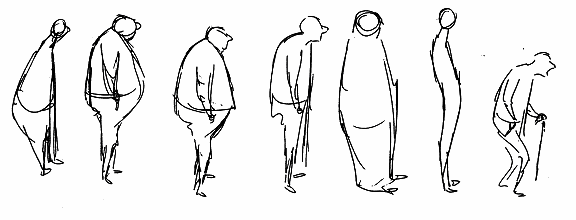

**Walt Stanchfield**

> **Edited by**\
> **Leo Brodie**

ii Walt Stanchfield

This compilation is not copyrighted or protected in any way by the
editor of the compilation (Leo Brodie). It is based on a series of
un-copyrighted class notes written by animation instructor Walt
Stanchfield during the period roughly from 1970 to 1990. Since then,
these class handouts have been widely copied and shared amongst
animation students and members of the animation industry with Mr.
Stanchfield\'s blessing and encouragement; in that spirit, the handouts
are now available freely on the Internet. Some of the illustrations in
this book represent preliminary drawings of cartoon characters that are
the properties of their respective copyright holder(s) and are therefore
protected by copyright. These illustrations were part of the original
handouts and are included here for educational purposes to illustrate
specific principles of animation technique. No endorsement of this book
by the copyright holder(s) is implied, nor do the views expressed in
this book necessary reflect those of the copyright holders(s). I hope
that covers it.

> Gesture Drawing for Animation iii
>
> **Table of Contents**\
> **Chapter 1: Go for the Truth**
> \...\...\...\...\...\...\...\...\...\...\...\...\...\...\...\...\...\...\...\...\...\...\...\...\...\...\...\...\.....2
> Observe, Observe,
> Observe\...\...\...\...\...\...\...\...\...\...\...\...\...\...\...\...\...\...\...\...\...\...\...\...\...\...\...\...\...\...2
> Lead to the
> Emotion\...\...\...\...\...\...\...\...\...\...\...\...\...\...\...\...\...\...\...\...\...\...\...\...\...\...\...\...\...\...\...\...\.....4
> Give Them the
> Experience\...\...\...\...\...\...\...\...\...\...\...\...\...\...\...\...\...\...\...\...\...\...\...\...\...\...\...\...\...\....5
> The Driving Force behind the
> Action\...\...\...\...\...\...\...\...\...\...\...\...\...\...\...\...\...\...\...\...\...\...\...\.....5
> Gesture\...\...\...\...\...\...\...\...\...\...\...\...\...\...\...\...\...\...\...\...\...\...\...\...\...\...\...\...\...\...\...\...\...\...\...\...\...\...\...\....9
> The Essence
> \...\...\...\...\...\...\...\...\...\...\...\...\...\...\...\...\...\...\...\...\...\...\...\...\...\...\...\...\...\...\...\...\...\...\...\...\...10
> Go For The
> Truth!\...\...\...\...\...\...\...\...\...\...\...\...\...\...\...\...\...\...\...\...\...\...\...\...\...\...\...\...\...\...\...\...\...\...13
> **Chapter 2: The Animator\'s
> Sketchbook**\...\...\...\...\...\...\...\...\...\...\...\...\...\...\...\...\...\...\...\...\...\.....13
> Everywhere You Go
> \...\...\...\...\...\...\...\...\...\...\...\...\...\...\...\...\...\...\...\...\...\...\...\...\...\...\...\...\...\...\...\.....17
> Composition\...\...\...\...\...\...\...\...\...\...\...\...\...\...\...\...\...\...\...\...\...\...\...\...\...\...\...\...\...\...\...\...\...\...\...\...\...17
> Ron Husband\'s Sketchbook
> \...\...\...\...\...\...\...\...\...\...\...\...\...\...\...\...\...\...\...\...\...\...\...\...\...\...\...\...\...21
> Note Taking and
> Sketching\...\...\...\...\...\...\...\...\...\...\...\...\...\...\...\...\...\...\...\...\...\...\...\...\...\...\...\...\....27
> Good Habits
> \...\...\...\...\...\...\...\...\...\...\...\...\...\...\...\...\...\...\...\...\...\...\...\...\...\...\...\...\...\...\...\...\...\...\...\...\...32
> **Chapter 3: A Visual Vocabulary for Drawing**
> \...\...\...\...\...\...\...\...\...\...\...\...\...\...\...\...\...\...\....31
> Lines, Lines,
> Lines\...\...\...\...\...\...\...\...\...\...\...\...\...\...\...\...\...\...\...\...\...\...\...\...\...\...\...\...\...\...\...\...\.....31
> A Simple Approach to Drawing
> \...\...\...\...\...\...\...\...\...\...\...\...\...\...\...\...\...\...\...\...\...\...\...\...\...\.....31
> A Simple Approach to Drawing
> \...\...\...\...\...\...\...\...\...\...\...\...\...\...\...\...\...\...\...\...\...\...\...\...\...\.....32
> Finding the
> Abstract\...\...\...\...\...\...\...\...\...\...\...\...\...\...\...\...\...\...\...\...\...\...\...\...\...\...\...\...\...\...\...\...\...32
> The Solid-Flexible
> Model\...\...\...\...\...\...\...\...\...\...\...\...\...\...\...\...\...\...\...\...\...\...\...\...\...\...\...\...\...\...32
> Figure Sketching for Animation
> \...\...\...\...\...\...\...\...\...\...\...\...\...\...\...\...\...\...\...\...\...\...\...\...\...\.....32
> The Pipe
> Model\...\...\...\...\...\...\...\...\...\...\...\...\...\...\...\...\...\...\...\...\...\...\...\...\...\...\...\...\...\...\...\...\...\...\....33
> Seeing in Three
> Dimensions\...\...\...\...\...\...\...\...\...\...\...\...\...\...\...\...\...\...\...\...\...\...\...\...\...\...\...\.....34
> The Rules of Perspective
> \...\...\...\...\...\...\...\...\...\...\...\...\...\...\...\...\...\...\...\...\...\...\...\...\...\...\...\...\...\....34
> Direction
> \...\...\...\...\...\...\...\...\...\...\...\...\...\...\...\...\...\...\...\...\...\...\...\...\...\...\...\...\...\...\...\...\...\...\...\...\...\.....36
> Problems of Drawing in
> Line\...\...\...\...\...\...\...\...\...\...\...\...\...\...\...\...\...\...\...\...\...\...\...\...\...\...\...\....36
> Simplifying Heads
> \...\...\...\...\...\...\...\...\...\...\...\...\...\...\...\...\...\...\...\...\...\...\...\...\...\...\...\...\...\...\...\...\.....37
> Caricatured Head
> Shapes\...\...\...\...\...\...\...\...\...\...\...\...\...\...\...\...\...\...\...\...\...\...\...\...\...\...\...\...\...\....37
> The Head in Gesture
> \...\...\...\...\...\...\...\...\...\...\...\...\...\...\...\...\...\...\...\...\...\...\...\...\...\...\...\...\...\...\...\.....38
> A Simple Approach to Costumes and
> Drapery\...\...\...\...\...\...\...\...\...\...\...\...\...\...\...\...\...\...\....38
> **Chapter 4: The First
> Impression**\...\...\...\...\...\...\...\...\...\...\...\...\...\...\...\...\...\...\...\...\...\...\...\...\...\.....71
> Short-pose Sketching
> \...\...\...\...\...\...\...\...\...\...\...\...\...\...\...\...\...\...\...\...\...\...\...\...\...\...\...\...\...\...\...\....71
> Superficial Appearance vs. Creative
> Portrayal\...\...\...\...\...\...\...\...\...\...\...\...\...\...\...\...\...\...\....71
> A New Phrase: "Body
> Syntax"\...\...\...\...\...\...\...\...\...\...\...\...\...\...\...\...\...\...\...\...\...\...\...\...\...\...\....72
> The \"Explosive\"
> Gesture\...\...\...\...\...\...\...\...\...\...\...\...\...\...\...\...\...\...\...\...\...\...\...\...\...\...\...\...\...\.....72
> Feel, As Well As See, the
> Gesture\...\...\...\...\...\...\...\...\...\...\...\...\...\...\...\...\...\...\...\...\...\...\...\...\.....76
> Draw Verbs, Not
> Nouns\...\...\...\...\...\...\...\...\...\...\...\...\...\...\...\...\...\...\...\...\...\...\...\...\...\...\...\...\...\...\...77
> Draw with a
> Purpose\...\...\...\...\...\...\...\...\...\...\...\...\...\...\...\...\...\...\...\...\...\...\...\...\...\...\...\...\...\...\...\.....77
> Dividing the Body into
> Units\...\...\...\...\...\...\...\...\...\...\...\...\...\...\...\...\...\...\...\...\...\...\...\...\...\...\...\....78
> \"Knowing\" or
> Searching\...\...\...\...\...\...\...\...\...\...\...\...\...\...\...\...\...\...\...\...\...\...\...\...\...\...\...\...\...\.....79
> Simplicity for the Sake of
> Clarity\...\...\...\...\...\...\...\...\...\...\...\...\...\...\...\...\...\...\...\...\...\...\...\...\...\...79
> **Chapter 5: Elements of the
> Pose**\...\...\...\...\...\...\...\...\...\...\...\...\...\...\...\...\...\...\...\...\...\...\...\...\...\...\...85
> Angles and
> Tension\...\...\...\...\...\...\...\...\...\...\...\...\...\...\...\...\...\...\...\...\...\...\...\...\...\...\...\...\...\...\...\...\....88
> Applying Angles and Tension in Our
> Drawings\...\...\...\...\...\...\...\...\...\...\...\...\...\...\...\...\...\.....92

iv Walt Stanchfield

> Tennis and
> Angles\...\...\...\...\...\...\...\...\...\...\...\...\...\...\...\...\...\...\...\...\...\...\...\...\...\...\...\...\...\...\...\...\...\...98
> Straight against Curve: Squash and Stretch in the Pose
> \...\...\...\...\...\...\...\...\...\...\...\...\...\...101 Applying
> Perspective\...\...\...\...\...\...\...\...\...\...\...\...\...\...\...\...\...\...\...\...\...\...\...\...\...\...\...\...\...\...\.....103
> The Sensation of
> Space\...\...\...\...\...\...\...\...\...\...\...\...\...\...\...\...\...\...\...\...\...\...\...\...\...\...\...\...\...\.....105
> Recreating the First Impression
> \...\...\...\...\...\...\...\...\...\...\...\...\...\...\...\...\...\...\...\...\...\...\...\...\...\....109
> Putting the Elements of a Pose
> Together\...\...\...\...\...\...\...\...\...\...\...\...\...\...\...\...\...\...\...\...\.....112
> Habits to
> Avoid\...\...\...\...\...\...\...\...\...\...\...\...\...\...\...\...\...\...\...\...\...\...\...\...\...\...\...\...\...\...\...\...\...\.....118
> It Ain't
> Easy\...\...\...\...\...\...\...\...\...\...\...\...\...\...\...\...\...\...\...\...\...\...\...\...\...\...\...\...\...\...\...\...\...\...\...\....121
> **Chapter 6: Pushing the Gesture**
> \...\...\...\...\...\...\...\...\...\...\...\...\...\...\...\...\...\...\...\...\...\...\...\...\...\....119
> Drawing Gesture from the
> Model\...\...\...\...\...\...\...\...\...\...\...\...\...\...\...\...\...\...\...\...\...\...\...\...\....120
> Stick to the Theme
> \...\...\...\...\...\...\...\...\...\...\...\...\...\...\...\...\...\...\...\...\...\...\...\...\...\...\...\...\...\...\...\...\...120
> Subtlety
> \...\...\...\...\...\...\...\...\...\...\...\...\...\...\...\...\...\...\...\...\...\...\...\...\...\...\...\...\...\...\...\...\...\...\...\...\...\.....123
> Pushing the Gesture
> \...\...\...\...\...\...\...\...\...\...\...\...\...\...\...\...\...\...\...\...\...\...\...\...\...\...\...\...\...\...\...\....124
> Gesture to Portray an Action or a
> Mood\...\...\...\...\...\...\...\...\...\...\...\...\...\...\...\...\...\...\...\...\...\...124
> Action Analysis: Hands & Feet
> \...\...\...\...\...\...\...\...\...\...\...\...\...\...\...\...\...\...\...\...\...\...\...\...\...\....125
> Learn to
> Cheat\...\...\...\...\...\...\...\...\...\...\...\...\...\...\...\...\...\...\...\...\...\...\...\...\...\...\...\...\...\...\...\...\...\...\....125
> Lazy
> Lines\...\...\...\...\...\...\...\...\...\...\...\...\...\...\...\...\...\...\...\...\...\...\...\...\...\...\...\...\...\...\...\...\...\...\...\...\....125
> Double
> Vision\...\...\...\...\...\...\...\...\...\...\...\...\...\...\...\...\...\...\...\...\...\...\...\...\...\...\...\...\...\...\...\...\...\...\....125
> Caricature\...\...\...\...\...\...\...\...\...\...\...\...\...\...\...\...\...\...\...\...\...\...\...\...\...\...\...\...\...\...\...\...\...\...\...\...\.....125
> **Chapter 7: Principles of Animation**
> \...\...\...\...\...\...\...\...\...\...\...\...\...\...\...\...\...\...\...\...\...\...\...\....153
> Drawing
> Principles\...\...\...\...\...\...\...\...\...\...\...\...\...\...\...\...\...\...\...\...\...\...\...\...\...\...\...\...\...\...\...\...\...153
> 28 Principles of
> Animation\...\...\...\...\...\...\...\...\...\...\...\...\...\...\...\...\...\...\...\...\...\...\...\...\...\...\...\.....154
> Drawing Calories
> \...\...\...\...\...\...\...\...\...\...\...\...\...\...\...\...\...\...\...\...\...\...\...\...\...\...\...\...\...\...\...\...\.....154
> The Pose Is an
> Extreme\...\...\...\...\...\...\...\...\...\...\...\...\...\...\...\...\...\...\...\...\...\...\...\...\...\...\...\...\...\.....154
> Animating Squash and
> Stretch\...\...\...\...\...\...\...\...\...\...\...\...\...\...\...\...\...\...\...\...\...\...\...\...\...\...\...154
> The Opposing
> Force\...\...\...\...\...\...\...\...\...\...\...\...\...\...\...\...\...\...\...\...\...\...\...\...\...\...\...\...\...\...\...\....154
> Connecting
> Actions\...\...\...\...\...\...\...\...\...\...\...\...\...\...\...\...\...\...\...\...\...\...\...\...\...\...\...\...\...\...\...\.....157
> Inbetweening\...\...\...\...\...\...\...\...\...\...\...\...\...\...\...\...\...\...\...\...\...\...\...\...\...\...\...\...\...\...\...\...\...\...\...\...158
> **Chapter 8: A Sense of
> Story**\...\...\...\...\...\...\...\...\...\...\...\...\...\...\...\...\...\...\...\...\...\...\...\...\...\...\...\.....171
> A Sense of Story
> \...\...\...\...\...\...\...\...\...\...\...\...\...\...\...\...\...\...\...\...\...\...\...\...\...\...\...\...\...\...\...\...\...\...171
> Talk To Your Audience - Through
> Drawing\...\...\...\...\...\...\...\...\...\...\...\...\...\...\...\...\...\...\.....179
> A Thinking Person\'s Art
> \...\...\...\...\...\...\...\...\...\...\...\...\...\...\...\...\...\...\...\...\...\...\...\...\...\...\...\...\...\...182
> Acting and
> Drawing\...\...\...\...\...\...\...\...\...\...\...\...\...\...\...\...\...\...\...\...\...\...\...\...\...\...\...\...\...\...\...\....187
> The Emotional Gesture
> \...\...\...\...\...\...\...\...\...\...\...\...\...\...\...\...\...\...\...\...\...\...\...\...\...\...\...\...\...\.....187
> Common Vs Uncommon Gestures
> \...\...\...\...\...\...\...\...\...\...\...\...\...\...\...\...\...\...\...\...\...\...\...\.....188
> Body
> Language\...\...\...\...\...\...\...\...\...\...\...\...\...\...\...\...\...\...\...\...\...\...\...\...\...\...\...\...\...\...\...\...\...\.....189
> **Chapter 9: Final
> Words**\...\...\...\...\...\...\...\...\...\...\...\...\...\...\...\...\...\...\...\...\...\...\...\...\...\...\...\...\...\...\...191
> Creative Energy
> \...\...\...\...\...\...\...\...\...\...\...\...\...\...\...\...\...\...\...\...\...\...\...\...\...\...\...\...\...\...\...\...\...\....191
> Osmosis\...\...\...\...\...\...\...\...\...\...\...\...\...\...\...\...\...\...\...\...\...\...\...\...\...\...\...\...\...\...\...\...\...\...\...\...\...\.....192
> A Bit of Introspection
> \...\...\...\...\...\...\...\...\...\...\...\...\...\...\...\...\...\...\...\...\...\...\...\...\...\...\...\...\...\...\....194
> Mental and Physical Preparation
> \...\...\...\...\...\...\...\...\...\...\...\...\...\...\...\...\...\...\...\...\...\...\...\...\.....195
> The Metaphysical
> Side\...\...\...\...\...\...\...\...\...\...\...\...\...\...\...\...\...\...\...\...\...\...\...\...\...\...\...\...\...\...\...196
> Habits\...\...\...\...\...\...\...\...\...\...\...\...\...\...\...\...\...\...\...\...\...\...\...\...\...\...\...\...\...\...\...\...\...\...\...\...\...\...\.....197
> Final Words on
> Essence\...\...\...\...\...\...\...\...\...\...\...\...\...\...\...\...\...\...\...\...\...\...\...\...\...\...\...\...\...\....199
>
> Gesture Drawing for Animation v
>
> **Foreword by the Editor**\
> Walt Stanchfield was an animator who taught life drawing classes for
> animators with a special emphasis on gesture drawing. For each weekly
> class session, he wrote informal handouts to emphasize the theme of
> the current class session, to comment on work done in the previous
> class, or discuss whatever topic struck his fancy. Over a period of
> years, these notes were lovingly shared, studied, and treasured by
> animators and animation students everywhere.
>
> Mr. Stanchfield personally gave copies of his collection to interested
> students, and was happy to seem them distributed. According to many
> people who were lucky enough to study under him, he wanted to publish
> them as a book, but the studio where he worked was not interested.
>
> The goal of this project is to imagine the book that Walt Stanchfield
> might have written.
>
> This project is a compilation of the first 60 handouts that are shared
> on the\
> www.animationmeat.com website (as that site has numbered them). Walt
> Stanchfield did not present his topics in any particular order, which
> suited the ongoing nature of the classes. Walt\'s handouts are like
> individual frames of animation---some are extremes, some are
> inbetweens, some are even cleanups. As I was reading the notes and
> trying to absorb as much as I could, I thought I might understand them
> better if it were all laid out in sequence, with basic topics followed
> by more complex ideas. I wanted to see his ideas grouped by subject so
> I could compare the ideas. In other words, I wanted the topics to be
> arranged like a normal book. So I\'ve re-arranged bits and pieces from
> the handouts into cohesive chapters, while taking the liberty to
> eliminate redundancy and make minor edits just as a book editor would.
>
> In deciding how to organize the material, I imagined how Walt himself
> would have put it together if he\'d written it. Where would he have
> started? Knowing that the readers of the book would not be the lucky
> members of his classes, what concepts would have\
> illustrated before moving on to more advanced topics? I tried to
> follow the principles Walt himself outlines in these notes: clarity,
> attention to the \"essence,\" emotion, and using the minimum number of
> words (lines) to get the point across.
>
> Another reason I wanted to see this material as a book is that there
> is no other book that covers the same information. There are many
> excellent volumes on animation, but they generally assume that the
> reader can already draw animatable characters with strong poses
> without explaining how to get to that stage. All the books on generic
> figure and life drawing, even those that emphasize gesture, encourage
> capturing the model\'s appearance and gesture without explaining how
> to internalize the gesture so as to push it to extremes or apply it to
> a different figure. Personally, I think this compilation---if it were
> a book---would take its place among the top volumes on animation.
>
> There is an informal, lively charm to the original handouts that gives
> the reader a sense of \'being there.\' You may want to check them out
> to get a feel for how this information was

vi Walt Stanchfield

originally presented. I\'ve left \"Savvy Sayings\" (\#47 in the
animationmeat.com collection) out of this book, so it remains a delight
that you can seek out on your own.

Many, many thanks to Jon Hooper and Steve Kellener of AnimationMeat.com
for scanning and transcribing many of Walt\'s notes and making them
available on their Web site. This book incorporates their scans and OCR
conversions, so it would not exist without their efforts. Thanks also to
Aimee Major Steinberger, who was, I believe, the first person to post
one of the Walt\'s notes on the Internet.

> \-- Leo Brodie\
> Seattle, Washington
>
> Gesture Drawing for Animation vii
>
> **About Walt Stanchfield**
>
> Walt Stanchfield was born in 1919 in Los Angeles,\
> California. He is listed as animator on Winnie the Pooh and the
> Blustery Day, The Many Adventures of Winnie the Pooh, The Rescuers,
> The Fox and the Hound (coordinating animator), Micky\'s Christmas
> Carol (creative\
> collaboration), The Black Cauldron (key animation\
> coordinator), The Great Mouse Detective (coordinating animator), Roger
> Rabbit (animation consultant) and Oliver & Company (production
> assistant). He continued with Disney in later years, advising and
> teaching classes. Mr. Stanchfield died September 3, 2000.

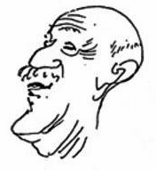

viii Walt Stanchfield

**From the October 2000 Peg-Board**\
Once in a lifetime, a truly special teacher comes along who can change
your life forever. To me and to many, many of our colleagues in the
industry, Walt Stanchfield was that very special teacher.

> Part artist, part poet, part musician, part tennis pro, part eccentric
> savant, part wizened professor, Walt inspired a generation of young
> artists not only with his vast understanding of the animator\'s craft,
> but with his enthusiasm and love of life.
>
> Walt started in the animation industry at Mintz in 1937. He also
> worked for two years at Lantz. In 1948 he went to work for Disney and
> with the exception of four short retirements, had worked there ever
> since. Walt worked on every full-length cartoon feature from The
> Adventures of Ichabod Crane and Mr. Toad (1949) to The Great Mouse
> Detective (1986).
>
> Throughout those years Walt developed an insatiable enthusiasm for
> teaching the craft. He supported his numerous drawing classes with
> weekly hand-outs that taught not only animation and drawing
> principles, but philosophy, attitude and life lessons.
>
> Walt\'s personal work was full of vitality. He was a tireless
> sketcher, a painter of landscapes, seascapes, still lifes and people.
> He was an avid writer, penning hundreds of pages of notes about the
> art of animation as well as poetry and stories. He also loved music
> and spent an inordinate amount of time at the piano - that is, between
> caring for his vegetable garden and playing his most beloved game:
> tennis.
>
> Walt has touched many lives, not only with his endless enthusiasm for
> animation but with his love of life, art and people. His work will
> live on forever in the hands and hearts of his students and we will
> all miss him.

\-- Don Hahn

> Gesture Drawing for Animation ix
>
> ***Introduction (In the Words of Walt Stanchfield)***\
> Have you ever said, "Oh, if I could just draw well"? Ah, yes, you
> could express yourself to the *n*th degree. You could animate or
> cleanup scenes that would evoke *oohs* and *aahs*. Work wouldn't be so
> much like work.
>
> You could get it all down on paper and leave at 5:00 o'clock feeling
> good.
>
> Sometimes I wish I had a magic wand that I could wave over you and
> say, "You are now learned artists---go and draw to your hearts
> content." But maybe it's better that you do it yourself---become your
> own self-starter. The learning process should be fun. One thing that
> it does is it tears down a lot of false pride. To seek help is a
> humbling experience, a very necessary one, in as much as animation
> should be thought of and practiced as a group effort. I consider a
> person who is not ashamed to seek help a wise person.
>
> I got a late start in life. The first five or six years in the
> business were a "walk through." (I started at Mintz's Cartoon Studio
> on Sept. 13, 1937.) I was a dilettante, toying with poetry, painting,
> singing and socializing. Then 10 years as Lounsbery's assistant, and
> 10 years as Johnston's assistant helped me to "center" myself. Those
> guys worked hard and were completely devoted to their jobs. That
> taught me to work hard (and study hard to catch up). The next 20 years
> were not easy but were very satisfying.
>
> Having been brought out of retirement for the fourth time, I have been
> trying to impart some of the drawing know how I have gathered in these
> past years. I have incorporated the weekly "handout" which I think
> works better than lectures. They allow me to more thoroughly express
> the salient points that come to mind. What's more, they are
> "collectables" that, in the future may be reviewed when the need
> arises.
>
> These handouts allow me to delve deep into my experiences and
> observations and come up with something that may be of help to you. I
> have concentrated on gesture drawing because that is one of the
> foundations of good animation. Necessary to good gesture drawing are
> acting, caricature, anatomy, body language, perspective, etc., so from
> time to time these topics are isolated and discussed.

At times I even play the "guru" and deliver a sermon of a positive
thinking nature.

> I have struggled to avoid referring to myself as a \"teacher\" and
> have used words like \"suggestion\" rather than \"correction\" when
> offering another version of a pose. I\'m really here just to share my
> experience and it\'s your prerogative to treat it however you see fit.
> As for the suggestions, they are only to encourage you to see in new
> ways, to help you break any stultifying habits of \"penny-pinching\"
> seeing. I feel that the classes I conduct and the handouts, if nothing
> else, create a surge of group energy that you might tap for your own
> personal betterment.
>
> I once told the class, \"These things I present are not esoteric
> concepts.\" But I was wrong---they are. They are things that only the
> chosen few absorb. It is the \"chosen\" few

x Walt Stanchfield

that lead the way and accomplish the \"academy-award-worthy\" animation
and drawing. But it is my conviction that by earnest pursuit, anyone can
be of that group. It\'s just a matter of exposing oneself to some
vehicle that will help one break the \"sound barrier\" (actually,
thought barrier, for drawing is a thinking person\'s art).

Here\'s a caricature by Dan Haskett that captured the spirit of my
\"Teaching\" many years ago at the \"Disney School of Animation\". It\'s
quite a prophetic drawing too, for out in the audience are two of your
current directors - Clements and Musker. Spot any others?

Maybe Jerry Reeves? Ed Gombert? Bluth, Pomeroy and Goldman? Even the
artist himself is there - Dan Haskett.

Different faces out there now but the sentiments are the same.

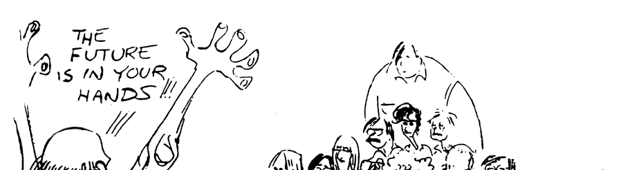{: style="padding:0px" }
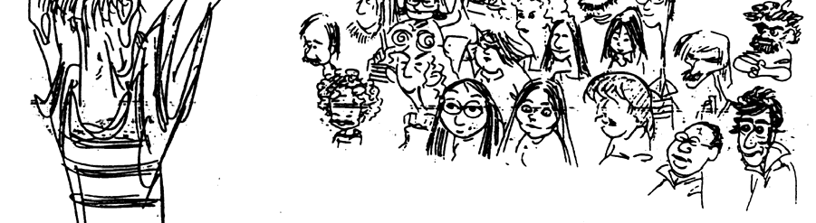{: style="padding:0px" }
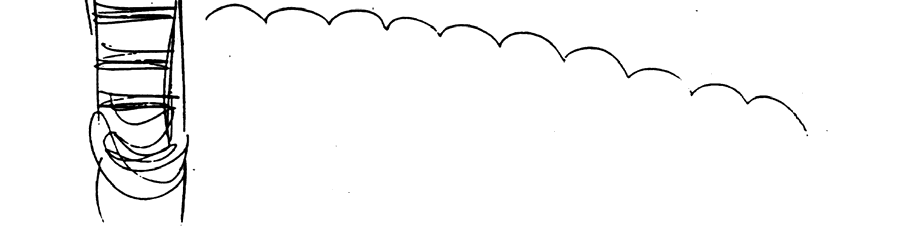{: style="padding:0px" }

In the *Illusion Of Life*, Ollie or Frank had written a paragraph on
cleanup people which lists some of the functions of a cleanup person
which coincide with some of the things I keep stressing in the drawing
class: a crisp line against a soft shape (using angles), designing
shapes that work with the action rather than copying, emphasizing squash
and stretch, and drawing detail only as it furthers the action and the
drawing. Especially, "telling the story" whether it's a scene of
animation or a still drawing.

> Gesture Drawing for Animation xi
>
> The quote, reprinted here in full, refers to cleanup people but it
> could as well refer to animators and inbetweeners. All of the above
> classifications make drawings that go into a scene, and so the same
> training is necessary for all.
>
> "They studied line drawing, training on Holbein, Degas, Daumier, Da
> Vinci; they watched drapery in movement, noting the difference between
> filmy scarves, woolen skirts, flowing capes, and even baggy pants;
> they learned the value of a sharp, crisp line against a large, soft
> shape; they knew how to keep a design in the free-flowing changing
> shapes of animation rather than make a rigid copy. They always
> extended the arcs of the movement, squashed the characters more,
> stretched him more -- refining while emphasizing both the action and
> the drawings. They understood the business of the scene, what it was
> supposed to achieve, worked closely with the animator in deciding
> which parts were developing well and which parts needed a little help,
> and they could see the characters start to live as they "rolled" the
> drawings on the pegs. This required a special kind of talent as well
> as study -- not every artist could master it."
>
> So you see, there is something special about the thinking that goes
> into animation drawing.
>
> Don't ease up on your search. Success is just around the proverbial
> corner.
>
> May the forces and stretches and angles and all other drawing helps be
> with you.

xii Walt Stanchfield

> ***Chapter 1: Go for the Truth***
>
> **Observe, Observe, Observe**\
> Animation! This is the vehicle you have chosen to express yourself in.
> A whole list of \"tools\" are required: drawing, timing, phrasing,
> action, acting, pantomime, staging, imagination, observation,
> interpretation, logic, caricature, creativity, clarity, empathy, and
> so on---a mind boggling array of prerequisites.
>
> Rest at ease. You were born with all of them. Some of them may need a
> little sharpening, others may need to be awakened as from a deep
> sleep, but they are as much a part of you as arms, legs, eyes,
> kidneys, hemoglobin, and speech.
>
> Reading and observing are two emancipators of the dormant areas of the
> mind. Read the classics, biographies, humor, mysteries and comic
> books. Observe, observe, observe. Be like a sponge---suck up
> everything you can lay your eyes on. Look for the unusual, the common,
> characters, situations, compositions, attitudes study shapes,
> features,\
> personalities, activities, details, etc.
>
> Draw ideas, not things; action, not poses; gestures not anatomical
> structures.
>
> I am reprinting some ruff animation drawings to remind you of the
> style of drawing that seems to serve the purposes of the animators
> best---loose and\
> expressive.
>
> 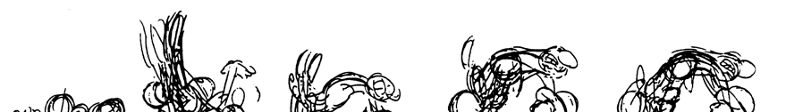
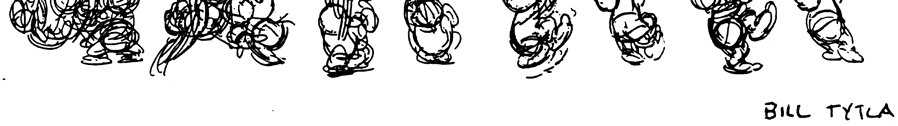
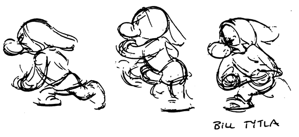

1

Gesture Drawing For Animation

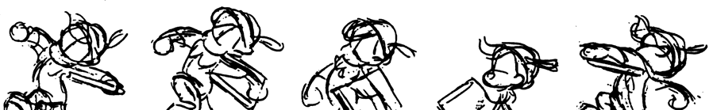
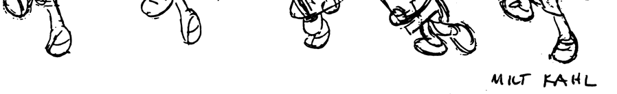
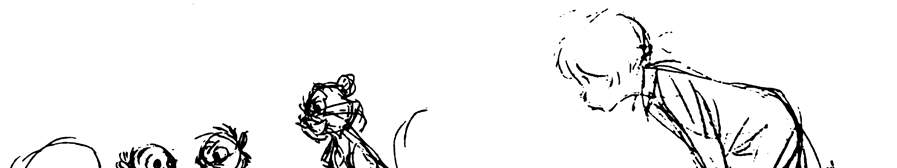
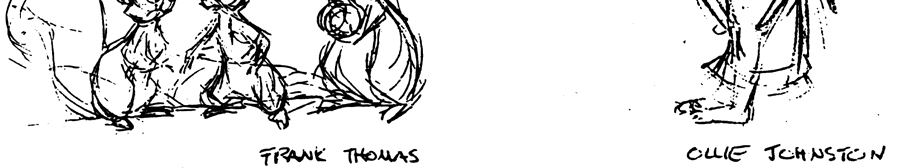

> 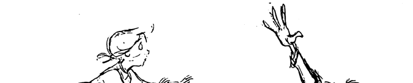
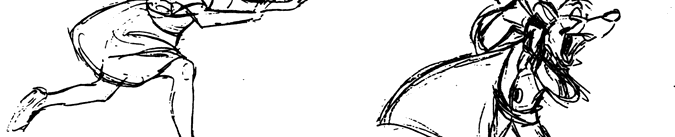
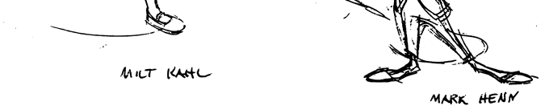

2

Chapter 1: Go For the Truth!

> 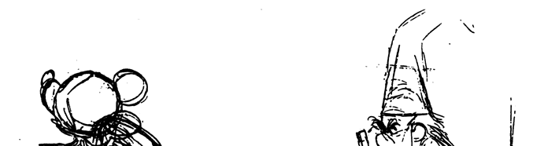
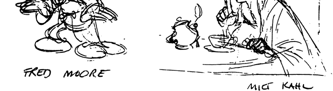

>
> **Lead to the Emotion**\
> A well constructed drawing should have all the parts and they should
> be put together beautifully, but that is not what you should see when
> you look at the drawing. What you should see is the emotion. In a
> drawing of a starving man you should see fear and hunger and despair,
> and you should feel this, plus pity and revulsion and anger. All
> gestures won't be quite that dramatic, but all gestures are certainly
> more than their parts.
>
> Do this experiment: get a wooden match and look at it. That represents
> your model or, character in animation. Then light it and let it burn
> half way. Now it represents your model or character in gesture.
>
> 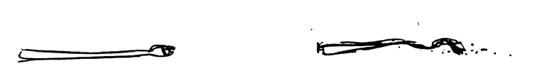
It has been transformed from the
> anatomical match into a burnt match. If you had to draw a burnt match
> you wouldn\'t say to yourself, \"Okay, this is the anatomy of a
> match.\" No, you would say, \"This is a match whose anatomy has been
> burnt and twisted into an agonizing shape. A shape that if I imagine
> myself being in that state---if I feel what has happened to that match
> has happened also to me---then this is the feeling that I have to
> draw, to portray.\"
>
> We must be emotional about our subject whether it has to do with
> serious matters or with humor. We cannot back off from our emotions --
> if we do the result will he a mere anatomical reproduction. A drawing
> or a scene is not final when a material representation has been made;
> it is final when a sensitive depiction of an emotion has been made.
>
> The significance is not in the story alone, but in the illustration
> that makes that story come alive. Yes, there is anatomy, form,
> construction, model and two or three lines of etceteras, but only in
> so far as those things are expressive of the story.

3

Gesture Drawing For Animation

**Give Them the Experience**\
Drawing for animation is not just copying a model onto paper; you could
do that better with a camera. Drawing for animation is translating an
action into drawing form so an audience can retranslate those drawings
back into an experience of that action. You don't just want to show the
audience an action for them to look at it. You want to visualize an
action for them to see -- that is, to experience. That way you have them
in your grasp, your power, and then the story can go on and the audience
goes on with it, because they are involved. You have allowed them to
experience it.

The parts of the figure must be put together in a manner that will
portray or caricature the meaning of the pose. Otherwise it will be just
a drawing. What a horrible fate -- to be just a drawing.

Here are some animation drawings that have transcended the anatomy and
model of the characters. They are good drawings, but not just drawings.

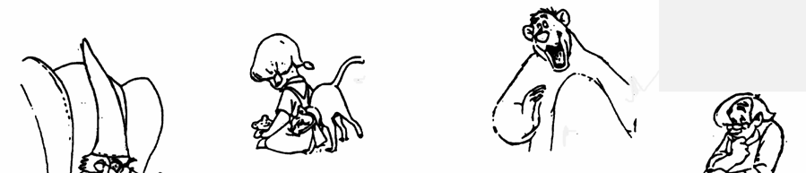
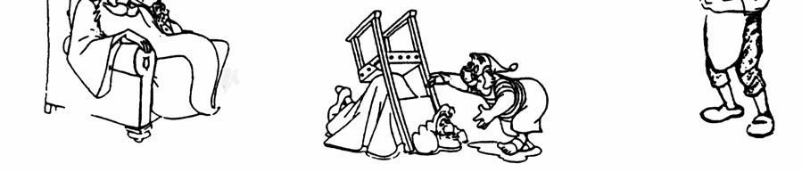

**The Driving Force behind the Action**\
In drawing sessions, I try to direct the students\' thoughts to the
gesture rather than to the physical presence of the models and their
sartorial trappings. It seems the less the model wears, the more the
thinking is directed to anatomy, while the more the model wears, the
more the thinking goes into drawing the costume. It's a deadlock that
you can only break by shifting mental gears from the "secondary"
(details) to the "primary" (motive or driving force behind the pose).
Remember, the drawing you are doing in class should be thought of as a
refining process for your animation drawing skills.

I found something in Eric Larson's first lecture on Entertainment, which
may be of help to you. Please bear with the length of the quote; it is
put so well I couldn't edit it without losing some of the meaning. As
you read it, keep your mind on gesture drawing.

> "\.... As we begin the 'ruffing out' of our scene, we become concerned
> with the believability of the character and the action we've planned
> and we give some

4

Chapter 1: Go For the Truth!

> thought to the observation of Constantin Stanislavsky. 'In every
> physical action,' he wrote, 'there is always something psychological
> and vice versa. There is no inner experience without external physical
> expression.' In other words, what is our character thinking to make it
> act, behave and move as it does? As animators, we have to feel within
> ourselves every move and mood we want our drawings to exhibit. They
> are the image of our thoughts.
>
> "In striving for entertainment, our imagination must have neither
> limits nor bounds. It has always been a basic need in creative
> efforts. 'Imagination,' wrote Stanislavsky, 'must be cultivated and
> developed; it must be alert, rich and active. An actor (animator) must
> learn to think on any theme. He must observe people (and animals) and
> their behavior---try to understand their mentality.'
>
> "To one degree or another, people in our audience are aware of human
> and animal behavior. They may have seen, experienced or read about it.
> ... Their knowledge, though limited, acts as a common denominator, and
> as we add to and enlarge upon said traits and behavior and bring them
> to the screen, \'caricatured and alive,\' there blossoms a responsive
> relationship of the audience to the screen character---and that spells
> "entertainment.\'
>
> "How well we search out every little peculiarity and mannerism of our
> character and how well and with what \'life\' we move and draw it,
> will determine the sincerity of it and its entertainment value, we
> want the audience to view our character on the screen and say: 'I know
> that guy!' (or in the case of gesture drawing: 'I know what that
> person is doing, what he or she is thinking.')
>
> Leonardo da Vinci wrote: 'Build a figure in such a way that its pose
> tells what is in the soul of it. A gesture is a movement not of a body
> but of a soul.' Walt Disney reminded us of this when he spoke of the
> driving force behind the action: 'In other words, in most instances,
> the driving force behind the action is the mood, the personality, the
> attitude of the character---or all three.'
>
> "Let's think of ourselves as pantomimists because animation is really
> a pantomime art. A good pantomimist, having a thorough knowledge of
> human behavior, will, in a very simple action, give a positive and
> entertaining performance. There will be exaggeration in his
> anticipations, attitudes, expressions and movements to make it all
> very visual.
>
> "The pantomimist, working within human physical limitations, will do
> his best to caricature his action and emotions, keep the action in
> good silhouette, do one thing at a time and so present his act in a
> positive and simple manner for\
> maximum visual strength. But we, as animators, interpreting life in
> linear\
> drawings, have the opportunity to be much stronger in our caricature
> of mood and movement, always keeping in mind, as the pantomimist, the
> value and power of simplicity."

5

Gesture Drawing For Animation

On the following page are some excellent examples of what Walt must have
meant when he said, "\....the driving force behind the action is the
mood, the personality, the attitude of the character \...." They are
sketches Mark Henn did while at a recording session for The Great Mouse
Detective.

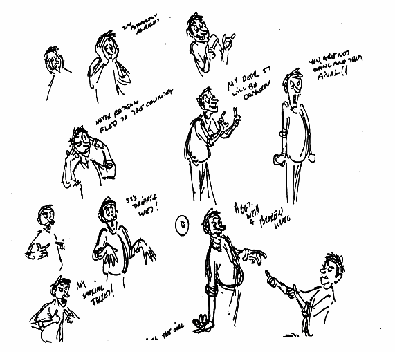

6

Chapter 1: Go For the Truth!

> 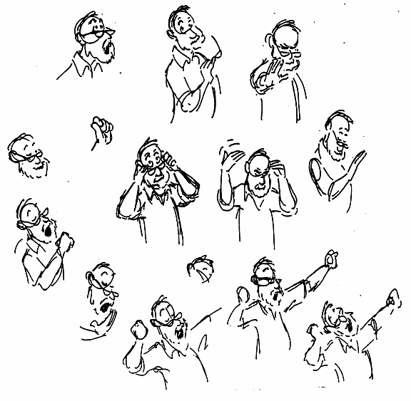

>
> **Gesture**\
> Gesture is the vehicle used in fitting a character into the role it is
> called upon to act out.
>
> We have drawn variously, dogs, mice, owls, elephants, cats, people,
> and so on; each distinct characters with distinct bodily shapes and
> bodily gestures. To approach a model with the idea of copying a human
> figure plus its clothing could be called a waste of time.
>
> Our interest is in seeing the differences in each personality and
> their individualistic gestures and, like a good caricaturist, capture
> the essence of those differences.
>
> When we review the cast of characters in our past films we realize the
> need to place these individual characteristics with the proper
> character and to be consistent in their depiction.
>
> Holmes' actions had to be different and distinct from Dawson's, or
> their personalities would become a blur. Mickey Mouse had his own
> personality---his own movements and gestures, consistent with his body
> structure and the personality given him. Goofy, a hundredfold
> different in all ways from Mickey, was Goofy because of the same
> principles used in different ways.

7

Gesture Drawing For Animation

There are really only a few principles of drawing but an infinite number
structures is to miss the excitement and the satisfaction of using that
information to tell the story of life through the nuances of gesture.

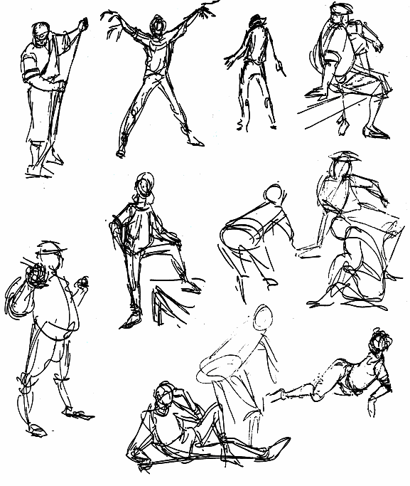

8

Chapter 1: Go For the Truth!

> **The Essence**\
> The word *essence* to me is almost philosophical in meaning: "That in
> being which underlies all outward manifestations \...\" Applied to
> drawing it is the motive, mood or emotion as displayed through the
> gestures of the physical body.
>
> Anatomy and mechanics are always present too, but in the end the
> essence of each pose must prevail if we want to win the award for best
> animated scene ('scuse me - scenes). Lots of things to think about:
> proportion, anatomy, line, structure, weight, negative space, angles,
> squash and stretch, perspective, and more, but you can be off in lots
> of those areas if you have the essence of the pose.
>
> A little study each day spent on one or another of them will net
> wondrous results. Hopefully, there will soon, suddenly, constantly
> appear in your drawings all of these elements in a satisfying blend.
> You will be pleased and much prospered when they all start to fit
> together and the exhausting battle with each separate one is over.
>
> We are all at different stages of development so must search out our
> own weak areas and concentrate on those. Let's hear it for the spirit
> of search and discovery. Anytime is a time to be adventurous if it
> spurs you on to some worthy goal.
>
> I have Xeroxed some drawings that Frederich Banbery did for the book,
> *The Posthumous Papers of the Pickwick Club* by Dickens, that I think
> are and excellent example of \"Essence Drawings.\" There is a minimum
> of line and rendering, but a maximum of gesture and feeling. And they
> radiate the type of humor the story calls for.

9

Gesture Drawing For Animation

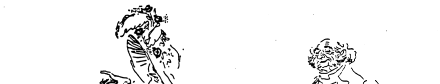
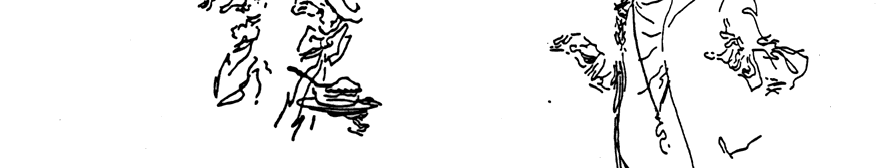
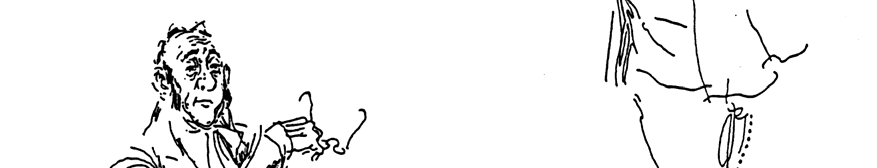
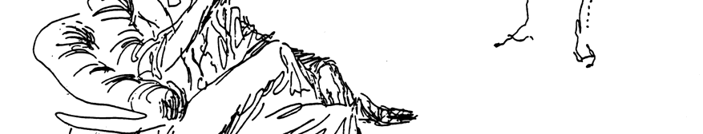
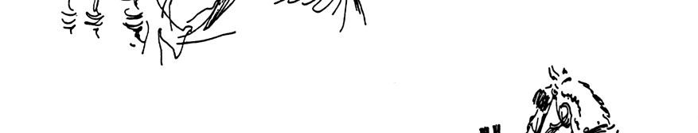
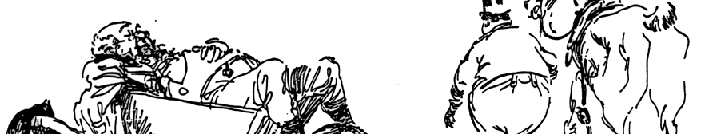
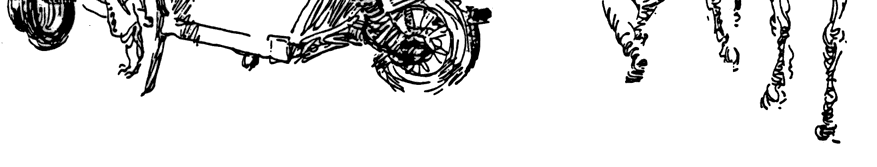

10

Chapter 1: Go For the Truth!

> 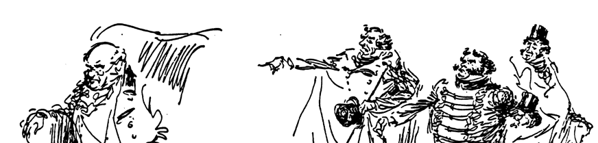
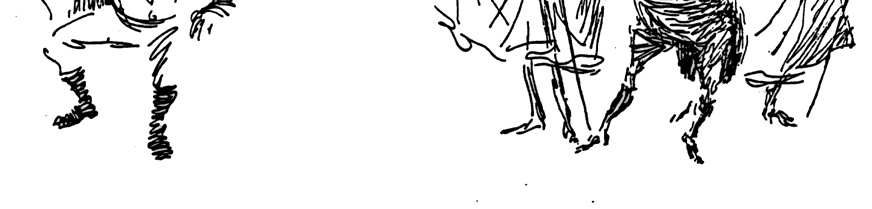
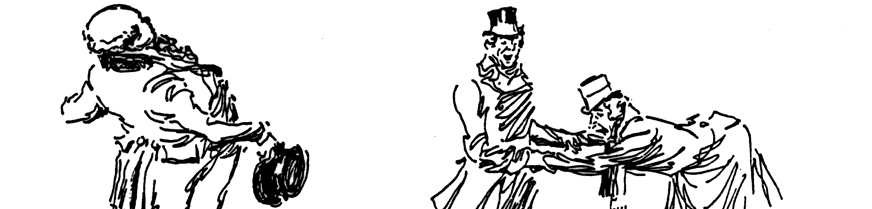
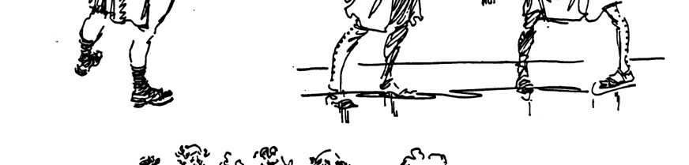
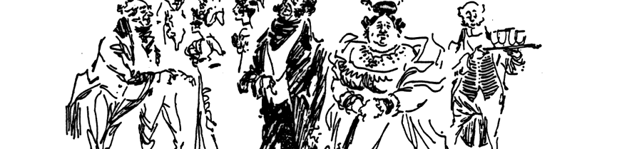
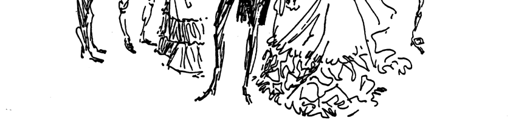

11

Gesture Drawing For Animation

**Go For The Truth!**

We actually create nothing of our ourselves---we merely use the creative
force that activates us. And when we draw we are not using the left
brain to record facts, we have shifted gears and are now using the right
brain to create a little one picture story. With, of course, the facts
that the left brain collected and named and itemized in former study
periods. This is not a study period; this is a show and tell period
(time we are not studying).

Do you feel that you are too limited in knowledge? Robert Henri, that
great teacher of art said that anyone could paint a masterpiece with
what limited knowledge they have. It would be a matter of using that
limited knowledge in the right (creative) way. Have you ever seen the
\"knowledge\" or drawing ability of that great painter Albert Ryder?
Probably not. But when you look at his nebulous paintings of ships at
sea or skeletons riding around with nothing on, you sense the drama and
have a feeling a story in being told. If its facts you want, pick up a
Sears mail order catalogue.

I\'m not advocating abandoning the study of the figure. Anatomy is a
vital tool in drawing---but don\'t mesmerize yourself into thinking that
knowing the figure is going to make an artist of you. What is going to
make an artist out of you is a combination of a few basic facts about
the body, a few basic principles of drawing and an extensive, obsessive
desire and urge to express your feelings and impressions.

Yehudi Menuin, the violinist started out at the \"top\" of his
profession. He played in concerts at a very young age and in his late
teens was world famous. Suddenly (if late teens is sudden) he realized
he\'d never taken a lesson---he didn\'t know how he was playing the
violin (the right brain hadn\'t been discovered then).

He worried that if that inspired way of playing ever left him, he\'d not
be able to play. So he took lessons and learned music (finally getting
the left brain into the art). It didn\'t alter his playing ability but
it bought him some insurance.

I\'m suggesting that somehow he had early on tapped the creative force
and bypassed the ponderous study period, like all geniuses seem to do. I
have a Mozart piano piece that he wrote when he was around 9 years old.
I\'ve been working on it for years and still can\'t play it. Who does he
think he is anyway? I\'ve been studying piano for umpteen years and I
still don\'t know the key signatures. The left side of the brain is
absolutely numb. But when I set down to play the piano, sometimes that
creative force takes my hands and extracts a hint of emotional sound out
of the music. That\'s all I really care about.

My sketching is the same way. I don\'t know a scapula from a sternum but
when I venture out into the world with my sketch book, I am able to
distill my impressions into a oneframe story that totally tells my
version of what I saw. When my wife Dee and I go on a vacation, she
takes the photos and I sketch. She records the facts---I record the
truth.

Shift gears! With the few facts you have---go for the truth!

12

> ***Chapter 2: The Animator\'s Sketchbook***\
> \"The cartoonist, when he sketches, is going through a process of
> study. He concentrates upon the model, plumbs its movement, bulk,
> outline. Then he sets it down, remembering that he wants only the
> spirit --- the \"guts\" of the thing he\'s after. He puts into his
> drawing all his experience. He simplifies. He plays with his line. He
> experiments. He isn\'t concerned with anatomy, chiaroscuro or the
> symmetry of \"flowing line.\" There\'s nothing highbrow about his
> approach to the sketch pad. He is drawing because he likes to draw!
> All types of sketching benefit the artist. Never stop sketching!
> Sketch at home, in the subway, on picnics, in art school or in bed.
> But SKETCH!

--- From the book *Cartooning For Everybody* by Lawrence Lariar

> \"I suggest that you wed yourself so thoroughly to your sketchbook
> that it almost becomes a physical extension of yourself. And now what
> you must do is draw and draw and look at drawings and draw and draw
> and draw and look at drawings and draw\...\"\
> --- From the book *Learning to Draw* by Robert Kaupelis
>
> \"Finally, I cannot stress too strongly the value of carrying a sketch
> book at all times. In it you can record notes and ideas and, above
> all, a continuous record of your development as an artist or
> cartoonist.\"\
> --- From the book *Cartooning Fundamentals* by Al Ross
>
> \"He (the artist) moves through life as he finds it, not passing
> negligently the things he loves, but stopping to know them, and to
> note them down in the\
> shorthand of his sketch book\... He is looking for what he loves, he
> tries to capture it. It\'s found anywhere, everywhere. Those who are
> not hunters do not see these things. The hunter is learning to see and
> to understand --- to enjoy.\"\
> --- Robert Henri
>
> Sketching is to the artist what shadow boxing is to a boxer, keyboard
> practice is to a concert pianist, practice is to a tennis player, or a
> participant in any sport (or endeavor). Above I have quoted artists
> and cartoonists who swear by and recommend sketching as a necessary
> part of an artist\'s daily ventures (adventures).

13

Gesture Drawing For Animation

> 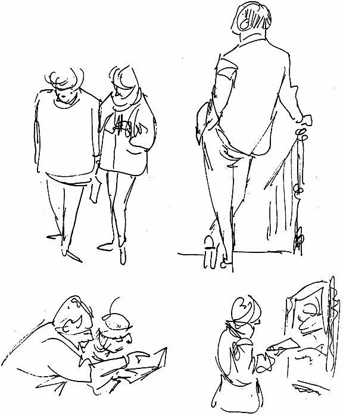

Carry a sketch book---a cheap one so you won\'t worry about wasting a
page. Sketch in the underground, while watching television, in pubs, at
horse shows. Sports events are especially fun to sketch--- boxing
matches, football games, etc. Draw constantly. Interest in life will
grow. Ability to solve drawing problems will be sharpened. Creative
juices will surge. Healing fluids will flow throughout your body. An
eagerness for life and experience and growth will crowd out all feelings
of ennui and disinterest.

Where are you going to get all this energy, you ask? Realize that the
human body is like a dynamo, it is an energy producing machine. The more
you use up its energy, the more it produces. A work-related pastime like
sketching is a positive activity. Inactivity,\
especially in your chosen field, is a negative. Negativity is heavy,
cumbersome,\
debilitating, unproductive and totally to be avoided. Take a positive
step today. Buy a sketch book and a pen (more permanent than pencil),
make a little rectangle on the page and fill it with a simple
composition.

14

Chapter 2: The Animator\'s Sketchbook

> 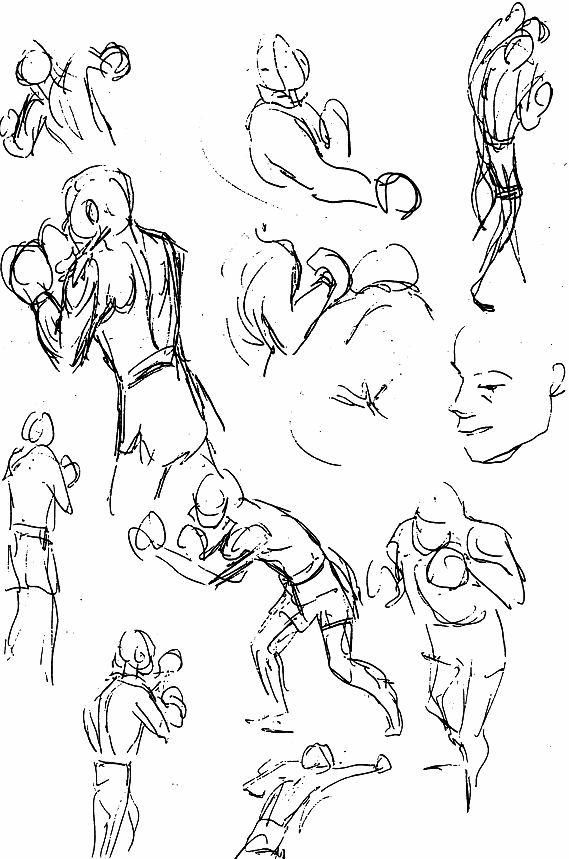
make another, and another, and another.
> Keep the first ones. Watch the growth of both your facility and your
> interest. Put an end to limiting yourself by drawing nothing but
> torsos in a life drawing class. (Do I exaggerate?) Activate the
> potential crannies of the mind. There is a law in the Christian
> religion that says (I paraphrase) \"If you can believe, so shall it
> come to pass.\" You can break a civil law but you can not break a
> spiritual law. You have to be careful of your\
> Identify it and/or date it and feel\
> good about it. Don\'t think or speak\
> negatively about it. If it is not as\
> satisfying a start as you would have\
> liked, don\'t be critical --- that\'s w here\
> e you are --- face it. Just turn the pag\
> and start another. All those faculties\
> that are required to make a more\
> satisfying sketch are being\
> awakened---even now---as you\
> search for a new subject and begin to\
> sketch. No one else in the universe\
> would have drawn it quite like you.
>
> If you think you\'d like to do better,\
> thoughts. Once you start one of the\
> spiritual or mental laws working, all\
> sorts of things begin happening\
> behind the scenes to implement its fulfillment. So if you want to be
> able to draw well, start a sketch book and get a good law working for
> you.

15

Gesture Drawing For Animation

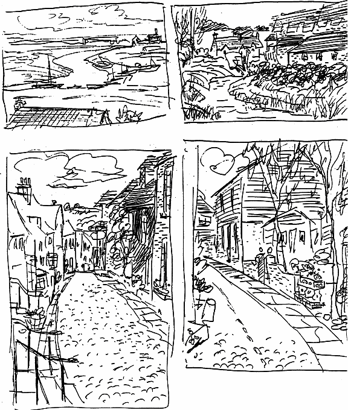

16

Chapter 2: The Animator\'s Sketchbook

> **Everywhere You Go**\
> Don\'t be afraid to sketch in\
> 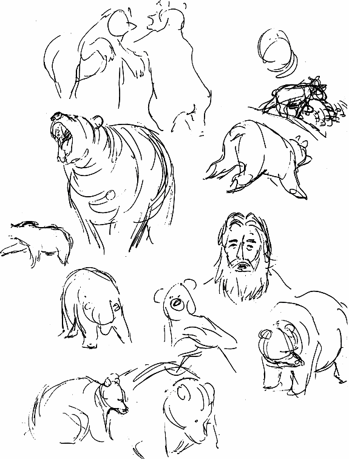
detailed sketch.You may shun landscapes, saying that
> you are interested only in figures or cartoons. But trees and
> mountains, rivers and clouds have gestures that can be beneficial for
> analyzing action. Mountains stand erect, lean, lie down, sprawl, and
> spill out onto valleys in alluvial forms. Trees loom, twist in
> agonized or\
> public places such as\
> museums, parks, restaurants,\
> etc. And don\'t let wind, rain\
> or cold or heat deter you ---\
> those conditions sometimes\
> yield the best sketching. Let\
> someone else drive when\
> traveling so you can draw.
>
> Capturing a scene while\
> moving at high speed will\
> sharpen your eye, but also\
> take time to do a more\
> humorous gestures; they stand erect, stretch, lean; some are tired,
> some perky, some bear fruit or flower, which in itself is a gesture.
> Even the atmosphere of a landscape has a (spatial) gesture.
>
> If you go on a trip, whether long or short, let your sketch book take
> preference over your camera. You\'ll find yourself looking and seeing
> more than ever before. You will find yourself searching out new things
> to see, new places to visit, more varieties of people to \"capture\"
> in your ever-growing sketch book. It will become your diary. Think of
> it as a graphic autobiography---a unique account of your personal
> observations of your all too brief journey on this planet.
>
> Sketch at home too. Never sit in front of the TV without a sketch pad
> on your lap. Sketch faces, figures, stage settings. If your dog or cat
> is lying on the floor nearby, sketch them.
>
> Vehicles have gestures of their own. Some cars seem to slink along,
> some move proudly. Some are raised way up on springs --- look like
> they\'re holding up their skirts so they can cross a stream. Special
> equipment like skip-loaders and semis and derricks and delivery

17

Gesture Drawing For Animation

trucks---all doing their own thing. They\'re as different from each
other as a farmer is from an office worker; or a military man is from a
hobo. Don\'t sketch vehicles as if you were doing a Ford ad --- go for
their personalities, their gesture. Sketching can not only be fun, but
it will help you master those blank sheets of paper you\'re going to be
spending the rest of your life battling.

**Composition**\
First draw a rectangle and work within that to force yourself to make a
composition, relating one thing to another and to the borders. If you
feel a need for toning the sketches, use cross hatch or carry a couple
of gray felt tip pens. Get in the habit of using a pen. It is much more
direct and does not rub off like a soft pencil.

I have Xeroxed some sketches I made at the airport, the underground and
a museum to show the possibilities of a direct approach to capturing a
pose with a minimum of line. Notice the emphasis of putting the weight
on one leg in the standing poses; the emphasis on relaxation in the
sitting poses. There was no penciling in first --- they were done
directly in ink.

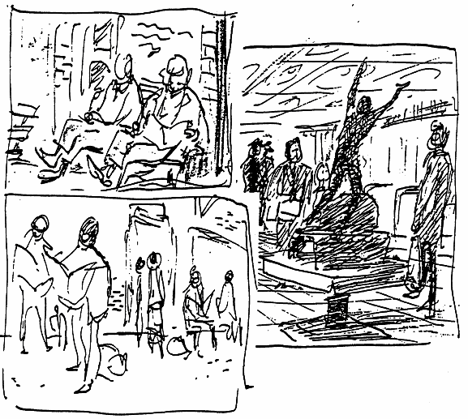
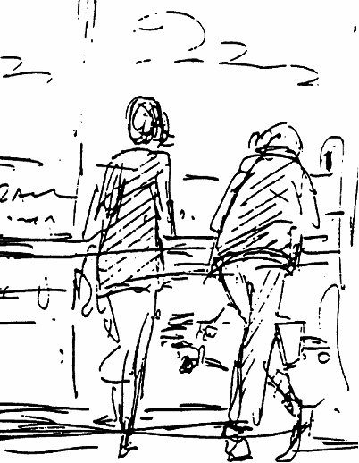

18

Chapter 2: The Animator\'s Sketchbook

> These were done inside a cardboard template with the eyes closed. The
> borders were added later. Good exercise!
>
> 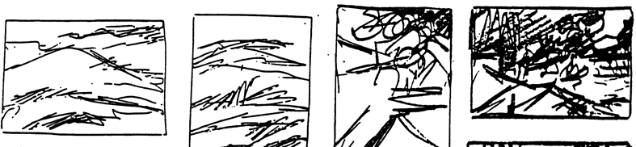
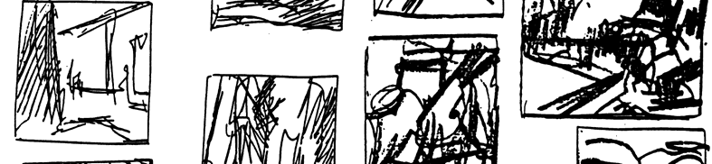
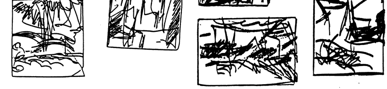

19

Gesture Drawing For Animation

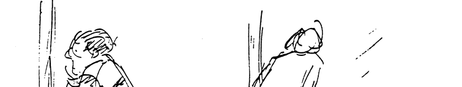
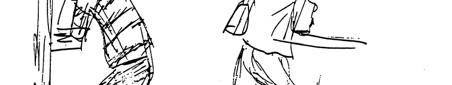
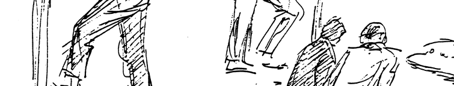
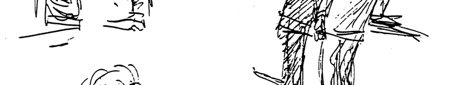
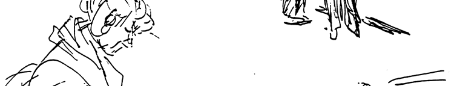

20

Chapter 2: The Animator\'s Sketchbook

> **Ron Husband\'s Sketchbook**\
> Ron Husband appears to be a quiet guy who just goes about his business
> in an evenmannered way. But he is an inveterate sketcher --- his pen
> is constantly searching and probing for incidents of every day life,
> attempting to push them beyond the ordinary --- into the realm of
> entertainment. The 100 filled sketch books in his room (there are a
> 100 more at home) might hoodwink you into thinking that is all he does
> when not animating, but he has several \"irons in the fire,\" and is
> more than capable of doing justice to all of them. He is an
> illustrator for children\'s magazines, and is involved in some very
> imaginative books of his own. Ron doesn\'t confine his drawing to just
> the small\
> sketchbook format, either, I recall an exhibit a year or so ago where
> he displayed many drawings about 17 x 22 inches. They ranged from
> humorous to dramatic, and were most elegantly done.
>
> Ron believes quick sketching is an aid to animation. He maintains
> sketching will enhance drawing ability, quicken your eye, help you to
> analyze action in a shorter period of time. He says the benefits of
> quick sketching are: the ability to capture the essence of a pose, to
> acquire believability in your drawing, to sharpen your awareness of
> \"grid\" or ground planes and backgrounds, a greater familiarity with
> depth, perspective and 3rd dimension, also frees you from thinking in
> terms of the standard 3/4 front or rear view.
>
> Here is a sampling from just a few of his sketchbooks:
>
> 

21

Gesture Drawing For Animation

22

Chapter 2: The Animator\'s Sketchbook

> 

23

Gesture Drawing For Animation

24

Chapter 2: The Animator\'s Sketchbook

> 

25

Gesture Drawing For Animation

26

Chapter 2: The Animator\'s Sketchbook

> **Note Taking and Sketching**\
> If you haven\'t been a note taker --- become one. Hundreds of
> potentially fertile ideas have drifted through your consciousness and
> have spun out into oblivion to be lost forever.
>
> You often hear or see things that, like a potent horseradish sauce
> clearing the sinuses, sparks a clear vision of some illusive point,
> perhaps some clearer way to draw a wrinkle or some better way to draw
> hands or knees. It seems so clear at the time there seems to be no
> reason to make a note of it.
>
> Many, perhaps dozens of ideas have bombarded your sensitive receptors
> during the day (and night), the overload adjusting itself in favor of
> a few of the most impressive messages, not always the most useful. So
> write them down, or sketch them. They may prove very valuable at a
> later date. A seasoned note taker will often hear a seemingly dull bit
> of information and, either on the spot or later, translate it into a
> meaningful bit of wisdom. Once down in writing or in drawing form it
> can be like a seed planted in fertile soil, burgeoning into growth
> when given the proper inducement.
>
> Taking notes, like sketching, sharpens the mind, hones it into a more
> sensitive and receptive instrument, more ready when needed than one
> that is allowed to \"flow with the tide.\" It can be the difference
> between being a reactor or an actor. The reactor drifts along awaiting
> opportunities from others before making a move. The actor checks his
> notes and comes up with a positive move of his own. Most, if not all,
> artists, composers, authors, scientists, etc. have been and are avid
> note takers and sketchers.
>
> A three ring, loose leaf note book with unlined paper is ideal for
> writing, sketching, and storing notes in. It may be too large to carry
> with you everywhere, so augment it with a small notepad that will fit
> into a pocket or purse. The notes taken in the small pad can be
> removed and taped or glued into the larger book. Record the source, or
> initial those of your own origin --- also the date. It will be a great
> focus of learning, a pleasurable hobby, and will help keep your mind
> alert for new ideas and to new vistas of creative thinking.
>
> Your note/sketch book can and should contain both writing and
> sketching. Memories are often useful in creative work. Present day
> experiences are worthy of recording, saved and savored. Jot down only
> the pertinent details.
>
> Sketch scenes, expressions --- make comments beneath the sketches.
> Describe people you know and meet. Don\'t correct your impressions
> later --- better to write or draw new ones.
>
> Develop your senses by becoming aware of them. Record them in a
> straightforward manner and/or caricature them to some humorous
> extreme. What you will be doing is sharpening your sensibilities,
> increasing your susceptibility to impressions, refining your ability
> to perceive and to transpose them into graphic form. Soon you will
> find yourself exploring your world for impressions and the recording
> of them will buoy you up mentally, physically, and spiritually.
>
> Remember my formula for this: impression -- expressions depression. So
> become a note taker, start collecting things --- not through one ear
> or eye and out the other, but graphically, through your fingers, which
> are the things you have chosen to express

27

Gesture Drawing For Animation

yourself through. Copy words, phrases, bits of articles, drawings,
paintings, anything that awakens a spark in you.

Arming yourself with a sketchbook will put you at the ready when
opportunities present themselves. One day while searching for driftwood
and shells (for my driftwood mobiles and seaweed (for my wife\'s
basket-making), I ran into this group of kite flyers at the beach.

28

Chapter 2: The Animator\'s Sketchbook

> 

>
> From the sketch book of Al Ross, Cartoonist
>
> A good way to take notes or gather your thoughts on any subject is to
> state the problem or subject at the center and circle it. Then as
> related thoughts come or as you gather\
> research, attach them to the center by a line and into groups that are
> more closely related. It\'s a wonderful means of focusing the mind.
>
> 

29

Gesture Drawing For Animation

I was working on an inspirational book for artists who find themselves
in the doldrums. These suggestions for a title could have been jotted
down in a restaurant or while driving\...

> 

**Good Habits**\
People usually do what they are in the habit of doing. That may seem
like an obvious thing to say, but it is significant in a number of ways.
Arguing in its favor, it is a comfortable way of living. There are a
minimum of decisions that require attention, and hopefully the things
you are in the habit of doing and the manner in which you do them are
compatible with your idea of the \"ideal\" life. And if you\'re studying
to be a concert pianist or a rock band drummer or a pro-tennis player,
you had better submit to some rigorous habit forming -- such as hours
and hours of practice.

30

> ***Chapter 3: A Visual Vocabulary for Drawing***\
> In a sense, drawing is learned by accumulating a visual vocabulary,
> just as speaking requires a verbal vocabulary. And as a certain amount
> of sentence structure, syntax and voice inflection must learned to
> communicate verbally, so must there be some rules of drawing that need
> to be learned and used to communicate the meanings of your drawings.
>
> We think of communication as \"normal,\" but in the distant past there
> were no words, and at that point man had limited ways to communicate
> his thoughts---simple as they probably were. Our present way of
> communication has evolved\... and is still evolving. In our class we
> are attempting to make another leap in drawing communication by seeing
> the gesture at once and putting it down in all its freshness and
> lucidity.
>
> **Lines, Lines, Lines**\
> In your business (animation) line is one of the most important
> elements. Line is a very exciting discovery that man (artists) has
> developed to a phenomenal degree. Drawing in line can be a real
> adventure and, when used skillfully, can be a source of adventure for
> the millions of viewers who see your work on the screen. Line is not
> just a tracing tool---it is a living, organic thing, capable of
> describing just about anything you can dream up.
>
> **There are many kinds of lines.**
>
> Short ones:
> 
\
> Long ones:
> 
Curved lines:
> 
\
> 
And some that get off to a good start
> but then seem to poop out:
>
> You can do anything with lines. Years ago there was a silly gimmick
> that went like this:
>
> Do you know what this is?
> 
It\'s a T.V. screen for people who
> squint.
>
> 
\
> Know what this is? It\'s a tornado with the hiccups.

31

Gesture Drawing For Animation

> 

32

Chapter 3: A Visual Vocabulary for Drawing

33

Gesture Drawing For Animation

**A Simple Approach to Drawing**\
For those in my class who have had little instruction or experience, I
would suggest adopting a very simple approach to drawing. Even those who
are experienced but have neglected working from a model can benefit from
this.

The most logical approach when faced with a model is to lay in the basic
pose with some simple elemental shapes. Ignore the details of the
costume. First study the pose for the gesture---you may have to add a
little of your own thespianism---then look for weight distribution and
over all abstract shape (silhouette), ignoring all particulars like
muscles or other detail, and go for the general, overall generic
gesture. This gives you the\
opportunity also to concentrate on relative proportions. Proportions are
important and you must develop sensitivity to them---Mickey, Roger
Rabbit, the Mermaid, Eric,\
Sebastian---all with distinct proportions.

Here are some suggestions for a simple approach. You'll not be
encumbered or confused by a multitude of superfluous lines and puzzling
shapes. Once you have the pose captured, the costume will be easier to
put on. And using the known facts about wrinkles, you will be able to
pick and choose the appropriate wrinkles from the model or make up some
of your own. Let me suggest that in working out your "shorthand"
body-shape, when the chest and hip are twisted, they can be handled as
separate shapes. That way you can more easily draw them facing in
different directions. When they are not twisting, the chest and hip
areas can be treated as one shape.

34

Chapter 3: A Visual Vocabulary for Drawing

> Here's a suggestion from Lariar's book, *Cartooning For Everyone*, on
> how to lay in a cartoon figure. He had no explanation for this
> illustration but you can see, he worked from the general to the
> specific.
>
> 

>
> **Finding the Abstract**\
> I keep searching for a shortcut to learning how to draw, but as Ollie
> Johnston used to say of drawing in general, "It ain't easy."
>
> Try to look for the overall abstract shape. I use the word abstract
> here in the sense of a summary---a brief statement of the essential
> elements. I sketched these abstracted shapes of some familiar (male)
> body types. If when drawing from life you can spot one of these shapes
> (or one of your own design) in the character you are drawing, it will
> save you the agony of searching for lines on the model to copy. If you
> know the overall abstract shape you are dealing with, it will be
> easier to apply that to the gesture.
>
> 

>
> Finding the abstract in the gesture itself will help too. Take a
> moment to study the type of body build, forming an abstract shape of
> it in your mind, then do the same with the overall pose. It simply
> means dropping 90% of the detail, and seeing only that 10% ---that
> essence of the pose.

35

Gesture Drawing For Animation

This kind of thinking will lead to more expressive drawing, especially
in animation where body language is so important. It will aid you in
capturing the essence of a gesture, and with an economy of lines. My
philosophy is: if you can draw it with 10 lines, why use 75? And who can
argue with the philosophy: if you can draw it in 5 minutes, why take a
half hour?

A loose style allows you to study and practice drawing
action---something that is hard to do if you try to make a cleaned-up,
finished drawing as you go.

**The Solid-Flexible Model**\
Humans, most animals and to a degree cartoon characters are constructed
on a solidflexible basis:

A cartoon character is more flexible, but
the principle of solid-flexible is applicable because the same parts are
there---they are merely caricatured.

The solid-flexible concept is the basis for all the angles that portray
the various actions, moods, and expressions that we are called upon to
draw. Each section has a limited yet unique movement to perform. Those
movements are the means through which we express all of our body
communications. Try to relate some incident in you life, or mimic
someone else\'s with your neck in a brace and your hands tied behind
your back. You would make up for it by bending at the waist and the
knees. You would make the whole upper part of you body do what your head
normally does, and the bending of your knees take the place of hand
gestures.

We\'ll see more of the solid-flexible model later in animating squash
and stretch.

36

Chapter 3: A Visual Vocabulary for Drawing

> **Figure Sketching for Animation**\
> Here is a sheet of figures drawn by Glen Vilppu, life drawing
> instructor and layout man. This is an excellent simplistic approach to
> sketching the figure for animation purposes. I suggest you study them
> and try to emulate them.
>
> 

37

Gesture Drawing For Animation

> 

38

Chapter 3: A Visual Vocabulary for Drawing

> **The Pipe Model**\
> There is another approach to drawing the figure that may seem a bit
> bizarre at first, but is worth your consideration. It is especially
> helpful when working out a difficult\
> foreshortening problem. The method merely employs pipes, or cylinders,
> as parts of the body.
>
> When cylinders are used to establish the basic shapes, their angles,
> directions and relationships, then it is an easy matter to add the
> details. Again, the details only after the basics are well
> established. Don\'t be impatient---the foundation first. To avoid
> \'doodling\' while practicing this form of study, confine yourself to
> these shapes:
>
> 

>
> There are only four lines per cylinder and if it takes you twenty
> lines to make one---you need help!

> See the cylinder in space. Perhaps envisioning an arrow inside each
> one will help capture its direction and angle:\
> 

>
> This will help you establish the shape in space rather than on a two
> dimensional surface, and in the simplest of terms. Also, the bulk of
> the figure is automatically built up and available for further
> delineation. If you have a difficult time seeing these shapes in space
> and relating them to the over all pose, sketch in just enough rhythmic
> gesture lines to suggest the pose. Then before getting too involved
> with them, \"throw\" on the cylinders with gusto and bravado and watch
> the figure take shape. Remembering of course, to embellish them with
> some suitably angled hands and feet.
>
> This basic drawing with its \"essence of pose\" can then be humanized
> or cartoonized according to the needs. If it\'s a nude you are working
> on, add flesh, joints, wrinkles, etc.,

39

Gesture Drawing For Animation

if a clothed figure, add clothes, costume, features, wrinkles and other
detail. If a cartooncaricature it accordingly, add costume, and win
yourself an Oscar.

Try combining the cylinders with the solid-flexible concept described
earlier.

40

Chapter 3: A Visual Vocabulary for Drawing

> 

>
> **Seeing in Three Dimensions**\
> The ability to see in three dimensions is fairly near the top of the
> list of requirements for the animator, assistant animator, and the
> in-betweener. Most of us come by this\
> knowledge only after years of observation and practice. The more I\'ve
> thought about it, the more I\'ve come to believe the rules of
> perspective ought to be called the \"all\
> encompassing principles of drawing.\" I never make a drawing without
> being conscious of them, and when I am having trouble with a drawing,
> I delve into those rules and they are a sure help.
>
> As artists we see through eyes that constantly search for shape,
> gesture, color, contrast, and so on. When we draw from the model (or
> from life in general) we have a tendency to feature shape. A thing is
> either round or oblong or rectangular or some combination of each.
> These in turn create the two-dimensional negative space that forms a
> relationship between one or more objects or parts of one object. It
> requires an extra nudge of\
> observation to see things as three-dimensional, and two extra nudges
> to translate that third dimension onto a two-dimensional surface.
> Since we see things as basic shapes, we must think of the shapes as
> being three-dimensional.
>
> For instance a rectangle
> 
is as flat as the paper it is drawn on.
>
> But add the rule diminishing size and we get a somewhat 3D shape.
> 
\
> Add some bulk to that shape and the 3D feeling (or illusion) is
> augmented.
> 

41

Gesture Drawing For Animation

Add a slight angle or give it a twist and the illusion is even more
apparent:

It is more difficult to achieve three dimensions with an orb or
spherical shape, but it can be done with the aid of the rules of
perspective. For instance when drawing a head, the nose, forehead,
cheeks, ears and chin may be thought of as shapes that overlap other
shapes.

\

\
If the model\'s pose forms a rectangle viewed straight on, that
rectangle, from a

\
three-quarter angle, would look like this:

The degree of diminishing size (perspective wise) would depend on how
close to the model (or object) we are and at what angle we are seeing
it.

If our eye is 1 foot from a rectangle measuring 17\' by 20\'

,\
at a 7/8 degree
angle
 the far side will appear to be about 7
inches high, meaning that within 20 inches the upright line has
diminished by more than one half. At 6 feet it is only 4 inches shorter,
and at 12 feet it is only 2 inches shorter. So the ratio of diminishing
perspective lessens as the distance increases.

So the factors that concern us are\
� how far from the object are we and\
� what is the angle of perspective; that is:

42

Chapter 3: A Visual Vocabulary for Drawing

> one-quarter, or
> 
\
> three-quarters.
> 

>
> **The Rules of Perspective**\
> Some years ago a simple little drawing book was given to me by its
> author, Bruce McIntyre. He had devised a sort of shorthand art course
> which he taught to young children and the results were amazing. His
> whole premise was built on six rules of perspective and an involved
> use of directional symbols.
>
> The perspective rules are simply this:
>
> 

>
> **Surface and Size**\
> Take the one about diminishing size. That has to do with establishing
> a vanishing point on the horizon and having all things diminish in
> size from an established height in the foreground to that vanishing
> point. In animation we work with a layout that has that kind of
> perspective built in, so we have to draw our characters with a
> somewhat matching perspective. Let\'s consider how these rules may be
> used to accomplish a desired threedimensional effect. This may seem
> like an unlikely approach, but let\'s take 5 dimes (minus the detail).
> Knowing they are all the same size, if we drew them all the same size,
> they would all appear to be the same distance from us.

43

Gesture Drawing For Animation

If we varied the sizes they would appear to be at different distances
from us (the \"diminishing size\" rule):\

The first two rules, I think, are a preparation for the third
one---surface plus size, a rule that is very usable in animation. For
instance when working on a scene with a layout like this:\

A character standing on that plain would have two feet fitted to that
surface, creating not only a stable stance but also a third dimension:\

\
and of course any props such as Apples, Cans, Bowls, and so on.

**Overlap**\
If we put two of the dimes side by side, we create and are aware of the
space between them (two-dimensional space).

\
Now if we place one behind the other (the overlap rule), plus making one
of them diminished in size (one of the rules of perspective), we create
a three-dimensional negative space:

\
The overlap rule is very important to all classes of drawing, especially
when the illusion of third dimension is desirable.

44

Chapter 3: A Visual Vocabulary for Drawing

> Here is an outlandishly simple example where, in the first drawing,
> the whole head area is in front of the shoulders, and in the next
> drawing there is a complete reversal. In the first drawing, note how
> definite the overlap is depicted: the fingers in front of the
> jaw---the thumb behind; the left thumb in front of the elbow---the
> fingers behind. Being definite with overlap helps the drawing "read"
> clearly.
>
> 

>
> There will be numerous occasions where we can use the whole dime
> thing, for instance in foreshortening the figure at some acute angle,
> the head (one dime) in front of the chest (second dime), the chest in
> front of the hips, (third dime), and so on.

> Those areas are easy to relate to a circle (whole dime) but when we
> are faced with longer and straighter shapes: an arm or leg or fingers
> foreshortened, that is when we can use what I once saw in a book on
> drawing, the \"T\" principle.

> Using the \"T\" principle creates depth (one thing in front of
> another):
>
> 

45

Gesture Drawing For Animation

Without the \"T\"s, all those lines would run together, and depth would
be destroyed:

Along these lines (slight pun intended) we might
introduce the \"L\" rule. In cases where one thing meets another but is
neither in front of nor behind it (changes direction but does not
overlap), but where differentiation is needed or desirable---use the
\"L\" rule:

> 

A *tangent* occurs when two or more lines meet or merge into one another
so there is no differentiation between the parts which they describe. A
simple example is two mountain shapes drawn with no overlap, which
automatically creates a tangent and destroys any illusion of depth
whatever:\

The simple solution to this problem is to add overlap:

Making it very clear which hill is in front of the other. Then if you
force the perspective by adding surface plus size to the drawing it will
be more definite and read much faster.

\
Tangents also occur when one line ends at some point then seems to
continue on at another point:

46

Chapter 3: A Visual Vocabulary for Drawing

> Here the head line seems to continue with the beak
> line:

>
> By adjusting the beak line, we avoid the tangent:
> 
\
> Here is an obvious instance of tangent trouble and a simple solution
> wherein a great deal of depth and clarity is achieved.
>
> 

47

Gesture Drawing For Animation

> 

**Surface Lines**\
The importance and usefulness of the surface lines rule can only be
hinted at. In a rendered drawing or painting, the artist has untold
nuances of color, shading and rendering to emphasize the depth. The
animator has only line, plus, of course the rules of perspective. As for
surface lines, there are usually very few in a line drawing. Using a
cigar with its surface lines (the band), the importance of using them
for direction and depth can easily be seen:

> 

There are few areas on cartoon bodies that can be used like the cigar
band. If none at all, the two objects would look like each other only
one smaller than the other.

> 

So the artist must use whatever suggests itself. A sleeve for instance:

48

Chapter 3: A Visual Vocabulary for Drawing

> or a pant cuff:
>
> 

>
> or a belt, collar, hem line, pattern on the material or wrinkles in
> cloth:
>
> 

>
> The \"T\" principle, described earlier, also coincides with the
> surface direction rule. To show surface direction on a foreshortened
> object, we just think of the stem of the T as the vertical angle and
> the cross as the horizontal angle. Thus:\
> 
We may be tempted to think of surface
> lines as belonging only to striped blouses or trousers, but actually
> everything has surface lines, though not always visible.
>
> Take the mouth for instance. It is situated on the head (a modified
> sphere) and changes its \"surface line\" as the head is tilted up or
> down. Likewise the eyes and the ears:\
> 

49

Gesture Drawing For Animation

Even the line of the nostrils does the came thing:

Likewise the brows, cheeks, and so on. Anything on a curved surface will
do it.

Surface lines on a flat surface work differently. When they are tilted
they simply get closer together:\

In the case of heads, the basic structure has to serve as a surface
line. For instance the eye, nose and mouth lines---unseen, but implied
and depicted by the placement of the eyes and mouth and the direction
they take when the head is tilted:\

Along with these "unseen" surface lines, there is overlap such as (in
this case) the hair, first being seen somewhat behind the forehead then
reversing to be in front of the forehead in the second drawing. The ear
employs another rule: Foreshortening. The other rules---surface plus
size and perspective---would have come into play had the head turned to
the side:\

50

Chapter 3: A Visual Vocabulary for Drawing

> And though the other ear is not seen so cannot be compared with the
> one seen, it will have grown in size as the head turns the ear towards
> you and closer to you, thereby giving even a better illusion of depth
> in motion than you would get from seeing a still drawing or the two
> ears:

> That increase in size plus a change in shape (angle) plus following an
> arc (as if the ear were orbiting the outside of a sphere (the head)
> would give a maximum third dimensional effect).
>
> **Foreshortening**\
> The last rule of perspective is foreshortening, which is none other
> than Italian perspective in a simplified form. It is used extensively
> in animation---by simply drawing things larger in the foreground than
> those of like size in the background. For instance on a head, "forced
> perspective" is used in drawing the eves, eyebrows, etc.

> It is the kind of perspective you would get when using a wide angle
> lens on a camera. The difference being that the photograph appears
> distorted and unreal. In the cartoon it is acceptable, partly because
> we can adjust the whole drawing and make it plausible. It is defying
> reality but in a logical way. Using logics in animation is a powerful
> tool. That is how we can use such extreme action and pull it off as
> believable.
>
> I came across this page in the book, \"The Act of Drawing.\", by
> Edward Laning.
>
> 

51

Gesture Drawing For Animation

He uses the principle of overlap to illustrate an example of
foreshortening. What I am suggesting is: everything in a
three-dimensional environment is one thing overlapping another in space,
whether they are connected like the parts of a leg (or a nose) or are
separate. Even then, nothing is really separate, for all things are
connected by the matrix of space that they occupy. In painting we can
use atmospheric perspective to show where the objects are in space if
they don\'t overlap. In drawing with line we can use another of the
principles of perspective: diminishing size or surface plus diminishing
size:

**Direction**\
Bruce McIntyre\'s system also involved directional symbols, consisting
of simple arrows pointing in a number of directions. Each arrow and its
direction had a code number. Their use was related to the manner in
which Bruce taught drawing. I had never involved myself with his use of
them, but the principle of it completely captivated me. It has
influenced every drawing and painting I've made since being exposed to
it. It has made me conscious of the fact that everything is pointing in
some direction; pointing away from us or sideways to us or three
quarters up at a certain angle; straight at us or slightly to the left
or right or down. Most often these directional lines coincide with
perspective lines and have a common vanishing point.

In the case of drawing a figure, the line directions are not random but
have to do with the pose or action. To be conscious of the direction
that arms, legs, fingers, and so on are pointing is the key to the
three-dimensional drawing. It is the thing that reveals to us the six
rules of perspective. For instance, if in drawing the legs of a
character you find one pointing toward you and the other pointing away:

You know that the surface lines will be dictated by those directions and
also surface plus size will influence the placement and size of the
feet, overlap will be necessary to show the right leg is in front of the
left leg. Foreshortening will be subtle but the left leg will diminish
in size as it recedes from hip to ankle:

52

Chapter 3: A Visual Vocabulary for Drawing

> Difficult foreshortening in a pose can be more easily handled if one
> is aware of the direction the object is pointing in. For instance, a
> figure bending over toward you presents a difficult view. The problem
> can best be conquered by the awareness of what is happening. To you it
> looks like this:\
> 
\
> From the side it would be a much more drawable view.

> Merely being aware of the side view will help you pick the rules of
> perspective that are needed to conquer this foreshortening dilemma.

> The surface lines of the chest and stomach will be almost circular;
> the arms, held slightly back will have a less circular surface line;
> one leg forward and one back will require opposite surface lines. The
> leg on the right would diminish slightly in size as it goes away

53

Gesture Drawing For Animation

from you while the other increases; employing the foreshortening rule.
The head being in front of the chest applies the rule of overlap while
the rule of surface plus size is\
employed in the feet.

Being aware of these rules is a positive aid in drawing, allowing you to
progress directly to the pose, rather than rely on a lot of doodling,
pencil manipulation and haphazard accidentals.

This system will also help with all the other rules: Surface Lines,
Surface plus Size, Overlap, and as mentioned above Foreshortening.

These ever helpful elements of perspective are present in every area of
every drawing we will ever make. Being conscious of them will be a great
help, plus a great comfort, in our quest for good draftsmanship. Not
that draftsmanship is the ultimate goal, but it does take draftsmanship
to express oneself in animation. Knowing and using these principles when
needed is like having a good road map when traveling in unfamiliar
places.

Here are two corrections I saved from the class. The rules of overlap
and surface lines are applicable here. Notice how the male figure
stooping over needed more angle to bring him forward at 3/4 view.

\

\

\
The head mass placed over the chest mass illustrates the overlap
rule:
The tilt of his head illustrates the
surface line
rule.

In the woman\'s head the same problem is present, and the same rules
provide the solution---the forehead overlapping the cheeks, the cheeks
overlapping the chin, and the ear, placed on a surface line, overlapping
the jaw.

54

Chapter 3: A Visual Vocabulary for Drawing

> **Problems of Drawing in Line**\
> One of the problems in using line alone to draw with is that there are
> very few lines in nature. Even the outline of an object is not truly a
> line, since if the object were turned 1/4 on its axis toward us, what
> was the edge would now be the center.
>
> 
\
> If we think of that circle as a head and put a round nose on the
> profile, when it is turned toward us it will still be a round nose.
>
> 
\
> But if we have a real human head with a real human nose on it, the
> complex shape of the nose changes drastically as we look at it
> straight on. What was a line on the profile becomes a non-line on the
> front view. The principles of perspective help to overcome this
> dilemma. For instance the rule of overlap
> 
tells us what is in front and what is behind, and
> helps us differentiate between the two and to draw them that way. The
> human face (head) is a very complicated set of planes with very few
> areas that can described by line alone. But if the areas that are in
> front (closest to us) are seen and drawn as such, then at least it
> presents something to work with.
>
> A face viewed straight on is in reality is a conglomerate of planes
> molded on top of each other---very few lines. So for a line drawing we
> invent some symbols to indicate which shape or plane is closest to us
> and its general shape.
>
> In animation, the symbols we use for noses are kept simple. The fewer
> lines there are, the less chance of jitters, and when lines have no
> anchor point, it is hard to keep them from \"drifting\". For instance
> a nose in rendering might be drawn this way:
>
> 

55

Gesture Drawing For Animation

While in line alone it might have to be done so:

> 

...depending, of course, on the type of character being drawn.

**Simplifying Heads**\
Often in animation, close-ups or waist-shots are featured. Because of
this, it behooves us to spend sometime in a study of heads and the upper
torso. The emphasis should still be on gesture, and as we do with the
full figure, we should ignore the details as much as possible. A very
simple symbol for the head shape, eyes, nose and mouth will suffice to
\"nail down\" the gesture or expression.

We are all at different stages of drawing ability, so some may feel it
unnecessary to start with simple shapes. If so, try to treat it like a
refresher course and spend a little time at it.

I think it\'s pretty safe, if not essential, to think of the head as
basically two oval shapes. Those shapes automatically suggest a kind of
flat plane on the top of the head, plus that bump at the back of the
head; a flatness for the face and a chin.

It even helps locate a place for the ear:

\
From the front, a circle for the top portion of the head and the oval
for the facial area again automatically suggest a temple, the narrow
facial area, and a chin.

It helps to talk your way through a drawing, because ordinarily we
don\'t carry very many fancy descriptive terms in our everyday
vocabulary. If we follow just the simple things we can describe, we\'ll
have less trouble. For instance, for the animator a few words like
\"structure,\" \"angle,\" \"squash\" and \"stretch\" will carry us
pretty far into any drawing.

56

Chapter 3: A Visual Vocabulary for Drawing

> So you might say to yourself, \"Okay, the head structure is basically
> this shape:\"
>
> 
\
> This particular head is tilted ¾ to the left and is facing ¾ to the
> front, and since this is a ¾ view of the upper oval, it will now be
> halfway between an oval and a circle:
>
> 

>
> So I get something like this:
>
> 

>
> I see because the head is tilted to the left (observer\'s left) that
> the left side of the neck is going to be squashed while the right side
> will be stretched:\
> 

>
> Now I need some shoulders to stabilize what I\'ve drawn so since I
> know that the neck merges into the spine in the back and into the
> chest in the front (I will hook up my mental computer for a side
> view---Ah, there it is!):\
> 

57

Gesture Drawing For Animation

I will now add the shoulders with that in mind:

Making sure to connect the neck gracefully to the shoulder on the left,
and connecting the other shoulder with a nice strong angle to give it a
three-dimensional look, because I know that this

 puts the neck in front of the shoulder
better than this:

or this:

 or this:

 or this:

 or this:

 .

The hair is quite a dominant feature on this person and since the head
is tilted that way I see that the hair reacts somewhat like the neck. So
I\'ll draw a squash on the left side and a stretch on the other:\

\
I want to make sure I\'m being clear (and simple) about the hair, and
though on the model it sort of goes this way and that, I must be
logical. So I will simply drape the hair over the shoulder on the squash
side and let the hair stretch down past the right shoulder, and oh yes,
making sure to use that principle of perspective (one object in front of
another to create depth) by getting a good angle on the meeting place of
the hair and shoulder.

This:
 rather than
this:

or
this:
 or this

Also, regardless of how wind-blown the hair is or what the styling is,
basically the top of the head is rather flat, the back of the head is
rather like a skull, the forehead does a rather sharp turn then gently
curves down to the chin, which is rather sharp, but sometimes a

58

Chapter 3: A Visual Vocabulary for Drawing

> little bit flat across the bottom and the jaw line is rather prominent
> as it curves back toward the ear:\
> 

>
> So now I have just used up my four word drawing \"starter
> vocabulary,\" and so far it feels pretty solid. Now, I don\'t know
> about you (you\'re still talking to yourself) but I think this is a
> good start and I think it might be time to add a nose and a couple of
> eyes, but of course not until I\'ve gotten some simple shapes in
> mind---something like what I\'ve done so far:\
> 

>
> **Caricatured Head Shapes**\
> If the designs above are thought of as the basic head, then from there
> one can deviate for the cartoon, or the caricature look. The head may
> take on one of these shapes, as some of the characters of our former
> pictures have done:
>
> 

>
> Hidden in all the myriad poses and gestures of the various characters
> are those basic shapes plus the creative use of those four basic
> words: *structure*, *angle*, *squash* and *stretch*.
>
> Head shapes vary in many ways, and once an individual\'s variances are
> discovered, they can be exploited to acquire a likeness or, if
> desired, carry them farther into caricature. A person\'s real head and
> feature shapes cannot really be known until we have seen that person
> from different angles and in different moods and circumstances such as
> laughter, anger, fear, clowning, seriousness, strain, etc.
>
> In animation most heads have been built on the circle. Cheeks have
> been added or mouse ears or duck bills have been added and suddenly
> there is a universally appealing\
> character. I said suddenly, but the truth of the matter is, many
> months of intensive search and experimentation have preceded the final
> acceptance of most character models.

59

Gesture Drawing For Animation

Some, such as Mickey mouse and Donald Duck have been under continual
evolvement for their entire lifetime Because many characters are built
somewhat on the same basic formula, great care must be taken to retain
the subtleties that distinguish one from another. Animation allows the
characters to be freely caricatured in action but though the shapes are
stretched and squashed to unbelievable limits, they must be recognizable
as that character at all times.

A good model is one with shapes that can be animated into various poses
and expressions without losing its character. The general shape of the
head and its individual features must be established in its normal state
first so that squashes and stretches will be\
recognized as such. In other words, a thoroughly recognizable norm will
serve to emphasize any deviation from it, giving added punch and
authority to special\
expressions.

On the other hand, since we have already enjoined the audience to
suspend their disbelief in such beings as talking mice and temperamental
ducks, it is important to sustain this newly created plausibility by
keeping the characters consistent. Studying the model and people in
general with this in mind gives us purpose and hopefully the added
incentive to do so.

Try to keep from getting too serious while head sketching. After all,
you are in the cartoon business and most of the Disney characters are
somewhat comical, and if not comical then at least they are caricatures
of serious beings. Usually when a person takes himself too seriously he
is in our eyes a \"comedian.\" He is ripe for caricature. So if cartoons
are not somewhat caricatures of reality they may be taken too seriously
and lose that special spark of humor needed in cartoons.

Museums and living rooms are full of serious portraits that are just
dying to be retouched with a little humor. But, of course, portraits
were not invented to make people smile---cartoons were. If you think the
world is all so serious, you should be a historian or a philosopher, but
if you desire to bring a little humor into the lives of those
humor-hungry people \"out there,\" then be a cartoonist and be serious
about losing some of that\
seriousness.

Very few, if any, of the animators I\'ve known found drawing easy. One
of Ollie\
Johnston\'s sayings, \"It ain\'t easy,\" became a studio quip. Drawing
funny cartoons was and is a serious business. It seems like the funniest
scenes were the ones that were \"sweat over\" most. They were serious
matters that required the animator to never forget (in all his groping
and mental anguish) that the result he was after was to make the
audience smile.

On the following page are a few of the characters from Disney features
and shorts. They are all built on some basic head shape or shapes. After
which the details such as features and so on are added. The shapes are
flexible to a degree that is animatable, but never so

60

Chapter 3: A Visual Vocabulary for Drawing

> flexible as to take on the shape or personality of some other
> character. The skull is usually pretty solid, while the rest of the
> head parts do the squashing and stretching.
>
> It\'s pretty hard to go wrong if you handle the basics correctly.
> It\'s the same in any activity---the basics have to be earned first.
> Then, and only then, may the details be added to complete the creative
> act.

61

Gesture Drawing For Animation

62

Chapter 3: A Visual Vocabulary for Drawing

> **The Head in Gesture**
>
> 

63

Gesture Drawing For Animation

Some of your drawings from the class are suggestive of the way I think
the head studies might go. They are simple enough to allow the
expression to beam through not weighted down with tons of ostentatious
falderal!

64

Chapter 3: A Visual Vocabulary for Drawing

> 

>
> **A Simple Approach to Costumes and Drapery**\
> The draped figure will be one of the many problems that will follow
> you like a heel fly throughout your career. Wrinkles, folds, seams,
> belts, pleats, ruffles and shirring \[puckering or gathering of
> material with stitches\] all seem so important and at times, downright
> overwhelming. Their importance cannot be denied, but their reason for
> being there and looking the way they do must be carefully considered.
>
> Let's face it---clothes cannot act. If clothes seem to act it is
> because the body underneath is acting (posing or gesturing). The
> clothes will react in a like manner and will even

65

Gesture Drawing For Animation

enhance the gesture. But if the drawing has not captured the gesture,
all the manipulation of wrinkles, lumps, bulges, folds, and seams will
not bring off the drawing. A real solid, expressive, sparkly drawing is
one where the clothing is doing what the body is causing it to do.

The best thing for you to do (to keep your sanity) is strive to handle
it in the simplest way possible. In animation, costumes may run from
simple to complex in style, but they are all handled in a simple manner
when it comes to folds and wrinkles.

It helps to mentally take the clothing apart to see how it is
constructed. For instance a sleeve: how big around is the shoulder
opening; how is it attached to the bodice; does it taper; does the
shoulder seam attach at or below the shoulder? Ward Kimball's great
observation is very apropos here. He said if he could take something
apart and put it back together again, he could draw it.

For the sake of studying the figure for animation, lines of clothing
should not be sketched in just for an impression---they should be
logical. If you were to use that drawing in a scene, those drapery lines
would have to animate as a secondary action---the primary action being
the body itself.

Reasons! Reasons! Reasons! Always look for logical reasons for the
shapes of the clothing or drapery---and the reason will always be found
in the bodily gestures.

There is a kind of shorthand for drapery that is standardized for all
characters. Most Disney characters only have wrinkles at the joints, and
then only when there is pressure applied by bending or squeezing. So
they'll occur at elbows and knees, and at the waist when seated. Women's
clothes have wrinkles caused by pleats, gathers, puffed sleeves, etc.,
but you can always count them on two or three fingers. An excess of
material will cause meaningless folds, bumps, and bulges.

This is not to suggest simplicity is easy---just less frustrating.

A clear understanding of drapery plus a general understanding of the
types of garment construction would be helpful. There is a book called,
*The Complete Book of Fashion*

66

Chapter 3: A Visual Vocabulary for Drawing

> *Illustration*, by Sharon Lee Tate and Mona Shafer Edwards (Harper &
> Row, publishers), that gives a very helpful view of drawing the figure
> with clothes on. I recommend it.
>
> Glenn Vilppu has made a videotape on drapery wherein he simplifies it
> very succinctly \[Ed. note: See http://www.vilppustudio.com/dvd.htm\].
> He has broken down the folds of cloth into seven basic categories,
> which should help you to make logical that which often appears to be
> haphazard.
>
> No. 1 he calls the "pipe fold." It occurs when cloth hangs from just
> one point:
>
> 

>
> No. 2 is when cloth hangs from two points, causing a "diaper fold":
> 

>
> No. 3 happens when a hanging bit of cloth is allowed to fold up on the
> floor as the cloth is lowered at an angle, and is called the "zigzag
> fold":
> 

>
> No. 4 is a "spiral fold." This results from cloth as it wraps around
> shapes such as arms, legs or other parts of the body:\
> 

>
> No. 5 is the "half-lock fold," which manifests itself at the knee when
> the leg is bent, also at the elbow when the arm is bent. When the knee
> or elbow is bent to more extremes
> 
\
> there occurs what Glenn calls the "complete-lock fold":
>
> No. 6 is the "falling fold." This will develop when some hanging cloth
> is allowed to
> 
\
> bunch up on some surface:

67

Gesture Drawing For Animation

No. 7 is the "inert fold". This is the only fold that seems to have no
potential for energy;

\
it just lies there, inactive.

Being aware of these somewhat simple categories of folds will help you
to interpret what happens to drapery under certain conditions. Also, the
more complex actions and poses will cause those categories to overlap
and produce a hybrid fold, which, without the benefit of knowing the
origin of the contributing folds, might prove to be slightly
bewildering.

So when you see a fold that is hard to categorize, with the help of this
list, you can search out its origins and, lo, erudition shall prevail.
Identifying the types of folds will be harder when drawing from the
model, for natural drapery doesn't always just lay it all out in simple
terms.

However, when drawing on your own, such as in animation, you can use
more simplified forms of drapery---those that match the action or
enhance the pose. With the help of Vilppu's list of folds, it will be
easier to spot and identify such problem areas as you are forming your
first impression.

It might also help to develop a vocabulary of drapery action terms such
as: *hang, suspend, dangle, swing freely, be pendent, adhere to, sag,
revolve around, drape, incline, bend, droop, descend, incline, sway,
dip, settle, plunge, drag, trail, hang over, drape over, envelope, wrap,
adorn, enshroud*. Each of these suggests an individualized action that
helps to get you involved in what is happening to the drapery. It is
good to be aware of the vast number of possibilities that are always
present---especially if you are\
Academy-award winning scene-conscious.

Here are three extreme drawings by Milt Kahl. They show how directly he
went at drawing the figure and they demonstrate how, in spite of using
folds in the girl\'s skirt, it is basically treated as a shape. Glance
from one drawing to another and observe how the overlap on the skirt
embellishes the action.

68

Chapter 3: A Visual Vocabulary for Drawing

> It is important, also, to drape a figure to emphasize the type of
> character that is being portrayed. Is it a woman or a man; is it a
> neat person or a slob? Is the dress formal or casual; is it supposed
> to flatter the actor or make it look ridiculous?
>
> Here's one example from class, where the artist got trapped into
> trying to feature the complications of the costume. The model was
> actually holding a very austere pose. There was a lot of cloth but it
> was wrapped tightly around the model's body, making a simple but
> dramatic shape. My suggested simplification appears on the right.
>
> 

69

Gesture Drawing For Animation

Here are some beautiful examples of how the clothing can be handled in a
simple way, yet be effective in complementing the action.

70

> ***Chapter 4: The First Impression***\
> Try this experiment: look at your surroundings---a panorama of scenery
> is ideal for this---and direct your mind to slip in and out of some
> selected modes. First concentrate on color. You should be able to
> eliminate all the other elements and see just areas of color. Then
> switch to dark and light, then to masses, then to the
> three-dimensional qualities of things near and far. Now, try to see
> all of those things at once. Your mind may have to do a little jig,
> skipping back and forth between them, for it\'s rather hard to
> concentrate on more than one thing at a time. But if you keep at it,
> it will all come together and the totality of the scene will hit you
> like a bomb.
>
> That is the *first impression* I speak about. It is sometimes referred
> to as a moment of inspiration; a moment of utter clarity; that instant
> of pure seeing that Betty Edwards (Drawing On The Artist Within) calls
> the "Ah - Ha!" moment. Actually it's just an extremely vivid summation
> of all the important elements before you. It hits you so hard and
> clear it is relatively easy to recall when you need a fresh look at
> it.
>
> Getting a strong first impression is the first, necessary step to
> analyzing the components of the pose.
>
> **Short-pose Sketching**\
> When practicing gesture drawing with a live model, the poses should be
> relatively short, so that a quick first impression can be summoned,
> worked on and developed---you won't have time to get involved in
> detail or "cleanup."
>
> Short pose sketching also excites you to a higher pitch of awareness
> so the creative juices flow more freely, and seeing becomes more
> acute. Quick sketching promulgates a feeling of spontaneity in the
> drawings. Most importantly, the short pose condenses the whole process
> of drawing so the wholeness of the gesture predominates and the
> gestural qualities of the pose permeate the entire process of drawing.
>
> In the time it takes some artists to do one drawing (and that one
> often nowhere near completed) others have sketched in three or four
> tries. This encourages experimentation and looking for alternate
> interpretations of the gesture. Trying for variations of the pose will
> sharpen your observation and your hand/eye coordination, and help you
> to seek out subtle nuances of the gesture. After all, if you had to
> draw several of the Disney characters in the same pose, you'd have to
> vary each one according to the personality of that character.
>
> In class, I try to get the artists to stop copying the model,
> especially in a ponderous fashion wherein the gesture is difficult to
> feel, and so often takes a back seat to the details. I encourage
> flexibility. Sketching quickly and loosely will help you to be more
> creative, inventive, inspired and will train you to be more adaptable
> and versatile (more fun, too).

71

Gesture Drawing For Animation

**Superficial Appearance vs. Creative Portrayal**\
In the course of animating on a picture, you will be called upon to draw
many different actions, each one calling for a distinct set of gestures.
Your character might have to display a variety of expressions like
happiness, anger, confusion, determination, etc., with actions that
match each of those emotions. The character will no doubt have to walk,
turn, stoop, stretch, extend arms, etc. There will be a number of
characters in the film and each one of them will have different
personalities that will require appropriate gestures, none of which will
be repeated---at least not in exactly the same way.

In a classroom situation where you are studying a live model, it is
nearly impossible to anticipate those action requirements, so you have
to concentrate on the ability to capture those gestures the model
performs for you. This, in effect, hones your sensitivity for seeing
bodily actions, so that you are better able to apply your skills to
future needs. It is nearly impossible also to find models who are
\"look-alikes\" to match the characters in the various stories. This may
be a blessing, in that if you could find them you would surely be
tempted to copy the superficial appearance of the model, rather than
using the time and opportunity to further your skills in gesture
drawing. After all, gesture drawing to the animator is what acting is to
the stage or movie actor. What the actor portrays on the stage or before
the camera is what the animator draws on paper.

When working from a model you must keep in mind the fact that you are
not copying what is before you, but that you are searching for a
gesture---one that will be applicable to any character that you might be
called upon draw (animate), say, the mermaid, one of the sailors, or the
prince in the "Mermaid," Mickey or Goofy. Again I use the term "shift
gears" (mental gears), to picture the release from the shackles of any
false burden, responsibility or obligation to copy the model.

A scene of animation is more or less a series of gesture drawings. The
difference being that an animator\'s drawing is likely to have some
things in it that are not associated with still drawings. For instance,
an animation drawing might have some overlapping action, some drag, some
squash and stretch, a stance that may be off balance, or a view that one
would avoid or adjust in a still drawing. But basically the extremes in
a scene of animation are gestural drawings created to fit the needs of
the story.

A perceptive and keen observation in regard to gesture (acting) is
essential to the animator.

> \"Completion (of a drawing) does not depend on material
> representation. The work is done when that special thing has been
> said.\"---Robert Henri

The purpose of working with a live model is to sharpen your awareness of
the\
possibilities of the human figure to tell a \"story\" with body
language. Assuming you understand basic anatomy, you know where the
knees are, how they work and their general functions; likewise all other
parts of the body. At this point, to merely copy what is before you
would be just to solidify your position on a plateau, short of your
potential.

72

Chapter 4: The First Impression

> Now is the time to transcend that ability to make a carbon copy
> likeness of the model, and to discover, reveal and disclose the rich
> assortments and subtleties of body language Then you will be better
> equipped to formulate the future needed variations and apply them to
> whatever character you happen to be working on.
>
> "The wise man brings forward what he can use most effectively to
> present his case. His case is his special interest--- his special
> vision. He does not repeat nature."---Robert Henri
>
> All the above is to try to convince you to stop tiring your eyes by
> glancing back and forth from model to paper in an attempt to make a
> pretty copy but rather to \"shift mental gears,\" looking past the
> flesh to the spirit of the pose---and to draw that. Think caricature,
> think essence of gesture, think going beyond to a better than average
> drawing, one that blows up in your \"emotional face.\" There will be
> rejoicing in the village if you can draw not the facts, but draw the
> truth.
>
> My apologies if I sound preachy, such is not the intent. I consider
> myself more a kind of coach than a teacher. You\'ve all had teachers.
> They have \"taught\" you to draw---I\'m just trying to help you see
> more clearly so you can put that drawing ability to a more fulfilling
> use.
>
> **A New Phrase: "Body Syntax"**\
> There is an insistent tendency to look at the model in a serious, even
> detached way---as if it were a still life devoid of feeling and
> personality. We look at the model to pick a starting point, we draw
> it. We look back to see if we did it right, make a few more dabs at it
> to reassure ourselves, we look up for another line to add---perhaps
> connected to the first one, perhaps somewhere else in some unrelated
> area. We look down; sketch in the new line tentatively. Reinforce it,
> after another look at the model, with several swipes of the pen. The
> gesture goes unrecognized. The more unrelated lines that get put down,
> the farther from our grasp goes the gesture.
>
> Imagine yourself drawing a simple shape like a circle or a square. Do
> you see yourself sketching a bit here or there, going over what you
> awe done, then on to another section, seeing only those small sections
> of line you are putting down? No, of course not! You see a circle and
> the size you want to make it and in as few lines as possible---wham!
> Down it goes.
>
> A human body is more complicated, granted, but the act of drawing its
> gesture is much the same. You must see the whole, and wham (over a
> longer period of time, of course), down it goes. You have hardly
> looked at the details. They influence and enhance the pose (gesture)
> but are somewhat incidental to it. If it is gesture you are interested
> in, then look beyond those extraneous, sometimes gesture-destroying
> details.
>
> I love to read. I love the way authors put their words together. I
> love syntax. I love the way the words reveal the plot and the
> personalities of the protagonists that carry me along

73

Gesture Drawing For Animation

in the plot. But if I\'m not careful, I get caught up in admiring the
details and how the story is being told, getting behind in what the
story is about.

We have been having some terrific models whose \"details\" (body syntax)
are fascinating to the point of distraction. It seems like the more
interesting the details, the more difficult it is to see the simplicity
of the gesture. So, as it takes a special effort on my part to read for
the story, so it is with most of us---we have to make a special effort
to draw for the gesture.

Earlier I mentioned body syntax. That\'s a phrase worth coining. The
non-grammatical meaning of syntax is: \"Connected system or order;
orderly arrangement.\" What is a pose or gesture but an orderly
arrangement of body parts to display a mood, demeanor, attitude,
mannerism, expression, emotion---whatever. That phrase \"orderly
arrangement\" (body syntax), is worth ruminating over. An orderly
arrangement of body parts. I love it. Even the sentence places
arrangement before parts.

Once the physical faculties of manipulating a pen or pencil to one\'s
satisfaction is conquered, that side of drawing is taken care of and
from there on it is mental. It\'s then the ability to analyze, imagine;
to caricature, to assemble and organize all the separate elements of
storytelling into one drawing or into a series of drawings (animation).
As we have come to realize since Dr. Betty Edwards, drawing is a right
brain activity. The left brain is a serious namer of things, while the
right brain uses all that seriousness for some creative purpose. The
left and right sides of the brain are the \"odd couple\" of the cerebral
community---the right side being the slightly less serious.

**The \"Explosive\" Gesture**\
A couple of weeks ago we had the wonderful Bobby Ruth as our model. I
think she's nearly as ancient as I am but she's just as energetic, and
quite a talented actress. She did a

74

Chapter 4: The First Impression

> clown for us. (The night before that she did a sexy night club
> performer.) The wonderful play-acting she did unearthed a typical
> clown-like character that was as distinctive as one of Red Skelton's
> characters, or Bob Newhart, or any other performer whose
> characteristic style is as memorable. If you saw Bobby in a
> supermarket checkout line, she might blend into the crowd, but while
> performing, she has that unique ability to carry us beyond the
> ordinary. She seems to transform herself into another realm---one of
> pure gesture.
>
> But it's not just the job of the model to do this---it's our goal too.
> We want to go beyond just making a drawing of arms and legs and
> clothes. We want to draw something that tells a story like our models
> do.
>
> Drawing is really your reaction to life---to the bits of life you are
> sketching. It is not merely a collection of parts being put down on
> paper. It's more like the colorful display of fireworks after they
> have exploded in the sky, revealing their final "gesture." You can't
> see that gesture by just handling the physical thing called a Sky
> Fountain, or whatever they are called; it has to explode to reveal its
> beauty. So with a drawing. Handling the human parts of the body will
> reveal nothing but the means to the end---the end being when it
> assumes one of its story-packed gestures.
>
> As you draw, you feel as much as see the gesture as it comes to life
> on your paper. There is a kind of flush that grips you. If you are
> just seeing the parts, they will always remain parts, but if you go
> for the final "explosive" gesture, the parts will fall into place and
> the pose magnificent will emerge.
>
> Here's a paragraph from *Drawing on the Artist Within*, by Betty
> Edwards, which is quite apropos:\
> "Gesture drawing is a technique of very rapid drawing, one drawing
> after another, perhaps fifteen scribbled drawings accomplished in
> fifteen minutes or less. It works, I believe to "set aside" the
> strong, verbal left-hemisphere mode, perhaps in the following way.
> L-mode, which prefers a rather slow (relatively speaking) step-by-step
> linear, sequential, analytic procedure for drawing, preferably using
> familiar namable forms, says, in effect, "First we'll draw the head,
> (let's see, that's sort of an oval); then the neck (two lines); then
> the shoulders (two slanty lines from the neck)\..." But in gesture
> drawing, L-mode finds you drawing helter skelter, all over the page,
> saying to yourself, "Just get it down! Faster! Faster!
>
> And L-mode objects, "If you're going to draw that stupid way, count me
> out! I like to do things the sensible way---my way! One thing at a
> time, the way... we... always\... do\..." And L-mode bows out.
> Perfect! Just what we want!"
>
> Here are some drawings from that session with Bobby Ruth that I felt
> needed a little help.
>
> My "suggestions" (shown to the right of the originals) were not
> attempts to make a "Rembrandt"-like drawing; after all, they were only
> 5 or 10 second sketch-like, "playacting." In her clown costume she was
> creating a charming clown-like character, and every move she made was
> typical clown.

75

Gesture Drawing For Animation

For this first pose, I suggested that one of the many possible
interpretations might be to let the principles of drawing permeate one's
thinking-squash and stretch, angles, simplification, balance, tension,
straight against curve, and perspective. Try to do it in about 10 or 15
seconds. Forget the details; that stuff's all on the "model sheets."

> 

Here's one where you might line things up in an attempt to point her
attention out to the "audience" she is entertaining. You might drop her
right arm to get it out of the look's way, and curve her back to help
send her communication with the audience forward. You might even have
the little flower on her hat jump out at them:\

\

You know the pose---modest, bashful, shy\... or better yet pretending to
be shy. It's in the shoving the hands into the pockets, the dragging of
one foot, the tilt of the head, which tries to hide behind one of the
shoulders:

76

Chapter 4: The First Impression

> And when a clown leans on something, they LEAN. They exaggerate
> everything---to the point of defying gravity:\
> 

>
> Here are two more. With the help of all those principles of drawing
> mentioned earlier, squash and stretch, and so on, feel free to "push"
> these poses just a bit, allowing them to "explode" into what might be
> termed a caricature of the gesture. You might take it upon yourself in
> drawing sessions such as this to surpass the model, whoever it might
> be. After all, they have physical limitations, whereas on paper---you
> have none.

77

Gesture Drawing For Animation

> 

**Feel, As Well As See, the Gesture**\
I repeatedly harp on feeling the pose rather than merely looking at it.
By looking at it only, you have to keep looking at it repeatedly as you
copy the parts. In feeling the pose, I mean actually picturing in your
mind yourself doing the pose. If you have to, stand up, put down your
drawing board and assume the pose. Feel which muscles pull or contract
to get which stretch or squash. Feel where the weight falls, what is
entailed to keep your balance. Feel the psychological attitude it
imparts. For example, if the head is drooped, does it evoke a sad or
disappointed feeling? If the head is held high, do you feel proud or
haughty or reverent---or what?

So with the whole body, impose some kind of attitude on it. Then you
have that pose locked into your mind and can summon it up at will by
simply seeing it in your mind and assuming that attitude. As a matter of
fact you can see it from any vantage point---you could even do some
mental levitation and look down on it from above.

Contrast that approach with the slow and ponderous neck-tiring process
of looking at the model, noticing the angle of the upper arm, looking
back to the paper and. sketching in the upper arm, then looking at the
model to see what the lower arm is doing, then back to the paper to
sketch that in, then back to the model to search out the next thing to
draw,

78

Chapter 4: The First Impression

> then back to the paper to see if what you have already drawn will give
> you a clue to what to add next, and so on.
>
> The "feeling the pose" method is of great help in a live sketching
> where you have an awkward view of the model; say a view where one leg
> and one arm are hidden from your view. With the live model the pose is
> somewhat clear because there are dozens of telltale indications of
> what is going on, but these illusive indications are difficult to
> capture in a line drawing. However, if you lock into the pose, you can
> make the necessary\
> adjustments required to clarify the pose. After all, in animation you
> would have to do that. You go to great lengths to get everything "out
> in the open" to make your pose "readable" ---so why not in a practice
> session. I'm sure you all know how to fantasize. Okay, put it to use
> in drawing.
>
> If you can lock into the pose, you can also fantasize the pose into
> useful variations---which sounds a little like animating.
>
> I came across a book \"How to Draw the Human Figure\" from the Famous
> Artists School. Lo and behold, they also stress the importance of
> seeing in order to learn to draw well, and to first feel the gesture
> before attempting to draw it. They also strongly advise assuming a new
> mood with each change of pose, bringing a freshness and spontaneity to
> each and every sketch.
>
> To carry the idea further, it would help to quickly assume the pose
> yourself, to feel it, to experience it, in order to jettison yourself
> into the proper frame of mind. Further into the book I find other
> points that were brought up in our classes such as: gesture drawing is
> more than just copying the action of the figure. It has, especially
> for us, to do with capturing the inner meaning, the essence of the
> pose---what is happening at that moment. With and through that first
> impression sketch, a good final drawing is assured.
>
> **Draw Verbs, Not Nouns**\
> A sure way to keep from making static, lifeless drawings is to think
> of drawing "verbs" instead of "nouns." Basically, a noun names a
> person place, or thing; a verb asserts, or expresses action, a state
> of being, or an occurrence.
>
> I speak often of shifting mental gears, and here is another place to
> do it. The tendency to copy what is before us without taking time (or
> effort) to ferret out what is happening action-wise, is almost
> overwhelming.
>
> Let's say for example, the model (and this also goes for making a
> drawing without a model) is leaning over with her elbows extended. If
> you approach the pose from the standpoint of drawing nouns, you will
> name and draw the parts (humerus, radius, ulna, scapula, biceps,
> triceps, deltoid, etc.) and place them as best you can in the
> positions suggested by the model. With good hand/eye coordination, or
> a good memory, or either a model or a good anatomy book handy, you can
> produce a fairly handsome drawing of nouns. If you approach the pose
> from the standpoint of drawing verbs, you will simply be using those
> nouns to produce a drawing that portrays a woman bending over,
> stretching

79

Gesture Drawing For Animation

> her arms, pulling her hair, about to push the towel over her hair to
> dry it. You feel the hair below her left hand hanging; you feel the
> right arm cocked and ready to push forward. You feel the back
> stretching and the left side squashing, you feel the downward motion
> set up by the angles of her forearms.
>
> The body is also balancing, twisting and angling. You feel she is
> thinking about what she is doing---not just frozen into a still life.
>
> Now there is a list of verbs that should develop into a drawing that
> has the breath of life in it. The pose could be described by nouns:
> "woman after bath," but verbs would charge it with the life giving
> qualities of bodily movement, rhythm, motion and action allowing the
> viewer to\
> participate vicariously.

**Draw with a Purpose**\
To doodle, according to the dictionary, means to scribble aimlessly. A
drawing on the other hand has an aim; it has a reason for being. It may
be an illustration, a depiction, a caricature, a recording of some
incident, a person, or a decoration. When making a drawing for animation
or for animation study it must be saying something, that is, depicting
an action or a mood, otherwise it becomes a mere doodle.

If you wanted to play Mozart music on the piano, you wouldn't doodle on
the piano hoping someday to come across something that sounded like
Mozart. No, first you would study the rules---the rudiments of music and
then with a little practice you could bring Mozart to life. Drawing is
no different.

An animator cannot relax into the luxury of doodling, for his drawings
have to "say" something, must communicate something.

So\.... whenever studying drawing to better yourself for animation,
don't doodle (draw aimlessly). Draw with a purpose---go for the gesture.
Save your doodling for telephone calls.

**Dividing the Body into Units**\
All too often in sketching, if you don\'t see the whole figure (the
figure as a whole, that is) it is possible to end up with a delightful
drawing, but which is at variance with the pose or gesture. This is fine
when doodling---to start out with a nothing in mind---somewhere on the
paper---and end up with a presentable drawing with a gesture of its own
(but not

80

Chapter 4: The First Impression

> yours). But when striving for a predetermined gesture, a measure of
> discipline is necessary.
>
> Imagine yourself a pilot landing a plane. Some weird phenomenon has
> blotted out all but a tiny detail of the field. Right---MAYDAY!
> MAYDAY! You need the whole field so you can make a good judgment of
> the situation. Okay, the same with drawing. You need the whole body
> (the field) to keep your judgment of the gesture true.
>
> Any of you who play a musical instrument will know that you have to
> use your peripheral vision to look ahead a measure or two to keep any
> kind of continuity going. The music must be reproduced perfectly or
> something is lost (most likely the audience). The rhythm would falter
> unmusically if the notes were read one at a time. Likewise in drawing,
> the pose must be captured with a continuity of form---a looking ahead
> to tie all the parts into a rhythmical and faithful expression of the
> pose.
>
> One way to keep continuity of parts in your sketches is to divide the
> body into two or t hreeunits. While sketching in unit \#1 see unit \#2
> clearly in your peripheral vision and even, in a lesser degree the 3rd
> unit. Then while\
> sketching unit \#2 keep the 3rd unit clearly in mind plus the unit you
> have just sketched in.
>
> The idea being that the whole pose must be kept constantly in
> mind---no going off and drawing a head or an arm as something\
> separate, but rather as parts of a whole. The relationship of the
> shoulders, elbows, hands, etc., and especially the foot on which the\
> whole body is on, must be \"mapped out\" or otplanned ahead so the
> essence of the pose is n lost---or in regard to the weight, the whole
> drawing be off balance.

> Let the mind and the eye constantly scan the pose so as not to lose
> sight of the first impression---which was the fresh, vivid view of the
> whole gesture before you got involved in drawing the parts.
>
> **\"Knowing\" or Searching**\
> There are two methods of drawing, especially with regard to capturing
> the gesture. Both are invaluable. But it is important to know the
> difference and be able to use either of them at will.
>
> In the gesture sketching class, I have students use pen and ink
> exclusively. The reason for this is to try to transfer the function of
> drawing away from the hand and to the mind---to eliminate a tendency
> to render, and to train the eye to see the gesture at a glance rather
> than feel it out on the paper with a multitude of searching and
> superfluous lines. I contend

81

Gesture Drawing For Animation

that in a model drawing situation, the pose is already there; searching
is not necessary. The use of a pen forces one to distill the essence of
the pose in the mind's eye and in turn draw it the way one sees it.

Of course, when there is no model and when a needed gesture is not clear
in the mind, by all means start searching. I am not putting down using a
multitude of lines---one may come to rely on it for it sometimes
accidentally locates things in its meandering lines, from which all one
has to do is pick out the best ones. Ultimately, the searching method
may be the style you will use in animation, for there will be no model
before you to lean on.

But this method borders on doodling, which can become a habit. Even when
you don\'t have a model to hold the pose, you can use your kinetic sense
of motion---the feeling of the pose in our own bodies, or "living" the
pose, or being at one with the gesture and "knowing" it, without having
to discover the gesture in a model. The ability to distill the essence
of the pose, acquired through the practice of using a pen, will let you
draw the pose the way you feel it in your body. This will in every sense
be a shortcut to capturing the gesture on paper.

**Simplicity for the Sake of Clarity**\
One of our models, Ian Steele, said a very significant thing to me after
a session. He said after holding a pose for some minutes he no longer
had that fresh, intense feeling for the pose that he had when he first
assumed it. That is something that happens in all phases of life. The
artist, when he first gets an inspiration or tackles a pose in an action
analysis class, sees the pose, is struck by its clarity, its
expressiveness, then after working on it for a while that first
impression is gone and with it goes any chance of capturing it on paper.
That\'s the reason we should learn to get that first impression down
right away---while it\'s fresh, while it\'s still in that first
impression stage before it starts to fade.

It\'s not an easy thing to do. You have studied anatomy and have spent
many hours admiring your favorite artists until a foregone conclusion as
to how to draw something sets in. Now you are bombarded with new
gestures and new concepts. You are called upon to see the essence of the
gesture and get it down before it slides back into a watereddown pose or
before your foregone conclusions alter your new found vision.

Detail doesn\'t buy you anything at this stage of the drawing. Doodling
with detail will cause you to lose that first impression. The time to
study bone structure and muscles is in anatomy class or at home with a
good book on anatomy. In an action analysis class a rough circle is all
you need to locate and suggest a knee or an elbow or a wrist. Two lines
is all you need to locate and suggest the various parts of the arms and
legs---preferably one of them straight and the other curved; the
straight one being used on the stretch side and the curved one being
used on the squash side. When I say locate and suggest, that is exactly
what and all you need. What you are drawing is a pose, not parts. The
simplest kind of suggestion is the surest way to a good drawing.

82

Chapter 4: The First Impression

> Any of you who have studied Zen will be familiar with the practice of
> seeing everything anew constantly. You don\'t dig up the past and use
> it to make judgments on the present.
>
> Everything is new, there is only now, this moment, so each moment has
> that first impression newness. Applied to drawing, each moment reveals
> the pose as if you had just seen it for the first time. Every stroke
> you make with the pencil is like a knife edge that carves out the pose
> as if it were the first time you ever saw it.
>
> I have Xeroxed a little series of drawings from *The Illusion of Life*
> to show how an extremely simple sketch can express so much (first
> impression), and thereby be a perfect basis for the final drawings.
> Notice how the hands and feet were not ignored in the sketches. As a
> matter of fact, they are a dominant element of the poses.
>
> Keep it simple and expressive\...

83

Gesture Drawing For Animation

> 

84

> ***Chapter 5: Elements of the Pose***
>
> *Those who cannot begin do not finish.*\
> --- Robert Henri: The Art Spirit
>
> In our model sketching sessions we naturally employ our efforts to
> drawing the model, but our attention is directed not so much to
> copying or getting a photographic likeness but rather to studying and
> capturing the essence of the poses. Our goal is to be able to apply
> the principles we learn to our animation drawings---whether we are
> animating, cleaning up or inbetweening.
>
> In searching the model's pose for a good first impression that says,
> "This is what the model is doing, or thinking," look not for the
> elements that make up the *figure* (anatomical parts), but rather look
> for the elements that make up the *pose*.
>
> Our real goal in studying a model is to draw not bones muscles and
> insignificant details, but rather squash and stretch and weight
> distribution, plus---just to keep life interesting---composition,
> shape and form, perspective, line and silhouette, tension, planes,
> negative and positive shapes, to mention a few.

These elements will vary with the gesture, but usually will feature
something like:

> 1\. **Weight distribution.** How the figure balances itself because of
> what it is doing.
>
> 2\. **Thrust.** Body language usually requires a hip to be thrust out,
> a shoulder up, knees apart, or an arm out (as in throwing something or
> pointing), etc.
>
> 3\. **Angles.** Straight up and down figures are generally stiff and
> static. Angles will add life and a feeling of movement.
>
> 4\. **Tension.** Whenever one member of the body moves there is the
> set up between it and its counterpart. You can capture an effective
> tension by working one elbow against the other elbow; one knee against
> the other. Likewise the feet, hands, and the shoulders. Never draw one
> appendage without planning a counter move with its opposite\....
> never.
>
> 5\. **Straight against curve.** All work and no play makes a long and
> dreary day---or something like that. All curves and no straights make
> a dreary drawing. Straights and curves used indiscriminately are but
> trickery, but when used logically they can emphasize and clarify the
> gesture. Straights and curves also tie in perfectly with one of
> animation's key tools, *squash and stretch*.
>
> 6\. **Extremes of the pose.** Extremes in animation usually mean the
> farthermost extension of some pose or the drawing just prior to a
> change of direction. A single drawing also has extremes, which, in a
> flash, explains what is happening in the pose. Those extremes are
> vital to such an explanation. To the degree they are missing or
> diluted, the drawing will deteriorate from "expressive" to "bland" to
> "confusing" to downright "boring." Silhouette almost explains
> "extreme," but not if it is thought of as a tracing of the outside of
> the figure. Forces are at play in a gesture, and it is force and
> thrust and tension that generate an extreme.

85

Gesture Drawing For Animation

A perceptive overall distribution of all these elements concentrates the
viewer\'s attention on the vital aspects of the gesture. To gloss over
them in a muddled and nebulous way is to cheat the viewer out of a clear
look at what you are trying to "say".

Here is another quote from "The Art Spirit" (I replaced the words
*portrait* and *painting* with the word *drawing*.)

> "An interest in the subject; something you want to say definitely
> about the subject; this is the first condition of a drawing. The
> processes of drawing spring from this interest, this definite thing to
> be said. Completion does not depend on material representation. The
> work is done when that special thing has been said. The artist starts
> with an opinion (first impression), he organizes the materials (the
> elements I spoke of above), from which and with which he draws, to
> the\
> expression of the opinion (first impression). The things have no
> longer their dead meaning but have become living parts of a
> coordination. To start with a deep impression, the best, the most
> interesting, the deepest you can have of the model; to preserve this
> vision throughout the work; to see nothing else; to admit of no
> digression from it\.... every element in the picture will be
> constructive,\
> constructive of an idea, expressive of an emotion. Every factor in the
> drawing will have beauty because in its place in the organization, it
> is doing its living part. It is only through a sense of the right
> relation of things that freedom can be obtained."

An actor may have a pleasant voice, perfect diction, proper emphasis,
all the qualities necessary to make a good performer, but if his
accompanying body language is unclear, the audience is left in a "no
man's land", and up goes the "TILT" sign. The audience is left with some
undecipherable bits of information. Likewise the artist. There may be an
appealing technique, but if the message is garbled, the purpose of the
drawing is lost.

The accompanying drawings all contain corrections that illustrate the
all-important elements of the pose. The correction (suggestions) were
not done to teach anyone "how to draw," but rather how to see those
elements and to make them the basis for all drawings. They are easy to
spot if you look for them when making your first impression. If you
start your drawing without locating them, you may find yourself drawing
without a purpose, or your purpose may evolve into a desperate search to
find out what went wrong with your drawing.

86

Chapter 5: Elements of the Pose

> 

87

Gesture Drawing For Animation

88

Chapter 5: Elements of the Pose

> **Angles and Tension**\
> Angles and tension are important elements in drawing. Little has been
> said about them in books on drawing and in drawing classes. They can
> be the difference between a donothing drawing and an active, dynamic
> drawing. Tension is brought about by the appropriate use of angles in
> a drawing.
>
> It is easy to imagine how a running figure can create tension by the
> angle of his body.
>
> Any time you pull a figure off its perpendicular norm you create
> tension. The figure is pulling away from one border and pushing toward
> the other. There is also a tension set up between the figure and the
> ground surface---for it would fall if something weren\'t done to
> stabilize it. There are tensions set up within the body, also, such as
> between the\
> outstretched arm and the opposite outstretched leg. That tension is
> eased as the body prepares to change from one leg to the other. Then
> the tension is set up again on the opposite side.
>
> Of utmost importance is any deviation from the perpendicular axis. We
> humans are very sensitive to it. We can\'t stand pictures hanging
> askew on a wall; Venetian blinds that are lower on one end than the
> other, neckties that hang askew. If the tree we planted has started to
> lean, we drive a stake beside it and tie it up straight.
>
> You\'ve all seen and probably have a copy of Muybridge\'s *The Human
> Figure in Motion*.
>
> Muybridge knew the value of using vertical and horizontal lines behind
> all of his photographs so any deviation of angle could easily be seen.
> I submit that without those lines the untrained eye would miss a great
> many of the vital angles that was and is necessary to enact those
> actions and poses.
>
> I have pointed out many times in the drawing class, there is a
> compulsive urge to straighten up the model\'s pose. The whole purpose
> of a gesture class is to nurture the ability to capture those subtle
> angles and tensions that makes the pose enjoyable, picturesque,
> charming, unique; or whimsical, humorous; or even sad or wretched.
>
> Try this---whenever you make a sketch, keep a mental vertical line
> going through the figure somewhere. Realize that even this is an
> angle---it is a 90-degree right angle to the horizontal plane. Any
> deviation from this (in mathematical terms) would be an obtuse or an
> acute angle. In drawing, this deviance would set up a tension. Or to
> put it in less formal terms, it is what we humans use in our body
> language. And body language, simply put, is our every day form of
> acting. As animators, acting is our business.
>
> The author E.B. White wrote, "When you say something, make sue you
> have said it. The chances of your having said it are only fair." He
> could have been talking about drawing. Here are a few corrections I
> made on drawings in class. All the problems were the same-a tendency
> to straighten up the pose and in effect iron out the gesture.

89

Gesture Drawing For Animation

> 

In the above drawing the gesture was
turning out to be more of an, "Oh, my tooth hurts" nature, rather than
one of reflection or deep thought. Strengthening the angles also helped
to show the weight of the head on the hand, also allowing for a more
definite angle of the wrist.

\[Below is\] another case of overlooking the life-giving qualities of
angles. Even a still drawing should look like it has action in it (even
repose is an action), and a skillful, bold, adventurous use of angles
will contribute to its presence.

> 

In this drawing it looks as though the artist tried to straighten the
body up and even make a front view of it, interpreting the angles to
suit those intentions. One doesn't have to invent angles to interpret a
gesture---the body with its solid/flexible construction will dictate
them for us.

90

Chapter 5: Elements of the Pose

> 

>
> I always advocate, and urge, and even plead for the termination of the
> practice of drawing one elbow without the other elbow to relate it
> to---or one knee without the other, or a hand or a foot or shoulder,
> etc. Observe people at play, at work or at rest\--there is a constant
> relationship between the joints and appendages. They are either
> complementing, opposing or balancing each other. It is this
> relationship that creates the angles and tensions that are the tool of
> expressive gesture drawing.
>
> 
\
> 
\
> A case of straightening up the angles and losing the gesture. Even a
> subtle gesture should be unmistakable. A judicious sprinkling of
> angles will go a long way in ensuring its readability.

91

Gesture Drawing For Animation

**Applying Angles and Tension in Our Drawings**\
One day as my wife, Dee, and I were coming home from the tennis courts,
we stopped along the country road so she could clip some reed-like
plants for use in her basket making. While stopped, I, as usual, took up
pen and pad and rather unthinkingly sketched what was before me---a
multitude of things that were not a good set up composition-wise.

I simply went through the motions of sketching. I got a lot of it down
but it was a hodgepodge. Suddenly, I realized that if one of my students
had done that, I would have reminded them of the rules of perspective
and certainly because it was so fresh in my mind, having worked up a
handout paper on angles and tension that week. So I corrected my
sketch\--several times, attempting to simplify and clarify things, aware
that I was now drawing, not copying. The possibilities became infinite.
I was no longer confused nor intimidated by the array of bits and
pieces---by the parts. I began to see the scene as a whole, with all the
parts fitting together into what I thought of as landscape gestures.

The subject was a landscape but the process of sketching it was the same
as if it had been a live model. I make no special claims for the
drawings---they are crude and quickly drawn, their only purpose being to
demonstrate a shifting from copying to creating. Betty Edwards (*Drawing
on the Right Side of the Brain*), would have said, "Shifting from the

How can we apply all this to figure drawing? On the following page I
have reproduced a class drawing, which for the short time in which it
was done, is quite anatomically solid.

92

Chapter 5: Elements of the Pose

> But it reminds me of my first sketch of the hills---we were involved
> in copying, getting lots of this:\
> 
 and not enough of this:
> 

>
> In animation squash and stretch is one of our greatest tools. Drawing
> a stretch with these will in no way put the idea across.
> 

>
> We have to learn to shift our mental gears so that when drawing a
> stretch, we lean less on our knowledge and infatuation of anatomy and
> simply draw a stretch.
>
> Here is the drawing along with three sketches I made to suggest a
> simple and more direct approach to the problem of capturing the pose.
> I changed the angles of the arms, torso and legs slightly to
> illustrate what I mean when I speak about using angles to clarify a
> pose or to bring out some desirable nuance of gesture.
>
> 

\
> In one of the sketches I straightened out one whole side of the figure
> to show that an almost straight line can be used for a stretch and
> still retain some semblance of anatomy.

93

Gesture Drawing For Animation

> 

Notice in one of the sketches I copied the angles of the lower legs,
while in the other 2 sketches, I varied them. Also notice how some sharp
angled lines were used on the figure\'s left foot to make it read
clearly as it works against the right leg. The student\'s drawing is a
little nebulous in that area.

As for tension in the drawings---imagine a large rubber band connected
from hand to hand, foot to foot, knee to knee; hand to knee, head to
foot etc. Tension is simply the stretching, pulling, elastic force,
pressure or exertion that takes place in a pose or an action. So in
effect, to capture the essence of this pose, we would not merely be
drawing the left hand and the left knee, but more importantly, the
tension between them.

**Angles and Tension**\
I can't resist pushing the idea of using angles in your drawings. At
first it may seem that you might end up with a very abstract or stiff
drawing. But that needn't be the case.

Perhaps there is a subtle difference in saying, "A drawing is angular"
as opposed to saying "Angles have been used in the drawing."

Don't confuse angles with angularity. Some of the most graceful people
are put together with 45-degree angles. Watch them---they seem to have
studied how to play one angle off another to create those tantalizing
poses. Sometimes the changes of angles of cheek against flock, or hand
against cheek are so subtle they are felt rather than seen, If you are
just looking they are seductive---if you are drawing, they suddenly
become almost invisible---difficult to see and capture. That's why
sometimes you have to draw not what you see but what you know is there
or what you feel is there.

94

Chapter 5: Elements of the Pose

> 

>
> Certainly these drawings of Medusa can be considered angular, and so
> they are, for she is an "angular" character. On the other hand, these
> drawings of Snow White, Cinderella and Freddie Moore\'s girls are
> quite angular but at the same time soft and feminine.
>
> 

95

Gesture Drawing For Animation

> 

In the more cartoony characters, angles are indispensable. Notice how
expressive these actions are and how angles play such an important part
in capturing those actions.

In the drawing below, the student has straightened up the torso, the
arms and the hands. I suggested that the gardener would lean into
whatever he was doing, bending forward from the waist. To guide the
attention downward to the cutter, I lowered his left hand. See the
triangle it creates between the two hands and the face---it sets up a
downward movement in the direction of the cutters. His right hand being
higher, calls for the right elbow and shoulder to be higher, eliminating
a sameness of angles, and sets up a tension---as if he were pushing on
the cutter handles.

> 

96

Chapter 5: Elements of the Pose

> **Tennis and Angles**\
> One thing is for sure: to acquire a certain degree of skill or
> expertise in any undertaking, the basics must be studied and
> conquered. Drawing, animation specifically, is no exception. Once the
> basic rules and principles are thoroughly ingrained, they can be
> applied to all the variations of problems that will confront us---and
> confront us they will.
>
> The game of tennis has a few basics that when once learned are
> applicable throughout the game. For instance once you learn what a
> "forehand drive" is, you soon realize that that shot doesn't cover
> just one tiny area of the total. It covers any ball that comes to your
> right side (If you're right handed), anywhere from the ankles up to
> around head height, providing it bounces once on the court before it
> gets to you. Beginners who are not yet aware of this as a category of
> shot will be confused, because it comes at them anywhere from the
> center of the body to way beyond their reach, and as I mentioned, from
> the ankle to head height. It's like being "splayed" by a machine gun
> of tennis balls. You may find a waist shot at arms length fairly easy
> to handle, but these things are coming at you like swallows entering
> their nesting place at sundown.
>
> So you study and learn this one stroke, the "forehand drive" which
> requires one particular "principle" of stroking, more or less. Just
> knowing that much makes it easier to adjust to the variety of heights
> and distances and speeds of balls, so you can adapt your body
> movements, weight distribution, speed of racket, footwork, etc.
> Anything over the head merges into the area of an "overhead"
> shot---that requires a technique of its own. Anything that bounces
> just before you hit it is a "half volley" shot that has its own rules
> for handling. The forehand drive is just one of many shots a tennis
> player should have in his arsenal of shots.
>
> I didn't mean to bore you, but I thought it might illustrate the fact
> that knowing a particular problem so you can deal with it on its own
> terms makes sense. It takes all the mystery and the confusion out of
> it. It allows one to isolate a problem and to work on it alone and by
> repetitive practice, "groove" it to perfection, and to learn it so
> well that it becomes second nature---not that you won't have to think
> anymore, but that thinking about it will not cause you to lose your
> main trend of thought, which of course in animation is acting out your
> character part on paper.
>
> To avoid belaboring those rules too much, let's use angles as an
> illustration of a "stroke" in our arsenal of shots. Every gesture or
> pose is loaded with angles, but if they are notrecognized as potential
> point winners, we might just gloss over them. I don't want you to
> gloss over that word gloss either---it means superficial quality or
> show---a deceptive outward appearance---to make an error seem right or
> trivial. If we gloss over enough of those kinds of drawing "strokes,"
> we'll end up with a "love game," in other words a nothing drawing.
>
> Back to angles. If you want to make a strong statement (and even
> subtle poses and actions can be strong statements), pay special
> attention to angles. Especially if you work roughly, then "clean" your
> drawings up later (after the initial spurt of enthusiasm and clarity
> of vision has left you). Then later a cleanup person will work on it,
> who never had

97

Gesture Drawing For Animation

your enthusiasm or clarity of vision, and perhaps soften the angles just
a little more. Your accolades will be soft too, for it is the strong
statements that get the oohs and aahs.

Sometimes when drawing from the model, the angles are just barely
discernible and so need special attention to find. Once found they need
accenting to make sure they are still subtle, but at the same time make
a strong statement.

> 

This was beginning to be a nice drawing, but was also becoming a
straight up and down thing. The pose had some subtle angles that I tried
to point out.

\

\
If I had not interrupted this sketch it might have turned out to be a
very sensitive drawing. But the whole gesture was overlooked. Note the
acute angles the gesture needed to get its story told. Not just the neck
angle but the face angle against the neck, the front neck angle against
the back, the neck angle against the shoulders. One should never work
one angle by itself\--it must work against other angles in order to
contribute to the overall maximum statement.

98

Chapter 5: Elements of the Pose

> 
\
> This is not a bad drawing. But I felt it missed a very subtle thing
> going on in the pose, which a few lines and some definite angles
> captured.
>
> 

\
> In this pose I didn't feel the head was leaning on the hand. Through
> the use of "surface line" I lowered the face so it angled into the
> fingers to show the weight of the head. The hand and arm became a
> tangent, so I bent the wrist to introduce an angle (which helped to
> show the weight of the head also). The trapezius muscles and shoulders
> became too symmetrical, so I offset them with more interesting angles
> and introduced a neck with its three-dimensional overlap.
>
> **Straight against Curve: Squash and Stretch in the Pose**\
> Simply put, a straight line is the symbol for a stretch, and a bent or
> folded line is the symbol for a squash. So whether the action is a
> broad stretch of the arm and body, or a subtle stretch on a face cause
> by a smile or an open mouth, the symbols are applied to the anatomy to
> put these ideas over.
>
> In quick, \"first-impression\" gesture drawing, two lines is all you
> need to locate and suggest the various parts of the arms and
> legs---preferably one straight line on the stretch side and one curved
> line on the squash side.

99

Gesture Drawing For Animation

In every move a figure (human or cartoon) makes its adjustments in the
various parts or groups of parts to pull off the move. Usually a
preparation or anticipation precedes the move and more than likely
involves a squash, plus the distribution of weight to intensify the
thrust of the move. The move or action itself usually is a stretch. But
even in an extreme squash drawing, some parts have to stretch to get
into that position.

The principles involved are simple and obvious and are applicable to any
action. If the body leans forward to grasp some object with its
outstretched hand, there must be stretch, and there must be an
adjustment in weight distribution such as counterbalancing with the
opposite arm, or placing one foot closer to the object than the other to
keep the body balanced.

There are other things which will contribute to the reach also. Eye
contact with the object funnels the attention to the reason for the
action, keeping the path between the hand and the object, and the eyes
and the object, clear of any obstruction; opening the hand in
anticipation for the grasp. Timing which we can\'t depict in a sketch,
but which we should feel, is also important. It will be different for
delicately picking up the object as opposed to seizing it in a broad
sweep of the arm, plus of course the continual redistribution of weight,
and the choice of which part of the move will be reserved for the
extreme extreme.

100

Chapter 5: Elements of the Pose

> Inanimate characters also stretch and squash:
>
> 

>
> Set aside time for the practice of sketching with these symbols. I
> don\'t mean merely drawing with straight and curved lines *per
> se*---but rather to modify the anatomy to encompass these principles
> in drawings that are flexible enough to mold into the desired gestural
> needs. This flexibility should be encouraged and nurtured. To sketch
> in a rigid fashion discourages adjustments and improvements. \"Hey, I
> just drew a great arm. It may be in the wrong place, but it\'s such a
> great arm---I\'ll just alter the rest of the figure to fit it.\"
>
> **Applying Perspective**\
> We have gotten a little technical here but it is only to stress the
> importance of thinking of and seeing things in three-dimensional
> space. If we carried the premise of the diminishing rectangles further
> we could divide all space into cubes. Layout and Background artists
> are more apt to think in these terms for they deal with scenery that
> involves space and objects in that space.

> For the artist drawing or animating a figure, whether human or
> cartoon, we are dealing with only one cube of that space at a time. A
> variable cube that encompasses the perimeters of the figure and its
> gestures.
>
> 

101

Gesture Drawing For Animation

The imaginary cube reveals the three-dimensional negative space so
important in capturing a third dimensional drawing on a two dimensional
surface. If all the rules of perspective aren\'t considered while making
a drawing or animating a scene, the character could end up looking as
though it were confined between two panes of glass, forcing it to do its
thing on a two-dimensional stage. Extending that plane into the third
dimension gives the character depth as well as lateral space to move in.

Feeling that three dimensional negative space can also be helpful in
creating tension in a pose or action.

> 

> Purdy, forced to work in tight rectangle.

102

> 

>
> Dwarfs form a circular area:

Chapter 5: Elements of the Pose

> 

Props such as this ironing board aid\
> in creating depth.
>
> 
Excellent three-dimensional\
> drawing of Mickey.
>
> **The Sensation of Space**\
> To awaken that sensation of depth and space, hold one fist close to
> your face and the other at arm\'s length. First look at them with one
> eye closed. This produces a twodimensional view---no depth. On opening
> the other eye, suddenly there will be space around each fist and
> between them. It is more than a visual fact---it is a sensation.
>
> We have lived with the sensation all our lives and it has become so
> familiar that we take it for granted, meaning we no longer notice it.
> We no longer experience that fantastic sensation of depth. An artist
> should be aware of the sensation and use it in his/her drawing.
>
> In the following drawings, John Aquino placed the model in settings of
> his own devising to create the feeling of space.

103

Gesture Drawing For Animation

 **John Aquino**

104

Chapter 5: Elements of the Pose

> 

Whitney Martin used the students as
> background and subject in order to depict space. No, not depict space
> but to rekindle that sensation of space: Whitney uses pastels and
> conte crayons in his drawing, which Xerox dark. Clarity is lost in
> black and white, but they are gorgeous in color.

105

Gesture Drawing For Animation

I thought these two drawings (above) by Whitney Martin were worthy of a
closer look. Let me help you fully appreciate them with a short,
positive critique: notice on the girl drawing how Whitney lifted her
left shoulder high because the left hand is on the elevated hip. This
lowered the right shoulder and tilted the whole chest area to the right.

Then, and this is a wonderful touch, he straightened the neck for
balance, drawing it closer to the left shoulder. That\'s stretching
things anatomically, but boy, is it effective, gesture-wise. There is a
powerful straight from the left shoulder out to the elbow, which works
strikingly against the curve of the right shoulder and arm which bends
around to her front.

With some dynamically forced perspective in the drawing of the painter,
Whitney increased the sensation of space and depth. There\'s a nice
touch where the paint pail seems to be swinging---as if he had just
rubbed the brush against it. Usually I recommend something heavy like
the pail be hanging straight down to show its weight, but this swinging
pail bit is right in line with the story being told, and adds some
excitement to and already exciting drawing.

**Recreating the First Impression**\
The practical application of the ability to isolate the elements of a
scene, or in your case, a posing figure, is to quickly analyze the
components of the pose and to put them all back together again into a
good, strong first impression, any part of which you can call to mind
for reference as your drawing proceeds.

106

Chapter 5: Elements of the Pose

> Depending on the purpose, or meaning, or story behind the gesture, you
> will search the figure for (not necessarily in this order)\
> � The overall structural personality or character (tall, thin,
> graceful, soft, doll-like, comical, etc.)\
> � The essence of the gesture (the one-pose story, how this particular
> figure enacts this particular pose, the feeling it evokes). You may
> want to refer back many times to that feeling, it is important.)\
> � The rules of perspective, mentally superimposing them on the figure
> to locate them there\
> Then file the findings in your short term memory for handy reference.
> Especially hone in on the all important angles and any, squash and
> stretch. This may all sound very complex, but it all happens in a
> split second.
>
> Once these things are established in the mind, you can go back to the
> whole figure and start drawing. If you bog down in some area, don't
> fight it---simply switch modes and call up that first impression for
> just long enough to revitalize your original intentions.
>
> This kind of drawing is, in a sense, finished before you start, so
> there is less struggling during the crucial periods of drawing. It
> frees you of laborious deliberations, vacillations, backtracking, and
> getting sidetracked. This is not to say any new information coming to
> light should not be considered, but only in so far as it is relevant
> and will help your first impression.
>
> In animation you usually have one thing to say at a time so everything
> on your drawing should relate to that one thing. Forming a good first
> impression will establish that one thing, and keeping it in the
> forefront of your mind will keep you on the right path. Simplicity
> will prove to be one of your best allies, both in your concept of the
> gesture and in the process of drawing it.
>
> The first impression is the right brain's summation of all that lies
> before it. Often as the drawing proceeds, the left brain will want to
> step in and have you start drawing all the details---the buttons, the
> stitching, the pockets, or some piece of clothing that for no
> particular reason has formed a little bump. You don't have to waste
> any energy fighting such temptations - just press the "CLEAR" button
> and your first impression will flash back on the screen again with all
> the consequential information, the strong angles, the simple shapes,
> the squashes and stretches, etc.
>
> You don't have to "put the left brain down." Relegate to it a job like
> switching back to the first impression every minute or two---it is
> eager to help (it thinks it can draw better than the right brain), but
> if you allow it to dominate it will copy what is before it,
> insignificant details and all. Both sides of the brain are eager to
> help, but you have to let them know what *you* want.
>
> While watching the finals of a tennis tournament between Agassi and
> Anacone, I sketched a little. This is quick sketching at a fairly fast
> pace. I tried for two things in these drawings:\
> 1. to capture the action itself, and

107

Gesture Drawing For Animation

2\. to draw the player's identity in the action (that is, so they could
be identified as those two players).

I can only guess at the time involved---perhaps one hundredth of a
second to analyze the gesture and from between 15 and 45 seconds to draw
it. This is good practice, for it forces you to lock in on a good solid
first impression. In one second the pose has changed and you're stuck
with how much information you have gathered in that "Ah - Ha!" moment.
In a classroom situation where there is a model to copy from, you often
have to remind yourself that it is the gesture you are after.

108

Chapter 5: Elements of the Pose

> **Putting the Elements of a Pose Together**\
> Earlier I reprinted some roughs as examples of a style of drawing
> appropriate for animation. These roughs are beautifully drawn, loose
> and expressive. What sort of thinking went into these drawings that
> made them spring to life as they do?
>
> Let's take one of those drawings and analyze it in terms of the
> elements of the pose. The animator, Mark Henn, was not interested in
> parts, but only in telling the part of the story that occurred on that
> particular frame of film.
>
> 

>
> Animators are not just recorders of facts; they are storytellers. But
> instead of words, they use their drawing vocabulary to spin a tale.
> They have at their disposal many exciting and dramatic ways to make
> expressive drawings, some of which are squash and stretch, twisting,
> contrast, angles, tension, perspective, and thrust. These are not
> physical things but they are what give *life* to physical things. (I
> emphasize "life" because without those things in a drawing it would be
> stiff, dull, and as I often point out in the drawing class, "too
> straight up and down.")
>
> You can be sure this drawing wasn't started with a detail of the head,
> or some other part of the body (as many students are tempted to do
> when drawing from the model).
>
> 

109

Gesture Drawing For Animation

It was started with a simple sketch of the whole action; then (and only
then) were the details and finishing touches added.

> 

At some point after the initial gesture is established, certain tensions
and forces important to the gesture should be chosen, including all
parts involved, and worked on as units of action.

Every drawing will have a weight distribution or a stress or a thrust or
a twist; a squash and stretch, a pull, a push, a drag, some action or
actions that you will want to emphasize.

Choose those themes or story points or gesture topics or whatever you
want to call them and with all your awareness concentrate on
them---accentuating them, "pressing home" their importance in what you
are trying to say, in a word, caricaturing them.

For instance, in Mark's drawing, Basil is yakking about something as he
goes through a flurry of putting on his coat. At this point in the
action he has thrust his tight arm through the arm hole, causing a
stretch, and is pulling it over his shoulder with his left hand. That is
one unit of action---the two hands pulling away from each other. There
are others: the lower jaw pulling away from the nose area, the left foot
pulling away from the right foot, the corner of the cloak swinging away
from his body. They are all part of the action, but they directly relate
to one another.

So, in order to get the most out of these areas of action, you work one
of the related parts against the other. Never draw one part of the unit
alone, but concomitantly as a whole

110

Chapter 5: Elements of the Pose

> unit. For instance you wouldn't draw two unrelated parts such as his
> left arm and his left leg:\
> 

>
> Rather you would work his left arm against his right arm:

> Then (but not necessarily in that order) you would draw the two feet,
> which work as a unit, pulling away from each other:\
> 

111

Gesture Drawing For Animation

Then you would concentrate on the action of the corner of the cape as it
stretches out away from his torso:\

Then the head thrust, which is set up by the sum total of all the other
parts. Notice how the nose direction is a continuation or rather a
culmination of the whole body action---clear from the left toe, but also
the belt line, the cape line; and the straight lines of the arms are
almost like a "sounding board" for the yakking that is going on:

> 

Some of the subtle poses that our models assume may be less extreme or
dramatic, but all the more reason for us to be cognizant of the
importance of those vital elements in

112

Chapter 5: Elements of the Pose

> gesture drawing. It is so easy for a subtle pose to become another one
> of those "straight up and down," self-conscious postures. On the other
> hand it is "goose bump" time when those eloquent, meaningful,
> story-telling gestures come through in your drawings.
>
> **Habits to Avoid**\
> The study we are involved in is gesture, and is designed to help us
> when the need arises (which is on practically every drawing) in
> animation. It seems that old seducing habits prevail when new goals
> are not clearly stated, re-stated and kept constantly in mind. Some of
> those old habits or tendencies that are likely to creep into one\'s
> drawings are:
>
> 1\. Thick and thin lines. They are hard to perform with a ball point
> pen---which is one reason why we are using them. I think a heavy line
> is fine to emphasize a tension, or thrust, or a pull, if it serves to
> delineate the gesture, but not for the purpose of creating a shadow or
> to balance a lopsided drawing, or for texture.
>
> 2\. Shading. Shading may enhance a gesture in a painting or a rendered
> drawing, but the animator does not enjoy the luxury of such
> devices---best to reserve shading for portrait study.
>
> 3\. Putting more details in one area than others. Sometimes one
> becomes fascinated by some detail, or the mind wanders or is marking
> time somewhere on the drawing. Or perhaps it is an attempt to raise
> the whole drawing up into the minor masterpiece level. Sufficient for
> it to be a simple gesture drawing.
>
> 4\. Adding texture under the pretext of locating key points in the
> drawing, such as the positions of outstretched hands or feet, or dots
> that profess to locate balance or other alignments. This becomes
> obvious when there are a lot of marks where there are no key points.
> Sometimes a stipple effect is charming in illustrations for
> children\'s books and other stylized drawings. Spattering with a pen
> is a much used technique in ink drawings. Watercolorists often throw
> spatterings and drippings of paint by flicking their brushes at their
> paintings. It adds a kind of loose and exciting texture, and also
> suggests the artist was so inspired and exuberant in getting down his
> creative impulses that he was lost in a flurry of involvement
> ---heedless of his surroundings, the time, the heat, the mosquitoes,
> and neatness was far from his mind. This is not to suggest that
> animators should not become exuberant and totally involved, but for
> our study purposes we need to direct our attention to our particular
> goal.
>
> 5\. One of the most offensive habits is putting down lines simply to
> get lines down. For instance tossing in a couple of lines for legs
> with no thought of which leg is supporting most of the weight of the
> body. It takes no longer to draw the lines in the right attitude ---
> it just takes a little prior observation and thought.
>
> 6\. The same goes for a multitude of lines where one line would have
> done the trick, which could have been avoided with a little more
> searching out the gesture before the pen or pencil is applied.

113

Gesture Drawing For Animation

7\. This one is not a devious way to achieve a nice looking drawing but
it is a sure way to miss the gesture: drawing down one side of the body
or working on isolated areas with no thought of their correlative
opposite. One should never draw one elbow, or hand, or knee, or foot
without considering the relationship to its opposite. I should say to
its \"companion part\" for all joints and parts work in conjunction with
their counterpart. They are either complementing, balancing, opposing,
or in some way relating to one another.

8\. One of the commonest techniques used to accomplish what \"seems\" to
be gesture drawing is copying the model. An artist who has drawn a lot
and has good hand/eye coordination, can simply by multitudinous looks at
the model and back to his drawing, reproduce fairly accurately what is
before him---without ever noticing or feeling the gesture. This is
almost like photography. Later, of course, when one is called upon to
draw Mickey or Donald or say a mermaid in some particular gesture, there
will be nothing to copy or \"photograph.\" One may be required to
conjure up a multitude of gestures, heaven forbid, from one\'s
imagination.

So there in eight nutshells (an incomplete list, to be sure) are some
tricks we need not concern ourselves with in the study of gesture We are
not striving for drawings that say, \"Look at me, aren\'t I an
attractive drawing?\" but that will say, \"I have life, and feeling, and
purpose\", and the drawing will reveal that purpose.

\

\
"It's Mr. Stanchfield from the Disney Studio---wants to know if you'll
pose for a drawing class."

114

Chapter 5: Elements of the Pose

> **It Ain't Easy**\
> In drawing one must continually run through the list of prerequisites
> for making a successful drawing. There is the brief study to grasp a
> first impression, then the start of the sketching---the size, the
> pose, the perspective (including overlap, diminishing size, surface
> lines, foreshortening); anatomy, squash and stretch, angles,
> tension---then back through the list again, perhaps in a different
> order, depending on the needs of the drawing at that particular stage.
> But always back to the first impression lest the drawing be allowed to
> drift off into \"justa drawing.\" So, in driving, one has constantly
> in mind the destination lest one ends up just driving around.
>
> Drawing may be compared to driving a car. While driving there are a
> number of things that need to filter through the consciousness and be
> constantly monitored: destination, steering, judging distances and
> speeds of other cars; working the gas pedal, the brakes or the clutch;
> being in the right lane at the right time; checking the panel for
> gas,\
> temperature, oil; seat belt, sun visor, etc.
>
> One must visualize the ideal drawing (gesture) and then monitor the
> progress and state of the drawing in order to keep steering it in that
> direction. Hopefully, the analysis of the pose to acquire the first
> impression was a good one.
>
> Talking oneself through the drawing is one technique. You might say,
> as your pen or pencil busies itself with your orders and desires,
> \"Let\'s see, do I have enough straights, enough curves; should I
> strengthen these angles? What can I do about this tangent? My first
> impression was thus and so---am I sticking with it? I will stress this
> tension; accent the lift or the stretch. How can I make this clearer?
> And so on.\"
>
> This may sound like an overly involved process just to get a gesture
> drawing down on a piece of blank paper, but, you see this is not just
> any old gesture drawing---this is the one you are working on now, at
> this moment of your life. You don\'t want to toss it off casually as
> if it were less important than another. Until all---and I mean
> all---of these prerequisites for a good drawing become second nature,
> some method has to be used to make sure each of these things are
> attended to. Just as you wouldn\'t think of driving a car without
> checking the fuel, planning your route, and for sure, tuning the radio
> to your favorite station.
>
> \"It ain\'t easy,\" as Ollie Johnston said. It requires a lot of
> thought and loving attention. Bill Berg said, \"I love to draw.\" Did
> he not speak for all of us? So in animation there is not just one pose
> to \"lovingly\" attend to, but hundreds---eventually thousands of such
> poses.
>
> So added to the above list of prerequisites are endurance,
> \"stick-to-itiveness\" and a sustained enthusiasm---things which in
> themselves require a special nurturing.
>
> It might seem that all this mental manipulation might impede the
> so-called creative side of drawing, because all these rules and the
> overseeing is a left brain activity. But left to its own, the right
> brain may take off into some Picasso-like freedom and we end up with

115

Gesture Drawing For Animation

some \"creative\" but inappropriate drawing. We must be creative within
the bounds of our media, so it is legitimate to call upon the left brain
to help out in that respect.

Most important to the success of a drawing is that first impression. If
it is perceived wrongly, the preliminary sketch will be off and all the
work put in it from then on will be a waste. You may think I\'m being
overly hard-headed about this---after all, if you finish the drawing and
it looks nice, what the heck? The point is, you want to sharpen your
skill and sensitivity to the point where you can express any gesture you
are called upon to draw. It is thrilling to see a well done anatomical
drawing, but it is deeply thrilling to see a drawing that expresses some
gesture, mood, feeling or meaningful action.

Following are a set of drawings that do just that. The artist\'s
knowledge of anatomy has been transformed to conform to the character he
was drawing. His adaptation of the anatomy of the human body was only a
tool to attain his intent. His sensibility to the personality of the
character and the resultant appropriate gestures are quite phenomenal.

(I would like to interject a word of praise and respect for the cleanup
people, including inbetweeners, for many\'s the time when the
sensitivity of the animation drawings came to full fruition in the
cleanup department.)

116

Chapter 5: Elements of the Pose

> 

117

Gesture Drawing For Animation

118

> Gesture Drawing For Animation
>
> ***Chapter 6: Pushing the Gesture***\
> In cartoon animation we often push the gestures so far they become a
> caricature. We need to not only capture our first impression, but
> perhaps even push it a little further.
>
> Any of you who have used live action in animation know the devastating
> effects of copying and tracing. I have seen scenes where the
> Photostats had been practically traced, and the scene was lifeless.
> One of the reasons for this is that live action actors do not move
> from extreme to extreme as animation characters do. Studying live
> action clips will reveal that many actors mince through their parts
> like a cloud changing shapes in a breezy sky. Often though, actors are
> used whose gestures are broad and crisp, making the animators\' job
> much easier.
>
> What is acceptable for live action becomes bland, vapid and
> uninteresting when traced into line. Here is where your ability to
> understand and draw gestures really hits pay dirt.
>
> There has to be an appropriate interpretation and restatement into a
> cartoon style. The term "caricature" pretty well explains the
> transformation. In class, you should strive for a release from the
> live-action-ness of the model and extract from it, not what it is, but
> what it is doing---the same as you would while sitting at an animation
> desk working on a scene.
>
> Here is a photograph of a chap picking up a box. The drawing next to
> it is a tracing, while the rest of the sketches were done (albeit,
> crudely), to demonstrate how slightly\
> caricaturing the action can bring out different nuances of the pose
> without drastically changing the original pose. A Mickey and a Goofy
> were added also to show a possible application of such a pose in a
> scene of animation.

119

Gesture Drawing For Animation

120

Chapter 6: Pushing the Gesture

> Cliff Nordberg was a master at carrying things a little beyond the
> camera\'s viewpoint.
>
> 

121

Gesture Drawing For Animation

A couple of typical human gestures carried to delightfully humorous
extremes by Milt Kahl:\

Reproduced on the following pages are some drawings that came from one
of Art Babbit\'s lectures. They show how he thinks in terms of
caricaturing live action for use in cartoon action.

122

Chapter 6: Pushing the Gesture

> 

>
> Most animation is done in profile---because that is the easiest way to
> do it. Now is the chance to tackle these things in a front or back
> view.
>
> 

123

Gesture Drawing For Animation

Character pick\
ing up a very\
heavy object. He is not picking up a pebble---knees are bent at all\
times because of the weight.

You\'re\
caricaturing\
reality. You\'re\
not trying to\
imitate reality---for that you have a camera. Go\
further than you would. Be\
inventive, you\'re not stuck with\
actuality.

124

> 

Chapter 6: Pushing the Gesture

> **Drawing Gesture from the Model**\
> The action is the thing here. There is absolutely no sense in trying
> to get a likeness, that is, a cosmetic likeness, or a personality
> likeness. The essence of femininity, yes, the essence of a coy or
> seductive pose, yes.
>
> Don't be shackled by the model. If the model is short and you want to
> draw a tall girl, draw a tall girl; if the model's hair is short and
> you want long hair, draw long hair. If the model strikes a pose you
> think you could improve by altering a little here or there, do it on
> your drawing.
>
> Take a moment before you start to see the pose. Feel yourself
> experiencing the pose subconsciously. Actually feel the tension of a
> reach, the folding up sensation of a squash; feel the pressure on the
> leg that the body is standing on, the weight of the body on that foot;
> feel the relaxation of the other leg show it relaxed to emphasize the
> tension and weight on the other side. The model's head is turned to
> the right, turn your own head to the right---feel the wrinkling of the
> skin as the chin squashes against the right shoulder - feel the left
> side of the neck stretch. That is what you want to draw---that squash
> and stretch.
>
> After capturing the pose, begin to consider what effect that pose has
> on the costume. The idea being that you don't animate clothing running
> around doing its thing---you animate a character that is a body, which
> just happens to have some clothes on it.
>
> If you want to experiment and use a cartoon character in place of the
> human figure that is fine. In any event try to caricature the pose,
> meaning go a little farther with the pose than the model has done (or
> even could do---not being a cartoon character).
>
> **Stick to the Theme**\
> An orchestra conductor, in a discussion on conducting Mahler\'s 1st
> symphony, said he had to be careful not to have too many climaxes in
> the performance. It is a relatively long symphony, 55 minutes in
> length, and is full of delightful passages that could be featured each
> in their own right. But there needs be control over such a temptation
> so that the overall theme of each of the three movements shall
> prevail.
>
> Drawing is like that. We are the conductors who are tempted also to
> feature the many interesting passages on the model. Some passages---a
> wrinkle, a belt buckle, a hair do, are sensuous to the point where we
> want to render them into little masterpieces of nonessential detail.
> Usually, a drawing has but one theme, and that theme must be featured
> or the drawing disintegrates into a montage of unrelated climaxes.
>
> There is a story to be told in drawing, whether it is one drawing of a
> model or many drawings in a scene of animation. True, in both cases
> there are secondary actions and costuming that must be dealt with, but
> the story (theme) is all important, while all else must be kept in a
> subordinate role. Subordinate doesn\'t mean unimportant. Everything on
> the drawing is there to help stress the story. Every line drawn should
> help direct the eye to the theme.

125

Gesture Drawing For Animation

An obvious example, but to the point (pun meant):

Every scene of animation and every single drawing have a theme upon
which the viewers\' attention should be directed. Every line in the
drawing must help.

It is much more difficult in music and literature. To keep a central
motif going in music for 55 minutes takes some advanced know-how and
discipline. An author has a similar problem. Whether writing a love
story or a psychic thriller, the words chosen are like the lines we use
in drawing---they help reveal and build the substance of the theme. A
wrong choice of words or phrases will spoil the mood. Things that are
not basic to the story (plot, mood or gesture) have to be left out.

Here are two sketches from the drawing class that illustrate the
\"centering down,\" the \"gathering of the forces\", the aggregation of
certain elements crucial to telling the story. (I like that word
aggregate it means: a mass of distinct things gathered together---a
total).

126

Chapter 6: Pushing the Gesture

> 
the artist would have finished it with a
> certain amount of expertise.
>
> The first sketch if\
> carried further would\
> have been a good\
> drawing in the sense\
> 
tossed a line to some destination. You
> feel the force of the toss. The secondary action\
> The second drawing\
> immediately centers\
> your attention on the\
> story. A sailor has\
> of the held end of the\
> 
is commensurate with the throwing arm
> still at its extreme p osition.His body is bent forward and down\
> rope indicates that it\
> has not reached its\
> destination yet which\
> from the forwar d\
> belly-hanging-overthe-belt bit. The straight of the right leg plus the
> force exerted by the left leg,
> 
thrust of the toss,\
> causing another\
> secondary action, the\
> 
even the unseen face, open a \"passage\"
> (one of Don Graham\'s favorite words) for t he attention of the view
> er\
> along with the open\
> \"channel\" set up by\
> the two arms and the\
> paid out rope, and\
> to dwell on, or pass through. That is where the story is being told,
> and every line in the drawing is contributing to it.

127

Gesture Drawing For Animation

So drawing is not just recording a leg here, an arm there, a head and
hands, etc. A drawing is like a parable, which is a story told to convey
a lesson. If the story reveals the meaning of the lesson it is a
success, but if it is just a cute story, it falls short of its reason
for being.

**Subtlety**\
Consider the normal upright standing position. It is not what you
ordinarily think of as an action but actually, to stand is an action.
Stand is a verb. Just think of what you have to go through to remain
standing. There is constant muscular adjustment, and according to our
individual physical structure, our attitude and the conditions around us
cause everyone\'s \"stand\" to be slightly different.

It is utterly impossible for a person to do nothing. So in effect every
position a person gets into is a pose. There\'s a challenge for you
whenever you are drawing---though the figure seems to be doing nothing,
such is not the case. You must sometimes seek out very subtle nuances to
capture the pose or gesture.

When you begin to radiate out in all directions from that upright
pose---into the millions of variations of poses and gestures the human
figure can assume---it seems to get easier. It seems like instead of
shooting an arrow at a tiny target, it\'s more like shooting it at the
\"broad side of a barn.\" But it just seems that way. There are as many
if not more\
subtleties in a broad pose as there are in a subdued one. It may not
take as much\
concentration to draw an action pose as a subtle standing pose, for you
can get away with more. But if you apply the same effort in seeking out
the subtleties of a broad pose as you must do for a less active one, you
would end up with a really nice drawing, not merely a recognizable
action.

So don\'t settle for merely recognition---go for the subtleties. If you
are animating and leaving those subtleties for the cleanup person to
find, you are expecting quite a bit. A cleanup person should be skilled
enough to \"cover\" you, but it is usually enough for the cleanup people
to hang on to whatever the animator has drawn.

If you are a cleanup person---it behooves you to train yourself in those
subtleties, so when they are needed in a scene of animation---you are
ready. And willing, let me add. Cleaning up may not have the most
glamorous aura about it, but it is an integral part of animation. After
all, yours are the actual drawings that are seen on the screen. It is my
contention that is easier to animate a loosely drawn character in a
scene than it is to clean it up. On the other hand, if the animator has
worked clean and has all the subtleties carefully drawn, then the
cleanup person\'s job is a cinch---gravy.

128

Chapter 6: Pushing the Gesture

> **Pushing the Gesture**\
> Here are some quick sketches done in class by Broose Johnson. They are
> simple in style and capture the essence of the pose with an economy of
> line, and as you might guess, in a very few seconds. Notice how in
> group 1, Broose got more twist in the second try by opening up the
> armhole of the dress, bringing the breast into view, sending the V of
> the dress farther around, breaking the silhouette with the hair, and
> adding a wrinkle from the left hip to the right shoulder.
>
> In group 4, note how in the drawing on the right, the tension was
> increased between the heads and shoulders, causing a feeling of
> movement. A more acute angle on the girl's upper body allowed her hair
> to hang down---a nice touch. Note the improved negative space between
> the heads. That same area in the drawing on the left is slightly
> static---it repeats the perpendicular angles of the body and arm of
> the girl.
>
> 

129

Gesture Drawing For Animation

The drawing on the left below is an example where the artist was merely
drawing things---heads, arms, legs, etc.---just to get them all down.
(The models were being "photographed" for the family album.) I looked
for not only the abstract shapes of the bodies but also the abstract of
the pose. I used the man's straight, more youthful body as a kind of
backboard for their attention to the camera---which is helped along by
the older woman's bent forward shape. Can you feel the movement going
off to screen left where the camera is? Angles and negative shapes are
involved also. Look from one drawing to the other and you will see what
happens to the negative shapes and how they help to define and simplify
the drawing. I made no attempt to draw a head or an arm, or a body. I
looked for the abstract shapes and they defined the body parts for me.

**Gesture to Portray an Action or a Mood**\
To further investigate the use and importance of gestures to portray an
action or a mood, I have taken a couple of simple but expressive
drawings that were made in our action analysis session and altered them
to fit other possible meanings.

The drawings on the next two pages have what you might call a basic
stance, one standing and one kneeling. Notice how, by changing some of
the extremities, the whole attitude is changed. That is because these
postures and gestures are a part of the universal language of gesture.
Posture, pose, carriage, manners, bearing, movement all tell what kind
of person it is and what that person is doing or thinking.

When certain gestures are drawn, we "read" the pose quickly because we
are educated as to their meaning. This makes it possible to communicate
in a visual way. A good pantomimist can tell all manner of stories by
gesture alone. This is part of the animator's "vocabulary" too, for in
telling a story in cartoons, he must use visual means.

130

Chapter 6: Pushing the Gesture

> 

131

Gesture Drawing For Animation

> 

132

Chapter 6: Pushing the Gesture

> **Action Analysis: Hands & Feet**\
> In life drawing classes there is a tendency to start somewhere around
> the head and end up somewhere around the knees. Perhaps the students
> are influenced by the thousands of sculptured torsos and portrait
> paintings that fill the museums, galleries and art books.
>
> However, for the animator, such a restricted area of study is for all
> practical purposes useless.
>
> Pantomime plays an important part in animation, especially in scenes
> that contain no dialogue. Even those scenes with dialogue are greatly
> enhanced and, of even more importance, caricatured by pantomime.
>
> If the animator were to study the mime, he would find that the hands
> and feet are one of the most important parts of the body in the
> representation of an action, or of a character, a mood, or a gesture.
>
> To emphasize the importance of the above premise I have selected some
> illustrations, which are presented in two different forms---one
> showing the head and torso, one showing the lower legs and feet plus
> the lower arms and hands. I submit that the latter drawings explain
> the poses much better than the ones with the head and torso only. I am
> not suggesting that you begin an extensive study of hands and feet,
> but only that when studying the figure you put the emphasis on the
> parts that explain what you are drawing.
>
> Otherwise your study becomes a mere repetition of torso after torso,
> after torso, after torso.
>
> 

133

Gesture Drawing For Animation

> 

134

Chapter 6: Pushing the Gesture

> 

>
> **Learn to Cheat**
>
> 
\
> No, I am not trying to lead you astray. "Cheating" in drawing is a
> term used when some part of the figure is adjusted to help make the
> pose read more clearly. One of the most obvious places to introduce a
> cheat is in establishing a good silhouette. First, let's look at a
> drawing with a fairly good silhouette.

135

Gesture Drawing For Animation

> This drawing of Dawson clearly defines his hat, nose, mustache, mouth,
> hand, coattail, legs, and so on. The stance, mood and personality are
> unmistakable.
>
> Incidentally, the third-dimensional elements in the drawing work
> equally well in making it a readable drawing.
>
> If the drawing had not been so successful, "cheating" a little here
> and there would have helped. For instance the coattails, or the
> fingers, or the hat could have been lengthened or in some way made
> more obvious.

Let's take a less clear silhouette and see if it could be improved
without substantially changing the pose. In the first attempt Dawson's
left elbow was extended to avoid the tangent it was forming with the
backside. His right elbow was shortened to expose more cheek, and the
tip of the hat was more clearly defined. In the second attempt the left
arm was shortened and the backside extended (the opposite from the
first), with a little of his shirttail extended, which helps to divide
and define the upper body from the lower.

The fear of straying from what is before you while drawing from the live
model can sometimes "tie your hands" (your drawing hands). An innocent
little cheat may do such wonders for your drawing that any deviation
from the "facts" will go unnoticed.

A good place to practice cheating is while drawing from the human
figure. Very often in a classroom situation you will be stuck with a
difficult angle where things that explain or complete the gesture are
hidden from you.

The challenge of adjusting the pose to better tell your story can be
invigorating. The important thing is you are not bound to copy what is
before you, but on the contrary, you are bound to tell the story of the
gesture, even if you have to cheat to do it.

Caricature, one of the animator's most valuable tools, is a total cheat.
An effective caricature can be so exaggerated that not one line of
realism remains. Even so, a good caricature can be more "real" than a
photographic copy. Tracing photostats for a scene of animation is
sufficient proof of that.

136

Chapter 6: Pushing the Gesture

> So start now. Discover that creative freedom that releases you from
> the conventional copycat type of seeing, thinking and drawing. Become
> a good cheater.
>
> I saved two drawings from class that may help to illustrate the point.
> In the first one, the model had assumed a rather haughty, officious
> air. It was subtle and the drapery was no help at all. One artist got
> trapped in the multitude of curves in the clothes and figure, and in
> attempting to copy what was there, missed the aloofness of the
> gesture. In my suggestion, I "cheated." I took out all the curves (I
> have a tendency to go to extremes when pointing out things like this),
> thrust the shoulder up, straightened out the hanging shirttail (thus
> accenting the shoulder lift), stretched the neck and added a better
> angle to the folded arms, and voila instant arrogance.
>
> 

137

Gesture Drawing For Animation

The other drawing was again from a deceptive pose, in that the clothes
contained a lot of soft curves. In cases like this, one has to cheat a
little and introduce what they know is happening rather than what they
see. For instance, in this pose the girl's right shoulder had to lower
in shape as well as position; the front of the neck had to stretch to
reach from the raised chin to the lowered pit of the neck; and the coat
had to hang with some straights to contrast with the bunched up cloth at
the elbows.

> 

Here are two beautiful drawings by Carl Erickson. Lots of "overlap,"
"diminishing size," "surface lines," and "foreshortening". Observe how
every line and shape and detail seem to direct your eye right to the
center of interest, the center of interest being a look. Every line on
the woman carries your eye to that space between her eye and the mirror.
The man's hat brim and shoulder form a path for his look to travel on.

The book I got this from has this to say about Erickson and his
drawings: "They give the impression of having sprung to life without
suffering the usual labor pains. But his performance looks too easy; its
nonchalance is deceptive. It is not accomplished without a struggle.
Erickson indeed is a hard-working man, a very serious artist who is
usually practicing when not actually performing. In spare moments he is
usually drawing from the model\.... and his sketchbook goes with him to
the restaurant and to the theatre."

138

Chapter 6: Pushing the Gesture

> 

>
> **Lazy Lines**\
> While talking to Dan Jeup one day, he mentioned \"lazy lines.\" He was
> referring to lines that didn\'t describe anything, Things like shape,
> texture, softness or hardness. It\'s like what you get when you trace
> something, an overall sameness of line. Granted, when you are using a
> mechanical pencil as we are on \"Mermaid,\" that in itself cuts down
> on possible variations of line. However, the problem of lazy lines
> goes deeper than just the surface patina; it has to do with the lack
> of basic drawing.
>
> For instance, the same pencil makes a line for a bird\'s beak as for
> its feathers. If the artist does not feel the difference and try to
> inject that feeling into the drawing, then both lines will look
> alike---lazy lines. And incidentally, they will look like a tracing.
>
> Many factors go into the drawing of any part of a bird, and the mind
> must be focused on each thing separately yet simultaneously. A Zen
> saying may help to clarify what I am trying to say: \"When I am
> walking, I am walking; when I am eating, I am eating.\" It simply
> means that when you are walking, enjoy the fact, instead of planning
> what you are going to do about the rent payment or what you should
> have said during yesterday\'s discussion on politics. Now is the only
> moment you have---live in it. Someone said, \"Thank God we only live
> one moment at a time---we couldn\'t handle any more than that.\"

139

Gesture Drawing For Animation

Back to walking. When I am walking, I am (just) walking. I feel the cool
breeze or the soothing warmth of the sun; I hear whatever sounds pass
into my consciousness; I feel my heels strike the ground as they make
contact; I enjoy the sway of my body as it negotiates for balance and
forward motion; I watch the scenery go by and am aware of the
three-dimensional quality unfolding around me. These factors are all
happening simultaneously yet can be enjoyed separately. The same goes
for every activity of your daily living. It is possible to go through
life (or sometimes just big chunks of it) in a sort of dream state
wherein you don\'t really experience the things you do. And so it is
possible to make a drawing (many drawings) without being wholly
conscious of what you are drawing.

To apply that philosophy to drawing, you simply have to realize: when
you are drawing a beak, you are drawing a beak; when you are drawing a
feathered head, you are drawing a feathered head. And that goes for any
of the hundreds, or will it be thousands, of separate parts you will be
called upon to draw. This may seem contrary to my usual preaching about
not drawing details in the gesture class. It is a matter of
sequence---first the rough gesture drawing, then the detail. The line
used to lay in the pose or action (acting) can be all one kind of line,
as long as it is flowing, expressive, flexible, searching, and basic.
The line to \"finalize\" the drawing must describe the shape, texture,
and malleability of each part. So when drawing a bird\'s beak, you
should aspire to make the drawing say \"beak.\" When you get to the
feathered part of the bird, you shift gears or press the, \"When I am
drawing feathers, I am drawing feathers\" button.

I fully realize the pressure levied on you by the production schedules,
but it really takes but a split second to alter your thinking as you
move from one texture or shape to another. Just being aware of what you
are drawing will help to elevate your line from \"lazy\" to
\"expressive.\"

140

Chapter 6: Pushing the Gesture

> The bird beak and feather thing is pretty obvious, so for a
> demonstration I\'ll use a character with a metal crown, some areas of
> hard and soft flesh, and some hair and cloth:\
> 

>
> Let\'s start with the crown.
>
> In reality it is a very\
> inflexible, rigid and lifeless object. It must be drawn so it looks
> like metal, though in animation, liberties may be taken with its
> shape. For instance, to enhance a\
> raised eyebrow or a frown, it can be contorted to\
> accommodate the\
> expression. Its shape may be altered to help other\
> actions too---for instance here the crown of the\
> crown still fits snugly onto his head but the brim leans forward
> helping the\
> direction of the look.

141

Gesture Drawing For Animation

Also notice that since the head is tilted to our left it sets up a
squash on that side and a stretch on the\
other side---and the contorted\
crown shape contributes to that\
very important animation g immick, squash and stretch. Even so, it\
remains rigid and must be drawn so as the surrounding hair and fles
hwork against it with their softness and of course, more extreme\
flexibility---soft and flexible n on-lazy-lines, that is.

> 

Take the hair. Its basic shape
is

In movement it never loses that basic appearance, but may squash and
stretch and overlap to enhance the head moves.

So, as you \"Zen\" your way through the drawing, you come to the face.
You say, now I am drawing the bridge of the nose:

Now the top of the nose:

\
Now the front of the nose:

Now the part under the nostril:

Now the back of the
nostril:
 Now the top of the nostril:

Those are all separate parts of the face and must be kept in mind as you
are drawing them. If you think of all that as being just one big shape
it will end up as a lazy-line
drawing:

142

Chapter 6: Pushing the Gesture

> When drawing a cheek it is not just a line you are putting down, it is
> a shape made of very flexible flesh over a fairly rigid bone
> structure.
>
> So when the chin is pulled down, the cheeks stretch and usually there
> is a bag under the eye. At this stage it is a bag you are drawing.
> When the mouth smiles, it pushes all that flesh up and pretty soon you
> are no longer drawing a bag under the eye; you are drawing the top of
> the cheek. The highest part of the cheek is found at a point where the
> mouth would have touched it had the mouth line continued up that far.
> So then you say, I am drawing the bottom of the cheek as it hangs over
> the corner of the mouth, which in this case is covered by the
> mustache, which is not a lazy-line mustache, but one\
> which is drawn in a way that suggests a smiling mouth.
>
> Now I am drawing the flesh that is slightly\
> more rigid, which is trying to stay where it\
> belongs. It is connected to the other line but is a different thing,
> and requires thought to depict it as a separate thing. Now I am
> drawing the front of the cheek as it bulges forward over the back side
> of the nostril wing. Suddenly it is not the back of the nose you are
> drawing---it is the cheek, attached more firmly.

+----------------------------------+----------------------------------+
| > Now I am drawing the top of    | 
   |
+==================================+==================================+
| nose and the ear try to stay     |                                  |
| put, so you get a bulge of loose |                                  |
+----------------------------------+----------------------------------+
| > flesh between two ends that    |                                  |
| > trail off to where they are    |                                  |
+----------------------------------+----------------------------------+
| > attached more firmly.          |                                  |
+----------------------------------+----------------------------------+
| Lazy lines would not spell out   |                                  |
| all that action. They would      |                                  |
+----------------------------------+----------------------------------+
| > simply be there, not           |                                  |
| > describing what is actually    |                                  |
| > happening in                   |                                  |
+----------------------------------+----------------------------------+
| > a realistic manner.            |                                  |
+----------------------------------+----------------------------------+

143

Gesture Drawing For Animation

> 

>
> And as if all that wasn\'t\
> enough to keep you\
> thoroughly occupied, you\
> have to fit all those parts into the perspective of the layout.
>
> So you have to constantly\
> remind yourself of where the vanishing point is and see that all of
> the parts are loyal to the layout.

If you are a \"lazy line\" person, all this will seem like an unbearable
burden, but if you love to draw, and can incorporate the \"When I am
drawing this, I am drawing this\" bit, your job of drawing will become
very meaningful. Sparks of enthusiasm will put a twinkle in your eyes
and a sparkle in your drawings.

**Double Vision**\
Try this experiment in a gesture drawing session. Find a production
model sheet of a cartoony character, and clip it to the top of your
drawing board where it will be visible at all times. Transfer the
gestures of the live model onto the production model.

This will give you an opportunity to break away altogether from copying
the details of the live model. Try to capture the pose the live model is
production model. Don\'t get involved in detail or "cleanup." At first
you may think this is a waste of a perfectly good live model, but as you
get with it, I think you'll find it to be a revelation. It might even
become addictive.

Do not attempt to copy anything on the live model except the gesture,
and do not try to copy anything specific off the model sheet---just
sketch in the most general terms.

Occasionally a bit of live action film is used as source material for
animation. Since it is impossible to find actors who are constructed
like the cartoon characters, the animator has to extract the essence of
the action from the film or Photostat and transfer that to the drawings.
It takes a kind of "double vision"---you are looking at the live action
but you are seeing the cartoon character. You may be looking at a person
seven heads tall but drawing a cartoon character three or four heads
tall. It requires a special knack---but it is a learnable knack.

In the early \'30s when the use of live action was first tried, it was a
period of discovery, a period of great excitement. That discovery is
history, and now each artist has to discover for themselves the merits
and even the necessity of using live action, whether in the form of live
models, film clips or Photostats. After all, all cartoon characters, no
matter how cartoony, are built on human traits or attributes.

144

Chapter 6: Pushing the Gesture

> Learning to see in this "double vision" can be fun. In their book *The
> Illusion of Life*, Ollie and Frank state, "And the spirit of fun and
> discovery was probably the most important element of that period."
> Don't let the statement, "that period" squelch your spirit of
> discovery, pursuit and involvement.
>
> Again I quote from the *The Illusion of Life*, "But whenever we stayed
> too close to the Photostats, or directly copied even a tiny piece of
> human action, the results looked very strange. The moves appeared real
> enough, but the figure lost the illusion of life \.... Not until we
> realized that photographs must be redrawn in animatable shapes, (our
> proven tools of communication) were we able to transfer this knowledge
> to cartoon animation. It was not the photographed action of an actor's
> swelling cheek that mattered, it was the animated cheek in our
> drawings that had to communicate. Our job was to make the cartoon
> figure go through the same movements as the live actor, with the same
> timing and the same staging, but, because animatable shapes called for
> a difference in\
> proportions, the figure and its model could not do things in exactly
> the same way. The actor's movements had to be reinterpreted in the
> world of our designs and shapes and forms."
>
> So give this experiment a try. Be sure to use a cartoony character so
> that you can, as the saying goes, hang loose. And to show you how
> loose you may be I have taken some class drawings of Craig, our model,
> in other costumes and turned him into Louis. I even used a female
> dancer and a little girl to demonstrate that it is not so much the
> model as it is your ability to adapt the human figure to the cartoon
> figure. These are my first tries at the character, so to the trained
> eye may be disgustingly off model, but for our purposes anything
> faintly resembling the character will do.

145

Gesture Drawing For Animation

146

Chapter 6: Pushing the Gesture

> 

147

Gesture Drawing For Animation

**Caricature**\
In drawing from the model, there is a tendency to draw the ideal figure,
the one that frequents the anatomy books and the ones we clip or Xerox
and pin up above our desks.

Instead, take advantage of the variety of subjects in your sketching
sessions. Capture those distinguishing features in your drawing. This
one has a large mid-section with a receding chin. This one is tall or
paunchy or lithe. His body tapers down to tiny ankles that seem
incongruously inadequate to carry the weight. This one is chunky, even
muscular, but dainty in movement---even graceful.

The same applies to heads. The model may have a pinched nose, a double
chin, baggy jowls, a long upper lip, beady eyes or a low forehead.

Should we not keep these things in mind rather than deltoids, ulnas and
the 7-heads tall syndrome? As Robert Henri said, "Seeing into the
realities---beyond the surfaces of the subject."

These are the things that help determine and emphasize the gesture. Even
as the structure of the body determines the possibilities and the
uniqueness of a gesture, so with the construction of the head and the
features of the face, especially if those features can be recognized and
caricatured.

Don Graham said, "It isn't how well we draw the joints or the different
parts of the anatomy, but how well you know where they are, how they
relate and how they work. That's the important thing." And as Woolie
Reitherman said, "Get the spirit of the thing. That's the most important
and then after that you can add to it." Ward Kimball said if he could
take something apart and put it back together again, he could draw it.
Perhaps we could approach drawing the head in that way. If we could
analyze the construction of the head, the types of features and the
meaning of the gesture, we could draw it.

In animation, the ideal model sheet is one that clearly describes the
head shape and the features. The proportions and types of features are
all defined and clearly recorded. It will even suggest, somewhat, the
extremes one might go to in animating that character. Even then, it is
not easy. And it is less easy with a live model. Here it is up to us to
discover the idiosyncrasies of that person and use them to reveal and
enhance the gesture. A\
reproduction of an anatomy book illustration will not do---no more than
it does for the model of one of our characters in a cartoon feature. The
basic structure will certainly be useful, but as for individual
character, each person is unique, and the gesture that comes from that
uniqueness is what we are striving for.

For the animation artist the ideal lies somewhere in that vast area
between\
realistic/anatomical and cartoon/caricature. Walt's definition of
caricature: "The true interpretation of caricature is the exaggeration
of an illusion of the actual, or the sensation of the actual put into
action." Eric Larson said, (see Eric Larson's lectures on\
caricature---copies available \[Ed. note: does anyone have a copy of
this?\]):

148

Chapter 6: Pushing the Gesture

> "Caricature comes from the old word, *caricatura*, which meant 'to
> overload'. So we overload. Caricature implies laughable exaggeration
> of the characteristic features of a subject, human, animal, building,
> prop, or whatever."
>
> But caricature needn't be thought of only as humorous or ludicrous
> exaggeration---it can be and is simply, "distortion by exaggeration of
> parts or characteristics" (Webster).
>
> The spirit of the thing as Woolie termed it can more easily be
> portrayed by exaggeration. It needn't be comical. Many very touching
> drawings of serious and poignant subjects are subtle caricatures of
> reality. I don't suggest we remain as subtle as Norman Rockwell or as
> far out as Gary Larson (*Far Side*), but don't forget, we are
> essentially cartoonists who are in the entertainment field, so with
> that in mind our model studies should perhaps lean in that direction.
>
> On the following pages I have made some drawings that might be literal
> sketches of a model, then beside them I have placed some exaggerations
> of their features to show the possibilities of augmenting both the
> character and the gesture.
>
> Go far and if you do it convincingly the audience will accept it. Go
> beyond!

149

Gesture Drawing For Animation

150

Chapter 6: Pushing the Gesture

> 

151

Gesture Drawing For Animation

152

> ***Chapter 7: Principles of Animation***
>
> **Drawing Principles**\
> Drawing is a lot like mathematics: there are certain rules or
> principles to be followed. A simple rule gives you the answer to 2 x
> 4, and the same rule gives you the answer to 24759 x
> 684393867540027485. The rules are quite simple, but if a person
> ignores them or misuses them, the effects are going to be pretty
> dreary.
>
> Learning how to apply the principles of drawing is a little more
> complex because there is a wider scope of problems to apply the
> principles to. We are often faced with a problem (perhaps it doesn't
> seem like a problem at the time---someone else has to see it and point
> it out to us) and we blunder on in the name of free expression
> forgetting that it requires one of those principles to properly put
> over the point. For instance, stretch. Stretch is not just used in
> extreme cartoony stretches. There are probably stretches in every
> drawing you'll ever make---subtle ones. Every time something (an arm,
> a mouth, the whole side of the body) is extended beyond its normal
> length, that is a stretch. And it should be thought of and treated
> like one. Every drawing you'll ever make will have an eye level and
> consequently a vanishing point, and all the other elements of the
> principles of perspective. No matter how imaginative your drawing
> assignment is, you have to rely on a communicable use of the
> principles of good drawing.
>
> When in the class someone draws an arm with a nice sleeve and nice
> wrinkles in the cloth and nicely rendered fingernails, I have to say,
> "Hey, you've drawn an arm---what you should have drawn is a stretch."
> The thing is with mathematics, if you don't use the rules, your books
> won't balance or your bridge will fall or your building will topple.
> In drawing, you'll just have a drawing that somehow doesn't look
> right. It'll carry the scene (just barely) but no one's going to
> *oooh* and *ahhh* at it.
>
> Would it be plausible to try to liken drawing to the science of cause
> and effect? Let's say the principles of drawing are the cause of a
> good drawing and when those principles are used, the resultant effect
> is a good drawing. Often you can get a good effect by simply searching
> around, or by accident, but when you're after a specific effect, the
> principles are the shortest distance between the two points.
>
> I'm not saying that using the principles of good drawing is going to
> take the place of creative thinking---those are two separate things
> which are dependent on each other. You may be able to identify every
> muscle in the body, be able to expound at length on the principles of
> drawing, but without that under girding of creativity (of which acting
> is a big part) you'll probably rarely come up with a good effect. On
> the other hand if you're real creative you'll need some of that other
> stuff to back you up. You'll probably come closer to a good effect
> with a heavy emphasis on creativity---but you will then have to have
> an extra good cleanup person to put the finishing touches to it.
>
> So technical knowledge and creative thinking are your two big guns.
> Stay with their development until they are part of you, and can be
> called up at will, when needed.

153

Gesture Drawing For Animation

**28 Principles of Animation**\
There are some principles of animation that\

drawing. It may seem mind
boggling---something like trying to corral a dozen frightened deer. But
once you get the knack, it\'s really quit a lot of fun.To illustrate
these principles, I have chosen a supposedly simple scene. When the
scene is analyzed, it is apparent how far one may go in using these
principles. The action in\
can be consciously used in any scene. I have\
listed 28 principles--- though there well may\
be more. Most of them apply to still drawing\
also---such as those made from a model.

Having 28 principles suggests that a hell of a\
lot of thinking and planning goes into a\
this scene is quite broad, making the principles easy to find, but they
should be applied to subtle scenes (actions) also. The use of held
drawings and moving holds can be very effective, but only if they
contain the vitality of an action drawing. Again, the use of these
principles makes that possible.

The purpose of studying and analyzing a scene like this is to acquaint
oneself with the possibilities in the use of the principles of
animation. At first these will have to be used consciously, then
hopefully in time will become second nature. These are the tools of
animation and should be incorporated whenever possible. Some of them may
be accidentally stumbled upon while animating in an emotional spurt. But
when the emotions are lax, knowing these principles will enable the
artist to animate his scene intellectually, logically and artistically
as well as emotionally.

> 

154

Chapter 7: Principles of Animation

> Here is a list of the principles that appear in these drawings, most
> of which should appear in all scenes, for they comprise the basis for
> full animation.
>
> 1\. pose and mood\
> 2. shape and form\
> 3. anatomy\
> 4. model or character\
> 5. weight\
> 6. line and silhouette\
> 7. action and reaction\
> 8. perspective\
> 9. direction\
> 10. tension to extreme\
> 11. planes\
> 12. solidity\
> 13. arcs\
> 14. squash and stretch\
> 15. beat and rhythm\
> 16. depth and volume\
> 17. overlap and follow thru\
> 18. timing\
> 19. working from extreme\
> 20. positive & negative shapes\
> 21. straights and curves\
> 22. primary and secondary action\
> 23. staging and composition\
> 24. anticipation\
> 25. caricature\
> 26. details\
> 27. texture\
> 28. simplification\
> 

155

Gesture Drawing For Animation

Here's an example of the observations that might be made by flipping and
studying just the first two drawings. By shifting your eyes from one
drawing to the other you can see these things happening. Watch the
negative shapes change also.

To continue along this line of investigation, drawing 8 on the next page
would be called a "push off." Note that every line and shape on the
drawing helps the upward thrust. Even the tail, (which is still
following the path set up for it by its primary force, the rump) helps
by way of contrast and follow-thru. Pick any shape on the figure and
compare it to drawing 6 above. Note how each shape changes to enhance
the overall shape of the action---the neck, the chest, the legs the
back, and so on. Even though this is just one drawing, there is no doubt
about the action that is taking place in this part of the scene. This
should be true of any drawing in any scene (for that matter any drawing
done from the model).

156

Chapter 7: Principles of Animation

> In this one drawing you will find most of the principles of good
> animation drawing:

+------+------------------------------------------------+
| > �\ | > pose and mood\                               |
| > �\ | > shape and form\                              |
| > �\ | > anatomy\                                     |
| > �\ | > model and character\                         |
| > �\ | > weight\                                      |
| > �\ | > line and silhouette\                         |
| > �\ | > perspective\                                 |
| > �\ | > direction\                                   |
| > �\ | > tension\                                     |
| > �\ | > planes\                                      |
| > �\ | > solidity\                                    |
| > �\ | > depth and volume\                            |
| > �\ | > squash and stretch\                          |
| > �\ | > overlap and follow thrustraights and curves\ |
| > �\ | > primary and secondary action\                |
| > �\ | > negative and positive shapes\                |
| > �\ | > texture\                                     |
| > �\ | > caricature\                                  |
| > �\ | > simplification\                              |
| > �\ | > details                                      |
| > �  |                                                |
+------+------------------------------------------------+

> 

>
> Aside from its purpose in the scene, each drawing can be analyzed for
> different aspects of drawing. Consider anatomy alone. The whole body
> is a caricature of an animal, but all the parts of a real animal are
> present, i.e., head, neck, back, tail, etc., and each of them work in
> a plausible way.

157

Gesture Drawing For Animation

> 

Anatomy is essential to any drawing, whether it has a direct reference
to nature or is completely imaginary. Though a character and/or its
action may be greatly exaggerated or caricatured, anatomy in a real
sense remains fairly constant: an elbow is an elbow and only bends in a
certain way, and has its limitations. Liberties may be taken but the
"reality" of even a cartoon must be kept or it will lose credibility. It
is not an easy thing to convert one's knowledge of structural anatomy to
the cartoon medium.

It has been said that the location of a joint is more important than the
joint itself. For instance if an arm shape has been established, it
cannot have an elbow bend in an improbable place, no matter how well the
elbow is drawn. Compare Tigger's arm to that of a real tiger:\

158

Chapter 7: Principles of Animation

> Consider weight. The pull of gravity is one of the most important
> principles to deal with in animation. Everything has a certain amount
> of weight and will act and react\
> accordingly. One easy way to lose the attention of an audience is to
> have feathers falling like bricks or bricks falling like feathers.
>
> A certain humor can be gotten by bending the rules but should only be
> used where humor or special effect is called for. In short cartoons,
> defying the laws of gravity, weight, speed, squash and stretch, and so
> on is the rule of thumb. In Disney feature cartoons such flamboyance
> must be handled with an abundance of good judgment.
>
> 

>
> **Drawing Calories**\
> Lots of people are calorie conscious these days. Why not artists too?
> A calorie as applied to food refers to its heat producing or energy
> value. This simply means that the foods we eat both maintain the body
> and supply the energy needed to carry out our daily chores. It takes
> just so many calories to keep a person vigorous in mind and body.
> There are charts available that indicate the caloric values of the
> various foods and drinks.
>
> So why not a calorie chart for drawings? Let's say it takes around
> 2,000 drawing calories to make a healthy, vigorous drawing.

+--------------------------------+-----------------------+
| > **Drawing element**          | **\"Caloric\" value** |
+================================+=======================+
| > Squash and stretch           | 500                   |
+--------------------------------+-----------------------+
| > Anatomy                      | 300                   |
+--------------------------------+-----------------------+
| > Angles                       | 300                   |
+--------------------------------+-----------------------+
| > Straight against curved line | 300                   |
+--------------------------------+-----------------------+
| > Gesture                      | 750                   |
+--------------------------------+-----------------------+
| > Overlap                      | 500\*                 |
+--------------------------------+-----------------------+
| > Diminishing size             | 500\*                 |
+--------------------------------+-----------------------+
| > Surface lines                | 500\*                 |
+--------------------------------+-----------------------+
| > Foreshortening               | 300\*                 |
+--------------------------------+-----------------------+
| > Surface                      | 400\*                 |
+--------------------------------+-----------------------+

> \* Calories with asterisks are from the rules of perspective,
> described earlier in this book.

159

Gesture Drawing For Animation

Wow, did I go over 2,000 mark! About 4,350. But not to worry. When I
prepare for a competitive tennis match, I overload my body with burnable
calories to ensure lots of stamina.

And I tell you it\'s almost like cheating. After an hour or two of
intense exercise, the 30 year olds I play with are panting, and I have
energy to burn. So, let's make our drawings have energy to burn---not
tired looking, but perky and expressive. They should shout out to the
viewer, "I have gone all out on this pose, held nothing back, with no
fear of pooping out. I have given it all I've got, but with energy left
over for many more to come."

Knowledge is the thing it takes to plan the course, but energy is the
thing it takes to make it all happen. So, watch those calories.

Here are some high energy drawings. Study them for their use of the
above listed calories.

> 

160

Chapter 7: Principles of Animation

> **The Pose Is an Extreme**
>
> 
While animating, you have the advantage
> of flipping the drawing you are working on with the previous extreme,
> to develop the full effect of an action: (Glance back and forth from
> one drawing to another and you get the effect.) This effect of motion
> lays open to view the main, or primary, action. Everything else
> becomes a secondary action in some degree or another. An animator
> never allows a secondary action to take precedence over the primary
> action. You might think of the primary action as the center of
> interest while all other actions diminish in concentric rings of
> importance:
>
> 

If the viewer's eye is pulled to some
> activity somewhere far from the center of interest, this becomes a
> conflict of interest, and the viewer has to fight his way along the
> story, instead of being swept along a well focused, well planned,
> easy-to-read action.
>
> While sketching from a model there is a tendency to think of the pose
> as a still life. For the sake of animation study, think of the pose
> rather as a part (or extreme) of an action. You have no previous
> extreme to flip from but you do have that sense of motion to give you
> the feel of what the body went through to get to that pose. This helps
> you to establish the center of interest and to feature or stress the
> important action.
>
> Time and again in class, there has been a pose where the model builds
> a pose around a prop, for instance, opening an umbrella. Five minutes
> into the sketching, out of 17 drawings being made, there might be only
> 3 or 4 umbrellas sketched in. The first impression should be---"woman
> opening umbrella." The center of interest! There should

161

Gesture Drawing For Animation

be an overwhelming obsession to produce a drawing that says "woman
opening umbrella."

Even after accepting the fact of the center of interest, the battle has
just begun, and the shortest route to victory is the use of all the
rules of drawing: perspective, tension, angles, rhythm, squash and
stretch, etc. Every single line should support the theme and help accent
the thrust of the action. The feeling of motion, that is the building up
of physical action to reach that climax of the pose can be conjured up
mentally and will serve as a previous animation extreme to "flip" from
in order to reach a dynamic extreme\
drawing---one that says, for instance, \"woman opening umbrella.\"

But whatever the prop or whatever the action, there is a story to be
told, and a prop definitely suggests a theme. A story sketch man usually
has only one drawing to describe a scene---he must choose one that will
illustrate the story point. If an umbrella is involved, you can be sure
he will construct a sketch featuring an umbrella. The story men and the
director could care less about how much the story sketch man knows about
anatomy or detail drawing, as long as the story point is getting across.

There comes a time in an author's career when he transcends the
obsession to get the proper amount of verbs and adjectives and
prepositions into a sentence and concentrates on telling his story in an
interesting, absorbing, stimulating, arresting, striking, attractive,
appealing, entertaining way.

The artist (animator), (you) have the same *raison d'etre*.

> 

162

Chapter 7: Principles of Animation

> **Animating Squash and Stretch**\
> Earlier I showed the \"solid-flexible\" model, which can be applied to
> humans, animals, and all types of cartoon characters.
>
> 
\
> The solid and flexible parts of a character\'s head can be used to
> great advantage in animation, for instance in dialog or in an open
> mouth stretch.

> The stretch will mean more if you can first give some sense of the
> normal, for instance if you first show the dog in his normal pose,
> then squashed it for the anticipation.\
> 

>
> Then the audience really feels the stretch when it comes. For the sake
> of illustration, say you start with a stretch drawing, the impact will
> not be as great. As a matter of fact if the viewer is not familiar
> with the character, he might think that the wide open mouth is his
> norm. That maybe stretching the point a little but it illustrates a
> valuable principle of animation: "Squash and Stretch."
>
> Even though considering the skull part of the head to be the solid,
> that doesn't mean the surface features need to be frozen to that
> shape. An expression where the eyes open wide and the jaw drops can
> send the eyebrows sky high on the brow, while the lines under the eyes
> can drop way down below normal, being pulled down by the jaw action.
> This

163

Gesture Drawing For Animation

happens nearly every time something is stretched. You might say nothing
ever happens without influencing something else. The closer the
"something else" is to the primary action the more it will be
influenced.

For instance let's take a row of lines:

And pull the one on the right to the right:

In searching out ways of using the principles of animation such as
squash and stretch, one should think of animating an object or character
rather than merely moving it. Even in your mind\'s eye, there is a
difference between looking at an action as opposed to seeing an action.

Another way to put it: Watching an action as opposed to experiencing an
action.

In the book *Inner Tennis* the author speaks about "Riding the Ball."
It's a psychological thing---it causes one to think of taking part in
the hitting of the ball and in its flight, as opposed to just hitting
the ball and letting it go anywhere it pleases. These are all just
different ways of saying, in true Zen fashion, animate the action as if
you were it.

**The Opposing Force**\
Every move we make has two elements: *anticipation* and *opposing
force*. These elements are sometimes almost imperceptibly subtle;
sometimes wildly exaggerated.

Here is an example of an opposing force. Bernard starting out in a part
squash pose, then opening his arms outward and his head upward all in
opposing directions. (Note the tangent of the tail and hand in the first
and second drawing---not good):

> 

164

Chapter 7: Principles of Animation

> Another example where Ollie Johnston worked Rufus\' lower jaw against
> his scarf for an opposing force:\
> 

>
> Here\'s a less subtle example. Notice how hand and pot go up while the
> head and left shoulder lower:\
> 

>
> Another---quite exaggerated yet very delicate:

> Another:
>
> 

165

Gesture Drawing For Animation

And yet another:

> 

These are all gestures we use in different degrees during our daily
living. Slightly, in ordinary circumstances, more exaggeratedly when
mimicking or telling a story, and greatly magnified when animating. Go
back over these examples and study how the solid-flex parts of the body
(see Chapter Three) were employed in order to execute those movements.
Work your eyes from drawing to drawing observing the use of angle
against angle, squash against stretch, close proximity to openness.

**Connecting Actions**\
For the action study's sake, forget the realism and go for the action. I
say action rather than pose because although we use poses in animation,
every pose is in reality an action.

No one ever just does nothing, especially in animation. If there is a
pose it is either because something has just happened or is about to
happen. If something funny has just happened, give the audience an
additional thrill by ending up with a funny pose. If something is about
to happen, give the audience that superior feeling that they have
figured out that something is about to happen. In true life, the wheels
of the mind turn undetected by observers; in cartoons that thinking
process has to be caricatured. The story line takes care of a lot of
that but the bulk of it is done visually. That is why we have such broad
anticipations, "takes," squashes and stretches, arcs, slow-ins and
slow-outs, followthroughs and overlaps, and long moving holds where you
want to build up to some situation or let down from one---some pose you
want to "milk" for all its worth.

So for the purposes of studying life drawing for animation, one pose
does not tell enough, because seldom will the animator be faced with
just a one pose scene. So ideally there should be at least three poses
to study and portray each action:

1\. The Preparation -- telling the audience something is going to
happen, 2. The Anticipation -- gathering the forces to carry through
with the action, and 3. The Action -- carrying out of the intended
action.

Plus, of course, all the follow-through, overlap and resulting
residuals---dust, smoke, wind, destroyed property, chaos\... whatever.

166

Chapter 7: Principles of Animation

> **Inbetweening**\
> Inbetweening is not merely putting line in between line but actually
> moving shapes and volumes to conform to some predetermined action.
>
> True, when inbetweening a slow movement where the volumes are very
> close together, one sees only line going between line.
>
> 

+----------------------------------+----------------------------------+
| > But when inbetweening a        | > 
 |
| > considered:                    |                                  |
+----------------------------------+----------------------------------+

> In the first case, inbetweening is usually pretty mechanical; i.e. put
> one line in between two others and that\'s it. In the broader movement
> the lines may be so far apart as to forgo any attempt to merely
> inbetween lines.
>
> However there is a shortcut to doing such drawings, which is called
> superimposing or place and trace. This is simply putting the two
> extremes on the pegs, say 1 and 5 plus a blank-sheet for 3. After
> sketching in roughly the character\'s inbetween position plus an
> accurate drawing of all lines close enough to inbetween, extreme 1 is
> left on the pegs while extreme 5 is placed over it in a superimposed
> position and taped to the desk leaving the part to be flipped free.
> Then superimpose the sketch and tape down also.
>
> You may double check the position of \#3 by \"eyeing\" the corners of
> the paper to see if they lineup. (This will only work if all the
> papers were punched alike.)
>
> 

>
> In extremely critical and/or exacting work the dot system may be
> employed. This entails placing three dots near the Corners of all
> three drawings---1, 3 and 5---traced accurately one over the other.
>
> between. Make sure the dots are out of the field lest they show upon
> the Xerox cel.
> 
papers to the desk and proceed with the
> in\
> Then in the same manner as in the above method,\
> line up the dots as if \"inbetweening\" them, tape a ll

167

Gesture Drawing For Animation

Another aid when inbetweening a particular shape is be conscious of
these things: note the angle, length, width, over all shape of the
extremes and keep these things in mind while drawing.

For instance if you have a shape like this to inbetween:

> 

First of all establish the angle of the extremes and indicate a n
inbetween angle lightly on your paper.

\
Then establish the length of the extremes and indicate the inbetween
length on your paper with a couple of dots:\

Then starting at one of the dots proceed to draw the inbetween with its
width and over all shape, plus any subtleties constantly in mind,
drawing your way to the other dot.

\
Then add the details. This may seem mind boggling but is really quite
simple. Once the procedure is learned and becomes second nature, it is
much faster and much more accurate than floundering amidst a maze of
confusing lines---with a hesitant approach---with stops and starts, \"a
little drawing here, a little drawing there\" technique with its
enervating and time consuming meanderings. And soon all of this can be
handled with a minimum of consternation---even on a Monday!

168

Chapter 7: Principles of Animation

> Another technique may be especially helpful when working on the
> \"microscopic\" drawings that are so small that flipping hardly
> differentiates the lines. It is: forget trying inbetween lines but
> rather concentrate on the shape and its details.
>
> 
 lower leg, and the foot.
>
> For instance, a leg. Note first the angle of the upper leg, the
> 
hind foot which also has a hip, a knee, and an ankle,
> only in a slightly different arrangement. You have started with the
> basic structure, flipping often to make sure your drawing is falling
> in place (inbetween); then add details\
> Note that there is a hip, a knee , and an ankle, for all cartoons are\
> constructed roughly on human anatomy, unless it\'s an animal \'s\
> until drawing is complete, having had all this time, running
> constantly through your mind, all those elements of drawing that are
> contained in the extremes.
>
> 

>
> Very often, if not most of the time, an action does not move in a
> straight line but in an arc. Sometimes the animator will indicate the
> arcs lightly with a blue pencil. But whether there is an indication or
> not, one should place several drawings on the pegs and check.
>
> Let\'s say if drawings 17 and 21 look like this:
> 
\
> It might be tempting to make the inbetween look like this:
> 

>
> But if drawings 13, 17, 21 and 25 are placed on the pegs, they may
> look like this:
>
> 

169

Gesture Drawing For Animation

This calls for an arc to assure a smooth flow from one drawing to
another:

Meaning the inbetweens 15, 19 and 23 should follow the arc:

If they were merely inbetweened the action would be jerky:

Try to swing your arm or move your head like that and you will see how
important it is to establish the arcs before attempting a drawing.

> 

Another consideration is timing: Again, whether there is a chart on the
extreme or not, one should check to be sure.

Actions are full of slow-outs:

\
And slow-ins:

Slow-outs occur when a character or a part of a character, having been
still, begins to move. It will not take off like a bullet out of a gun,
it has to start slowly and gain speed. At the other end of the action it
will slow-in, meaning it can not just stop abruptly but must ease into
the pose.

And if they are not heeded, the action will lose its snap. Rolling
several extremes on the pegs will reveal any need for slow-in or
slow-out consideration. It takes but a moment to check for arcs and
slow-ins, but in the long run may save either later rework or avoid a
possible not-too-crisp movement. If there is any question about whether
or not to do this on your own, discuss it with the animator. He will be
pleased that you have shown an interest.

Any \"follow through\" on clothing (sleeves, coat tails, dress hems,
ties) long hair, tails, ears, etc. will involve slow-outs and slow-ins.
For instance when a character with a long tail comes to a halt after a
move, the body may go into trace backs (or a held cel when permissible)
while the tail eases into its final position, perhaps many frames later.

170

> ***Chapter 8: A Sense of Story***
>
> **A Sense of Story**\
> There is something in us, whether it be biological or spiritual that
> urges us to become better \"us\'s\"\
> Author: Me (Who else would\
> invent a word like \"us\'s\"?)
>
> Drawing a figure (or copying one) just to be drawing a figure can be
> mind-numbing experience. But to draw one that is acting a part in a
> story can be extremely exhilarating. The feeling can be likened to
> acting on the stage and/or writing a story.
>
> Using a touch of story in your drawings can quicken them into
> life---like zapping them with a magic wand.
>
> There\'s no need for a whole story plot for a one drawing story. All
> you need is a character responding characteristically to some real or
> imagined motivation. It has been said that you can\'t save a bad story
> with good animation, but no matter how good a story is, it still takes
> a series of well gestured drawings to capture the interest and
> involvement of the audience.
>
> I think the chapter on story in Thomas\' and Johnston\'s book *Disney
> Animation: The Illusion Of Life* is a reading must for all aspiring
> artists at Disney\'s. I don\'t care how well a person can \"draw,\" if
> he can\'t marry his drawing to the story he is in trouble. The time to
> grasp the importance of the oneness of story and drawing is early on
> in one\'s training. An artist must feel comfortable with interpreting
> a story point, whether it is comical or dramatic.
>
> A drawing class is the perfect setting for experimenting with those
> requirements. We have models who pose as both comical and dramatic. To
> merely copy the model with the same emotional involvement as one might
> copy a recipe is sinful. He/she should \"take the ball and run,\" that
> is, carry the gesture as far (caricature) as possible, always
> conscious of a sense of story.
>
> Call forth a sense of story. Story will bring life to your drawings.
> Story is everything that is taking place in your drawing, especially
> the motivation for the gesture, which isn\'t something that disappears
> after the pose is struck; it is still there activating the muscles
> balancing the figure, causing emotions to emanate from the character
> as he or she playacts to the imaginary audience.
>
> Conjure up a sense of story as you draw. Let it swirl around on the
> page, in and out amongst the lines and shapes, let the story influence
> every mark you make. And, hey, your drawing will come to life before
> your very eyes, and to your utter delight.

171

Gesture Drawing For Animation

When I was young, studying drawing was difficult. The studios where I
worked didn\'t have life classes, so I copied drawings from anatomy
books and illustrations from magazines. In those days the magazines ran
a lot of stories that were profusely illustrated by some A-1 artists:
Mario Cooper, Harvey Dunne, Peter Helck, Wallace Morgan, etc. But
somehow it wasn\'t jelling. I couldn\'t seem to connect with the
drawings, and with my memory, it was hard to remember what I had copied
and why. It wasn\'t until I got interested in caption cartooning that my
study began to make sense. Why? Because I had a story to put over (a
gag). Now if I had a difficult or special gesture to draw, I made many
sketches and did some research having a goal. It was that sense of story
that fired me up and enabled me to grapple with gestural problems.
Anatomy, size relationships and bodily movements seemed to fall into
place.

Now I encourage students to have a one drawing story in mind as they
draw from the model so the essence of that story will project itself
into their drawing.

Recently we enjoyed a session where the students took turns being the
model. It\'s good for them to experience that side of classroom drawing.
It also provides many different characters to draw. I urged the students
to be aware of the differences: tall, short; thin, plump; male, female;
husky, frail, etc. I supplied several props each could choose for their
two short poses. I encouraged them to \"hang loose,\" that is, draw
loosely and expressively; to concentrate on story, rather than on making
a photographic copy of the models.

The spirit of this concept caught on like wildfire. As you will see in
the several drawings that I remembered to \"confiscate,\" the students
called up some reserve energy and went straight to the essence of the
story, even adding a little of their own imagination. Check out these
fabulous drawings by David Pimentel and Whitney Martin:

> 

172

Chapter 8: A Sense of Story

> 

173

Gesture Drawing For Animation

174

Chapter 8: A Sense of Story

> We saw earlier how John Aquino placed the model in settings of his own
> devising to create the feeling of space. He was also using the space
> to tell a story:\
> 

>
> I have a few critiques of student work to show you, and as always,
> want to explain these are not \"how to draw\" pointers---they are
> designed to help awaken your own acting abilities as you draw, based
> on the premise that all drawing is acting on paper.
>
> The first one is a fairly attractive drawing. It shows a sea captain
> who is supposed to be leaning to his right.
>
> 

175

Gesture Drawing For Animation

However the student shifted the hips and legs over to the left, even
beyond the axis with the head, which canceled out the lean. Also he drew
a straight right arm, which would indicate a stretch, but with the right
shoulder lowered, a stretch would put the hand down below the knees.
Even if he is using that arm to support the lean it would bend to
suggest the feeling of squash on that side, as I have indicated in my
sketch. His left shoulder is high so causes a stretch/tension from
shoulder to hip. (I omitted the left arm to feature that stretch). I
also corrected the problem of the parallel lower legs, which helped the
feeling of spreading the legs apart, which naturally occurs when you
want to make room for an object being held there (no matter how small
the object is).

In regard to a sense of story, I picture this sea captain as showing off
or acting in front of his crew, letting them know how manly, debonair,
masterly, self-confident he is. In other words how captain-like he is,
even while just resting. Artist, actor, writer, director,
whatever---should have a pretty good idea of the character he is
portraying. In the gesture drawing class we have models that suggest a
character, but the artist has the opportunity to fine-tune it to suit
his or her own liking. An artist, other than myself, may have chosen a
captain who hates the sea, is sticking by the rail because he\'s going
to be sick; maybe he\'s gruff and boisterous, a tyrant; maybe he\'s an
inbetweener having his picture taken at a carnival photo booth.

In this next pose, the model was opening an umbrella. That would require
one shoulder up on the pulling up side, the other shoulder down on the
pushing down side. Sounds normal, doesn\'t it?

\
But you see, this gal is just like the sea captain in that she wants
everyone to know she can work this gadget with expertise, élan, grace,
and in proper kinesthetic mastery. In other words, she\'s playacting.
She has to bend over to push down on that left arm, and any time you
bend over from the waist your fanny protrudes. (Stand up and try it).
And though that area may be partly hidden, as in this case, you must
draw the feeling that this is happening, that the legs are connected to
the hips and the knees are bent for\
stabilization. If you call forth your sense of kinesthesia, these
problems will disappear in a flurry of joyful and expressive drawing:

176

Chapter 8: A Sense of Story

> In this next critique sketch (below) I took some liberties with the
> pose. The model was leaning on his left elbow to steady the telescope,
> but I felt viewers should be shown a little more of the interest or
> urgency the captain is experiencing, so I introduced some angles in
> the gesture. Angles invariably create tension, and intensify
> emotions---in a word, grab the attention of the audience. Also I
> wanted to show that he was on a ship that was perhaps violently
> rolling on the high seas, so he had to keep his knees bent to steady
> himself (sea legs). Stare at each drawing for a minute. The student\'s
> drawing will appear glued to the paper, and your eye will stay where
> you plant it, while my sketch will undulate. You experience a sense of
> kinesthetic activity and your eye will wander about, following the
> movement of the gesture:\
> 

Rumi wrote, \"Let your impressions be
> the clarity; your pens and pencils be the language that tries to say
> it.\" And, \"True seekers keep riding straight through, whereas big,
> lazy, self-worshipping geese unload their pack animals in a farmyard
> and say, \'This is far enough.\"
>
> I have been trying to find a way of saying, \"drawing is mental.\" I
> mentioned \"positive thinking\" a couple of times but received no
> feedback, so I figured that sounded a little too much like I was
> trying to sell a religious denomination or something. It is religion
> but only in the sense that it is a system of belief. Positive thinking
> comes in many forms.
>
> **Talk To Your Audience - Through Drawing**\
> I used to sing in operettas, concerts, weddings and churches. One of
> my singing teachers kept on me to stop \"singing\"\... to stop singing
> notes, words and tones, and to concentrate on telling the story. Just
> \"talk\" the song on the proper pitch. He taught me to study the parts
> well while learning, but while performing, forget the notes, the
> dynamics, the key, the beat---all the \"parts\"---and just tell the
> story.

177

Gesture Drawing For Animation

A \"shifting of mental gears\" took place. What an eye opener! Singing
suddenly took on a whole new meaning. I was able to put aside the
concern with voice (anatomy) and began concentrating on telling the
message and meaning of the music. So, what\'s all this got to do with
drawing? This you are telling a story in drawing, and you want to tell
it in the most enjoyable and creative way you can. You don\'t want to
burden your viewers with how much you know or don\'t know about anatomy
or how well you draw belts and dress seams. Just tell the story with
simple, easy-to-read gesture drawings.

Some years ago I took a modern painting class at Valley College. The
instructor,\
Danielli, told the class on the first night, \"Anyone who wants to paint
dew drops on roses, don\'t bother to come back.\" I accepted that as a
challenge, painted a rose with a dew drop on it and brought it to the
next session. He said, \"That\'s nice---very tasteful, but I don\'t want
any \'taste\' in this class.\" I said, \"What? I\'ve spent 40 years
trying to acquire taste and now you tell me \'no taste\'.\" He said,
\"You\'ve been trying to turn people \'on\', now I want you to try to
turn them \'off\'.\"

That may sound very anti-social but taken in its proper sense, he was
telling me to relax---quit trying to force my paintings into some
preconceived mold. We\'re going to try to be \"creative\" in this class.
We\'re not going to \"copy\" the old dewdrops-on-roses thing. We\'re
going to abstract the essences of color and shape and mood and design
from nature release ourselves from the old conventional ways of painting
a picture.

The effect on me was phenomenal. I felt a great weight fall from my
back. I am still, 29 years later, impressed by that lesson.

Recently the people in the drawing class were starting off very stiffly,
bearing down on tightly gripped pencils, trying to trace the model\'s
anatomical physique. I pleaded with them to stop trying to \"draw\" the
model. They were drawing the muscles, drawing the head, drawing the
arms, etc. I had them grasp the pencil farther up the shank, releasing
themselves of all the responsibilities of drawing the model. \"Let the
pencil do the drawing,\" I said. \"Allow it to search out the
gesture\... allow it to tell the story.\"

What followed was a joy to see. I have reproduced one of the artist\'s
work here to show how quickly and thoroughly he got the idea. This was
not a slow transition---it happened on the very next drawing, and
continued for the rest of the session. The first two drawings are
representative of his first sketches. They are rather stiff, frozen, and
seem to be an attempt to tell the viewer how the model was built. The
ones following are expressive, loose, graceful, and tell the viewer in
an interesting way, what the model was doing.

It\'s tough having to come up with some nice drawings after having
become tired and tight from drawing exacting line drawings all day. But
here\'s where the mental part of it enters in. To continue in the same
vein will further tire you. What is needed is some form of release that
will be exhilarating and liberating. Again, one of my favorite phrases,
a \"shifting of the mental gears\" into a different mode which will be
rewarding both as a study period and for some wholesome relaxation. Try
to forget \"singing\" (drawing) to the audience---just tell the story.

178

Chapter 8: A Sense of Story

> If you were called upon to translate these drawings into Ariel, or any
> other character for that matter, the later ones would certainly be by
> far the easiest, for they express a gesture, but without the
> inhibiting, overpowering influence of the anatomy. In the first type
> of drawing a gesture is used to show off the figure; in the later
> drawings the figure is used to show off the gesture.
>
> 

>
> **A Thinking Person\'s Art**\
> If you\'re not thinking about the story behind the pose or the action,
> you\'re just drawing lines. A storyboard will rarely call for a
> character to just stand there frozen in a donothing pose. The story
> will require the character to act or react in some story-related way:
> shake hands, walk toward the door, or something. Even just looking
> requires a drawing that expresses action.
>
> So drawing requires thinking. Thinking, in this case, being synonymous
> with acting. I don\'t know how many hundreds, perhaps thousands of
> times I\'ve watched artists use lines

179

Gesture Drawing For Animation

simply because that\'s how they appeared on the model or on the model
sheet, or in the anatomy book. Many struggle so doggedly with the
construction and the detail that they miss the gesture.

Why are we so hesitant, so reluctant, or tentative to manipulate the
character to suit the needs of the story? The human figure is extremely
pliable, even capable of contortion.

I\'m not advocating contortion, but I am trying to promote thinking and
acting.

The very first stages of a drawing will tell where your thinking is. If
you are thinking story---that will begin to emerge in the first few
lines drawn. Many times in the evening class, artists will carry a
drawing to an advanced stage yet have no clue as to what the story
behind the pose is (the most important thing in a drawing). Here\'s a
drawing that I intercepted at a stage where I thought the artist should
have been well into the story. He (or she) has perhaps 75 lines drawn
and you still can\'t tell what\'s going on. To make my point, I sketched
in what was happening in about 10 lines:\

\
To arouse that sense of urgency to get the essence down, I often ask the
class to imagine they are running to board a train---which is about to
leave the station. They see someone in a delightful pose which they have
just got to sketch, so out comes the sketchbook. At that moment the
conductor calls, \"ALL ABOARD,\" and so they have just enough time to
get the barest essence of the pose. If they get the essence down, then
tomorrow it can be reconstructed---but if the essence is not there in
the sketch\--forget it.

Here\'s a nice little essence drawing by Dan Boulos. Just a few
lines---dashed off in bravura fashion. A common, everyday gesture told
in a very delicate and expressive way:

\

180

Chapter 8: A Sense of Story

> We incorporate two models occasionally, in the class, to set up some
> relationships to draw. This complicates things because there are two
> separate characters that have to be woven into one pose. The desired
> result is not a dual action, but rather dual characters blended into
> one, action. Here the lines and shapes used in each of the separate
> characters must relate to each other almost as if they were one
> character. Here is a detail of one very successful duo pose. You feel
> an intensity of interest in both characters in whatever the man is
> pointing to.

> Here\'s a two-model pose where one man was handing the other a
> telephone, saying, \"It\'s for you.\" I didn\'t have much room for my
> suggestion sketch, so the figures had to be done apart, but even so,
> you can see a definite action and reaction relationship. I reasoned
> that if you\'re handing someone a telephone you would bend forward a
> little to emphasize the, \"\...for you.\" The other chap might react
> with, \"Who, me?\" Or \"I wonder who it can be?\" He is doing two
> things which comprise one gesture---reaching forward with his arms to
> take the phone, but rearing back in an, \"I wonder who it is?\"
> attitude:\
> 
\
> 
\
> 
\
> 

181

Gesture Drawing For Animation

Here\'s another one. Two guys shaking hands. The one on the left is all
excited---he hasn\'t seen his friend in ages. He is exuberantly pumping
away, head tucked down, shoulders up---positively gushing. He is leaning
forward at the waist, as if bowing. He is\
demonstrative but respectful. The other chap is a little more hesitant,
saying, perhaps, \"Oh, hi\...,\" but thinking, \"Do I know him?\" The
man on the left is the initiator of this action---the one on the right
is reacting. He reaches out in involuntary response but the rest of him
displays caution:

> 

See what fun drawing can be?

In an article on the author Reynolds Price, (L.A. Times, Wed., May 2) it
stated that he \"\...has respect for the [tradition of storytelling,
which he ranks after food as man\'s]{.ul} [principle need]{.ul}---sex
and shelter being relatively expendable.\" I underlined the words I want
you to remember, lest your attention be deflected by other thoughts in
that sentence.

You, as animation cartoonists/artists, should acknowledge that
storytelling is also one of your principle needs. Not only for your job
but for yourself. You should surrender to the delights of expressing
yourself in drawing. If you don\'t feel that need now---you should
expose yourself to more dramatizing, even if only in the form of books,
movies, and plays, thus creating a desire to express those things.

I\'m a \"frustrated actor\" who has spent many an hour on the stage. But
now I get my kicks by doing my acting/storytelling on paper or canvas.
You don\'t have to be an actor, but

182

Chapter 8: A Sense of Story

> you must develop their kind of thinking. I don\'t know how else you
> can make it happen. Surely you don\'t want to rely on chance. Even
> when reading, I picture the story in my mind. I become the stage
> designer, the director and the actors. I am serious if it suits the
> story, or I can \"ham it up.\" I require the actors to play their
> roles just like I did in those sketches above---acted out with heart
> and soul, and thinking.
>
> It\'s really quite a lot of fun coaxing a story (a gesture) out of a
> bunch of lines and shapes. And as I recently read somewhere, \"It\'s
> okay to have fun.\"
>
> **Acting and Drawing**\
> Stanislavski, in his book *An Actor Prepares*, said, \"\...the organic
> basis on which our art is founded will protect you in the future from
> going down the wrong path." The "organic basis" he spoke about is that
> emotional empathy and those natural body gestures that we are striving
> to see and know---know in our own bodies and minds so we can transfer
> them to paper. As Stanislavski says, "...if we are not living our art,
> imagination\
> evaporates and is replaced by theatrical claptrap." On another page he
> writes, "...in our art you must live the part every moment that you
> are playing it, and every time."
>
> And on still another page, "You must be very careful in the use of a
> mirror. It teaches an actor to watch the outside rather than the
> inside." In our classroom situation we are not using a mirror, but we
> are using a model, which is no different than a mirror if we merely
> copy it. Stanislavski cautioned, "\...never allow yourself externally
> to portray anything that you have not inwardly experienced and which
> is not interesting to you."
>
> Translating all that to drawing from the model: copying or drawing by
> formula, that is, with anatomical diagrams, symbols of shapes and
> parts, or copying photographically will simply be drawing by the
> numbers. There is indeed a kind of universal "body language," but it
> differs with each person's (or character's) use of it.
>
> Charlie Chaplin's reaction to some particular stimulus such as grief
> or joy might be the same, emotionally, as John Wayne's, but would
> differ greatly gesture-wise. If you attempted to mimic those actors,
> it would come from your mental image of their gestures, with an
> adjustment of your own bodily movements to reproduce theirs. This is
> the very thing we do when drawing a model's gestures, except we don't
> mimic them with our bodies---we use a pen or pencil.
>
> All the above just to say: see it in the mind, and feel it in the body
> before trying to draw it on the paper.
>
> **The Emotional Gesture**\
> You might think of drawing as composed of two elements of
> life---mental and physical. The physical part is the knowledge of
> anatomy, and the mechanics of how that anatomy works. The other part
> is the mental, which involves the whole gamut of moods and emotions.
> Our job as artists is to somehow tie those two elements together into
> a readable expression of whatever it is we want to illustrate.

183

Gesture Drawing For Animation

In our sessions we emphasize the mood and emotional part of the
gestures. Needless to say both areas are necessary for a maximum of
expression. But whereas the mechanical part of anatomy is traditionally
taught in anatomy classes, the mental and emotional side has been left
for the artist to develop according to the artists\' needs or
preference. Ultimately in animation one must face up to the emotional
gesture when called upon by the director to interject it into his
scenes.

As and example of the marriage of the physical and mental, take the
breaking of a vase. The physical act of breaking a base can be
accomplished by simply dropping the vase on a hard surface. But to show
the emotional reason for breaking the vase would require the artist to
imagine himself in such an angry state that would cause him to break it,
and get that feeling into the drawings. Each artist would have his own
subtle manner of doing it but basically there is a sort of universal
body language that says \"anger.\"

There is no doubt that there is a physical universe, but we deal with it
in a mental and emotional way. A physical being without emotions would
make a lousy roommate. Nor would a scene of one of our characters
perfectly drawn but without some mental\
motivation be of help to the picture. A roughly drawn scene, off model
but containing the essence of the storyline would be much more
desirable. Then let the one who draws so well clean the scene up---but
retaining all the emotional gesture so vital to the making of a good
Disney film.

One night we had an excellent model named Lalla, who acts out little
one-pose dramas.

Lalla\'s pose showed a woman in mental and physical agony. One student
was making a beautiful drawing that looked like a woman in repose. I
said, \"Yours is a nice drawing but that pose is a Käthe Kollwitz
situation.\" He said, \"Who is Käthe Kollwitz?\" She was a Prussian
artist who grew up in a period of much conflict. She lived in Germany
during Hitler\'s rise to power, and depicted the tragedies and
sufferings of the period.

\"Woman with Dead Child\", *Käthe Kollwitz,* 1903, etching

184

Chapter 8: A Sense of Story

> Hours and hours should be spent with anatomy books, old Disney films,
> and scenes of the old masters like Milt Kahl and Ollie Johnston. Also
> much time must be spent flexing one\'s emotional muscles with
> \"essence\" sketching, reading a great variety of authors---novels,
> biographies, psychology, metaphysics, and of course\... humor. Don\'t
> be like a friend who used to say he was waiting for the \"Light to
> Come On.\" Well, he was a real charming guy but he retired before the
> light came on. Moral: Don\'t wait---immerse yourself in the search
> now.
>
> **Common Vs Uncommon Gestures**\
> At times I may seem to get too involved in subtle and uncommon
> gestures. I defend that habit with the argument that you are doing
> uncommon films. If you were working on Bugs Bunny or the Road Runner,
> or heaven forbid, limited animation, you might get away with about a
> dozen common gestures: mad, surprised, scheming, a squash or stretch,
> anticipations, some crazy takes, a bombed-out pose with lots of smoke,
> and a fast run.
>
> The stories you work on require a more diversified range of emotions
> and a much more sophisticated style for communicating them. The Disney
> style of animation goes beyond the \"stock\" variety. It often
> requires a little introspection---analyzing your own feelings to come
> up with an \"uncommon\" gesture. And at these times it would be well
> if you knew the \"principles\" of drawing I so often speak of, so you
> could get the most out of what you are trying to express. That is also
> why I suggest reading a variety of writers who are able to describe
> that vast range of human emotions you as \"actors\" must deal with.
> Watching movies, not just for enjoyment, but also for study purposes
> is a must.
>
> The old silent movies are especially good because they were acted
> without the \"crutch\" of dialogue to carry the story, or the gags.
> The gestures had to be caricatured with pinpoint accuracy. In these
> present times, good snappy dialogue is \"in\" and very often
> substitutes for good acting or good pantomime. In Disney feature
> cartoons, mushy animation or weak gestures are not so readily
> acceptable. Even with good dialogue to help, the acting has to be
> caricatured---much like the old silent movies. The style of drama and
> humor has changed---but the need for good visual portrayal is still
> needed.
>
> If you neglect to update yourself through the study of good writing,
> movies and plays, your sensitivity to these various emotions will
> surely atrophy. More important than just being able recognize or
> picture in your mind the multitude of body-gestures---you have to be
> able to draw them, and that is why I so often recommend
> sketching---constant sketching. That will keep your mind active,
> inquisitive; your eye sharp, and your drawing dexterity at \"launch
> capability\" at all times.
>
> **Body Language**\
> Body language is vital to animation. The use of body language in
> visual communication ranges from subtle eye movements to great
> sweeping bodily gesticulations. Each of these movements has meaning
> and has been developed to a high degree of spontaneous understanding
> between people of like cultures.

185

Gesture Drawing For Animation

There are some non-verbal messages that are "universal". These are basic
human emotions such as joy, sorrow, anger, tenderness, submission,
domination, fear, surprise, distress, disgust, contempt, and shame. It
seems these emotions are tied in with the physiological structure of
humans. Some scientists (who study kinesics) believe that the brains of
all humans are programmed to react bodily in a similar fashion to these
emotions.

Other forms of body language are either learned by copying, or by strict
codes or rules devised by individual cultures. Often these gestures are
the exact opposite from those of other cultures. For instance, nodding
the head is our western culture's non-verbal way of saying "yes." There
are societies in India, however, where a nod of the head means "no".

Messages of the body are used to establish one's "space," of which there
are many kinds---personal, social, public, territorial, etc. Body
language is used to reveal one's social position, one's attitude, and
one's needs; also there are gestures of love, friendship, and hatred.
Gestures are used to create an "image" of self as honest (watch the
candidates on TV), or sexy, or physical or caring, etc. The kinds of
gestures and their uses are practically limitless. Every gesture we make
or contrive is used to explain our thoughts or actions, and the degree
to which we display the movements establishes our character as extrovert
or introvert, aggressive or passive, thoughtful or insensitive, comical
or tragic.

In animation, of course, the story and its characters dictate the types
of gestures needed. In most cases whatever the character, caricaturing
the action is necessary to "punch" the business. Caricature is the
animator's means of making sure there is no doubt in the viewer\'s mind
what is being portrayed. John Lounsbery animated what he thought was a
cute Italian gesture for Tony, the waiter, in *Lady and the Tramp*. The
director, Geronimi, knowledgeable in Italian matters, suggested he
change it---it happened to be an obscene gesture.

Poetry can, for instance, be nebulous and suggestive in order to evoke
personal images in the mind of the reader, but a cartoon has to "read"
in an instant---with no need for retrogression. In a film, everything
unfolds at 24 frames a second and all must be "spelled out" so everyone
arrives at the ending at the same time and with the same conclusion.

Gestures that "ring true" are needed to attain that goal. Practice,
observation, constant sketching, "osmosis", and even emulation of the
Disney masters past and present should be among your daily pursuits.

Drawing gestures is like using body language - it requires the context
of an entire situation (story) to be thoroughly meaningful.

We learn drawing by studying parts; we practice drawing by assembling
those parts into a meaningful whole.

Here are some drawings from Joe Ranft's sketchbook, done recently on a
trip to Australia. They are what I call "unselfconscious" gesture
drawings. As you study them you will see that there was no attempt to
impose upon them any more than that they

186

Chapter 8: A Sense of Story

> record some activity (body language) in its most direct and simplest
> form. In every drawing he seems to fuse the gesture into the context
> of the situation he has chosen to draw.
>
> (Incidentally, this handout was triggered by reading the book, "Body
> Language", by Julius Fast).
>
> 

187

Gesture Drawing For Animation

188

> Here is a student\'s drawing\... which is quite loose (something I
> encourage), but seems to lack the artist\'s wholehearted involvement
> in the gesture. An artist is \"on stage\" just like an actor in a
> play. He can\'t just \"make a drawing\"; that is, put down the proper
> number of legs and arms, etc. He has to make them \"do\" something\...
> \"act\". He has to have a dramatic or a humorous point to put over,
> and must use all the principles of drawing at his command to put it
> over.
>
> In this pose, Craig Howell was a gardener, probably cleaning the
> leaves out of his rake (I forget). The student\'s drawing seemed a bit
> passive, so I added a thrust of energy from his feet right up to the
> rake. The whole left side of his body became a stretch, causing the
> right side to be a squash. I dropped his left foot and the belt on the
> left side so they would pull away from the upraised shoulder. I got
> the hand out where we could see what it was doing and exposed the face
> so he could see what he was doing. I angled the whole body toward the
> center of interest---the rake:\
> 

189

190 Walt Stanchfield

And here is a pose with lots of tension in it. The artist knows his
anatomy; that is, how to draw arms, legs, waists, hips, etc., but failed
to work those parts into what was a very expressive pose. Notice that he
straightened up the body; made the hands, buttocks, knees, and feet
horizontally parallel:

As you can see, anatomy is not the
answer---*acting* is. If anatomy were the answer, an actor could go out
on the stage and just stand there---naked. The inner motivations that
power a person\'s body to express body language are what it\'s all
about. Anatomy is what is on the outside---motivation is the driving
force within. That\'s what the gesture classes and these handouts are
for---to whet your desire to go beyond just an anatomical drawing (or a
copy of the model); to foment a lifelong desire to express readable
emotions in your drawings; to stimulate your inner forces to take over
and rule the outer. May the INNER FORCE be with you!

190

> ***Chapter 9: Final Words***\
> At times I play the "guru" and deliver a sermon of a positive thinking
> nature. I approach the subject cautiously for I realize each person's
> background is different and sometimes deeply meaningful in terms of
> life style and psychological under girding. But psychology there is,
> and it cannot and should not be ignored. Your mental and emotional
> processes are you.
>
> Your mental and emotional processes are what motivate you, and without
> motivation you would accomplish nothing. And without enthusiasm,
> motivation would atrophy before you could make a quick sketch. Your
> mind is like a projector---whatever you choose to put into it is what
> will be seen on the screen. The choice is yours and yours alone. The
> switch is motivation, and the electricity (power) that keeps the whole
> show moving along is enthusiasm.
>
> **Creative Energy**\
> I've always been one of those ordinary guys, you know, just a plugger,
> nothing\
> outstanding. I have a short memory so if I've done something great I
> can't brag about it because I can\'t remember it. Maybe that's why I
> am prone to look forward rather than back. What's happening today and
> tomorrow are the important things. And for a person that has that
> forward-looking trait, I think it\'s especially important for him to
> have a good solid philosophical and psychological undergirding. The
> word *gird* is very apropos here because it means to prepare (oneself)
> for action.
>
> The action, in our case, is drawing; that impassioned desire to
> express oneself, that urge to create that ingrained need to interpret
> one's surroundings. It is the need to make or create a tiny bit of
> order, it is the need to express some of the myriads of impressions we
> have gathered in all our hours of looking and seeing and observing; it
> is the pleasure that comes from corralling form and content and
> assembling them into a new thing---preferably something that no one
> else has done before---at least not quite in the same way.
>
> All this takes energy. Energy of a special kind. For an artist, energy
> is in constant use and demand. A gardener cuts his lawns, trims his
> bushes and his work is done---he can go home, open a beer and watch
> TV. A cartoonist or an artist draws all day then goes to a drawing
> class at night or studies a book on anatomy, heads, composition,
> perspective, caricature, acting, or some related subject. If he
> watches TV, he is either sketching the actors or studying the action
> or the way the dialogue is being delivered, thinking how he would have
> improved this or that scene if he were the director. In all his waking
> hours (sometimes in sleep) he is mentally transposing his environment
> into compositions, delineating certain lines, stressing certain
> shapes---working one against another. He talks to someone, missing
> whole sentences while concentrating on how the lines are being
> delivered rather than what is being said.
>
> Clearly and simply, man---and the artist in particular---is a creative
> being. If you take that away from him (or if he relinquishes it
> himself), he is less than his potential. So who

191

Gesture Drawing For Animation

needs potentials? I'll tell you who needs them---you do, I do. This
world was created by some creative energy (you name it as you see fit)
and that creative energy that founded it and now runs it, is working, in
and through you now. Do you not feel that surge of energy and awareness
tingling at your finger tips and its motor humming away in your solar
plexus? Is your mind not spinning with thoughts, ideas? Is it not always
searching, searching, searching?

The awareness of it will be strongest in the springtime when the earth
around you begins to hum with the renewal of life. But here's the
wonderful thing---man's renewal is not dependent on springtime. A mere
rededication to creativity is all man needs to start the creative juices
flowing and then suddenly there is the energy---energy that seems to
feed upon itself, so that each moment becomes a fresh start, each
experience a new event, and the vision is forward-looking with
anticipation and wonder---not backward looking, full of regrets for
neglected opportunities of the past, or negative influences that creep
in and block our vision.

Yes, the action is drawing and the preparation is aligning ourselves
with that creative energy, becoming a channel through which it can find
expression. Think of the universe as being full of energy (it is, you
know) and that energy is swirling around us waiting to take on some
form. All we have to do is open up our consciousness and allow it to
enter---and in a way that no one else in the world can, express it.

**Osmosis**\
Positive thinking comes in many forms. One of the more potent and
effective forms is subliminal input. Glen Keane was pinning up some
inspirational drawings in his room one day as I happened by. He
explained that he hoped that some of the artist\'s genius would enter
him through osmosis. Glen laughed, but he was serious. And serious he
has a right to be, for osmosis works.

The conscious mind must be selective of the things that vie for one\'s
attention because it can only process one thing at a time. You could
liken it to a telephone line where the voice travels over a single
concentrated vehicle. The conscious mind \"listens in\" to whatever it
desires to pay attention. The subconscious mind, however, receives an
unbroken deluge of information, not through a single line but more like
radio waves which travel in all directions. The subconscious mind
receives constantly, from all directions, all the information picked up
by the five senses (and psychically) in the form of subliminal
\"osmosis\".

Most everyone is acquainted with the classic example where subliminal
advertisements for coke and popcorn were flashed on the screen
periodically during the film. Later, some fellow capitalized on the
method by recording several tapes of a positive thinking and self help
nature, but with only the sound of waves breaking at the sea shore being
audible.

The person seeking help listens for an hour a day (or something like
that) and while the conscious mind is soothed by the wave sounds, the
subconscious deals with the subliminal suggestions in its mysterious but
inevitable fashion.

192

Chapter 9: Final Words

> So, be convinced that osmosis (subliminal input) is a very serious
> business, and a potent vehicle to guide your mind in the direction you
> want it to go (or change some undesirable direction it has
> inadvertently taken).
>
> By all means, as artists aspiring to excel in animation, avail
> yourselves of this excellent form of self help. If there are those who
> don\'t aspire\.... period, then you need to work on that missing link.
>
> Besides, it can make life rather pleasant---surrounding yourself with
> the best drawings you can lay your hands on and perhaps a few
> \"quotable quotes\" of a positive thinking nature. Your subconscious
> loves to take all this information and find some way to express it. It
> has nothing else to do for 24 hours every day but manipulate and match
> bits of information, trying to piece something usable out of them for
> you to use. It\'s quite impersonal, so it can also build an evil and
> destructive think tank without you being aware of it. Remember, it is
> sub-conscious and aimless unless you consciously control it.
>
> In the book, *The Power in You*, by Wally \"Famous\" Amos (the
> chocolate cookie man), there are interspersed throughout, encased in
> \"boxes\" to set them off, some choice bits of wisdom. They are
> designed to sum up the surrounding text, but are gems in themselves.
> Here is a sampling.
>
> \"Each of us has free will and we have chosen the results in our
> lives, either passively or actively.\"
>
> That goes hand in hand with the \"guard at the door\" bit---you can
> either choose what you want to feed your mind (life improving
> nourishment) or you can be passive and allow just about anything to
> get in there and take root. Another like unto it\....
>
> \"Success is the result of an attitude that can find the positive,
> worthwhile aspects of everything it comes into contact with and denies
> anything that may be negative or hindering.\"
>
> So if the guard at your mind\'s door has been letting you down by
> letting a lot of negative stuff in, maybe it\'s time for a \"changing
> of the guards.\" Some exciting things could be directed into that
> cauldron of creativity you\'re carrying around up there.
>
> He also wrote:
>
> "Enthusiasm is the mainspring of the mind which urges one to put
> knowledge into action."
>
> **A Bit of Introspection**\
> We are all beautiful people but also strange in some ways. We all have
> psychological quirks that whisk us through life, along many paths that
> often are not really of our own choosing. Why did we choose art for a
> career---certainly not because we were good at it.
>
> If we were good at it we wouldn't have to struggle so hard to make a
> go of it. But we

193

Gesture Drawing For Animation

plug along, each at our own pace, some eager and industrious in
improving ourselves --some of us sit back and wait for the "light" to
come on. Some of us are driven by some invisible urge to create. Others
of us need some project imposed on us from outside us to stir us into
action.

Animation has a unique requirement in that its rewards are vaguely
rewarding and at the same time frustrating. We are performers but our
audience is hidden from us. We are actors but there is no applause. We
are artists but our works are not framed and hung on walls for friends
to see. We are sensitive people whose sensibility is judged across the
world in dingy theaters by a sometimes popcorn eating audience. Yet we
are called upon day by day to delve deep into our psyche and come up
with fresh creative bits of entertaining fare. That requires a special
kind of discipline and devotion, and enthusiasm. Our inner dialogue must
be amply peppered with encouraging argument. We sometimes have to invent
or create an audience in our minds to draw for.

Our fellow artists only partially serve us in that respect. We go to
them for criticism not for praise. The directors are necessarily
merciless. We at times almost connive rather than create to get a scene
by them. I used to sing in operettas, concerts, etc., so I know what
real applause is. It is heavenly. A living audience draws something
extra out of the performer. A stage director once said to the cast of a
play on the opening night, "You've had good equipment to work with: a
theatre with everything it takes to put on a show. But you have been
handicapped---one essential thing has been denied you. Tonight there's
an audience out there; now you have everything you need."

Well, we do have an awaiting audience out there. We'll be denied the
applause but at least there is a potential audience to perform for; one
to keep in mind constantly as we day by day shape up our year dress
rehearsal. Even as we struggle with the myriad difficulties of
finalizing a picture---what is the phrase, "getting it in the can," we
can perform each act for that invisible or mystical audience. We can't
see our audience but it is real and it is something to work for.

So, all you beautiful people, if you are the kind that needs a little
mental manipulation to keep your creative juices flowing, perhaps this
has been of some benefit; if not, well, so be it.

**Mental and Physical Preparation**\
I would be amiss if I didn\'t mention mental attitude or physical well
being, along with some possible means of acquiring and/or maintaining
it. Much recent research has proven the benefits of pursuing such a
program.

All of us have experienced periods of diminished energy and depression.
It is possible to have one or both of them creep upon us so slowly that
we are unaware of the change, and there we are, dragging our (mental and
physical) feet. Over a period of time we may even come to believe that
this is the way life is supposed to be. You\'ve heard people when asked,
\"How are you?\" answer, \"Okay\", meaning of course, not bad enough to
say \"Lousy,\" and not good enough to say \"Terrific.\"

194

Chapter 9: Final Words

> If I were selling this program of physical and mental betterment for
> money, I would do it on a money-back guarantee basis, because I am
> confident that a little physical and mental gymnastics are necessary
> for an artist\'s well being. Each one has to find his or her approach.
> If you are involved in a sport, and do it fairly often that may be all
> you need. If not, perhaps some simple aerobics will do the trick.
>
> I personally have settled for 25 or 30 minutes of stretching and
> aerobics each morning, plus (when at home) at least one hour of
> competitive tennis (singles) every day. This, plus hikes on the beach
> or in the hills have kept me fairly physically fit. So at 68 I am
> still quite active.
>
> As for food, I am not over zealous about what I put in my body, but I
> am very careful to get enough of the foods which will rebuild the worn
> down parts and to maintain the parts that are working well. That in
> itself takes a little special attention. But in the long run it is
> worth it.
>
> As for mental hygiene, again it must be a personal choice and one
> which helps keep everything in perspective. It may be through the use
> of religious, or a philosophy or yoga, or Zen, whatever it is, it
> should serve to activate the \"juices\" and to stir up the desire to
> improve yourself to reach beyond yourself---beyond where you are now.
> It has to make you want to express yourself (your self), to create.
>
> You must create. The injunction of life is to create or perish. Good
> physical and mental conditioning are necessary to do this. Remember
> this: the creative energy that created the Universe, created you and
> its creative power is in you now, motivating you, urging you on always
> in the direction of creative expression.
>
> I have a formula: \"Impression minus expression equals depression.\"
> This is especially applicable to artists. We have trained ourselves to
> be impressed (aware) of all the things around us, and in the natural
> course of our lives those impressions cry out to be expressed---on
> paper, on canvas, in music, in poetry, in an animated film. So shape
> up!
>
> **The Metaphysical Side**\
> Certain "new thought" religions have a positive theme running through
> their teachings; they feature life, peace, happiness, health, and.
> success. One way of getting in tune with all this goodness is to start
> the day with a positive affirmation. One might say something like
> this: "Today brings out the best in me, if I bring out the best in
> today."
>
> For artists (animators), drawing takes up a large portion of the day,
> so perhaps a positive statement for making successful drawings would
> be in line. Say: "today's drawings bring out the best in me---if I
> bring out the best in today's drawings." It becomes an expectancy
> factor, and attitude factor, and those two things are a great energy
> source. Athletes usually do better at home games because their home
> fans cheer them on. It helps the team's expectancy/attitude factor.

195

Gesture Drawing For Animation

You as artists don't have bands playing, banners flying, cheerleaders or
a friendly crowd of admirers to bring you up to creative heights. But
you can have a quiet, affirmative, efficacious word with yourself daily,
to make sure all your wheels are on the track.

> 

**Habits**\
Arguments against forming daily habits that guide you through life
without having make any new choices are quite numerous. The old adage
\"use it or lose it\" is applicable here. If one has formed pretty solid
days worth of habits that carry him through the days and months and
years---he is going to grow smaller and smaller as age sets and the more
habitual he is the sooner age will set in.

Someone said, \"Change will help keep the balance sheets in order,\" or
something like that. We\'re not talking change for the sake of
change---but for improvement. For\
expanding the consciousness, for an ever fresh and open-minded attitude
to your piece of the universe. Habits are a blessing when they relieve
us of the burden of having to relearn everything we do every day. But if
they lead us down the narrowing road of\
complacency, they become a drag.

196

Chapter 9: Final Words

> That great teacher and the great guy, T. Hee, told his students to be
> like a sponge---soak up all the knowledge and information you can.
> Never allow yourself to get into a selfsatisfied or complacent state.
> He advised never to drive home from work by the same streets twice.
> Take alternate routes---observe the new houses, trees, gardens, and
> don\'t just drive by them---look at them, see them. When walking along
> a sidewalk, look into the store windows, not just a glance, but a good
> look, to see what\'s there---the set up, the merchandise, the signs.
> Sketch it in the mind\'s eye. Observe passersby. Notice their walks,
> their postures, their rhythms---look for their history on their faces.
> Observe, observe, observe. And of course there is no better way to
> observe than to carry a sketch book with you wherever you go.
>
> Whether your heart is set on the fine arts or on animation, quick
> sketching is the shortest route to training yourself for capturing
> those spontaneous gestures and poses that are so essential to good
> drawing. Break one of your bad habits today. Which one? The habit of
> not sketching.
>
> Also relative to drawing is the sharpening of your sense of dramatics
> and humor and of science and psychology. What are your reading habits?
> If they are narrow and limited, make a determined effort to expand
> them. Read a book on acting. Read a mystery; read a book on the life
> of Pissarro. Have a few books of New Yorker cartoons in your library.
> Read Van Gogh\'s *Dear Theo*. Read a few self-improvement books. Call
> a joke line once in a while. Listen to some jazz, some symphony, a
> string quintet, some country music.
>
> Stop everything and just listen. There are some delightful Irish and
> Scottish recordings. Feel the leaves of a sycamore tree, a wad of
> cotton, a piece of sandpaper. Pick up a stone from the beach or from
> the mountains and fondle it. See if it has a message for you.
>
> Notice its color and texture, imagine doing an abstract painting of
> it, or actually do it. Sharpen your senses in all ways. Life will open
> up its vistas of adventure and courage and adventuresomeness. Then
> when you make a sketch you will feel an authoritative\
> confidence flow into it. It will have the rhythms of the music you
> have heard, the drama of the books you have read, and the tactile
> influence of all the things you have touched.
>
> Sounds like a dream? No way! You have been given all these
> things---these possibilities, and for the small price of a few new
> habits \... who knows?
>
> **Final Words on Essence**\
> The essence thing appears in all the arts not sketching. In literature
> it is when the writing goes beyond just words---beyond just reporting.
> In music it is when it goes beyond just notes and lyrics---when there
> exists an essence that touches the heart. There are only 26 letters in
> our alphabet---only a couple hundred words we use in daily
> communication, but it is the artful way those are juxtaposed that sets
> them apart as memorable and\
> meaningful. In drawing you have 360 degrees in which to vary your
> lines and the choice and variance determines whether or not your
> drawing will be worthy of the effort you've spent on it.

197

Gesture Drawing For Animation

There used to be the belief that certain muses attended the
inspirational needs of the artist. Nowadays we speak of using the right
side of the brain. Certain metaphysical teachings speak of expanded
consciousness or awareness.

In Psalm I it says the man whose delight is in the law of the Lord ...
whatever he does prospers. Whatever---it is a shifting of the mental
gears from the ordinary to the inspired area of creativity. Here are a
few bars of Mozart. How can anything so beautiful be put down so simply?
When it's played by a good pianist it sounds like an ethereal orchestra
playing God's own Symphony.

Popular music has its essence passages too - Here's one that came from
our own studio (Disney).

198

Chapter 9: Final Words

> Guys like Robert Frost the poet spend their whole lives on the razor
> thin edge between the ordinary and the inspirational. How thought
> provoking his "The Road not Taken."
>
> 

>
> THE ROAD NOT TAKEN
>
> Two roads diverged in a yellow wood,\
> And sorry I could not travel both\
> And be one traveler, long I stood\
> And looked down one as far as I could\
> To where it bent in the undergrowth;
>
> The poem goes on for three more stanzas but ends with these three
> exquisite lines:
>
> Two roads diverged in a wood, and I---\
> I took the one less traveled by,\
> And that has made all the difference.
>
> How pithy the first line of his "Mending Wall". It has the essence of
> all our feelings about being fenced in.
>
> MENDING WALL
>
> Something there is that doesn't love a wall,\
> That sends the frozen-ground-swell under it,\
> And spills the upper boulders in the sun;\
> And makes gaps even two can pass abreast.
>
> The work of hunters is another thing:
>
> As for drawings and sketches that "tell all," they are all around us.
> We recognize them immediately. They imprint their vivid essences on
> our mental retinas. Fancy talk, eh? Well, this is fancy stuff. You
> can't just pass over this stuff with a "Hey man." You've got to
> worship it and make it your religion.

199

Gesture Drawing For Animation

It all starts with preparation, which is the "open sesame" of all
genius. Even the geniuses admit it's 99% hard work and 1% genius.

Here are two Forain drawings - a master of simplicity and gesture.

Some simple animal sketches by the artist Rein Poortvliet:

200

Chapter 9: Final Words

> The cartoonist too has to get at the essence of his subject---
>
> 

>
> And in the business so near to our own hearts---animator Cliff
> Nordberg was a genius at simple, direct action. This is the last part
> of a weightlifting demonstration.
>
> 

201

Gesture Drawing For Animation

Ollie Johnston has done some of the most sensitive animation drawings
the Disney studio has seen. I gave him the title of, "Mr. Essence Man".

> 

202
